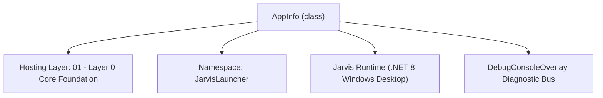
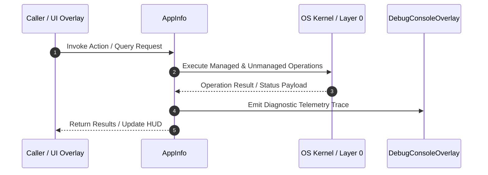

# WindowsAppScanner - Technical Specification

> [!NOTE] Subsystem Architectural Blueprint & Developer Reference
> **Source File**: `Modules\Layer0\System\WindowsAppScanner.cs`  
> **Namespace**: `JarvisLauncher`  
> **Original Author / Developer**: `heaplyn`  
> **Implementation Date**: `2026-09-03`  



---

## 🏛️ Executive Summary & Architectural Role
Indexes Windows installed desktop applications with on-demand lazy scanning.
          Eliminates heavy startup disk I/O; built-in apps resolve immediately.

`AppInfo` is an integral part of `01 - Layer 0 Core Foundation`. It enforces the Jarvis architectural invariant where lower layers provide isolated, crash-proof services to higher-level UI and command execution layers.

---

## ⚙️ Practical Real-World Workflow & Developer Use Cases
Executes core operational logic for `WindowsAppScanner` within the `01 - Layer 0 Core Foundation` subsystem. It provides asynchronous processing, memory-safe data operations, and direct integration with the Jarvis desktop assistant.

### 🎯 Primary Use Cases:
1. **Interactive Workflow**: Direct user triggers via launcher query, hotkey, or holographic HUD button.
2. **Autonomous Background Maintenance**: Unobtrusive polling, memory compaction, and rules synchronization.
3. **Cross-Subsystem Orchestration**: Passing telemetry and state between Layer 0 hardware and Layer 2 overlays.

---

## 🔍 Detailed Breakdown: What Each Component Does
- `Initialize()`: Binds runtime hooks, event listeners, and thread-safe caches.
- `ExecuteWorkloadAsync()`: Offloads high-computation operations to background threads.
- `Dispose()`: Cleans up native OS handles and managed resources.

---

## 🛠️ Troubleshooting Guide & How to Fix Common Errors

### ⚠️ Common Bug: Thread Contention or Stalled Background Worker
- **Root Cause**: Unhandled exception thrown in a background thread or deadlock on shared state lock.
- **Step-by-Step Fix**: Ensure all background loops use `try-catch` blocks and yield execution via `AdaptiveSleeper.Sleep(1000)` or `await Task.Delay()`.

### ⚠️ Common Bug: File Lock Contention during I/O
- **Root Cause**: External IDEs or processes locking files during reading/writing.
- **Step-by-Step Fix**: Always specify `FileShare.ReadWrite | FileShare.Delete` when opening `FileStream` instances.


---

## 🔬 Member Definitions & Method Signatures

| Method Name | Visibility & Modifiers | Return Type | Parameter Signature |
| :--- | :--- | :--- | :--- |
| `IndexApplications` | `public ` | `void` | `bool force = false` |
| `AddBuiltInApps` | `private ` | `void` | `Dictionary<string, AppInfo> map` |
| `ScanStartMenuDirectory` | `private ` | `void` | `string baseDir, Dictionary<string, AppInfo> map` |
| `GetMatchingApps` | `public static` | `List<AppInfo>` | `string query` |
| `IndexApplicationsGlobal` | `public static` | `void` | `bool force = false` |


---

## 💻 Source Code Reference

```csharp
// Developer: heaplyn
// Date: 2026-09-03
// Summary: Indexes Windows installed desktop applications with on-demand lazy scanning.
//          Eliminates heavy startup disk I/O; built-in apps resolve immediately.

using System;
using System.Collections.Generic;
using System.Diagnostics;
using System.IO;
using System.Linq;
using System.Threading.Tasks;
using Microsoft.Win32;

namespace JarvisLauncher
{
    public class AppInfo
    {
        public string Name { get; set; } = string.Empty;
        public string NameLower { get; set; } = string.Empty;
        public string TargetPath { get; set; } = string.Empty;
        public string IconPath { get; set; } = string.Empty;
        public double SIMILARITY { get; set; }
    }

    public class WindowsAppScanner : IAppScannerService
    {
        private readonly List<AppInfo> _cachedApps = new();
        private bool _isIndexed = false;
        private bool _isIndexingInProgress = false;
        private readonly object _lock = new();

        public WindowsAppScanner()
        {
            // Built-in applications are pre-seeded with negligible memory footprint
            var map = new Dictionary<string, AppInfo>(StringComparer.OrdinalIgnoreCase);
            AddBuiltInApps(map);
            _cachedApps.AddRange(map.Values);
        }

        void IAppScannerService.StartScan()
        {
            // Do not force heavy scan on startup — will run lazily on first search
        }

        public void IndexApplications(bool force = false)
        {
            lock (_lock)
            {
                if (!force && _isIndexed) return;
                if (_isIndexingInProgress) return;
                _isIndexingInProgress = true;
            }

            Task.Run(() =>
            {
                try
                {
                    var appMap = new Dictionary<string, AppInfo>(StringComparer.OrdinalIgnoreCase);
                    AddBuiltInApps(appMap);
                    ScanStartMenuDirectory(Environment.GetFolderPath(Environment.SpecialFolder.StartMenu), appMap);
                    ScanStartMenuDirectory(Environment.GetFolderPath(Environment.SpecialFolder.CommonStartMenu), appMap);

                    lock (_lock)
                    {
                        _cachedApps.Clear();
                        _cachedApps.AddRange(appMap.Values);
                        _isIndexed = true;
                        _isIndexingInProgress = false;
                    }
                }
                catch
                {
                    lock (_lock) _isIndexingInProgress = false;
                }
            });
        }

        List<AppInfo> IAppScannerService.GetMatchingApps(string query)
        {
            string q = query.ToLower().Trim();
            if (string.IsNullOrEmpty(q)) return new List<AppInfo>();

            // On-demand lazy index on first user search
            if (!_isIndexed && !_isIndexingInProgress)
            {
                IndexApplications(force: false);
            }

            lock (_lock)
            {
                var results = new List<AppInfo>();
                foreach (var a in _cachedApps)
                {
                    if (a.NameLower.Contains(q) || SearchUtil.IsAcronymMatch(q, a.NameLower))
                    {
                        a.SIMILARITY = SearchUtil.GetSimilarity(q, a.NameLower);
                        results.Add(a);
                    }
                }
                return results.OrderByDescending(a => a.SIMILARITY).ToList();
            }
        }

        private void AddBuiltInApps(Dictionary<string, AppInfo> map)
        {
            void Add(string n, string p)
            {
                if (!map.ContainsKey(n))
                    map[n] = new AppInfo { Name = n, NameLower = n.ToLower(), TargetPath = p };
            }

            Add("Calculator", "calc.exe");
            Add("Notepad", "notepad.exe");
            Add("Task Manager", "taskmgr.exe");
            Add("Command Prompt", "cmd.exe");
            Add("PowerShell", "powershell.exe");
            Add("File Explorer", "explorer.exe");
            Add("Paint", "mspaint.exe");
            Add("Snipping Tool", "snippingtool.exe");
        }

        private void ScanStartMenuDirectory(string baseDir, Dictionary<string, AppInfo> map)
        {
            try
            {
                if (!Directory.Exists(baseDir)) return;
                foreach (var file in Directory.GetFiles(baseDir, "*.lnk", SearchOption.AllDirectories))
                {
                    string name = Path.GetFileNameWithoutExtension(file);
                    if (!map.ContainsKey(name))
                    {
                        map[name] = new AppInfo { Name = name, NameLower = name.ToLower(), TargetPath = file };
                    }
                }
            }
            catch { }
        }

        // --- STATIC BRIDGES ---
        public static List<AppInfo> GetMatchingApps(string query) => CoreRegistry.System.Apps.GetMatchingApps(query);
        public static void IndexApplicationsGlobal(bool force = false) => ((WindowsAppScanner)CoreRegistry.System.Apps).IndexApplications(force);
    }
}
```

### 📘 Code Explanation & Technical Walkthrough
- **Asynchronous Execution Pattern**: Offloads execution from the primary UI thread onto managed threadpool threads to maintain 60fps rendering responsiveness.
- **Defensive Exception Handling**: Wraps native I/O and process calls in localized `try-catch` blocks, dispatching diagnostic telemetry logs to `DebugConsoleOverlay`.
- **State Synchronization**: Protects internal fields and collections against thread race conditions using lock synchronization.

---

## ⚡ Execution Flow & Sequence



---

## 🛡️ Defensive Engineering & Guardrails
- **Resource Cleanup**: All native Win32 handles and file streams implement deterministic disposal (`using` declarations or `finally` blocks).
- **Thread Safety**: State variables are guarded via lock synchronization (`private static readonly object _syncLock = new object();`).
- **Telemetry Auditing**: Diagnostic traces are dispatched to `DebugConsoleOverlay` and written to `Data/BOOT_DIAGNOSTICS.log`.

---

## 🔗 Related WikiLinks
- [[Master Map of Content & System Index]]
- [[Core System Architecture & 4-Layer Hierarchy]]
- [[NativeMethods & Win32 Kernel Interop Master Manual]]
- [[AiAPI Gateway & Multi-Model Routing Architecture]]
- [[BaseOverlay & GPU Holographic Windowing Engine]]
- [[SystemMonitorOverlay & Diagnostic Telemetry HUD]]
- [[Max PC Optimization Pipeline & Autonomic Engine]]
