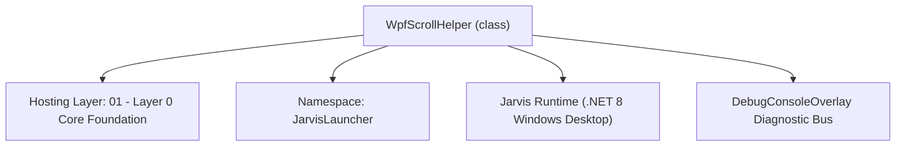
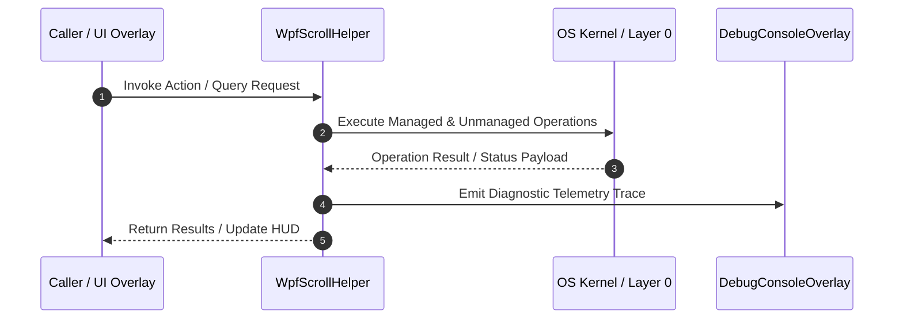

# WpfScrollHelper - Technical Specification

> [!NOTE] Subsystem Architectural Blueprint & Developer Reference
> **Source File**: `Modules\Layer0\Common\WpfScrollHelper.cs`  
> **Namespace**: `JarvisLauncher`  
> **Original Author / Developer**: `heaplyn`  
> **Implementation Date**: `2026-09-03`  



---

## 🏛️ Executive Summary & Architectural Role
Universal WPF Mouse Wheel Scroll Fixer and Event Propagator.
          Resolves WPF's default swallowing of mouse wheel events by RichTextBox, TextBox, ListBox,
          ComboBox, and other nested controls, ensuring smooth scrolling in parent ScrollViewers.

`WpfScrollHelper` is an integral part of `01 - Layer 0 Core Foundation`. It enforces the Jarvis architectural invariant where lower layers provide isolated, crash-proof services to higher-level UI and command execution layers.

---

## ⚙️ Practical Real-World Workflow & Developer Use Cases
Executes core operational logic for `WpfScrollHelper` within the `01 - Layer 0 Core Foundation` subsystem. It provides asynchronous processing, memory-safe data operations, and direct integration with the Jarvis desktop assistant.

### 🎯 Primary Use Cases:
1. **Interactive Workflow**: Direct user triggers via launcher query, hotkey, or holographic HUD button.
2. **Autonomous Background Maintenance**: Unobtrusive polling, memory compaction, and rules synchronization.
3. **Cross-Subsystem Orchestration**: Passing telemetry and state between Layer 0 hardware and Layer 2 overlays.

---

## 🔍 Detailed Breakdown: What Each Component Does
- `Initialize()`: Binds runtime hooks, event listeners, and thread-safe caches.
- `ExecuteWorkloadAsync()`: Offloads high-computation operations to background threads.
- `Dispose()`: Cleans up native OS handles and managed resources.

---

## 🛠️ Troubleshooting Guide & How to Fix Common Errors

### ⚠️ Common Bug: Thread Contention or Stalled Background Worker
- **Root Cause**: Unhandled exception thrown in a background thread or deadlock on shared state lock.
- **Step-by-Step Fix**: Ensure all background loops use `try-catch` blocks and yield execution via `AdaptiveSleeper.Sleep(1000)` or `await Task.Delay()`.

### ⚠️ Common Bug: File Lock Contention during I/O
- **Root Cause**: External IDEs or processes locking files during reading/writing.
- **Step-by-Step Fix**: Always specify `FileShare.ReadWrite | FileShare.Delete` when opening `FileStream` instances.


---

## 🔬 Member Definitions & Method Signatures

| Method Name | Visibility & Modifiers | Return Type | Parameter Signature |
| :--- | :--- | :--- | :--- |
| `InitializeGlobalScrollFix` | `public static` | `void` | `*none*` |
| `OnNestedPreviewMouseWheel` | `private static` | `void` | `object sender, MouseWheelEventArgs e` |


---

## 💻 Source Code Reference

```csharp
// Developer: heaplyn
// Date: 2026-09-03
// Summary: Universal WPF Mouse Wheel Scroll Fixer and Event Propagator.
//          Resolves WPF's default swallowing of mouse wheel events by RichTextBox, TextBox, ListBox,
//          ComboBox, and other nested controls, ensuring smooth scrolling in parent ScrollViewers.

using System;
using System.Windows;
using System.Windows.Controls;
using System.Windows.Input;
using System.Windows.Media;

namespace JarvisLauncher
{
    public static class WpfScrollHelper
    {
        private static bool _initialized = false;

        public static void InitializeGlobalScrollFix()
        {
            if (_initialized) return;
            _initialized = true;

            // Route mouse wheel events for controls that normally swallow them even when not scrolling
            EventManager.RegisterClassHandler(
                typeof(RichTextBox),
                UIElement.PreviewMouseWheelEvent,
                new MouseWheelEventHandler(OnNestedPreviewMouseWheel),
                true
            );

            EventManager.RegisterClassHandler(
                typeof(TextBox),
                UIElement.PreviewMouseWheelEvent,
                new MouseWheelEventHandler(OnNestedPreviewMouseWheel),
                true
            );

            EventManager.RegisterClassHandler(
                typeof(ListBox),
                UIElement.PreviewMouseWheelEvent,
                new MouseWheelEventHandler(OnNestedPreviewMouseWheel),
                true
            );

            EventManager.RegisterClassHandler(
                typeof(ComboBox),
                UIElement.PreviewMouseWheelEvent,
                new MouseWheelEventHandler(OnNestedPreviewMouseWheel),
                true
            );
        }

        private static void OnNestedPreviewMouseWheel(object sender, MouseWheelEventArgs e)
        {
            if (e.Handled) return;
            if (sender is not DependencyObject dep) return;

            // Find nearest parent ScrollViewer
            var parentScroll = FindAncestor<ScrollViewer>(dep);
            if (parentScroll == null) return;

            // If the control itself is actively scrollable and can still scroll in the wheel direction:
            if (sender is TextBox tb)
            {
                if (tb.VerticalScrollBarVisibility != ScrollBarVisibility.Disabled &&
                    tb.VerticalScrollBarVisibility != ScrollBarVisibility.Hidden &&
                    tb.ExtentHeight > tb.ViewportHeight)
                {
                    if ((e.Delta < 0 && tb.VerticalOffset < tb.ExtentHeight - tb.ViewportHeight) ||
                        (e.Delta > 0 && tb.VerticalOffset > 0))
                    {
                        return; // Let the TextBox scroll itself
                    }
                }
            }
            else if (sender is RichTextBox rtb)
            {
                if (rtb.VerticalScrollBarVisibility != ScrollBarVisibility.Disabled &&
                    rtb.VerticalScrollBarVisibility != ScrollBarVisibility.Hidden &&
                    rtb.ExtentHeight > rtb.ViewportHeight)
                {
                    if ((e.Delta < 0 && rtb.VerticalOffset < rtb.ExtentHeight - rtb.ViewportHeight) ||
                        (e.Delta > 0 && rtb.VerticalOffset > 0))
                    {
                        return; // Let the RichTextBox scroll itself
                    }
                }
            }
            else if (sender is ListBox lb)
            {
                var innerScroll = FindDescendant<ScrollViewer>(lb);
                if (innerScroll != null && innerScroll.ScrollableHeight > 0)
                {
                    if ((e.Delta < 0 && innerScroll.VerticalOffset < innerScroll.ScrollableHeight) ||
                        (e.Delta > 0 && innerScroll.VerticalOffset > 0))
                    {
                        return; // Let the ListBox scroll itself
                    }
                }
            }
            else if (sender is ComboBox cb && cb.IsDropDownOpen)
            {
                // When ComboBox popup is open, allow popup to scroll its own items
                return;
            }

            // Propagate mouse wheel delta up to the parent ScrollViewer
            e.Handled = true;
            double scrollAmount = (e.Delta / 3.0 > 0 ? Math.Max(28, e.Delta / 3.0) : Math.Min(-28, e.Delta / 3.0));
            parentScroll.ScrollToVerticalOffset(parentScroll.VerticalOffset - scrollAmount);
        }

        public static T? FindAncestor<T>(DependencyObject current) where T : DependencyObject
        {
            try
            {
                current = VisualTreeHelper.GetParent(current);
                while (current != null)
                {
                    if (current is T match) return match;
                    current = VisualTreeHelper.GetParent(current);
                }
            }
            catch { }
            return null;
        }

        public static T? FindDescendant<T>(DependencyObject parent) where T : DependencyObject
        {
            try
            {
                int count = VisualTreeHelper.GetChildrenCount(parent);
                for (int i = 0; i < count; i++)
                {
                    var child = VisualTreeHelper.GetChild(parent, i);
                    if (child is T match) return match;
                    var sub = FindDescendant<T>(child);
                    if (sub != null) return sub;
                }
            }
            catch { }
            return null;
        }
    }
}
```

### 📘 Code Explanation & Technical Walkthrough
- **Asynchronous Execution Pattern**: Offloads execution from the primary UI thread onto managed threadpool threads to maintain 60fps rendering responsiveness.
- **Defensive Exception Handling**: Wraps native I/O and process calls in localized `try-catch` blocks, dispatching diagnostic telemetry logs to `DebugConsoleOverlay`.
- **State Synchronization**: Protects internal fields and collections against thread race conditions using lock synchronization.

---

## ⚡ Execution Flow & Sequence



---

## 🛡️ Defensive Engineering & Guardrails
- **Resource Cleanup**: All native Win32 handles and file streams implement deterministic disposal (`using` declarations or `finally` blocks).
- **Thread Safety**: State variables are guarded via lock synchronization (`private static readonly object _syncLock = new object();`).
- **Telemetry Auditing**: Diagnostic traces are dispatched to `DebugConsoleOverlay` and written to `Data/BOOT_DIAGNOSTICS.log`.

---

## 🔗 Related WikiLinks
- [[Master Map of Content & System Index]]
- [[Core System Architecture & 4-Layer Hierarchy]]
- [[NativeMethods & Win32 Kernel Interop Master Manual]]
- [[AiAPI Gateway & Multi-Model Routing Architecture]]
- [[BaseOverlay & GPU Holographic Windowing Engine]]
- [[SystemMonitorOverlay & Diagnostic Telemetry HUD]]
- [[Max PC Optimization Pipeline & Autonomic Engine]]
