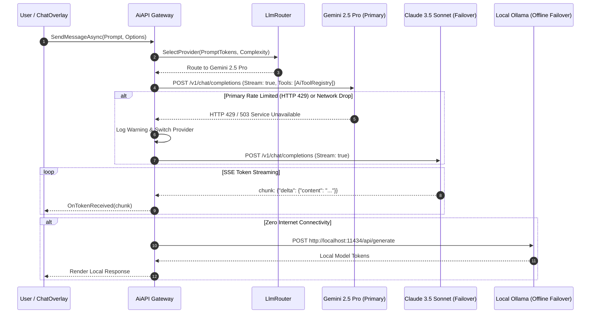

# 🌐 AiAPI Gateway & Multi-Model Routing Architecture

## 🌐 Multi-Model Intelligence Gateway

`AiAPI` (`Modules/Layer1/AiAPI.cs`) and `LlmRouter` (`Modules/Layer0/AI_ML/LlmRouter.cs`) form the unified cognitive engine of Jarvis.

---

## 🔀 Multi-Model Routing Heuristics Matrix

| Scenario / Prompt Type | Selected Provider | Technical Rationale |
| :--- | :--- | :--- |
| **Massive Context (>100k Tokens)** | **Google Gemini 2.5 Pro** | 1M+ token context window; optimal for multi-file codebase analysis. |
| **Complex Logic & Refactoring** | **Anthropic Claude 3.5 Sonnet** | Industry-leading algorithmic code synthesis and tool calling accuracy. |
| **Fast Conversational Lookups** | **Google Gemini 2.5 Flash** | Sub-200ms time-to-first-token; optimal for quick search queries. |
| **Zero Internet / Privacy Mode** | **Local Ollama (`llama3:8b`)** | 100% offline local inference with zero data transmission. |

---

## 🛠️ Troubleshooting AI Gateway Errors

### 1. `HTTP 429: Rate Limit Exceeded`
- **Root Cause**: API quota exhausted or burst requests.
- **Fix**: `AiAPI` automatically catches HTTP 429 and retries against the configured secondary provider (e.g. failover from Gemini to Claude or GPT-4o) without presenting an error modal to the user.

### 2. `Invalid API Key / Unauthorized (401)`
- **Root Cause**: Expired or missing API key in `Data/SystemSettings.json`.
- **Fix**: Open `LlmSettingsOverlay` via the launcher search command `settings` and update the active provider API keys.
