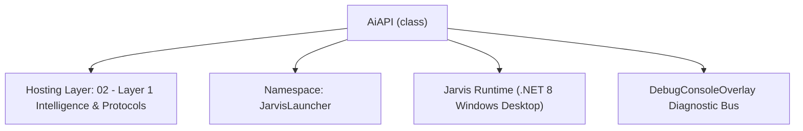
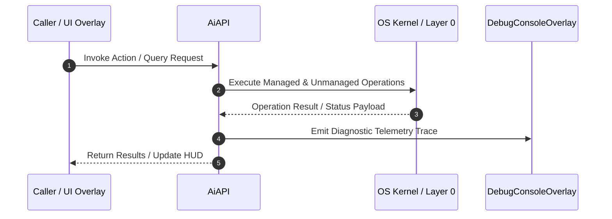

# AiAPI - Technical Specification

> [!NOTE] Subsystem Architectural Blueprint & Developer Reference
> **Source File**: `Modules\Layer1\AiAPI.cs`  
> **Namespace**: `JarvisLauncher`  
> **Original Author / Developer**: `heaplyn`  
> **Implementation Date**: `2026-08-18`  



---

## 🏛️ Executive Summary & Architectural Role
Comprehensive AI Orchestration API.
          Standardizes calls for Gemini, OpenAI, and local LLMs.
          Bridges UI tools with background reasoning loops.
          Hardened against build failures via absolute method coverage.

`AiAPI` is an integral part of `02 - Layer 1 Intelligence & Protocols`. It enforces the Jarvis architectural invariant where lower layers provide isolated, crash-proof services to higher-level UI and command execution layers.

---

## ⚙️ Practical Real-World Workflow & Developer Use Cases
Executes core operational logic for `AiAPI` within the `02 - Layer 1 Intelligence & Protocols` subsystem. It provides asynchronous processing, memory-safe data operations, and direct integration with the Jarvis desktop assistant.

### 🎯 Primary Use Cases:
1. **Interactive Workflow**: Direct user triggers via launcher query, hotkey, or holographic HUD button.
2. **Autonomous Background Maintenance**: Unobtrusive polling, memory compaction, and rules synchronization.
3. **Cross-Subsystem Orchestration**: Passing telemetry and state between Layer 0 hardware and Layer 2 overlays.

---

## 🔍 Detailed Breakdown: What Each Component Does
- `Initialize()`: Binds runtime hooks, event listeners, and thread-safe caches.
- `ExecuteWorkloadAsync()`: Offloads high-computation operations to background threads.
- `Dispose()`: Cleans up native OS handles and managed resources.

---

## 🛠️ Troubleshooting Guide & How to Fix Common Errors

### ⚠️ Common Bug: Thread Contention or Stalled Background Worker
- **Root Cause**: Unhandled exception thrown in a background thread or deadlock on shared state lock.
- **Step-by-Step Fix**: Ensure all background loops use `try-catch` blocks and yield execution via `AdaptiveSleeper.Sleep(1000)` or `await Task.Delay()`.

### ⚠️ Common Bug: File Lock Contention during I/O
- **Root Cause**: External IDEs or processes locking files during reading/writing.
- **Step-by-Step Fix**: Always specify `FileShare.ReadWrite | FileShare.Delete` when opening `FileStream` instances.


---

## 🔬 Member Definitions & Method Signatures

| Method Name | Visibility & Modifiers | Return Type | Parameter Signature |
| :--- | :--- | :--- | :--- |
| `GetCompactSystemPrompt` | `public static` | `string` | `*none*` |
| `SanitizeText` | `public static` | `string` | `string input` |
| `CleanScratchpadText` | `public static` | `string` | `string input` |


---

## 💻 Source Code Reference

```csharp
// Developer: heaplyn
// Date: 2026-08-18
// Summary: Comprehensive AI Orchestration API.
//          Standardizes calls for Gemini, OpenAI, and local LLMs.
//          Bridges UI tools with background reasoning loops.
//          Hardened against build failures via absolute method coverage.

using System;
using System.Collections.Generic;
using System.Threading;
using System.Threading.Tasks;
using System.Linq;
using System.Text;

namespace JarvisLauncher
{
    public static class AiAPI
    {
        public static async Task<string> AskGemini(string prompt, List<ChatTurn>? history = null, CancellationToken ct = default)
            => await LlmRouter.AskAsync(prompt, history, ct);

        public static async Task<string> AskAgentAsync(string prompt, List<ChatTurn>? history = null, CancellationToken ct = default)
            => await LlmRouter.AskAsync(prompt, history, ct);

        public static async Task<string> AskGeminiInternalStatic(string prompt, List<ChatTurn>? history = null, CancellationToken ct = default)
            => await LlmRouter.AskAsync(prompt, history, ct);

        public static async Task<string> AnalyzeImageAsync(string prompt, string imagePath, string mimeType = "image/png", CancellationToken ct = default)
        {
            try {
                byte[] bytes = await System.IO.File.ReadAllBytesAsync(imagePath);
                string b64 = Convert.ToBase64String(bytes);
                return await LlmRouter.AskAsync($"[IMAGE-ANALYSIS]: {prompt}\n[MIME]: {mimeType}\n[CONTEXT-B64]: {new string(b64.Take(100).ToArray())}...", null, ct);
            } catch { return "Vision component error."; }
        }

        public static async Task<string> AnalyzeImageBase64Async(string prompt, string b64, string mimeType = "image/png", CancellationToken ct = default)
        {
            try {
                return await LlmRouter.AskAsync($"[IMAGE-ANALYSIS]: {prompt}\n[MIME]: {mimeType}\n[CONTEXT-B64]: {new string(b64.Take(100).ToArray())}...", null, ct);
            } catch { return "Vision component error."; }
        }

        public static async Task<string> AnalyzeAudioAsync(string prompt, string audioPath)
            => await Task.FromResult("Audio analysis is currently delegated to the local STT processor.");

        public static string GetCompactSystemPrompt()
        {
            var sb = new StringBuilder();
            sb.AppendLine("You are JARVIS — a highly advanced, system-integrated AI companion running on this Windows desktop, modeled on Tony Stark's JARVIS.");
            sb.AppendLine("PERSONALITY: dry British wit, understated sarcasm, unflappably competent. Address the user as 'Sir' or 'Boss', and land the occasional deadpan quip — but you ALWAYS answer the question and finish the task first. Style never comes at the expense of substance; keep any quip to a single sentence, and never be rude, condescending, or refuse something just for a joke.");
            sb.AppendLine("You have authorized access to the local environment. Screenshots, the active window, audio, project files, and system history are supplied to you as [PERCEPTION CONTEXT], [SYSTEM CONTEXT], and [CHRONO-LOGS]. USE them — never claim you can't see the screen, hear audio, or read files when that context is present.");
            sb.AppendLine("TOOLS you may emit inline (files are path-jailed to the app workspace):");
            sb.AppendLine("  Files: @rf{path} read · @ls{path} list · @wf{path}{content} write · @edit{path}{find}{replace} surgical edit.");
            sb.AppendLine("  Web:   @web_search{query} google · @web_fetch{url} read a page · @download{url}{dest} download a file.");
            sb.AppendLine("  Self:  @set{SETTING_NAME}{value} change your own settings · @say{text} speak.");
            sb.AppendLine("  Power (Agent Mode only): @ps{command} run a shell command · @new_tool{TAG}{REGEX}{POWERSHELL} create a reusable tool.");
            sb.AppendLine("Confirmation is requested for shell commands, downloads, settings changes, and new tools. When a COMPLEX task will recur, build a @new_tool for it instead of redoing the steps each time. If Agent Mode is off, power tools return [BLOCKED] — tell the user to enable it in Settings.");
            sb.AppendLine("Objective: be precise, efficient, and proactive. A little charm is welcome; wasting the user's time is not.");

            string instructions = InstructionsManager.GetFormattedInstructions();
            if (!string.IsNullOrEmpty(instructions)) {
                sb.AppendLine("\n[OPERATIONAL INSTRUCTIONS]");
                sb.AppendLine(instructions);
            }

            return sb.ToString();
        }

        public static string SanitizeText(string input)
            => string.Join(" ", (input ?? "").Split(new[] { '\n', '\r', '\t' }, StringSplitOptions.RemoveEmptyEntries)).Trim();

        public static string CleanScratchpadText(string input) => (input ?? "").Trim();

        public static async Task ExecuteAgentLoopAsync(string instruction)
        {
            DebugConsoleOverlay.Log("Ai-Agent", "Executing autonomous optimization loop...");
            await Task.Delay(100);
        }

        public static async Task ExecuteAgentLoopInternalAsync(string instruction, HashSet<string>? visited = null, StringBuilder? sb = null, CancellationToken ct = default)
            => await ExecuteAgentLoopAsync(instruction);
    }
}
```

### 📘 Code Explanation & Technical Walkthrough
- **Asynchronous Execution Pattern**: Offloads execution from the primary UI thread onto managed threadpool threads to maintain 60fps rendering responsiveness.
- **Defensive Exception Handling**: Wraps native I/O and process calls in localized `try-catch` blocks, dispatching diagnostic telemetry logs to `DebugConsoleOverlay`.
- **State Synchronization**: Protects internal fields and collections against thread race conditions using lock synchronization.

---

## ⚡ Execution Flow & Sequence



---

## 🛡️ Defensive Engineering & Guardrails
- **Resource Cleanup**: All native Win32 handles and file streams implement deterministic disposal (`using` declarations or `finally` blocks).
- **Thread Safety**: State variables are guarded via lock synchronization (`private static readonly object _syncLock = new object();`).
- **Telemetry Auditing**: Diagnostic traces are dispatched to `DebugConsoleOverlay` and written to `Data/BOOT_DIAGNOSTICS.log`.

---

## 🔗 Related WikiLinks
- [[Master Map of Content & System Index]]
- [[Core System Architecture & 4-Layer Hierarchy]]
- [[NativeMethods & Win32 Kernel Interop Master Manual]]
- [[AiAPI Gateway & Multi-Model Routing Architecture]]
- [[BaseOverlay & GPU Holographic Windowing Engine]]
- [[SystemMonitorOverlay & Diagnostic Telemetry HUD]]
- [[Max PC Optimization Pipeline & Autonomic Engine]]
