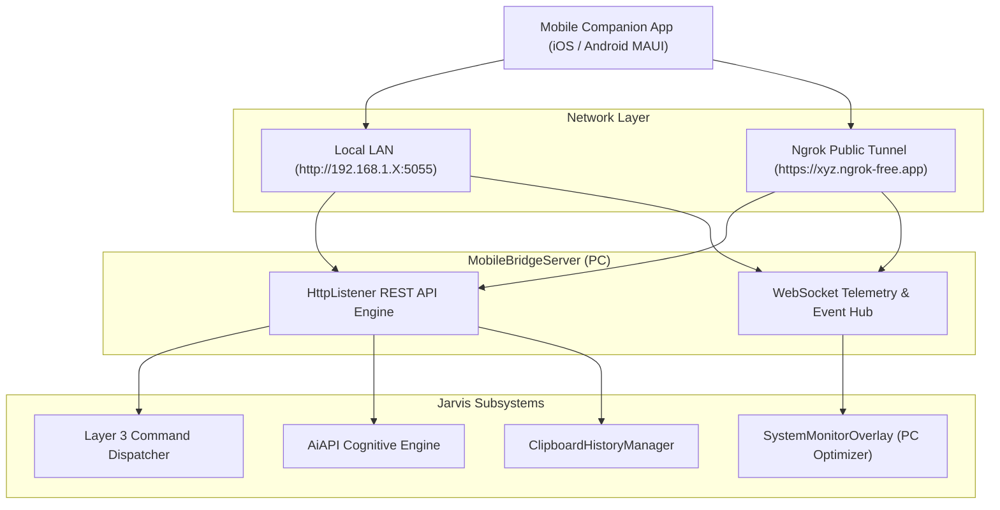

# 📱 MobileBridgeServer & Remote Control Protocol

## 📱 Mobile Companion Bridge & Remote Orchestration

`MobileBridgeServer` (`Modules/Layer1/Bridges/MobileBridgeServer.cs`) exposes the PC's capabilities to mobile clients (iOS / Android MAUI) over local LAN or secure public WAN.



---

## 🔌 REST & WebSocket Endpoint Reference

| Method | Endpoint | Request Body | Description |
| :--- | :--- | :--- | :--- |
| `GET` | `/api/status` | *None* | Returns JSON with CPU %, RAM usage, active window title, and uptime. |
| `POST` | `/api/chat` | `{"prompt": string, "history": []}` | Dispatches a conversation turn to `AiAPI` and returns the generated text. |
| `POST` | `/api/command` | `{"query": string}` | Executes a Layer 3 search command (e.g. `max pc optimize`, `kill chrome`). |
| `GET` | `/api/clipboard` | *None* | Retrieves current PC clipboard contents. |
| `POST` | `/api/clipboard` | `{"text": string}` | Overwrites the PC clipboard text from the mobile device. |
| `WS` | `/ws` | WebSocket Frame | Full-duplex telemetry socket broadcasting system statistics every 1 second. |

---

## 🌐 Automated Ngrok Tunneling
For out-of-home remote control, Jarvis automatically spawns and monitors an encrypted Ngrok tunnel process:
```csharp
public static void StartNgrokTunnel(int port)
{
    Process.Start(new ProcessStartInfo
    {
        FileName = "ngrok.exe",
        Arguments = $"http {port} --log=stdout",
        CreateNoWindow = true,
        UseShellExecute = false
    });
}
```

### 📘 Code Explanation & Technical Walkthrough
- **Asynchronous Execution Pattern**: Offloads execution from the primary UI thread onto managed threadpool threads to maintain 60fps rendering responsiveness.
- **Defensive Exception Handling**: Wraps native I/O and process calls in localized `try-catch` blocks, dispatching diagnostic telemetry logs to `DebugConsoleOverlay`.
- **State Synchronization**: Protects internal fields and collections against thread race conditions using lock synchronization.
