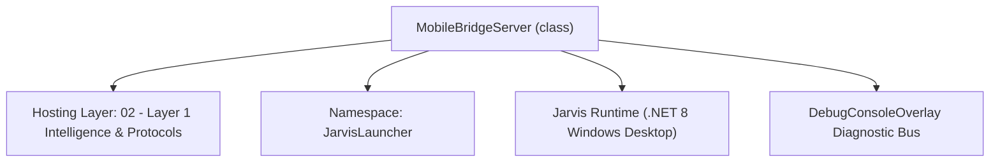
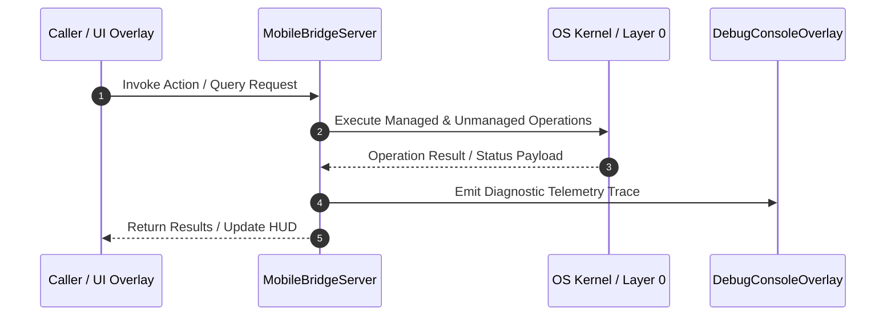

# MobileBridgeServer - Technical Specification

> [!NOTE] Subsystem Architectural Blueprint & Developer Reference
> **Source File**: `Modules\Layer1\Bridges\MobileBridgeServer.cs`  
> **Namespace**: `JarvisLauncher`  
> **Original Author / Developer**: `heaplyn`  
> **Implementation Date**: `2026-08-12`  



---

## 🏛️ Executive Summary & Architectural Role
High-performance, permission-independent HTTP server using TcpListener.
 Enhanced with Dual-Stack support, self-healing firewall tools, and advanced file/stats API.
 Updated screen capture to support high-DPI full-desktop snapshots across all monitors.

`MobileBridgeServer` is an integral part of `02 - Layer 1 Intelligence & Protocols`. It enforces the Jarvis architectural invariant where lower layers provide isolated, crash-proof services to higher-level UI and command execution layers.

---

## ⚙️ Practical Real-World Workflow & Developer Use Cases
Executes core operational logic for `MobileBridgeServer` within the `02 - Layer 1 Intelligence & Protocols` subsystem. It provides asynchronous processing, memory-safe data operations, and direct integration with the Jarvis desktop assistant.

### 🎯 Primary Use Cases:
1. **Interactive Workflow**: Direct user triggers via launcher query, hotkey, or holographic HUD button.
2. **Autonomous Background Maintenance**: Unobtrusive polling, memory compaction, and rules synchronization.
3. **Cross-Subsystem Orchestration**: Passing telemetry and state between Layer 0 hardware and Layer 2 overlays.

---

## 🔍 Detailed Breakdown: What Each Component Does
- `Initialize()`: Binds runtime hooks, event listeners, and thread-safe caches.
- `ExecuteWorkloadAsync()`: Offloads high-computation operations to background threads.
- `Dispose()`: Cleans up native OS handles and managed resources.

---

## 🛠️ Troubleshooting Guide & How to Fix Common Errors

### ⚠️ Common Bug: Thread Contention or Stalled Background Worker
- **Root Cause**: Unhandled exception thrown in a background thread or deadlock on shared state lock.
- **Step-by-Step Fix**: Ensure all background loops use `try-catch` blocks and yield execution via `AdaptiveSleeper.Sleep(1000)` or `await Task.Delay()`.

### ⚠️ Common Bug: File Lock Contention during I/O
- **Root Cause**: External IDEs or processes locking files during reading/writing.
- **Step-by-Step Fix**: Always specify `FileShare.ReadWrite | FileShare.Delete` when opening `FileStream` instances.


---

## 🔬 Member Definitions & Method Signatures

| Method Name | Visibility & Modifiers | Return Type | Parameter Signature |
| :--- | :--- | :--- | :--- |
| `Start` | `public static` | `void` | `int PortNumber = 9000` |
| `TryBindLoopback` | `private static` | `TcpListener?` | `int preferredPort, out int boundPort` |
| `GetMobileCommandBarHtml` | `private static` | `string` | `*none*` |
| `GetMobileAppHtml` | `private static` | `string` | `*none*` |
| `RunPowerShellCommand` | `private static` | `string` | `string CommandText` |
| `GetSystemStats` | `private static` | `object` | `*none*` |
| `CaptureScreenJpeg` | `private static` | `byte[]?` | `*none*` |
| `LogToFile` | `private static` | `void` | `string Message` |
| `GetLogPath` | `public static` | `string` | `*none*` |
| `GetRecentLogs` | `public static` | `string` | `int LinesCount = 10` |
| `EnsureFirewallRule` | `private static` | `void` | `int PortNumber` |
| `FixedTimeEquals` | `private static` | `bool` | `string? provided, string configured` |
| `IsFeatureBlocked` | `private static` | `bool` | `string path, out string feature` |
| `GetLocalIPAddress` | `public static` | `string` | `*none*` |
| `GetAllLocalIPv4Addresses` | `public static` | `List<string>` | `*none*` |


---

## 💻 Source Code Reference

```csharp
// Developer: heaplyn
// Date: 2026-08-12
// Summary: High-performance, permission-independent HTTP server using TcpListener.
// Enhanced with Dual-Stack support, self-healing firewall tools, and advanced file/stats API.
// Updated screen capture to support high-DPI full-desktop snapshots across all monitors.

using System;
using System.Collections.Generic;
using System.Diagnostics;
using System.IO;
using System.Linq;
using System.Net;
using System.Net.NetworkInformation;
using System.Net.Sockets;
using System.Text;
using System.Text.Json;
using System.Threading.Tasks;
using System.Windows;
using System.Drawing;
using System.Drawing.Imaging;
using System.Runtime.InteropServices;

// Resolve ambiguity between System.Drawing.Size and System.Windows.Size
using Size = System.Drawing.Size;

namespace JarvisLauncher
{
    public static class MobileBridgeServer
    {
        private static TcpListener? Listener;
        private static bool IsRunningInternal;
        private static int PortParam = 9000;
        public static string? LastConnectedPhoneIp { get; private set; }

        public static bool IsActive => IsRunningInternal && Listener != null;
        public static int Port => PortParam;
        public static string ServerUrl => $"http://{GetLocalIPAddress()}:{PortParam}/";
        public static string HostnameDomain => $"http://{Environment.MachineName.ToLower()}.local:{PortParam}/";
        public static string JarvisDomain => $"http://jarvis.local:{PortParam}/";

        public static void Start(int PortNumber = 9000)
        {
            if (IsRunningInternal) return;
            PortParam = PortNumber;
            IsRunningInternal = true;

            Task.Run(async () =>
            {
                try
                {
                    LogToFile($"Starting loopback-only TCP Server on port {PortParam}...");

                    // SECURITY: bind to 127.0.0.1 ONLY. The server is never exposed on the LAN or
                    // all interfaces. Remote (phone) access must go through an explicit, opt-in tunnel
                    // (cloudflared/ngrok) or `adb reverse`, both of which terminate on loopback here.
                    // Bind resiliently: SocketException 10013 (WSAEACCES) / 10048 (in-use) on a
                    // loopback bind is almost always the configured port sitting inside a Windows
                    // *excluded* port range (Hyper-V / WSL / Docker / winnat reserve blocks of ports).
                    // Rather than crash, walk a list of fallbacks and finally let the OS pick a free port.
                    Listener = TryBindLoopback(PortParam, out int boundPort);
                    if (Listener == null)
                    {
                        IsRunningInternal = false;
                        LogToFile("FATAL: could not bind ANY loopback port. The configured port and every fallback " +
                                  "are blocked — likely a Windows excluded/reserved port range. Inspect with: " +
                                  "netsh int ipv4 show excludedportrange protocol=tcp");
                        return;
                    }
                    PortParam = boundPort;

                    LogToFile($"Server LIVE on 127.0.0.1:{PortParam} (loopback only).");

                    // Removed ChatOverlay.LogConsoleAction from here to keep the Chat Console focused on AI actions only.

                    while (IsRunningInternal && Listener != null)
                    {
                        try
                        {
                            var client = await Listener.AcceptTcpClientAsync();
                            _ = Task.Run(() => HandleClientAsync(client));
                        }
                        catch (Exception Ex)
                        {
                            if (IsRunningInternal) LogToFile($"Accept error: {Ex.Message}");
                        }
                    }
                }
                catch (Exception Ex)
                {
                    IsRunningInternal = false;
                    LogToFile($"FATAL server crash: {Ex}");
                }
            });
        }

        // Loopback ports to try, in order, when the preferred one is blocked. The final 0 asks the
        // OS for any free ephemeral port so the server always comes up somewhere.
        private static readonly int[] FallbackPorts = { 9010, 9090, 8787, 8181, 7333, 5599, 45999, 0 };

        private static TcpListener? TryBindLoopback(int preferredPort, out int boundPort)
        {
            boundPort = 0;
            var order = new List<int> { preferredPort };
            order.AddRange(FallbackPorts.Where(p => p != preferredPort));

            foreach (int p in order)
            {
                try
                {
                    var l = new TcpListener(IPAddress.Loopback, p);
                    l.Server.SetSocketOption(SocketOptionLevel.Socket, SocketOptionName.ReuseAddress, true);
                    l.Start();
                    boundPort = ((IPEndPoint)l.LocalEndpoint).Port;
                    if (p != preferredPort)
                        LogToFile($"Port {preferredPort} unavailable; bound to fallback loopback port {boundPort} instead. " +
                                  "Point your mobile client / tunnel at this port.");
                    return l;
                }
                catch (SocketException se) when (
                    se.SocketErrorCode == SocketError.AccessDenied ||
                    se.SocketErrorCode == SocketError.AddressAlreadyInUse)
                {
                    LogToFile($"Cannot bind loopback port {p}: {se.SocketErrorCode} ({se.ErrorCode}). Trying next candidate...");
                }
                catch (Exception ex)
                {
                    LogToFile($"Unexpected bind error on loopback port {p}: {ex.Message}. Trying next candidate...");
                }
            }
            return null;
        }

        private static async Task HandleClientAsync(TcpClient ClientParam)
        {
            var RemoteEp = ClientParam.Client.RemoteEndPoint;
            if (RemoteEp is IPEndPoint iep) LastConnectedPhoneIp = iep.Address.ToString();

            try
            {
                using (ClientParam)
                using (var Stream = ClientParam.GetStream())
                {
                    Stream.ReadTimeout = 15000;

                    byte[] Buffer = new byte[8192];
                    int BytesRead = await Stream.ReadAsync(Buffer, 0, Buffer.Length);
                    if (BytesRead == 0) return;

                    string Request = Encoding.UTF8.GetString(Buffer, 0, BytesRead);
                    string[] Lines = Request.Split(new[] { "\r\n", "\r", "\n" }, StringSplitOptions.None);
                    if (Lines.Length == 0) return;

                    string[] RequestLine = Lines[0].Split(' ');
                    if (RequestLine.Length < 2) return;

                    string Method = RequestLine[0].ToUpper();
                    string FullPath = RequestLine[1];

                    string PathString = FullPath;
                    string QueryStr = string.Empty;
                    int QIndex = FullPath.IndexOf('?');
                    if (QIndex != -1)
                    {
                        PathString = FullPath.Substring(0, QIndex);
                        QueryStr = FullPath.Substring(QIndex + 1);
                    }

                    var Query = new Dictionary<string, string>();
                    foreach (var Pair in QueryStr.Split('&', StringSplitOptions.RemoveEmptyEntries))
                    {
                        var Parts2 = Pair.Split('=');
                        if (Parts2.Length == 2) Query[Parts2[0]] = Uri.UnescapeDataString(Parts2[1]);
                        else if (Parts2.Length == 1) Query[Parts2[0]] = string.Empty;
                    }

                    // Read headers
                    int ContentLength = 0;
                    foreach (var Header in Lines.Skip(1))
                    {
                        if (string.IsNullOrWhiteSpace(Header)) break;
                        if (Header.StartsWith("Content-Length:", StringComparison.OrdinalIgnoreCase))
                        {
                            int.TryParse(Header.Substring(15).Trim(), out ContentLength);
                        }
                    }

                    if (!PathString.Contains("screenshot"))
                    {
                        LogToFile($"Request: {Method} {PathString} from {RemoteEp}");
                        DebugConsoleOverlay.LogVerbose("Bridge-Packet", $"Raw Request From {RemoteEp}:\n{Request.Substring(0, Math.Min(Request.Length, 500))}", isMinimal: false);
                    }

                    if (Method == "OPTIONS")
                    {
                        await SendResponseAsync(Stream, 204, "No Content", null, "text/plain");
                        return;
                    }

                    // Security Check: If a secret is configured, all API requests must include it
                    string? providedSecret = null;
                    foreach (var header in Lines) {
                        if (header.StartsWith("X-Jarvis-Secret:", StringComparison.OrdinalIgnoreCase))
                            providedSecret = header.Substring(16).Trim();
                    }

                    // SECURITY: every /api endpoint requires a configured, matching secret. Fail closed.
                    // No localhost bypass, no "empty secret = open server". The static UI shell
                    // (/, /index.html, /cmd, /bar, health) is allowed through so the page can load and
                    // then authenticate its own API calls with the X-Jarvis-Secret header.
                    bool isApi = PathString.StartsWith("/api", StringComparison.OrdinalIgnoreCase);
                    if (isApi)
                    {
                        string configuredSecret = SettingsManager.Current.BACKUP_PC_SECRET ?? string.Empty;
                        if (string.IsNullOrEmpty(configuredSecret))
                        {
                            await SendResponseAsync(Stream, 401, "Unauthorized",
                                Encoding.UTF8.GetBytes("Server locked: set BACKUP_PC_SECRET in Jarvis settings to enable the mobile API."), "text/plain");
                            return;
                        }
                        if (!FixedTimeEquals(providedSecret, configuredSecret))
                        {
                            await SendResponseAsync(Stream, 401, "Unauthorized", Encoding.UTF8.GetBytes("Invalid Secret"), "text/plain");
                            return;
                        }

                        // SECURITY: per-capability gates (all default OFF). A disabled feature is 403
                        // even with a valid secret; the user must opt in per capability in settings.
                        if (IsFeatureBlocked(PathString, out string blockedFeature))
                        {
                            await SendResponseAsync(Stream, 403, "Forbidden",
                                Encoding.UTF8.GetBytes($"'{blockedFeature}' is disabled. Enable it in Jarvis mobile settings."), "text/plain");
                            return;
                        }
                    }

                    if (PathString == "/" || PathString.Equals("/index.html", StringComparison.OrdinalIgnoreCase))
                    {
                        string Html = GetMobileAppHtml();
                        await SendResponseAsync(Stream, 200, "OK", Encoding.UTF8.GetBytes(Html), "text/html; charset=utf-8");
                    }
                    else if (PathString.Equals("/cmd", StringComparison.OrdinalIgnoreCase) || PathString.Equals("/bar", StringComparison.OrdinalIgnoreCase))
                    {
                        string Html = GetMobileCommandBarHtml();
                        await SendResponseAsync(Stream, 200, "OK", Encoding.UTF8.GetBytes(Html), "text/html; charset=utf-8");
                    }
                    else if (PathString.Contains("health", StringComparison.OrdinalIgnoreCase))
                    {
                        string Json = JsonSerializer.Serialize(new { status = "ok", pc = Environment.MachineName, time = DateTime.Now.ToString("HH:mm:ss") });
                        await SendResponseAsync(Stream, 200, "OK", Encoding.UTF8.GetBytes(Json), "application/json");
                    }
                    else if (PathString.Equals("/api/suggestions", StringComparison.OrdinalIgnoreCase))
                    {
                        Query.TryGetValue("q", out string? Q);
                        var List = new List<object>();
                        if (!string.IsNullOrWhiteSpace(Q))
                        {
                            Application.Current.Dispatcher.Invoke(() =>
                            {
                                try
                                {
                                    foreach (var S in CommandParser.GetSuggestions(Q).Take(6))
                                        List.Add(new { title = S.TITLE, desc = S.DESCRIPTION });
                                }
                                catch { }
                            });
                        }
                        string Json = JsonSerializer.Serialize(List);
                        await SendResponseAsync(Stream, 200, "OK", Encoding.UTF8.GetBytes(Json), "application/json");
                    }
                    else if (PathString.Equals("/api/chat", StringComparison.OrdinalIgnoreCase) && Method == "POST")
                    {
                        string Body = await GetRequestBodyAsync(Request, Stream, ContentLength);
                        string Reply;
                        try
                        {
                            using var Doc = JsonDocument.Parse(Body);
                            string Prompt = Doc.RootElement.TryGetProperty("prompt", out var PProp) ? PProp.GetString() ?? "" : "";
                            Reply = await LlmRouter.AskAsync(Prompt);
                        }
                        catch (Exception Ex) { Reply = $"Error: {Ex.Message}"; }
                        string Json = JsonSerializer.Serialize(new { response = Reply });
                        await SendResponseAsync(Stream, 200, "OK", Encoding.UTF8.GetBytes(Json), "application/json");
                    }
                    else if (PathString.Equals("/api/terminal", StringComparison.OrdinalIgnoreCase) && Method == "POST")
                    {
                        if (!SettingsManager.Current.MOBILE_ALLOW_TERMINAL)
                        {
                            await SendResponseAsync(Stream, 403, "Forbidden", Encoding.UTF8.GetBytes("{\"error\":\"Remote terminal is disabled in Mobile Hub settings.\"}"), "application/json");
                            return;
                        }
                        string Body = await GetRequestBodyAsync(Request, Stream, ContentLength);
                        string Output;
                        try
                        {
                            using var Doc = JsonDocument.Parse(Body);
                            string CommandString = Doc.RootElement.TryGetProperty("command", out var CProp2) ? CProp2.GetString() ?? "" : "";
                            Output = RunPowerShellCommand(CommandString);
                        }
                        catch (Exception Ex) { Output = $"Error: {Ex.Message}"; }
                        string Json = JsonSerializer.Serialize(new { output = Output });
                        await SendResponseAsync(Stream, 200, "OK", Encoding.UTF8.GetBytes(Json), "application/json");
                    }
                    else if (PathString.Equals("/api/stats", StringComparison.OrdinalIgnoreCase))
                    {
                        var Stats = GetSystemStats();
                        string Json = JsonSerializer.Serialize(Stats);
                        await SendResponseAsync(Stream, 200, "OK", Encoding.UTF8.GetBytes(Json), "application/json");
                    }
                    else if (PathString.Contains("screenshot", StringComparison.OrdinalIgnoreCase))
                    {
                        if (!SettingsManager.Current.MOBILE_ALLOW_SCREEN_MIRROR)
                        {
                            await SendResponseAsync(Stream, 403, "Forbidden", Encoding.UTF8.GetBytes("Screen mirroring is disabled in Mobile Hub settings."), "text/plain");
                            return;
                        }
                        byte[]? Img = CaptureScreenJpeg();
                        if (Img != null && Img.Length > 0)
                            await SendResponseAsync(Stream, 200, "OK", Img, "image/jpeg");
                        else
                            await SendResponseAsync(Stream, 500, "Error", Encoding.UTF8.GetBytes("Capture failed"), "text/plain");
                    }
                    else if (PathString.Equals("/api/clipboard", StringComparison.OrdinalIgnoreCase))
                    {
                        if (!SettingsManager.Current.MOBILE_ALLOW_CLIPBOARD)
                        {
                            await SendResponseAsync(Stream, 403, "Forbidden", Encoding.UTF8.GetBytes("{\"error\":\"Clipboard sync is disabled in Mobile Hub settings.\"}"), "application/json");
                            return;
                        }
                        if (Method == "GET")
                        {
                            string Text = string.Empty;
                            Application.Current.Dispatcher.Invoke(() => { try { Text = Clipboard.GetText(); } catch { } });
                            string Json = JsonSerializer.Serialize(new { text = Text });
                            await SendResponseAsync(Stream, 200, "OK", Encoding.UTF8.GetBytes(Json), "application/json");
                        }
                        else if (Method == "POST")
                        {
                            string Body = await GetRequestBodyAsync(Request, Stream, ContentLength);
                            try
                            {
                                using var Doc = JsonDocument.Parse(Body);
                                string Text = Doc.RootElement.GetProperty("text").GetString() ?? "";
                                Application.Current.Dispatcher.Invoke(() => { try { Clipboard.SetText(Text); } catch { } });
                            }
                            catch { }
                            await SendResponseAsync(Stream, 200, "OK", Encoding.UTF8.GetBytes("{\"status\":\"success\"}"), "application/json");
                        }
                    }
                    else if (PathString.Equals("/api/command", StringComparison.OrdinalIgnoreCase) && Method == "POST")
                    {
                        string Body = await GetRequestBodyAsync(Request, Stream, ContentLength);
                        string CommandToExec = "";
                        try
                        {
                            using var Doc = JsonDocument.Parse(Body);
                            CommandToExec = Doc.RootElement.TryGetProperty("command", out var CProp) ? CProp.GetString() ?? "" : "";
                            Application.Current.Dispatcher.Invoke(() => CommandParser.ExecuteFirstSuggestion(CommandToExec));
                        }
                        catch { }
                        string Json = JsonSerializer.Serialize(new { status = "success", message = $"Executed: {CommandToExec}" });
                        await SendResponseAsync(Stream, 200, "OK", Encoding.UTF8.GetBytes(Json), "application/json");
                    }
                    else if (PathString.Equals("/api/notes", StringComparison.OrdinalIgnoreCase))
                    {
                        string Dir = GetNotesDir();
                        if (!Directory.Exists(Dir)) Directory.CreateDirectory(Dir);

                        if (Method == "GET")
                        {
                            var List = new List<object>();
                            foreach (var FilePath in Directory.GetFiles(Dir, "*.txt"))
                            {
                                try
                                {
                                    string Name = Path.GetFileNameWithoutExtension(FilePath);
                                    string Content = File.ReadAllText(FilePath);
                                    List.Add(new { name = Name, content = Content });
                                }
                                catch { }
                            }
                            string Json = JsonSerializer.Serialize(List);
                            await SendResponseAsync(Stream, 200, "OK", Encoding.UTF8.GetBytes(Json), "application/json");
                        }
                        else if (Method == "POST")
                        {
                            string Body = await GetRequestBodyAsync(Request, Stream, ContentLength);
                            try
                            {
                                using var Doc = JsonDocument.Parse(Body);
                                string Name = Doc.RootElement.GetProperty("name").GetString() ?? "";
                                string Content = Doc.RootElement.GetProperty("content").GetString() ?? "";

                                foreach (char C in Path.GetInvalidFileNameChars()) Name = Name.Replace(C, '_');

                                if (!string.IsNullOrEmpty(Name))
                                {
                                    string FileToSave = Path.Combine(Dir, $"{Name}.txt");
                                    File.WriteAllText(FileToSave, Content);
                                    await SendResponseAsync(Stream, 200, "OK", Encoding.UTF8.GetBytes("{\"status\":\"saved\"}"), "application/json");
                                }
                                else
                                {
                                    await SendResponseAsync(Stream, 400, "Bad Request", Encoding.UTF8.GetBytes("{\"error\":\"Invalid note name\"}"), "application/json");
                                }
                            }
                            catch (Exception Ex)
                            {
                                await SendResponseAsync(Stream, 500, "Error", Encoding.UTF8.GetBytes($"{{\"error\":\"{Ex.Message}\"}}"), "application/json");
                            }
                        }
                        else if (Method == "DELETE")
                        {
                            string Body = await GetRequestBodyAsync(Request, Stream, ContentLength);
                            try
                            {
                                using var Doc = JsonDocument.Parse(Body);
                                string Name = Doc.RootElement.GetProperty("name").GetString() ?? "";
                                string FileToDelete = Path.Combine(Dir, $"{Name}.txt");
                                if (File.Exists(FileToDelete))
                                {
                                    File.Delete(FileToDelete);
                                    await SendResponseAsync(Stream, 200, "OK", Encoding.UTF8.GetBytes("{\"status\":\"deleted\"}"), "application/json");
                                }
                                else
                                {
                                    await SendResponseAsync(Stream, 404, "Not Found", Encoding.UTF8.GetBytes("{\"error\":\"Note not found\"}"), "application/json");
                                }
                            }
                            catch (Exception Ex)
                            {
                                await SendResponseAsync(Stream, 500, "Error", Encoding.UTF8.GetBytes($"{{\"error\":\"{Ex.Message}\"}}"), "application/json");
                            }
                        }
                    }
                    else if (PathString.Equals("/api/calendar", StringComparison.OrdinalIgnoreCase))
                    {
                        if (Method == "GET")
                        {
                            var Events = CalendarOverlay.LoadEvents();
                            string Json = JsonSerializer.Serialize(Events);
                            await SendResponseAsync(Stream, 200, "OK", Encoding.UTF8.GetBytes(Json), "application/json");
                        }
                        else if (Method == "POST")
                        {
                            string Body = await GetRequestBodyAsync(Request, Stream, ContentLength);
                            try
                            {
                                var Ev = JsonSerializer.Deserialize<CalendarEvent>(Body);
                                if (Ev != null)
                                {
                                    if (Ev.Id == Guid.Empty) Ev.Id = Guid.NewGuid();
                                    CalendarOverlay.LogEvent(Ev.Title, Ev.DateString, Ev.Time, Ev.Category);
                                    await SendResponseAsync(Stream, 200, "OK", Encoding.UTF8.GetBytes("{\"status\":\"success\"}"), "application/json");
                                }
                                else
                                {
                                    await SendResponseAsync(Stream, 400, "Bad Request", Encoding.UTF8.GetBytes("{\"error\":\"Invalid event format\"}"), "application/json");
                                }
                            }
                            catch (Exception Ex)
                            {
                                await SendResponseAsync(Stream, 500, "Error", Encoding.UTF8.GetBytes($"{{\"error\":\"{Ex.Message}\"}}"), "application/json");
                            }
                        }
                        else if (Method == "DELETE")
                        {
                            string Body = await GetRequestBodyAsync(Request, Stream, ContentLength);
                            try
                            {
                                using var Doc = JsonDocument.Parse(Body);
                                Guid Id = Doc.RootElement.GetProperty("id").GetGuid();
                                var Events = CalendarOverlay.LoadEvents();
                                var Match = Events.FirstOrDefault(e => e.Id == Id);
                                if (Match != null)
                                {
                                    Events.Remove(Match);
                                    CalendarOverlay.SaveEvents();
                                    await SendResponseAsync(Stream, 200, "OK", Encoding.UTF8.GetBytes("{\"status\":\"deleted\"}"), "application/json");
                                }
                                else
                                {
                                    await SendResponseAsync(Stream, 404, "Not Found", Encoding.UTF8.GetBytes("{\"error\":\"Event not found\"}"), "application/json");
                                }
                            }
                            catch (Exception Ex)
                            {
                                await SendResponseAsync(Stream, 500, "Error", Encoding.UTF8.GetBytes($"{{\"error\":\"{Ex.Message}\"}}"), "application/json");
                            }
                        }
                    }
                    else if (PathString.Equals("/api/files/organize", StringComparison.OrdinalIgnoreCase) && Method == "POST")
                    {
                        string Body = await GetRequestBodyAsync(Request, Stream, ContentLength);
                        var ResultsList = new List<string>();
                        try
                        {
                            using var Doc = JsonDocument.Parse(Body);
                            string TargetDir = Doc.RootElement.GetProperty("path").GetString() ?? "";
                            string TaskType = Doc.RootElement.GetProperty("task").GetString() ?? "";
                            bool ExecuteFlag = Doc.RootElement.GetProperty("execute").GetBoolean();

                            if (Directory.Exists(TargetDir))
                            {
                                 if (TaskType == "extension") ResultsList = FileOrganizer.CategorizeByExtension(TargetDir, !ExecuteFlag);
                                else if (TaskType == "date") ResultsList = FileOrganizer.OrganizeByDate(TargetDir, !ExecuteFlag);
                                else if (TaskType == "duplicate")
                                {
                                    List<string> PurgeLogs;
                                    var Logs = FileOrganizer.FindDuplicates(TargetDir, ExecuteFlag, out PurgeLogs);
                                    ResultsList = ExecuteFlag ? PurgeLogs : Logs;
                                }
                                else if (TaskType == "large") ResultsList = FileOrganizer.AuditLargeFiles(TargetDir, 100 * 1024 * 1024);
                                else if (TaskType == "empty") ResultsList = FileOrganizer.PurgeEmptyDirectories(TargetDir, !ExecuteFlag);
                                else if (TaskType == "fuzzy")
                                {
                                    List<string> PurgeLogs;
                                    var Logs = FileOrganizer.FindFuzzyDuplicates(TargetDir, ExecuteFlag, out PurgeLogs);
                                    ResultsList = ExecuteFlag ? PurgeLogs : Logs;
                                }
                                else if (TaskType == "junk") ResultsList = FileOrganizer.CleanJunkFiles(TargetDir, ExecuteFlag);
                                else if (TaskType == "stale") ResultsList = FileOrganizer.FindStaleFiles(TargetDir, 180, ExecuteFlag);
                            }
                            else
                            {
                                ResultsList.Add("⚠️ Target directory does not exist.");
                            }
                        }
                        catch (Exception Ex)
                        {
                            ResultsList.Add($"❌ Error: {Ex.Message}");
                        }
                        string Json = JsonSerializer.Serialize(ResultsList);
                        await SendResponseAsync(Stream, 200, "OK", Encoding.UTF8.GetBytes(Json), "application/json");
                    }
                    else if (PathString.Equals("/api/screen/analyze", StringComparison.OrdinalIgnoreCase))
                    {
                        var Windows = ScreenAnalyzer.GetActiveWindows();
                        double Coverage, Overlap;
                        string Feedback;
                        ScreenAnalyzer.CalculateClutterIndex(Windows, out Coverage, out Overlap, out Feedback);

                        System.Windows.Media.Color Dominant, Accent;
                        ScreenAnalyzer.ExtractScreenPalette(out Dominant, out Accent);

                        string DomHex = $"#{Dominant.R:X2}{Dominant.G:X2}{Dominant.B:X2}";
                        string AccHex = $"#{Accent.R:X2}{Accent.G:X2}{Accent.B:X2}";

                        var Payload = new
                        {
                            coverage = Math.Round(Coverage, 1),
                            overlap = Math.Round(Overlap, 1),
                            feedback = Feedback,
                            dominantHex = DomHex,
                            accentHex = AccHex,
                            windowsCount = Windows.Count
                        };

                        string Json = JsonSerializer.Serialize(Payload);
                        await SendResponseAsync(Stream, 200, "OK", Encoding.UTF8.GetBytes(Json), "application/json");
                    }
                    else if (PathString.Equals("/api/screen/tile", StringComparison.OrdinalIgnoreCase) && Method == "POST")
                    {
                        Application.Current.Dispatcher.Invoke(() => ScreenAnalyzer.TileActiveWindows());
                        string Json = JsonSerializer.Serialize(new { status = "success", message = "Windows tiled." });
                        await SendResponseAsync(Stream, 200, "OK", Encoding.UTF8.GetBytes(Json), "application/json");
                    }
                    else if (PathString.Equals("/api/screen/synctheme", StringComparison.OrdinalIgnoreCase) && Method == "POST")
                    {
                        Application.Current.Dispatcher.Invoke(() =>
                        {
                            System.Windows.Media.Color Dominant, Accent;
                            ScreenAnalyzer.ExtractScreenPalette(out Dominant, out Accent);

                            double Factor = 0.12;
                            byte BgR = (byte)(Dominant.R * Factor);
                            byte BgG = (byte)(Dominant.G * Factor);
                            byte BgB = (byte)(Dominant.B * Factor);

                            string BgHex = $"#F2{BgR:X2}{BgG:X2}{BgB:X2}";
                            string BorderHex = $"#FF{Accent.R:X2}{Accent.G:X2}{Accent.B:X2}";
                            string CaretHex = $"#FF{Accent.R:X2}{Accent.G:X2}{Accent.B:X2}";
                            string HoverHex = $"#1C{Accent.R:X2}{Accent.G:X2}{Accent.B:X2}";
                            string SelectedHex = $"#33{Accent.R:X2}{Accent.G:X2}{Accent.B:X2}";
                            string SelectedBorderHex = $"#80{Accent.R:X2}{Accent.G:X2}{Accent.B:X2}";

                            byte GsR = (byte)Math.Min(255, BgR + 15);
                            byte GsG = (byte)Math.Min(255, BgG + 15);
                            byte GsB = (byte)Math.Min(255, BgB + 15);
                            string GradientStartHex = $"#F2{GsR:X2}{GsG:X2}{GsB:X2}";
                            string GradientEndHex = $"#F2{Math.Max(0, BgR - 10):X2}{Math.Max(0, BgG - 10):X2}{Math.Max(0, BgB - 10):X2}";

                            ThemeManager.SetBackgroundResource("WindowBackgroundBrush", BgHex, GradientStartHex, GradientEndHex);
                            ThemeManager.SetColorResource("WindowBorderBrush", BorderHex);
                            ThemeManager.SetColorResource("AccentCaretBrush", CaretHex);
                            ThemeManager.SetColorResource("HoverBackgroundBrush", HoverHex);
                            ThemeManager.SetColorResource("SelectedBackgroundBrush", SelectedHex);
                            ThemeManager.SetColorResource("SelectedBorderBrush", SelectedBorderHex);

                            ThemeManager.SetColorResource("TextPrimaryBrush", "#FFFFFF");
                            ThemeManager.SetColorResource("TextPlaceholderBrush", "#5AFFFFFF");
                            ThemeManager.SetColorResource("TextSecondaryBrush", "#8CFFFFFF");
                        });

                        string Json = JsonSerializer.Serialize(new { status = "success", message = "Theme synced." });
                        await SendResponseAsync(Stream, 200, "OK", Encoding.UTF8.GetBytes(Json), "application/json");
                    }
                    else if (PathString.Equals("/api/ipa/download", StringComparison.OrdinalIgnoreCase))
                    {
                        string IpaPath = IpaCompilerService.LastCompiledIpaPath;
                        if (!string.IsNullOrEmpty(IpaPath) && File.Exists(IpaPath))
                        {
                            try
                            {
                                byte[] FileBytes = File.ReadAllBytes(IpaPath);
                                await SendResponseAsync(Stream, 200, "OK", FileBytes, "application/octet-stream");
                            }
                            catch (Exception Ex)
                            {
                                await SendResponseAsync(Stream, 500, "Error", Encoding.UTF8.GetBytes($"{{\"error\":\"{Ex.Message}\"}}"), "application/json");
                            }
                        }
                        else
                        {
                            await SendResponseAsync(Stream, 404, "Not Found", Encoding.UTF8.GetBytes("{\"error\":\"No compiled IPA file found.\"}"), "application/json");
                        }
                    }
                    else if (PathString.Equals("/api/ipa/status", StringComparison.OrdinalIgnoreCase))
                    {
                        var StatusPayload = new
                        {
                            status = IpaCompilerService.CompileStatus,
                            lastCompiledPath = IpaCompilerService.LastCompiledIpaPath,
                            fileName = string.IsNullOrEmpty(IpaCompilerService.LastCompiledIpaPath) ? "" : Path.GetFileName(IpaCompilerService.LastCompiledIpaPath)
                        };
                        string Json = JsonSerializer.Serialize(StatusPayload);
                        await SendResponseAsync(Stream, 200, "OK", Encoding.UTF8.GetBytes(Json), "application/json");
                    }
                    else if (PathString.Equals("/api/memories", StringComparison.OrdinalIgnoreCase))
                    {
                        try
                        {
                            string MemoryFile = Path.Combine(InstructionsManager.InstructionsDirectory, "Memories.md");
                            if (File.Exists(MemoryFile))
                            {
                                string Content = File.ReadAllText(MemoryFile);
                                // Return the last 2000 characters or so to avoid huge payloads
                                if (Content.Length > 5000) Content = Content.Substring(Content.Length - 5000);
                                await SendResponseAsync(Stream, 200, "OK", Encoding.UTF8.GetBytes(Content), "text/plain");
                            }
                            else
                            {
                                await SendResponseAsync(Stream, 404, "Not Found", Encoding.UTF8.GetBytes("Memories file not found."), "text/plain");
                            }
                        }
                        catch (Exception Ex)
                        {
                            await SendResponseAsync(Stream, 500, "Error", Encoding.UTF8.GetBytes(Ex.Message), "text/plain");
                        }
                    }
                    else if (PathString.Equals("/api/files/root", StringComparison.OrdinalIgnoreCase))
                    {
                        if (!SettingsManager.Current.MOBILE_ALLOW_FILES)
                        {
                            await SendResponseAsync(Stream, 403, "Forbidden", Encoding.UTF8.GetBytes("{\"error\":\"File access is disabled in Mobile Hub settings.\"}"), "application/json");
                            return;
                        }
                        string Root = Environment.GetFolderPath(Environment.SpecialFolder.MyDocuments);
                        string Json = JsonSerializer.Serialize(new { root = Root });
                        await SendResponseAsync(Stream, 200, "OK", Encoding.UTF8.GetBytes(Json), "application/json");
                    }
                    else if (PathString.Equals("/api/files/list", StringComparison.OrdinalIgnoreCase))
                    {
                        if (!SettingsManager.Current.MOBILE_ALLOW_FILES)
                        {
                            await SendResponseAsync(Stream, 403, "Forbidden", Encoding.UTF8.GetBytes("[]"), "application/json");
                            return;
                        }
                        Query.TryGetValue("path", out string? TargetPath);
                        if (string.IsNullOrEmpty(TargetPath)) TargetPath = Environment.GetFolderPath(Environment.SpecialFolder.MyDocuments);

                        var Entries = new List<object>();
                        try
                        {
                            if (Directory.Exists(TargetPath))
                            {
                                var hiddenDirs = new HashSet<string>(StringComparer.OrdinalIgnoreCase) { "node_modules", "obj", "bin", ".git", ".vs", "dist", "out", ".idea", ".gradle" };
                                var hiddenExts = new HashSet<string>(StringComparer.OrdinalIgnoreCase) { ".dll", ".pdb", ".exe", ".lib", ".o", ".a", ".pyc", ".class", ".suo", ".user" };
                                bool hideLibs = SettingsManager.Current.HIDE_DEV_LIBS;

                                foreach (var D in Directory.GetDirectories(TargetPath))
                                {
                                    var Info = new DirectoryInfo(D);
                                    if (hideLibs && hiddenDirs.Contains(Info.Name)) continue;
                                    Entries.Add(new { name = Info.Name, path = Info.FullName, isDirectory = true, size = 0L, modifiedUtc = Info.LastWriteTimeUtc });
                                }
                                foreach (var F in Directory.GetFiles(TargetPath))
                                {
                                    var Info = new FileInfo(F);
                                    if (hideLibs && (hiddenExts.Contains(Info.Extension) || hiddenDirs.Contains(Info.Name))) continue;
                                    Entries.Add(new { name = Info.Name, path = Info.FullName, isDirectory = false, size = Info.Length, modifiedUtc = Info.LastWriteTimeUtc });
                                }
                            }
                        }
                        catch { }
                        string Json = JsonSerializer.Serialize(Entries);
                        await SendResponseAsync(Stream, 200, "OK", Encoding.UTF8.GetBytes(Json), "application/json");
                    }
                    else if (PathString.Equals("/api/files/delete", StringComparison.OrdinalIgnoreCase) && Method == "POST")
                    {
                        string Body = await GetRequestBodyAsync(Request, Stream, ContentLength);
                        try
                        {
                            using var Doc = JsonDocument.Parse(Body);
                            string Target = Doc.RootElement.GetProperty("path").GetString() ?? "";
                            if (File.Exists(Target)) File.Delete(Target);
                            else if (Directory.Exists(Target)) Directory.Delete(Target, true);
                        }
                        catch { }
                        await SendResponseAsync(Stream, 200, "OK", Encoding.UTF8.GetBytes("{\"status\":\"deleted\"}"), "application/json");
                    }
                    else if (PathString.Equals("/api/files/upload", StringComparison.OrdinalIgnoreCase) && Method == "POST")
                    {
                        Query.TryGetValue("path", out string? TargetDir);
                        Query.TryGetValue("name", out string? FileName);
                        if (string.IsNullOrEmpty(FileName)) FileName = "uploaded_file.bin";

                        if (!string.IsNullOrEmpty(TargetDir) && Directory.Exists(TargetDir))
                        {
                            string FullFile = Path.Combine(TargetDir, FileName);
                            int HeaderEnd = Request.IndexOf("\r\n\r\n") + 4;
                            using (var Fs = new FileStream(FullFile, FileMode.Create))
                            {
                                int InitialBodyBytes = BytesRead - HeaderEnd;
                                if (InitialBodyBytes > 0) await Fs.WriteAsync(Buffer, HeaderEnd, InitialBodyBytes);

                                int TotalBodyRead = InitialBodyBytes;
                                while (TotalBodyRead < ContentLength)
                                {
                                    int Read = await Stream.ReadAsync(Buffer, 0, Buffer.Length);
                                    if (Read == 0) break;
                                    await Fs.WriteAsync(Buffer, 0, Read);
                                    TotalBodyRead += Read;
                                }
                            }
                            await SendResponseAsync(Stream, 200, "OK", Encoding.UTF8.GetBytes("{\"status\":\"uploaded\"}"), "application/json");
                        }
                        else
                        {
                            await SendResponseAsync(Stream, 400, "Bad Request", Encoding.UTF8.GetBytes("Invalid path"), "text/plain");
                        }
                    }
                    else if (PathString.Equals("/api/files/download", StringComparison.OrdinalIgnoreCase) && Method == "GET")
                    {
                        if (!SettingsManager.Current.MOBILE_ALLOW_FILES)
                        {
                            await SendResponseAsync(Stream, 403, "Forbidden", Encoding.UTF8.GetBytes("File access is disabled in Mobile Hub settings."), "text/plain");
                            return;
                        }
                        Query.TryGetValue("path", out string? targetPath);
                        if (string.IsNullOrEmpty(targetPath) || !File.Exists(targetPath))
                        {
                            await SendResponseAsync(Stream, 404, "Not Found", Encoding.UTF8.GetBytes("File not found."), "text/plain");
                            return;
                        }

                        byte[] fileBytes = await File.ReadAllBytesAsync(targetPath);
                        var headers = new Dictionary<string, string> {
                            { "Content-Disposition", $"attachment; filename=\"{Uri.EscapeDataString(Path.GetFileName(targetPath))}\"" }
                        };
                        await SendResponseWithHeadersAsync(Stream, 200, "OK", fileBytes, "application/octet-stream", headers);
                    }
                    else if (PathString.Equals("/api/backup/manifest", StringComparison.OrdinalIgnoreCase))
                    {
                        if (!SettingsManager.Current.IS_BACKUP_PC)
                        {
                            await SendResponseAsync(Stream, 403, "Forbidden", Encoding.UTF8.GetBytes("This PC is not configured as a Backup PC."), "text/plain");
                            return;
                        }
                        var manifest = BackupSyncManager.GenerateManifest();
                        string json = JsonSerializer.Serialize(manifest);
                        await SendResponseAsync(Stream, 200, "OK", Encoding.UTF8.GetBytes(json), "application/json");
                    }
                    else if (PathString.Equals("/api/backup/download", StringComparison.OrdinalIgnoreCase))
                    {
                        if (!SettingsManager.Current.IS_BACKUP_PC)
                        {
                            await SendResponseAsync(Stream, 403, "Forbidden", Encoding.UTF8.GetBytes("This PC is not configured as a Backup PC."), "text/plain");
                            return;
                        }
                        Query.TryGetValue("path", out string? relPath);
                        if (string.IsNullOrEmpty(relPath))
                        {
                            await SendResponseAsync(Stream, 400, "Bad Request", Encoding.UTF8.GetBytes("Path parameter missing."), "text/plain");
                            return;
                        }

                        string fullPath = Path.GetFullPath(Path.Combine(PathHandler.GetDataDirectory(), relPath));
                        // Security check: ensure path is within Data directory
                        if (!fullPath.StartsWith(PathHandler.GetDataDirectory(), StringComparison.OrdinalIgnoreCase))
                        {
                            await SendResponseAsync(Stream, 403, "Forbidden", Encoding.UTF8.GetBytes("Path escape detected."), "text/plain");
                            return;
                        }

                        if (!File.Exists(fullPath))
                        {
                            await SendResponseAsync(Stream, 404, "Not Found", Encoding.UTF8.GetBytes("File not found."), "text/plain");
                            return;
                        }

                        byte[] bytes = File.ReadAllBytes(fullPath);
                        var headers = new Dictionary<string, string> { { "X-Last-Modified", File.GetLastWriteTimeUtc(fullPath).ToString("O") } };
                        await SendResponseWithHeadersAsync(Stream, 200, "OK", bytes, "application/octet-stream", headers);
                    }
                    else
                    {
                        await SendResponseAsync(Stream, 200, "OK", Encoding.UTF8.GetBytes("Jarvis Bridge Active"), "text/plain");
                    }
                }
            }
            catch (Exception Ex)
            {
                LogToFile($"Handle error: {Ex.Message}");
            }
        }

        private static async Task<string> GetRequestBodyAsync(string Request, Stream StreamParam, int ContentLengthParam)
        {
            int BodyStartIndex = Request.IndexOf("\r\n\r\n") + 4;
            string Body = Request.Substring(BodyStartIndex);

            if (Body.Length < ContentLengthParam)
            {
                byte[] RemainingBody = new byte[ContentLengthParam - Body.Length];
                int TotalRead = 0;
                while (TotalRead < RemainingBody.Length)
                {
                    int Read = await StreamParam.ReadAsync(RemainingBody, TotalRead, RemainingBody.Length - TotalRead);
                    if (Read == 0) break;
                    TotalRead += Read;
                }
                Body += Encoding.UTF8.GetString(RemainingBody, 0, TotalRead);
            }
            return Body;
        }

        private static async Task SendResponseAsync(Stream StreamParam, int Code, string Status, byte[]? Body, string ContentType)
        {
            await SendResponseWithHeadersAsync(StreamParam, Code, Status, Body, ContentType, null);
        }

        private static async Task SendResponseWithHeadersAsync(Stream StreamParam, int Code, string Status, byte[]? Body, string ContentType, Dictionary<string, string>? ExtraHeaders)
        {
            try
            {
                var HeaderBuilder = new StringBuilder();
                HeaderBuilder.Append($"HTTP/1.1 {Code} {Status}\r\n");
                HeaderBuilder.Append("Access-Control-Allow-Origin: *\r\n");
                HeaderBuilder.Append("Access-Control-Allow-Methods: GET, POST, OPTIONS\r\n");
                HeaderBuilder.Append("Access-Control-Allow-Headers: Content-Type, X-Jarvis-Secret\r\n");
                HeaderBuilder.Append($"Content-Type: {ContentType}\r\n");
                HeaderBuilder.Append($"Content-Length: {(Body?.Length ?? 0)}\r\n");

                if (ExtraHeaders != null)
                {
                    foreach (var kvp in ExtraHeaders)
                        HeaderBuilder.Append($"{kvp.Key}: {kvp.Value}\r\n");
                }

                HeaderBuilder.Append("Connection: close\r\n");
                HeaderBuilder.Append("\r\n");

                byte[] HeaderBytes = Encoding.UTF8.GetBytes(HeaderBuilder.ToString());
                await StreamParam.WriteAsync(HeaderBytes, 0, HeaderBytes.Length);
                if (Body != null) await StreamParam.WriteAsync(Body, 0, Body.Length);
                await StreamParam.FlushAsync();
            }
            catch { }
        }

        private static string? CachedHtml;
        private static string? CachedCmdHtml;

        private static string GetMobileCommandBarHtml()
        {
            if (CachedCmdHtml != null) return CachedCmdHtml;

            string[] Candidates =
            {
                Path.Combine(AppDomain.CurrentDomain.BaseDirectory, "HTML", "MobileCommandBar.html"),
                Path.GetFullPath(Path.Combine(AppDomain.CurrentDomain.BaseDirectory, "..", "..", "..", "HTML", "MobileCommandBar.html"))
            };

            foreach (var FilePath in Candidates)
            {
                try
                {
                    if (File.Exists(FilePath))
                    {
                        CachedCmdHtml = File.ReadAllText(FilePath);
                        return CachedCmdHtml;
                    }
                }
                catch { }
            }

            CachedCmdHtml = "<html><body style='background:#030712;color:#fff;font-family:sans-serif;padding:20px;'>Jarvis Bridge Active, but MobileCommandBar.html was not found.</body></html>";
            return CachedCmdHtml;
        }

        private static string GetMobileAppHtml()
        {
            if (CachedHtml != null) return CachedHtml;

            // Look for the source HTML alongside the running exe first, then fall back to the project folder during debugging.
            string[] Candidates =
            {
                Path.Combine(AppDomain.CurrentDomain.BaseDirectory, "HTML", "MobileBridgeServer.html"),
                Path.GetFullPath(Path.Combine(AppDomain.CurrentDomain.BaseDirectory, "..", "..", "..", "HTML", "MobileBridgeServer.html"))
            };

            foreach (var FilePath in Candidates)
            {
                try
                {
                    if (File.Exists(FilePath))
                    {
                        CachedHtml = File.ReadAllText(FilePath);
                        return CachedHtml;
                    }
                }
                catch { }
            }

            CachedHtml = "<html><body style='background:#0b0f19;color:#fff;font-family:sans-serif;padding:20px;'>Jarvis Bridge Active, but MobileBridgeServer.html was not found.</body></html>";
            return CachedHtml;
        }

        private static string RunPowerShellCommand(string CommandText)
        {
            try
            {
                var Psi = new ProcessStartInfo
                {
                    FileName = "powershell.exe",
                    Arguments = $"-NoProfile -NonInteractive -Command \"{CommandText.Replace("\"", "\\\"")}\"",
                    RedirectStandardOutput = true,
                    RedirectStandardError = true,
                    UseShellExecute = false,
                    CreateNoWindow = true
                };
                using var Proc = Process.Start(Psi);
                if (Proc == null) return "Failed to start PowerShell.";
                string Output = Proc.StandardOutput.ReadToEnd();
                string Error = Proc.StandardError.ReadToEnd();
                Proc.WaitForExit(10000);
                return string.IsNullOrWhiteSpace(Output) ? Error : Output;
            }
            catch (Exception Ex) { return $"Error: {Ex.Message}"; }
        }

        private static object GetSystemStats()
        {
            try
            {
                var Mem = new NativeMethods.MEMORYSTATUSEX();
                Mem.dwLength = (uint)System.Runtime.InteropServices.Marshal.SizeOf(typeof(NativeMethods.MEMORYSTATUSEX));
                NativeMethods.GlobalMemoryStatusEx(ref Mem);

                string ActiveWin = "Unknown";
                try {
                    var Handle = NativeMethods.GetForegroundWindow();
                    NativeMethods.GetWindowThreadProcessId(Handle, out uint Pid);
                    var Proc = Process.GetProcessById((int)Pid);
                    ActiveWin = Proc.MainWindowTitle;
                    if (string.IsNullOrEmpty(ActiveWin)) ActiveWin = Proc.ProcessName;
                } catch { }

                return new
                {
                    computerName = Environment.MachineName,
                    userName = Environment.UserName,
                    memoryLoad = Mem.dwMemoryLoad,
                    totalRamMb = Mem.ullTotalPhys / 1024 / 1024,
                    freeRamMb = Mem.ullAvailPhys / 1024 / 1024,
                    usedRamMb = (Mem.ullTotalPhys - Mem.ullAvailPhys) / 1024 / 1024,
                    activeWindow = ActiveWin,
                    serverUrl = ServerUrl,
                    localIp = GetLocalIPAddress(),
                    timestamp = DateTime.Now.ToString("HH:mm:ss")
                };
            }
            catch { return new { computerName = Environment.MachineName }; }
        }

        [DllImport("user32.dll")]
        private static extern int GetSystemMetrics(int NIndex);
        private const int SM_XVIRTUALSCREEN = 76;
        private const int SM_YVIRTUALSCREEN = 77;
        private const int SM_CXVIRTUALSCREEN = 78;
        private const int SM_CYVIRTUALSCREEN = 79;

        private static byte[]? CaptureScreenJpeg()
        {
            try
            {
                byte[]? Result = null;
                Application.Current.Dispatcher.Invoke(() =>
                {
                    try
                    {
                        // Use low-level SystemMetrics to get raw pixel values, bypassing WPF scaling logic
                        int Left = GetSystemMetrics(SM_XVIRTUALSCREEN);
                        int Top = GetSystemMetrics(SM_YVIRTUALSCREEN);
                        int Width = GetSystemMetrics(SM_CXVIRTUALSCREEN);
                        int Height = GetSystemMetrics(SM_CYVIRTUALSCREEN);

                        // If virtual screen returns 0 (single monitor or error), fallback to primary monitor
                        if (Width <= 0 || Height <= 0)
                        {
                            var Primary = System.Windows.Forms.Screen.PrimaryScreen;
                            if (Primary != null)
                            {
                                Width = (int)Primary.Bounds.Width;
                                Height = (int)Primary.Bounds.Height;
                            }
                            else
                            {
                                Width = 1920; // Hard fallback
                                Height = 1080;
                            }
                            Left = 0;
                            Top = 0;
                        }

                        using var Bmp = new Bitmap(Width, Height);
                        using var G = Graphics.FromImage(Bmp);

                        // Captures the entire desktop spanning all monitors
                        G.CopyFromScreen(Left, Top, 0, 0, new Size(Width, Height), CopyPixelOperation.SourceCopy);

                        using var Ms = new MemoryStream();
                        // Send as medium-quality Jpeg to balance clarity and speed
                        var EncoderParams = new EncoderParameters(1);
                        EncoderParams.Param[0] = new EncoderParameter(System.Drawing.Imaging.Encoder.Quality, 65L);
                        var JpegCodec = ImageCodecInfo.GetImageEncoders().First(c => c.FormatID == ImageFormat.Jpeg.Guid);

                        Bmp.Save(Ms, JpegCodec, EncoderParams);
                        Result = Ms.ToArray();
                    }
                    catch (Exception Ex)
                    {
                        LogToFile($"Capture failure: {Ex.Message}");
                    }
                });
                return Result;
            }
            catch { return null; }
        }

        private static void LogToFile(string Message)
        {
            try
            {
                string LogFilePath = GetLogPath();
                File.AppendAllText(LogFilePath, $"{DateTime.Now}: {Message}\n");
                DebugConsoleOverlay.Log("Bridge", Message);
            }
            catch { }
        }

        public static string GetLogPath() => Path.Combine(AppDomain.CurrentDomain.BaseDirectory, "mobile_server_log.txt");

        public static string GetRecentLogs(int LinesCount = 10)
        {
            try
            {
                string LogFilePath = GetLogPath();
                if (!File.Exists(LogFilePath)) return "No logs found.";
                var AllLines = File.ReadAllLines(LogFilePath);
                return string.Join("\n", AllLines.TakeLast(LinesCount));
            }
            catch { return "Error reading logs."; }
        }

        public static async Task FixFirewallPermissionsAsync()
        {
            await Task.Run(() =>
            {
                try
                {
                    var Psi = new ProcessStartInfo
                    {
                        FileName = "netsh",
                        Arguments = $"advfirewall firewall add rule name=\"Jarvis Mobile Hub\" dir=in action=allow protocol=TCP localport={PortParam} profile=any",
                        Verb = "runas",
                        UseShellExecute = true,
                        CreateNoWindow = false
                    };
                    var Proc = Process.Start(Psi);
                    Proc?.WaitForExit(5000);
                }
                catch { }
            });
        }

        private static void EnsureFirewallRule(int PortNumber)
        {
            Task.Run(() =>
            {
                try
                {
                    var Psi = new ProcessStartInfo
                    {
                        FileName = "netsh",
                        Arguments = $"advfirewall firewall add rule name=\"Jarvis Bridge\" dir=in action=allow protocol=TCP localport={PortNumber} profile=any",
                        UseShellExecute = false,
                        CreateNoWindow = true
                    };
                    Process.Start(Psi);
                }
                catch { }
            });
        }

        // SECURITY: constant-time secret comparison to avoid timing side channels.
        private static bool FixedTimeEquals(string? provided, string configured)
        {
            if (provided == null) return false;
            var a = Encoding.UTF8.GetBytes(provided);
            var b = Encoding.UTF8.GetBytes(configured);
            return System.Security.Cryptography.CryptographicOperations.FixedTimeEquals(a, b);
        }

        // SECURITY: maps an API path to a capability flag. All capabilities default OFF.
        private static bool IsFeatureBlocked(string path, out string feature)
        {
            var s = SettingsManager.Current;
            string p = path.ToLowerInvariant();

            if ((p.Contains("terminal") || p.Contains("/api/command")) && !s.MOBILE_ALLOW_TERMINAL)
            { feature = "Remote terminal"; return true; }

            if (p.StartsWith("/api/files") && !s.MOBILE_ALLOW_FILES)
            { feature = "File access"; return true; }

            if ((p.Contains("screenshot") || p.StartsWith("/api/screen")) && !s.MOBILE_ALLOW_SCREEN_MIRROR)
            { feature = "Screen mirror"; return true; }

            if (p.Contains("clipboard") && !s.MOBILE_ALLOW_CLIPBOARD)
            { feature = "Clipboard"; return true; }

            feature = string.Empty;
            return false;
        }

        public static string GetLocalIPAddress()
        {
            try
            {
                var Ips = GetAllLocalIPv4Addresses();
                return Ips.FirstOrDefault(i => i.StartsWith("100.")) ??
                       Ips.FirstOrDefault(i => i.StartsWith("192.168.")) ??
                       Ips.FirstOrDefault(i => !i.StartsWith("127.")) ?? "127.0.0.1";
            }
            catch { return "127.0.0.1"; }
        }

        public static List<string> GetAllLocalIPv4Addresses()
        {
            var IpsList = new List<string>();
            try
            {
                foreach (var Ni in NetworkInterface.GetAllNetworkInterfaces())
                {
                    if (Ni.OperationalStatus != OperationalStatus.Up) continue;
                    var Props = Ni.GetIPProperties();
                    foreach (var Addr in Props.UnicastAddresses)
                    {
                        if (Addr.Address.AddressFamily == AddressFamily.InterNetwork)
                            IpsList.Add(Addr.Address.ToString());
                    }
                }
            }
            catch { }
            return IpsList.Distinct().ToList();
        }

        private static string GetNotesDir()
        {
            string BaseDir = Path.Combine(AppDomain.CurrentDomain.BaseDirectory, "Data", "Notes");
            if (!Directory.Exists(BaseDir))
            {
                string DevPath = Path.GetFullPath(Path.Combine(AppDomain.CurrentDomain.BaseDirectory, @"..\..\..\Data\Notes"));
                if (Directory.Exists(Path.GetDirectoryName(DevPath)!))
                {
                    BaseDir = DevPath;
                }
                else
                {
                    Directory.CreateDirectory(BaseDir);
                }
            }
            return BaseDir;
        }

        public static void Stop()
        {
            IsRunningInternal = false;
            try { Listener?.Stop(); Listener = null; } catch { }
        }
    }
}
```

### 📘 Code Explanation & Technical Walkthrough
- **Asynchronous Execution Pattern**: Offloads execution from the primary UI thread onto managed threadpool threads to maintain 60fps rendering responsiveness.
- **Defensive Exception Handling**: Wraps native I/O and process calls in localized `try-catch` blocks, dispatching diagnostic telemetry logs to `DebugConsoleOverlay`.
- **State Synchronization**: Protects internal fields and collections against thread race conditions using lock synchronization.

---

## ⚡ Execution Flow & Sequence



---

## 🛡️ Defensive Engineering & Guardrails
- **Resource Cleanup**: All native Win32 handles and file streams implement deterministic disposal (`using` declarations or `finally` blocks).
- **Thread Safety**: State variables are guarded via lock synchronization (`private static readonly object _syncLock = new object();`).
- **Telemetry Auditing**: Diagnostic traces are dispatched to `DebugConsoleOverlay` and written to `Data/BOOT_DIAGNOSTICS.log`.

---

## 🔗 Related WikiLinks
- [[Master Map of Content & System Index]]
- [[Core System Architecture & 4-Layer Hierarchy]]
- [[NativeMethods & Win32 Kernel Interop Master Manual]]
- [[AiAPI Gateway & Multi-Model Routing Architecture]]
- [[BaseOverlay & GPU Holographic Windowing Engine]]
- [[SystemMonitorOverlay & Diagnostic Telemetry HUD]]
- [[Max PC Optimization Pipeline & Autonomic Engine]]
