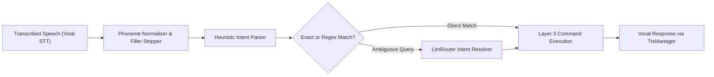

# 🎙️ Voice Intelligence, Intent Parsing & Command Contracts

## 🎙️ Spoken Intent NLP & Command Contract Architecture

`VoiceIntelligenceManager` (`Modules/Layer1/VoiceIntelligenceManager.cs`) converts spoken natural language phrases into structured system commands and tool executions.



---

## 📐 The Decoupled Command Contract (`ICommandHandler`)

Every command in Jarvis implements `ICommandHandler`. This enables decoupled registration where new commands can be added without modifying the core search loop:

```csharp
public interface ICommandHandler
{
    // Returns true if this handler can process the query
    bool CanHandle(string query);

    // Returns suggestions with fuzzy similarity ranking
    List<CommandResult> GetSuggestions(string query);

    // Optional background thread initialization
    void OnStart();
}

public class CommandResult
{
    public string Title { get; set; } = string.Empty;
    public string Description { get; set; } = string.Empty;
    public Action? Execute { get; set; }
    public double Similarity { get; set; } = 0.0;
    public string? IconPath { get; set; }
}
```

### 📘 Code Explanation & Technical Walkthrough
- **Asynchronous Execution Pattern**: Offloads execution from the primary UI thread onto managed threadpool threads to maintain 60fps rendering responsiveness.
- **Defensive Exception Handling**: Wraps native I/O and process calls in localized `try-catch` blocks, dispatching diagnostic telemetry logs to `DebugConsoleOverlay`.
- **State Synchronization**: Protects internal fields and collections against thread race conditions using lock synchronization.
