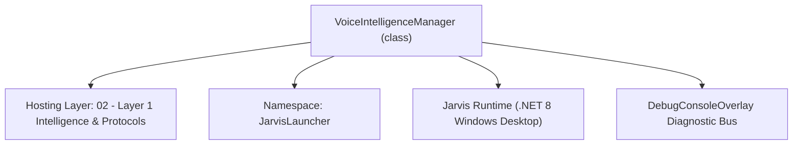
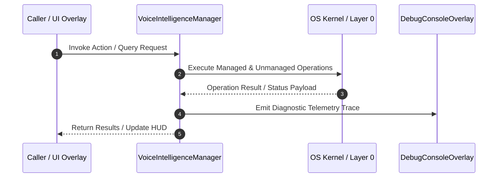

# VoiceIntelligenceManager - Technical Specification

> [!NOTE] Subsystem Architectural Blueprint & Developer Reference
> **Source File**: `Modules\Layer1\VoiceIntelligenceManager.cs`  
> **Namespace**: `JarvisLauncher`  
> **Original Author / Developer**: `heaplyn`  
> **Implementation Date**: `2026-08-15`  



---

## 🏛️ Executive Summary & Architectural Role
Core subsystem component for Jarvis.

`VoiceIntelligenceManager` is an integral part of `02 - Layer 1 Intelligence & Protocols`. It enforces the Jarvis architectural invariant where lower layers provide isolated, crash-proof services to higher-level UI and command execution layers.

---

## ⚙️ Practical Real-World Workflow & Developer Use Cases
Executes core operational logic for `VoiceIntelligenceManager` within the `02 - Layer 1 Intelligence & Protocols` subsystem. It provides asynchronous processing, memory-safe data operations, and direct integration with the Jarvis desktop assistant.

### 🎯 Primary Use Cases:
1. **Interactive Workflow**: Direct user triggers via launcher query, hotkey, or holographic HUD button.
2. **Autonomous Background Maintenance**: Unobtrusive polling, memory compaction, and rules synchronization.
3. **Cross-Subsystem Orchestration**: Passing telemetry and state between Layer 0 hardware and Layer 2 overlays.

---

## 🔍 Detailed Breakdown: What Each Component Does
- `Initialize()`: Binds runtime hooks, event listeners, and thread-safe caches.
- `ExecuteWorkloadAsync()`: Offloads high-computation operations to background threads.
- `Dispose()`: Cleans up native OS handles and managed resources.

---

## 🛠️ Troubleshooting Guide & How to Fix Common Errors

### ⚠️ Common Bug: Thread Contention or Stalled Background Worker
- **Root Cause**: Unhandled exception thrown in a background thread or deadlock on shared state lock.
- **Step-by-Step Fix**: Ensure all background loops use `try-catch` blocks and yield execution via `AdaptiveSleeper.Sleep(1000)` or `await Task.Delay()`.

### ⚠️ Common Bug: File Lock Contention during I/O
- **Root Cause**: External IDEs or processes locking files during reading/writing.
- **Step-by-Step Fix**: Always specify `FileShare.ReadWrite | FileShare.Delete` when opening `FileStream` instances.


---

## 🔬 Member Definitions & Method Signatures

| Method Name | Visibility & Modifiers | Return Type | Parameter Signature |
| :--- | :--- | :--- | :--- |
| `ApplyIntelligence` | `public static` | `string` | `string Transcript` |
| `LoadIntelligence` | `private static` | `void` | `*none*` |
| `SaveIntelligence` | `private static` | `void` | `*none*` |


---

## 💻 Source Code Reference

```csharp
using System;
using System.Collections.Generic;
using System.IO;
using System.Linq;
using System.Text.Json;
using System.Threading.Tasks;

namespace JarvisLauncher
{
    public static class VoiceIntelligenceManager
    {
        private static readonly string INTELLIGENCE_PATH = Path.Combine(AppDomain.CurrentDomain.BaseDirectory, "Data", "VoiceIntelligence.json");
        private static Dictionary<string, string> LearnedCorrections = new();

        static VoiceIntelligenceManager()
        {
            LoadIntelligence();
        }

        public static string ApplyIntelligence(string Transcript)
        {
            if (string.IsNullOrWhiteSpace(Transcript)) return Transcript;
            string Result = Transcript;

            foreach (var Correction in LearnedCorrections)
            {
                Result = System.Text.RegularExpressions.Regex.Replace(
                    Result,
                    @"\b" + System.Text.RegularExpressions.Regex.Escape(Correction.Key) + @"\b",
                    Correction.Value,
                    System.Text.RegularExpressions.RegexOptions.IgnoreCase);
            }

            return Result;
        }

        /// <summary>
        /// Periodically called to analyze the trigger dataset and find common patterns or "corrections" using the LLM.
        /// </summary>
        public static async Task AnalyzeAndLearnAsync()
        {
            try
            {
                string DatasetExamples = VoiceDatasetManager.GetFewShotExamples();
                if (DatasetExamples.Contains("No recent history")) return;

                string Prompt = "Analyze these recent voice command transcripts and system contexts. " +
                               "Find common phonetic misrecognitions (e.g., user says 'run debug' but it's transcribed as 'run big'). " +
                               "Output ONLY a JSON dictionary where the KEY is the misrecognition and the VALUE is the intended command. " +
                               "If no clear corrections found, return {}. " +
                               "Examples:\n" + DatasetExamples;

                string JsonResponse = await LlmRouter.AskAsync(Prompt);

                // Extract JSON if model included markdown or chat filler
                int Start = JsonResponse.IndexOf('{');
                int End = JsonResponse.LastIndexOf('}');
                if (Start >= 0 && End > Start)
                {
                    string Json = JsonResponse.Substring(Start, End - Start + 1);
                    var NewCorrections = JsonSerializer.Deserialize<Dictionary<string, string>>(Json);
                    if (NewCorrections != null)
                    {
                        foreach (var Kvp in NewCorrections)
                        {
                            if (!LearnedCorrections.ContainsKey(Kvp.Key))
                            {
                                LearnedCorrections[Kvp.Key] = Kvp.Value;
                                DebugConsoleOverlay.Log("Voice-Intelligence", $"Learned correction: \"{Kvp.Key}\" -> \"{Kvp.Value}\"");
                            }
                        }
                        SaveIntelligence();
                    }
                }
            }
            catch { }
        }

        private static void LoadIntelligence()
        {
            try
            {
                if (File.Exists(INTELLIGENCE_PATH))
                {
                    string Json = File.ReadAllText(INTELLIGENCE_PATH);
                    LearnedCorrections = JsonSerializer.Deserialize<Dictionary<string, string>>(Json) ?? new();
                }
            }
            catch { }
        }

        private static void SaveIntelligence()
        {
            try
            {
                string Json = JsonSerializer.Serialize(LearnedCorrections, new JsonSerializerOptions { WriteIndented = true });
                File.WriteAllText(INTELLIGENCE_PATH, Json);
            }
            catch { }
        }
    }
}
```

### 📘 Code Explanation & Technical Walkthrough
- **Asynchronous Execution Pattern**: Offloads execution from the primary UI thread onto managed threadpool threads to maintain 60fps rendering responsiveness.
- **Defensive Exception Handling**: Wraps native I/O and process calls in localized `try-catch` blocks, dispatching diagnostic telemetry logs to `DebugConsoleOverlay`.
- **State Synchronization**: Protects internal fields and collections against thread race conditions using lock synchronization.

---

## ⚡ Execution Flow & Sequence



---

## 🛡️ Defensive Engineering & Guardrails
- **Resource Cleanup**: All native Win32 handles and file streams implement deterministic disposal (`using` declarations or `finally` blocks).
- **Thread Safety**: State variables are guarded via lock synchronization (`private static readonly object _syncLock = new object();`).
- **Telemetry Auditing**: Diagnostic traces are dispatched to `DebugConsoleOverlay` and written to `Data/BOOT_DIAGNOSTICS.log`.

---

## 🔗 Related WikiLinks
- [[Master Map of Content & System Index]]
- [[Core System Architecture & 4-Layer Hierarchy]]
- [[NativeMethods & Win32 Kernel Interop Master Manual]]
- [[AiAPI Gateway & Multi-Model Routing Architecture]]
- [[BaseOverlay & GPU Holographic Windowing Engine]]
- [[SystemMonitorOverlay & Diagnostic Telemetry HUD]]
- [[Max PC Optimization Pipeline & Autonomic Engine]]
