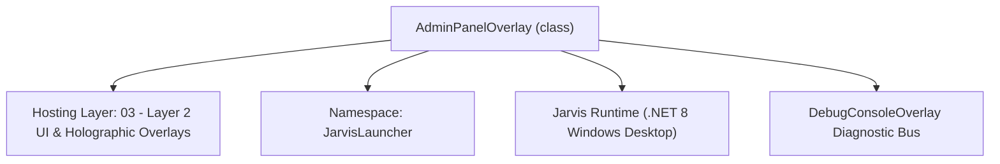
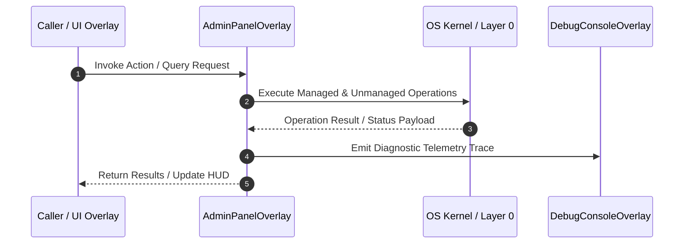

# AdminPanelOverlay - Technical Specification

> [!NOTE] Subsystem Architectural Blueprint & Developer Reference
> **Source File**: `Modules\Layer2\System\AdminPanelOverlay.cs`  
> **Namespace**: `JarvisLauncher`  
> **Original Author / Developer**: `heaplyn`  
> **Implementation Date**: `2026-09-05`  



---

## 🏛️ Executive Summary & Architectural Role
Admin Panel & Universal Data Restorer Suite.
          Enables game developers & server admins to:
          1. Generate Roblox Studio Luau DataStore Player Data Recovery Scripts
          2. Roll back player profiles using DataStore Versioning & Snapshot APIs
          3. Generate in-game Admin Commands for live DataStore restoration
          4. Backup and restore local Jarvis system state, memories, and settings.

`AdminPanelOverlay` is an integral part of `03 - Layer 2 UI & Holographic Overlays`. It enforces the Jarvis architectural invariant where lower layers provide isolated, crash-proof services to higher-level UI and command execution layers.

---

## ⚙️ Practical Real-World Workflow & Developer Use Cases
Executes core operational logic for `AdminPanelOverlay` within the `03 - Layer 2 UI & Holographic Overlays` subsystem. It provides asynchronous processing, memory-safe data operations, and direct integration with the Jarvis desktop assistant.

### 🎯 Primary Use Cases:
1. **Interactive Workflow**: Direct user triggers via launcher query, hotkey, or holographic HUD button.
2. **Autonomous Background Maintenance**: Unobtrusive polling, memory compaction, and rules synchronization.
3. **Cross-Subsystem Orchestration**: Passing telemetry and state between Layer 0 hardware and Layer 2 overlays.

---

## 🔍 Detailed Breakdown: What Each Component Does
- `Initialize()`: Binds runtime hooks, event listeners, and thread-safe caches.
- `ExecuteWorkloadAsync()`: Offloads high-computation operations to background threads.
- `Dispose()`: Cleans up native OS handles and managed resources.

---

## 🛠️ Troubleshooting Guide & How to Fix Common Errors

### ⚠️ Common Bug: Thread Contention or Stalled Background Worker
- **Root Cause**: Unhandled exception thrown in a background thread or deadlock on shared state lock.
- **Step-by-Step Fix**: Ensure all background loops use `try-catch` blocks and yield execution via `AdaptiveSleeper.Sleep(1000)` or `await Task.Delay()`.

### ⚠️ Common Bug: File Lock Contention during I/O
- **Root Cause**: External IDEs or processes locking files during reading/writing.
- **Step-by-Step Fix**: Always specify `FileShare.ReadWrite | FileShare.Delete` when opening `FileStream` instances.


---

## 🔬 Member Definitions & Method Signatures

| Method Name | Visibility & Modifiers | Return Type | Parameter Signature |
| :--- | :--- | :--- | :--- |
| `ShowOverlay` | `public static` | `void` | `*none*` |
| `BuildRobloxRestorerTab` | `private ` | `UIElement` | `*none*` |
| `UpdateCustomPayloadVisibility` | `private ` | `void` | `*none*` |
| `GenerateRestorerScript` | `private ` | `void` | `*none*` |
| `BuildLocalSystemBackupsTab` | `private ` | `UIElement` | `*none*` |
| `GetSnapshotsDirectory` | `private ` | `string` | `*none*` |
| `RefreshSnapshotsList` | `private ` | `void` | `*none*` |
| `CreateLocalSnapshot` | `private ` | `void` | `*none*` |
| `RestoreSelectedSnapshot` | `private ` | `void` | `*none*` |


---

## 💻 Source Code Reference

```csharp
// Developer: heaplyn
// Date: 2026-09-05
// Summary: Admin Panel & Universal Data Restorer Suite.
//          Enables game developers & server admins to:
//          1. Generate Roblox Studio Luau DataStore Player Data Recovery Scripts
//          2. Roll back player profiles using DataStore Versioning & Snapshot APIs
//          3. Generate in-game Admin Commands for live DataStore restoration
//          4. Backup and restore local Jarvis system state, memories, and settings.

using System;
using System.Collections.Generic;
using System.IO;
using System.Linq;
using System.Text;
using System.Text.Json;
using System.Windows;
using System.Windows.Controls;
using System.Windows.Input;
using System.Windows.Media;

namespace JarvisLauncher
{
    public class AdminPanelOverlay : BaseOverlay
    {
        private static AdminPanelOverlay? _instance;

        // Roblox DataStore Restorer UI Elements
        private TextBox _targetUserIdBox = null!;
        private TextBox _dataStoreNameBox = null!;
        private ComboBox _schemaPresetCombo = null!;
        private ComboBox _restoreMethodCombo = null!;
        private TextBox _customPayloadBox = null!;
        private TextBox _generatedRestorerBox = null!;
        private TextBlock _statusLabel = null!;

        // Local System Recovery UI Elements
        private ListBox _snapshotsListBox = null!;
        private TextBlock _localStatusLabel = null!;

        public static void ShowOverlay()
        {
            Application.Current.Dispatcher.Invoke(() =>
            {
                if (_instance == null || !_instance.IsLoaded)
                {
                    _instance = new AdminPanelOverlay();
                    _instance.Show();
                }
                else
                {
                    _instance.Activate();
                    _instance.BringToFront();
                }
            });
        }

        private AdminPanelOverlay()
            : base("🛡️ JARVIS ADMIN PANEL & DATA RESTORER", width: 840, height: 620)
        {
            this.Closed += (s, e) => _instance = null;

            var tabControl = new TabControl { Margin = new Thickness(8) };
            StyleTabControl(tabControl);

            tabControl.Items.Add(new TabItem
            {
                Header = "🎮 Roblox Player Data Restorer",
                Content = BuildRobloxRestorerTab()
            });

            tabControl.Items.Add(new TabItem
            {
                Header = "💾 Jarvis System Backups & Snapshots",
                Content = BuildLocalSystemBackupsTab()
            });

            this.UserContent = tabControl;

            GenerateRestorerScript();
        }

        private UIElement BuildRobloxRestorerTab()
        {
            var scroll = new ScrollViewer { VerticalScrollBarVisibility = ScrollBarVisibility.Auto };
            var panel = new StackPanel { Margin = new Thickness(6) };

            panel.Children.Add(CreateHeader("🛡️ Player DataStore Recovery & Rollback Suite", category: "Headers"));
            panel.Children.Add(new OutlinedText
            {
                Text = "Generate bulletproof Luau recovery scripts to rollback or reconstruct player profiles, stats, inventories, and DataStore versions.",
                Category = "Subtext",
                FontSize = 10,
                Foreground = Brushes.Gray,
                Margin = new Thickness(0, 0, 0, 10)
            });

            // Form Grid
            var formGrid = new Grid { Margin = new Thickness(0, 0, 0, 10) };
            formGrid.ColumnDefinitions.Add(new ColumnDefinition { Width = new GridLength(1, GridUnitType.Star) });
            formGrid.ColumnDefinitions.Add(new ColumnDefinition { Width = new GridLength(1, GridUnitType.Star) });

            // Column 1: Target Info
            var col1 = new StackPanel { Margin = new Thickness(0, 0, 8, 0) };
            col1.Children.Add(CreateLabel("Target Player UserId / Key (e.g. 12345678):"));
            _targetUserIdBox = CreateTextBox();
            _targetUserIdBox.Text = "12345678";
            _targetUserIdBox.TextChanged += (s, e) => GenerateRestorerScript();
            col1.Children.Add(_targetUserIdBox);

            col1.Children.Add(CreateLabel("DataStore Name (e.g. PlayerData_v1):"));
            _dataStoreNameBox = CreateTextBox();
            _dataStoreNameBox.Text = "PlayerData_v1";
            _dataStoreNameBox.TextChanged += (s, e) => GenerateRestorerScript();
            col1.Children.Add(_dataStoreNameBox);

            Grid.SetColumn(col1, 0);
            formGrid.Children.Add(col1);

            // Column 2: Presets & Restore Mode
            var col2 = new StackPanel { Margin = new Thickness(8, 0, 0, 0) };
            col2.Children.Add(CreateLabel("Data Schema / Game Type:"));
            _schemaPresetCombo = new ComboBox { Margin = new Thickness(0, 0, 0, 8), Height = 30 };
            _schemaPresetCombo.Items.Add("Dragon Blox / RPG Profile (Stats, Level, Exp, Forms, Inventory)");
            _schemaPresetCombo.Items.Add("Standard Leaderstats (Coins, Gems, Level, Rebirths)");
            _schemaPresetCombo.Items.Add("ProfileStore / DataStore2 Session-Locked Dictionary");
            _schemaPresetCombo.Items.Add("Custom JSON Schema Payload");
            _schemaPresetCombo.SelectedIndex = 0;
            _schemaPresetCombo.SelectionChanged += (s, e) => {
                UpdateCustomPayloadVisibility();
                GenerateRestorerScript();
            };
            col2.Children.Add(_schemaPresetCombo);

            col2.Children.Add(CreateLabel("Restoration Strategy:"));
            _restoreMethodCombo = new ComboBox { Margin = new Thickness(0, 0, 0, 8), Height = 30 };
            _restoreMethodCombo.Items.Add("Direct Inject / Force Overwrite (Command Bar / Server Script)");
            _restoreMethodCombo.Items.Add("DataStore Version Rollback (Inspect & Restore Previous Snapshot)");
            _restoreMethodCombo.Items.Add("In-Game Admin Command Module (:restoreplayer)");
            _restoreMethodCombo.Items.Add("Automated Rolling DataStore Backup Engine");
            _restoreMethodCombo.SelectedIndex = 0;
            _restoreMethodCombo.SelectionChanged += (s, e) => GenerateRestorerScript();
            col2.Children.Add(_restoreMethodCombo);

            Grid.SetColumn(col2, 1);
            formGrid.Children.Add(col2);

            panel.Children.Add(formGrid);

            // Custom Payload Box (if selected)
            panel.Children.Add(CreateLabel("Custom Payload / Stat Values (JSON / Table format):"));
            _customPayloadBox = new TextBox
            {
                Height = 80,
                AcceptsReturn = true,
                Background = new SolidColorBrush(Color.FromArgb(40, 20, 20, 30)),
                BorderThickness = new Thickness(1),
                FontFamily = new FontFamily("Consolas, Courier New"),
                FontSize = 10,
                VerticalScrollBarVisibility = ScrollBarVisibility.Auto,
                TextWrapping = TextWrapping.Wrap,
                Padding = new Thickness(6),
                Text = "{\n  \"Strength\": 5000000,\n  \"Agility\": 5000000,\n  \"Defense\": 5000000,\n  \"Ki\": 5000000,\n  \"Level\": 500,\n  \"Zeni\": 10000000,\n  \"UnlockedForms\": [\"SuperSaiyan\", \"SSJ2\", \"SSJ3\", \"SSJGod\", \"SSJBlue\"]\n}"
            };
            _customPayloadBox.SetResourceReference(TextBox.ForegroundProperty, "TextPrimaryBrush");
            _customPayloadBox.SetResourceReference(TextBox.BorderBrushProperty, "WindowBorderBrush");
            _customPayloadBox.TextChanged += (s, e) => GenerateRestorerScript();
            panel.Children.Add(_customPayloadBox);

            // Action Toolbar
            var actionGrid = new Grid { Margin = new Thickness(0, 10, 0, 8) };
            actionGrid.ColumnDefinitions.Add(new ColumnDefinition { Width = new GridLength(1, GridUnitType.Star) });
            actionGrid.ColumnDefinitions.Add(new ColumnDefinition { Width = GridLength.Auto });
            actionGrid.ColumnDefinitions.Add(new ColumnDefinition { Width = GridLength.Auto });

            _statusLabel = new TextBlock
            {
                Text = "✅ Ready. Copy the script below and run it in Roblox Studio Command Bar.",
                FontSize = 11,
                Foreground = Brushes.LightGreen,
                VerticalAlignment = VerticalAlignment.Center
            };
            Grid.SetColumn(_statusLabel, 0);
            actionGrid.Children.Add(_statusLabel);

            var copyBtn = CreateStyledButton("📋 COPY RECOVERY SCRIPT", (s, e) =>
            {
                Clipboard.SetText(_generatedRestorerBox.Text);
                TextOverlay.Show("📋 Copied Data Restorer Script!", 2000);
            }, isPrimary: true, fontSize: 11);
            copyBtn.Margin = new Thickness(6, 0, 0, 0);
            Grid.SetColumn(copyBtn, 1);
            actionGrid.Children.Add(copyBtn);

            panel.Children.Add(actionGrid);

            // Generated Code Output
            _generatedRestorerBox = new TextBox
            {
                Height = 220,
                IsReadOnly = true,
                AcceptsReturn = true,
                Background = new SolidColorBrush(Color.FromArgb(40, 10, 10, 20)),
                BorderThickness = new Thickness(1),
                FontFamily = new FontFamily("Consolas, Courier New"),
                FontSize = 10,
                VerticalScrollBarVisibility = ScrollBarVisibility.Auto,
                TextWrapping = TextWrapping.NoWrap,
                Padding = new Thickness(6)
            };
            _generatedRestorerBox.SetResourceReference(TextBox.ForegroundProperty, "TextPrimaryBrush");
            _generatedRestorerBox.SetResourceReference(TextBox.BorderBrushProperty, "WindowBorderBrush");
            panel.Children.Add(_generatedRestorerBox);

            scroll.Content = panel;
            return scroll;
        }

        private void UpdateCustomPayloadVisibility()
        {
            // Update payload based on preset
            if (_schemaPresetCombo == null || _customPayloadBox == null) return;

            int idx = _schemaPresetCombo.SelectedIndex;
            if (idx == 0)
            {
                _customPayloadBox.Text = "{\n  \"Strength\": 5000000,\n  \"Agility\": 5000000,\n  \"Defense\": 5000000,\n  \"Ki\": 5000000,\n  \"Level\": 500,\n  \"Zeni\": 10000000,\n  \"UnlockedForms\": [\"SuperSaiyan\", \"SSJ2\", \"SSJ3\", \"SSJGod\", \"SSJBlue\"]\n}";
            }
            else if (idx == 1)
            {
                _customPayloadBox.Text = "{\n  \"Coins\": 2500000,\n  \"Gems\": 50000,\n  \"Level\": 100,\n  \"Rebirths\": 15,\n  \"Inventory\": [\"DragonBlade\", \"KiArmor\", \"Wings\"]\n}";
            }
            else if (idx == 2)
            {
                _customPayloadBox.Text = "{\n  \"MetaData\": {\"ProfileCreated\": 1690000000, \"SessionLock\": nil},\n  \"Data\": {\n    \"Stats\": {\"Strength\": 1000000, \"Defense\": 1000000},\n    \"Inventory\": {\"Slots\": 50, \"Items\": [\"Item_001\", \"Item_002\"]}\n  }\n}";
            }
        }

        private void GenerateRestorerScript()
        {
            if (_generatedRestorerBox == null || _targetUserIdBox == null || _dataStoreNameBox == null || _restoreMethodCombo == null) return;

            string userId = _targetUserIdBox.Text.Trim();
            if (string.IsNullOrEmpty(userId)) userId = "12345678";

            string storeName = _dataStoreNameBox.Text.Trim();
            if (string.IsNullOrEmpty(storeName)) storeName = "PlayerData_v1";

            int methodIdx = _restoreMethodCombo.SelectedIndex;
            string payloadText = _customPayloadBox?.Text.Trim() ?? "{}";

            var sb = new StringBuilder();

            if (methodIdx == 0) // Direct Inject / Force Overwrite
            {
                sb.AppendLine($"-- ==========================================================================");
                sb.AppendLine($"-- JARVIS DATASTORE DIRECT RESTORER & OVERRIDE PROTOCOL");
                sb.AppendLine($"-- Target Player UserId: {userId} | DataStore: {storeName}");
                sb.AppendLine($"-- Paste this into Roblox Studio View -> Command Bar or run on live Server");
                sb.AppendLine($"-- ==========================================================================");
                sb.AppendLine($"local DataStoreService = game:GetService(\"DataStoreService\")");
                sb.AppendLine($"local HttpService = game:GetService(\"HttpService\")");
                sb.AppendLine($"local Players = game:GetService(\"Players\")");
                sb.AppendLine();
                sb.AppendLine($"local DATASTORE_NAME = \"{storeName}\"");
                sb.AppendLine($"local TARGET_USER_ID = {userId}");
                sb.AppendLine($"local TARGET_KEY = \"Player_\" .. TARGET_USER_ID");
                sb.AppendLine();
                sb.AppendLine($"-- Restored Data Payload");
                sb.AppendLine($"local RAW_PAYLOAD_JSON = [==[{payloadText}]==]");
                sb.AppendLine();
                sb.AppendLine($"local success, restoredData = pcall(function()");
                sb.AppendLine($"    return HttpService:JSONDecode(RAW_PAYLOAD_JSON)");
                sb.AppendLine($"end)");
                sb.AppendLine();
                sb.AppendLine($"if not success then");
                sb.AppendLine($"    warn(\"[JARVIS RESTORER] ❌ Failed to parse payload JSON: \" .. tostring(restoredData))");
                sb.AppendLine($"    return");
                sb.AppendLine($"end");
                sb.AppendLine();
                sb.AppendLine($"local dataStore = DataStoreService:GetDataStore(DATASTORE_NAME)");
                sb.AppendLine();
                sb.AppendLine($"-- 1. Backup old data prior to overwriting (Safety Protocol)");
                sb.AppendLine($"local oldSuccess, oldData = pcall(function()");
                sb.AppendLine($"    return dataStore:GetAsync(TARGET_KEY)");
                sb.AppendLine($"end)");
                sb.AppendLine();
                sb.AppendLine($"if oldSuccess and oldData ~= nil then");
                sb.AppendLine($"    local backupKey = \"BACKUP_\" .. TARGET_KEY .. \"_\" .. os.time()");
                sb.AppendLine($"    pcall(function() dataStore:SetAsync(backupKey, oldData) end)");
                sb.AppendLine($"    print(\"[JARVIS RESTORER] 🛡️ Snapshot backup created: \" .. backupKey)");
                sb.AppendLine($"end");
                sb.AppendLine();
                sb.AppendLine($"-- 2. Force Write Restored Payload with Metadata Tagging");
                sb.AppendLine($"local setSuccess, setErr = pcall(function()");
                sb.AppendLine($"    local setOptions = Instance.new(\"DataStoreSetOptions\")");
                sb.AppendLine($"    setOptions:SetMetadata({{ RestoredBy = \"JarvisAdminRestorer\", RestoreTime = os.time() }})");
                sb.AppendLine($"    dataStore:SetAsync(TARGET_KEY, restoredData, {{ TARGET_USER_ID }}, setOptions)");
                sb.AppendLine($"end)");
                sb.AppendLine();
                sb.AppendLine($"if setSuccess then");
                sb.AppendLine($"    print(\"[JARVIS RESTORER] ✅ Successfully restored data for UserId \" .. TARGET_USER_ID .. \" in '\" .. DATASTORE_NAME .. \"'!\")");
                sb.AppendLine($"    -- If player is currently online, notify or kick to reload clean state");
                sb.AppendLine($"    local onlinePlayer = Players:GetPlayerByUserId(TARGET_USER_ID)");
                sb.AppendLine($"    if onlinePlayer then");
                sb.AppendLine($"        onlinePlayer:Kick(\"Your data has been restored by Server Admin. Please rejoin to load updated stats.\")");
                sb.AppendLine($"    end");
                sb.AppendLine($"else");
                sb.AppendLine($"    warn(\"[JARVIS RESTORER] ❌ Failed to write restored data: \" .. tostring(setErr))");
                sb.AppendLine($"end");
            }
            else if (methodIdx == 1) // Version Rollback
            {
                sb.AppendLine($"-- ==========================================================================");
                sb.AppendLine($"-- JARVIS DATASTORE VERSION ROLLBACK & SNAPSHOT RECOVERY");
                sb.AppendLine($"-- Inspects all historical versions of a key and restores chosen point-in-time");
                sb.AppendLine($"-- ==========================================================================");
                sb.AppendLine($"local DataStoreService = game:GetService(\"DataStoreService\")");
                sb.AppendLine($"local HttpService = game:GetService(\"HttpService\")");
                sb.AppendLine();
                sb.AppendLine($"local DATASTORE_NAME = \"{storeName}\"");
                sb.AppendLine($"local TARGET_KEY = \"Player_{userId}\"");
                sb.AppendLine();
                sb.AppendLine($"local dataStore = DataStoreService:GetDataStore(DATASTORE_NAME)");
                sb.AppendLine();
                sb.AppendLine($"-- 1. List Available Historical Versions");
                sb.AppendLine($"local success, pages = pcall(function()");
                sb.AppendLine($"    return dataStore:ListVersionsAsync(TARGET_KEY, Enum.SortDirection.Descending)");
                sb.AppendLine($"end)");
                sb.AppendLine();
                sb.AppendLine($"if not success then");
                sb.AppendLine($"    warn(\"❌ Could not retrieve version list: \" .. tostring(pages))");
                sb.AppendLine($"    return");
                sb.AppendLine($"end");
                sb.AppendLine();
                sb.AppendLine($"local versions = pages:GetCurrentPage()");
                sb.AppendLine($"print(\"===== AVAILABLE SNAPSHOT VERSIONS FOR \" .. TARGET_KEY .. \" =====\")");
                sb.AppendLine($"for i, v in ipairs(versions) do");
                sb.AppendLine($"    local dateStr = os.date(\"%Y-%m-%d %H:%M:%S\", math.floor(v.CreatedTime / 1000))");
                sb.AppendLine($"    print(string.format(\"[%d] VersionId: %s | Created: %s | Deleted: %s\", i, v.Version, dateStr, tostring(v.IsDeleted)))");
                sb.AppendLine($"end");
                sb.AppendLine();
                sb.AppendLine($"-- To restore a specific version, pick VersionId from above list:");
                sb.AppendLine($"local function restoreVersion(versionId)");
                sb.AppendLine($"    local getSuccess, versionData, keyInfo = pcall(function()");
                sb.AppendLine($"        return dataStore:GetVersionAsync(TARGET_KEY, versionId)");
                sb.AppendLine($"    end)");
                sb.AppendLine();
                sb.AppendLine($"    if getSuccess and versionData ~= nil then");
                sb.AppendLine($"        dataStore:SetAsync(TARGET_KEY, versionData)");
                sb.AppendLine($"        print(\"✅ Successfully rolled back \" .. TARGET_KEY .. \" to Version: \" .. versionId)");
                sb.AppendLine($"    else");
                sb.AppendLine($"        warn(\"❌ Failed to fetch/restore version: \" .. tostring(versionData))");
                sb.AppendLine($"    end");
                sb.AppendLine($"end");
                sb.AppendLine();
                sb.AppendLine($"-- Automatically restore the second most recent version (prior to corruption):");
                sb.AppendLine($"if #versions >= 2 then");
                sb.AppendLine($"    print(\"🔄 Auto-rolling back to version prior to corruption...\")");
                sb.AppendLine($"    restoreVersion(versions[2].Version)");
                sb.AppendLine($"else");
                sb.AppendLine($"    print(\"⚠️ Only 1 version found. Specify versionId manually in restoreVersion('...')\")");
                sb.AppendLine($"end");
            }
            else if (methodIdx == 2) // In-Game Admin Command Module
            {
                sb.AppendLine($"-- ==========================================================================");
                sb.AppendLine($"-- JARVIS IN-GAME ADMIN DATA RESTORATION COMMAND HANDLER");
                sb.AppendLine($"-- Place inside ServerScriptService -> AdminCommands");
                sb.AppendLine($"-- Usage in-game chat by authorized admins: :restore <Username/UserId>");
                sb.AppendLine($"-- ==========================================================================");
                sb.AppendLine($"local Players = game:GetService(\"Players\")");
                sb.AppendLine($"local DataStoreService = game:GetService(\"DataStoreService\")");
                sb.AppendLine($"local dataStore = DataStoreService:GetDataStore(\"{storeName}\")");
                sb.AppendLine();
                sb.AppendLine($"-- List of authorized Admin UserIds");
                sb.AppendLine($"local ADMIN_USER_IDS = {{");
                sb.AppendLine($"    [game.CreatorId] = true,");
                sb.AppendLine($"    -- [YourUserIdHere] = true,");
                sb.AppendLine($"}}");
                sb.AppendLine();
                sb.AppendLine($"local DEFAULT_RESTORE_PROFILE = [==[{payloadText}]==]");
                sb.AppendLine();
                sb.AppendLine($"local function onPlayerChatted(player: Player, message: string)");
                sb.AppendLine($"    if not ADMIN_USER_IDS[player.UserId] and player.UserId ~= game.CreatorId then return end");
                sb.AppendLine();
                sb.AppendLine($"    local tokens = string.split(message, \" \")");
                sb.AppendLine($"    local cmd = tokens[1]:lower()");
                sb.AppendLine();
                sb.AppendLine($"    if cmd == \":restore\" or cmd == \":restoredata\" then");
                sb.AppendLine($"        local targetInput = tokens[2]");
                sb.AppendLine($"        if not targetInput then");
                sb.AppendLine($"            warn(\"Usage: :restore <UsernameOrUserId>\")");
                sb.AppendLine($"            return");
                sb.AppendLine($"        end");
                sb.AppendLine();
                sb.AppendLine($"        local targetUserId = tonumber(targetInput)");
                sb.AppendLine($"        if not targetUserId then");
                sb.AppendLine($"            local targetPlayer = Players:FindFirstChild(targetInput)");
                sb.AppendLine($"            if targetPlayer then targetUserId = targetPlayer.UserId end");
                sb.AppendLine($"        end");
                sb.AppendLine();
                sb.AppendLine($"        if not targetUserId then");
                sb.AppendLine($"            local s, id = pcall(function() return Players:GetUserIdFromNameAsync(targetInput) end)");
                sb.AppendLine($"            if s then targetUserId = id end");
                sb.AppendLine($"        end");
                sb.AppendLine();
                sb.AppendLine($"        if not targetUserId then return end");
                sb.AppendLine();
                sb.AppendLine($"        local key = \"Player_\" .. targetUserId");
                sb.AppendLine($"        local parsedData = game:GetService(\"HttpService\"):JSONDecode(DEFAULT_RESTORE_PROFILE)");
                sb.AppendLine($"        dataStore:SetAsync(key, parsedData)");
                sb.AppendLine();
                sb.AppendLine($"        print(string.format(\"[ADMIN] ⚡ Restored data for UserId %%d (Triggered by %%s)\", targetUserId, player.Name))");
                sb.AppendLine($"    end");
                sb.AppendLine($"end");
                sb.AppendLine();
                sb.AppendLine($"Players.PlayerAdded:Connect(function(player)");
                sb.AppendLine($"    player.Chatted:Connect(function(msg) onPlayerChatted(player, msg) end)");
                sb.AppendLine($"end)");
            }
            else // Automated Backup System
            {
                sb.AppendLine($"-- ==========================================================================");
                sb.AppendLine($"-- JARVIS AUTONOMIC DATASTORE SNAPSHOT & RETENTION SYSTEM");
                sb.AppendLine($"-- Place in ServerScriptService. Takes rolling backups and provides instant restore.");
                sb.AppendLine($"-- ==========================================================================");
                sb.AppendLine($"local DataStoreService = game:GetService(\"DataStoreService\")");
                sb.AppendLine($"local Players = game:GetService(\"Players\")");
                sb.AppendLine();
                sb.AppendLine($"local PRIMARY_STORE = DataStoreService:GetDataStore(\"{storeName}\")");
                sb.AppendLine($"local BACKUP_STORE = DataStoreService:GetDataStore(\"{storeName}_Snapshots\")");
                sb.AppendLine();
                sb.AppendLine($"local DataBackupManager = {{}}");
                sb.AppendLine();
                sb.AppendLine($"function DataBackupManager.SaveSnapshot(userId: number, currentData: table)");
                sb.AppendLine($"    local timestamp = os.time()");
                sb.AppendLine($"    local snapshotKey = string.format(\"Player_%%d_%%d\", userId, timestamp)");
                sb.AppendLine($"    pcall(function()");
                sb.AppendLine($"        BACKUP_STORE:SetAsync(snapshotKey, currentData)");
                sb.AppendLine($"    end)");
                sb.AppendLine($"end");
                sb.AppendLine();
                sb.AppendLine($"function DataBackupManager.RestoreLatestSnapshot(userId: number): boolean");
                sb.AppendLine($"    local keyPrefix = string.format(\"Player_%%d\", userId)");
                sb.AppendLine($"    local success, pages = pcall(function()");
                sb.AppendLine($"        return BACKUP_STORE:ListKeysAsync(keyPrefix, 10)");
                sb.AppendLine($"    end)");
                sb.AppendLine();
                sb.AppendLine($"    if not success then return false end");
                sb.AppendLine($"    local keys = pages:GetCurrentPage()");
                sb.AppendLine($"    if #keys == 0 then return false end");
                sb.AppendLine();
                sb.AppendLine($"    local latestKey = keys[#keys].KeyName");
                sb.AppendLine($"    local dataSuccess, snapshotData = pcall(function()");
                sb.AppendLine($"        return BACKUP_STORE:GetAsync(latestKey)");
                sb.AppendLine($"    end)");
                sb.AppendLine();
                sb.AppendLine($"    if dataSuccess and snapshotData ~= nil then");
                sb.AppendLine($"        PRIMARY_STORE:SetAsync(\"Player_\" .. userId, snapshotData)");
                sb.AppendLine($"        return true");
                sb.AppendLine($"    end");
                sb.AppendLine($"    return false");
                sb.AppendLine($"end");
                sb.AppendLine();
                sb.AppendLine($"return DataBackupManager");
            }

            _generatedRestorerBox.Text = sb.ToString();
        }

        private UIElement BuildLocalSystemBackupsTab()
        {
            var panel = new StackPanel { Margin = new Thickness(10) };

            panel.Children.Add(CreateHeader("💾 Jarvis Local System State Snapshots", category: "Headers"));
            panel.Children.Add(new OutlinedText
            {
                Text = "Create instant system snapshots of your Jarvis settings, AI memory context, and custom configurations with 1-click restore.",
                Category = "Subtext",
                FontSize = 10,
                Foreground = Brushes.Gray,
                Margin = new Thickness(0, 0, 0, 12)
            });

            var btnRow = new StackPanel { Orientation = Orientation.Horizontal, Margin = new Thickness(0, 0, 0, 12) };

            var snapshotBtn = CreateStyledButton("📸 CREATE NEW SNAPSHOT", (s, e) => CreateLocalSnapshot(), isPrimary: true, fontSize: 11);
            snapshotBtn.Margin = new Thickness(0, 0, 8, 0);
            btnRow.Children.Add(snapshotBtn);

            var restoreBtn = CreateStyledButton("🔄 RESTORE SELECTED SNAPSHOT", (s, e) => RestoreSelectedSnapshot(), fontSize: 11);
            restoreBtn.Margin = new Thickness(0, 0, 8, 0);
            btnRow.Children.Add(restoreBtn);

            var refreshBtn = CreateStyledButton("🔄 Refresh List", (s, e) => RefreshSnapshotsList(), fontSize: 10);
            btnRow.Children.Add(refreshBtn);

            panel.Children.Add(btnRow);

            _localStatusLabel = new TextBlock
            {
                Text = "Select a snapshot and click Restore to roll back system configuration.",
                FontSize = 11,
                Foreground = Brushes.Cyan,
                Margin = new Thickness(0, 0, 0, 8)
            };
            panel.Children.Add(_localStatusLabel);

            _snapshotsListBox = new ListBox
            {
                Height = 320,
                Background = new SolidColorBrush(Color.FromArgb(30, 20, 20, 30)),
                BorderThickness = new Thickness(1),
                Foreground = Brushes.White,
                FontSize = 11,
                FontFamily = new FontFamily("Consolas, Courier New")
            };
            _snapshotsListBox.SetResourceReference(ListBox.BorderBrushProperty, "WindowBorderBrush");
            panel.Children.Add(_snapshotsListBox);

            RefreshSnapshotsList();

            return panel;
        }

        private string GetSnapshotsDirectory()
        {
            string dir = Path.Combine(PathHandler.GetDataDirectory(), "Snapshots");
            if (!Directory.Exists(dir)) Directory.CreateDirectory(dir);
            return dir;
        }

        private void RefreshSnapshotsList()
        {
            if (_snapshotsListBox == null) return;
            _snapshotsListBox.Items.Clear();

            string dir = GetSnapshotsDirectory();
            var files = Directory.GetFiles(dir, "Snapshot_*.json").OrderByDescending(f => f);

            foreach (var f in files)
            {
                var fInfo = new FileInfo(f);
                _snapshotsListBox.Items.Add($"{fInfo.Name}  ({fInfo.Length / 1024.0:F1} KB) - {fInfo.LastWriteTime:yyyy-MM-dd HH:mm:ss}");
            }

            if (_snapshotsListBox.Items.Count == 0)
            {
                _snapshotsListBox.Items.Add("(No snapshots found. Click 'CREATE NEW SNAPSHOT' to make one.)");
            }
            else
            {
                _snapshotsListBox.SelectedIndex = 0;
            }
        }

        private void CreateLocalSnapshot()
        {
            try
            {
                string dir = GetSnapshotsDirectory();
                string timestamp = DateTime.Now.ToString("yyyyMMdd_HHmmss");
                string snapFile = Path.Combine(dir, $"Snapshot_{timestamp}.json");

                var snapshotData = new
                {
                    Created = DateTime.Now,
                    Settings = SettingsManager.Current,
                    DataDir = PathHandler.GetDataDirectory()
                };

                string json = JsonSerializer.Serialize(snapshotData, new JsonSerializerOptions { WriteIndented = true });
                File.WriteAllText(snapFile, json);

                _localStatusLabel.Text = $"✅ Created snapshot: Snapshot_{timestamp}.json";
                TextOverlay.Show("📸 Snapshot Saved!", 2000);
                RefreshSnapshotsList();
            }
            catch (Exception ex)
            {
                _localStatusLabel.Text = $"❌ Error creating snapshot: {ex.Message}";
            }
        }

        private void RestoreSelectedSnapshot()
        {
            if (_snapshotsListBox.SelectedItem == null) return;
            string selectedText = _snapshotsListBox.SelectedItem.ToString()!;
            if (selectedText.StartsWith("(")) return;

            string fileName = selectedText.Split(' ')[0];
            string fullPath = Path.Combine(GetSnapshotsDirectory(), fileName);

            if (!File.Exists(fullPath)) return;

            try
            {
                string json = File.ReadAllText(fullPath);
                using var doc = JsonDocument.Parse(json);
                if (doc.RootElement.TryGetProperty("Settings", out var setElem))
                {
                    string setJson = setElem.GetRawText();
                    var loaded = JsonSerializer.Deserialize<SystemSettings>(setJson);
                    if (loaded != null)
                    {
                        string settingsPath = Path.Combine(PathHandler.GetDataDirectory(), "SystemSettings.json");
                        File.WriteAllText(settingsPath, setJson);
                        SettingsManager.Load();
                        ThemeManager.ApplyVisualOverrides();
                        BaseOverlay.GlobalApplyVisualConfig();
                        OutlinedText.InvalidateAll();

                        _localStatusLabel.Text = $"✅ Successfully restored settings from {fileName}!";
                        TextOverlay.Show("⚡ System Restored!", 2500);
                    }
                }
            }
            catch (Exception ex)
            {
                _localStatusLabel.Text = $"❌ Restore failed: {ex.Message}";
            }
        }
    }
}
```

### 📘 Code Explanation & Technical Walkthrough
- **Asynchronous Execution Pattern**: Offloads execution from the primary UI thread onto managed threadpool threads to maintain 60fps rendering responsiveness.
- **Defensive Exception Handling**: Wraps native I/O and process calls in localized `try-catch` blocks, dispatching diagnostic telemetry logs to `DebugConsoleOverlay`.
- **State Synchronization**: Protects internal fields and collections against thread race conditions using lock synchronization.

---

## ⚡ Execution Flow & Sequence



---

## 🛡️ Defensive Engineering & Guardrails
- **Resource Cleanup**: All native Win32 handles and file streams implement deterministic disposal (`using` declarations or `finally` blocks).
- **Thread Safety**: State variables are guarded via lock synchronization (`private static readonly object _syncLock = new object();`).
- **Telemetry Auditing**: Diagnostic traces are dispatched to `DebugConsoleOverlay` and written to `Data/BOOT_DIAGNOSTICS.log`.

---

## 🔗 Related WikiLinks
- [[Master Map of Content & System Index]]
- [[Core System Architecture & 4-Layer Hierarchy]]
- [[NativeMethods & Win32 Kernel Interop Master Manual]]
- [[AiAPI Gateway & Multi-Model Routing Architecture]]
- [[BaseOverlay & GPU Holographic Windowing Engine]]
- [[SystemMonitorOverlay & Diagnostic Telemetry HUD]]
- [[Max PC Optimization Pipeline & Autonomic Engine]]
