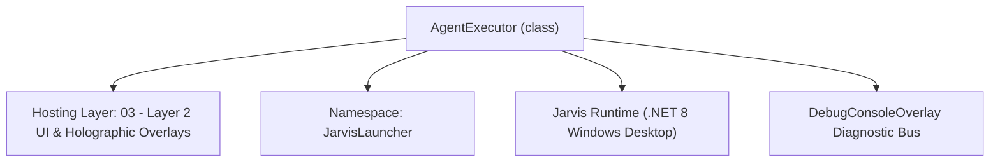
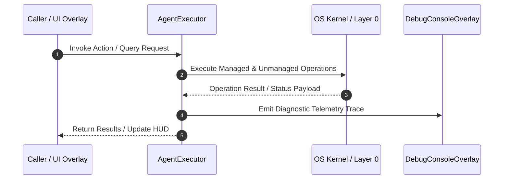

# AgentExecutor - Technical Specification

> [!NOTE] Subsystem Architectural Blueprint & Developer Reference
> **Source File**: `Modules\Layer2\System\AgentExecutor.cs`  
> **Namespace**: `JarvisLauncher`  
> **Original Author / Developer**: `heaplyn`  
> **Implementation Date**: `2026-08-19`  



---

## 🏛️ Executive Summary & Architectural Role
Universal AI Action Orchestrator with Autonomous Evolution.
          Supports stacked/cascading tool calls and real-time capability synthesis.

`AgentExecutor` is an integral part of `03 - Layer 2 UI & Holographic Overlays`. It enforces the Jarvis architectural invariant where lower layers provide isolated, crash-proof services to higher-level UI and command execution layers.

---

## ⚙️ Practical Real-World Workflow & Developer Use Cases
Executes core operational logic for `AgentExecutor` within the `03 - Layer 2 UI & Holographic Overlays` subsystem. It provides asynchronous processing, memory-safe data operations, and direct integration with the Jarvis desktop assistant.

### 🎯 Primary Use Cases:
1. **Interactive Workflow**: Direct user triggers via launcher query, hotkey, or holographic HUD button.
2. **Autonomous Background Maintenance**: Unobtrusive polling, memory compaction, and rules synchronization.
3. **Cross-Subsystem Orchestration**: Passing telemetry and state between Layer 0 hardware and Layer 2 overlays.

---

## 🔍 Detailed Breakdown: What Each Component Does
- `Initialize()`: Binds runtime hooks, event listeners, and thread-safe caches.
- `ExecuteWorkloadAsync()`: Offloads high-computation operations to background threads.
- `Dispose()`: Cleans up native OS handles and managed resources.

---

## 🛠️ Troubleshooting Guide & How to Fix Common Errors

### ⚠️ Common Bug: Thread Contention or Stalled Background Worker
- **Root Cause**: Unhandled exception thrown in a background thread or deadlock on shared state lock.
- **Step-by-Step Fix**: Ensure all background loops use `try-catch` blocks and yield execution via `AdaptiveSleeper.Sleep(1000)` or `await Task.Delay()`.

### ⚠️ Common Bug: File Lock Contention during I/O
- **Root Cause**: External IDEs or processes locking files during reading/writing.
- **Step-by-Step Fix**: Always specify `FileShare.ReadWrite | FileShare.Delete` when opening `FileStream` instances.


---

## 🔬 Member Definitions & Method Signatures

| Method Name | Visibility & Modifiers | Return Type | Parameter Signature |
| :--- | :--- | :--- | :--- |
| `ProcessAIResponse` | `public static` | `string` | `string aiResponse` |
| `ProcessSafeIntents` | `private static` | `void` | `string aiResponse` |
| `StripAllInternalTags` | `public static` | `string` | `string text` |
| `ExecutePowerShellDirect` | `public static` | `string` | `string cmd` |


---

## 💻 Source Code Reference

```csharp
// Developer: heaplyn
// Date: 2026-08-19
// Summary: Universal AI Action Orchestrator with Autonomous Evolution.
//          Supports stacked/cascading tool calls and real-time capability synthesis.

using System;
using System.IO;
using System.Text;
using System.Text.RegularExpressions;
using System.Windows;
using System.Threading.Tasks;
using System.Linq;
using System.Collections.Generic;
using System.Diagnostics;
using JarvisLauncher.AiTools;

namespace JarvisLauncher
{
    public static class AgentExecutor
    {
        private const int MAX_TOOL_RECURSION = 5;

        public static async Task<string> ProcessAIResponseAsync(string aiResponse)
        {
            if (string.IsNullOrEmpty(aiResponse)) return aiResponse;
            aiResponse = AiAPI.CleanScratchpadText(aiResponse);

            if (!SettingsManager.Current.ENABLE_PC_CONTROL)
            {
                ProcessSafeIntents(aiResponse);
                return StripAllInternalTags(aiResponse);
            }

            // AGENT MODE: runtime tool synthesis (@new_tool). Each synthesized tool runs arbitrary
            // PowerShell, so ProcessToolSynthesisAsync confirms every one with the user before it is
            // registered. Only reachable here because ENABLE_PC_CONTROL is on.
            try { await SelfEvolvingToolEngine.ProcessToolSynthesisAsync(aiResponse); } catch { }

            string currentContext = aiResponse;
            var executedTags = new HashSet<string>();
            int iteration = 0;

            // --- UNIVERSAL TOOL LOOP (Supports Stacking/Chaining) ---
            while (iteration < MAX_TOOL_RECURSION)
            {
                var tools = AiToolRegistry.GetAllTools();
                var toolResults = new StringBuilder();
                bool anyExecuted = false;

                foreach (var tool in tools)
                {
                    try
                    {
                        var regex = new Regex(tool.RegexPattern, RegexOptions.Singleline | RegexOptions.IgnoreCase);
                        var matches = regex.Matches(currentContext);

                        foreach (Match match in matches)
                        {
                            string result = await tool.ExecuteAsync(match, executedTags);
                            if (!string.IsNullOrEmpty(result))
                            {
                                toolResults.AppendLine(result);
                                anyExecuted = true;
                                ChatOverlay.LogConsoleAction("Tool Executed", $"[{tool.Tag}]: {match.Value}");
                                CommandAuditLog.Log(tool.Tag, match.Value);   // durable audit of every tool the AI runs
                            }
                        }
                    }
                    catch (Exception ex)
                    {
                        DebugConsoleOverlay.Log("Tool-Error", $"[{tool.Tag}]: {ex.Message}");
                    }
                }

                // Process legacy hardcoded tags that return context
                string legacyOutput = await ProcessLegacyTagsWithContextAsync(currentContext, executedTags);
                if (!string.IsNullOrEmpty(legacyOutput))
                {
                    toolResults.AppendLine(legacyOutput);
                    anyExecuted = true;
                }

                if (!anyExecuted) break;

                // Stacked execution: The output of these tools is fed back to the orchestrator
                // This allows the AI to react to file contents, command results, etc.
                currentContext = toolResults.ToString();
                iteration++;

                DebugConsoleOverlay.Log("Ai-Agent", $"Cascading tool chain depth: {iteration}");
            }

            // Final pass for side-effect-only tags (Speech, UI)
            ProcessSafeIntents(aiResponse);

            return StripAllInternalTags(aiResponse);
        }

        // === Multi-turn agent loop ===
        // Ask the LLM, run any tools it emitted, feed the tool results BACK to the LLM, and repeat —
        // up to AGENT_MAX_TURNS — so it can chain steps for a complex task. Tools only run in Agent
        // Mode; otherwise this is a single LLM call. Returns the final (tag-stripped) answer.
        public static async Task<string> RunAgentTurnsAsync(string userPrompt, List<ChatTurn>? history,
            System.Threading.CancellationToken ct = default, Action<string>? onStep = null)
        {
            int maxTurns = Math.Max(1, SettingsManager.Current.AGENT_MAX_TURNS);
            var convo = new List<ChatTurn>(history ?? new List<ChatTurn>());
            string prompt = userPrompt;
            string finalResponse = "";
            var executedTags = new HashSet<string>();

            for (int turn = 0; turn < maxTurns; turn++)
            {
                string response = await LlmRouter.AskAsync(prompt, convo, ct);
                finalResponse = response;

                if (!SettingsManager.Current.ENABLE_PC_CONTROL) { ProcessSafeIntents(response); break; }

                try { await SelfEvolvingToolEngine.ProcessToolSynthesisAsync(response); } catch { }
                var (toolOutput, anyRan) = await ExecuteToolsOnceAsync(response, executedTags);

                if (!anyRan) { ProcessSafeIntents(response); break; }   // no tools => final answer

                onStep?.Invoke($"⚙️ Turn {turn + 1}: ran tools, continuing…");
                convo.Add(new ChatTurn { Role = "user", Text = prompt });
                convo.Add(new ChatTurn { Role = "model", Text = response });
                prompt = $"[TOOL RESULTS]\n{toolOutput}\nUse these results to continue the task. When it is complete, reply with your final answer and NO more tool tags.";
            }
            return StripAllInternalTags(finalResponse);
        }

        // Runs each registered tool's matches once (+ legacy tags), returns combined output & whether any ran.
        private static async Task<(string output, bool anyRan)> ExecuteToolsOnceAsync(string response, HashSet<string> executedTags)
        {
            var sb = new StringBuilder();
            bool any = false;
            foreach (var tool in AiToolRegistry.GetAllTools())
            {
                try
                {
                    var rx = new Regex(tool.RegexPattern, RegexOptions.Singleline | RegexOptions.IgnoreCase);
                    foreach (Match m in rx.Matches(response))
                    {
                        string r = await tool.ExecuteAsync(m, executedTags);
                        if (!string.IsNullOrEmpty(r))
                        {
                            sb.AppendLine(r); any = true;
                            try { ChatOverlay.LogConsoleAction("Tool Executed", $"[{tool.Tag}]: {m.Value}"); } catch { }
                            CommandAuditLog.Log(tool.Tag, m.Value);
                        }
                    }
                }
                catch (Exception ex) { try { DebugConsoleOverlay.Log("Tool-Error", $"[{tool.Tag}]: {ex.Message}"); } catch { } }
            }
            string legacy = await ProcessLegacyTagsWithContextAsync(response, executedTags);
            if (!string.IsNullOrEmpty(legacy)) { sb.AppendLine(legacy); any = true; }
            return (sb.ToString(), any);
        }

        private static async Task<string> ProcessLegacyTagsWithContextAsync(string response, HashSet<string> executed)
        {
            var sb = new StringBuilder();

            // SECURITY: model-emitted PowerShell (@ps{...} / [EXEC_PS:...]) is DISABLED. The model
            // must never run arbitrary shell. Internal fixed-script callers of ExecutePowerShellDirect
            // (firewall rule, diagnostics) are unaffected because they pass constant scripts, not model text.

            // 2. Process INGEST_DOCS
            var ingestRegex = new Regex(@"(?:\[INGEST_DOCS:\s*(?<url>.+?)\]|@ingest\{(?<url>.+?)\})", RegexOptions.IgnoreCase);
            foreach (Match m in ingestRegex.Matches(response))
            {
                string url = m.Groups["url"].Value.Trim();
                if (executed.Add("INGEST:" + url))
                {
                    _ = Task.Run(() => WebOperationManager.IngestDocumentationAsync(url));
                    sb.AppendLine($"[SYSTEM]: Triggered documentation ingestion for {url}");
                }
            }

            return sb.ToString();
        }

        public static string ProcessAIResponse(string aiResponse)
        {
             var task = Task.Run(() => ProcessAIResponseAsync(aiResponse));
             task.Wait();
             return task.Result;
        }

        private static string _lastSpokenText = string.Empty;
        private static DateTime _lastSpokenTime = DateTime.MinValue;

        private static void ProcessSafeIntents(string aiResponse)
        {
            // 5. Process SPEECH tags with anti-loop de-duplication
            var speechRegex = new Regex(@"(?:\[SPEECH:\s*(?<text>[\s\S]+?)\]|@say\{(?<text>.*?)\})", RegexOptions.IgnoreCase | RegexOptions.Singleline);
            foreach (Match m in speechRegex.Matches(aiResponse))
            {
                string text = m.Groups["text"].Value.Trim().Trim('"', '\'');
                if (string.IsNullOrWhiteSpace(text)) continue;

                // Anti-loop: suppress identical speech tags repeating within 6 seconds
                if (text.Equals(_lastSpokenText, StringComparison.OrdinalIgnoreCase) && (DateTime.Now - _lastSpokenTime).TotalSeconds < 6)
                {
                    DebugConsoleOverlay.Log("AntiLoop", $"Suppressed duplicate speech tag: '{text}'");
                    continue;
                }

                _lastSpokenText = text;
                _lastSpokenTime = DateTime.Now;
                TtsManager.Speak(text);
            }

            // 6. Process SET_CLIPBOARD tags
            var clipRegex = new Regex(@"\[SET_CLIPBOARD:\s*(?<text>[\s\S]+?)\]", RegexOptions.IgnoreCase | RegexOptions.Singleline);
            foreach (Match m in clipRegex.Matches(aiResponse))
            {
                string text = m.Groups["text"].Value.Trim().Trim('"', '\'');
                Application.Current.Dispatcher.Invoke(() => Clipboard.SetText(text));
            }

            // 11. Handling UI commands (allowAiFallback: false prevents infinite recursion back to ChatOverlay)
            var cmdRegex = new Regex(@"(?:\[RUN_COMMAND:\s*(?<cmd>.+?)\]|@run\{(?<cmd>.+?)\})", RegexOptions.IgnoreCase);
            foreach (Match m in cmdRegex.Matches(aiResponse))
            {
                string cmd = m.Groups["cmd"].Value.Trim();
                Application.Current.Dispatcher.Invoke(() => CommandParser.ExecuteFirstSuggestion(cmd, allowAiFallback: false));
            }

            // 12. Handle REBUILD / FRESH START
            if (aiResponse.Contains("[REBUILD_PROJECT]", StringComparison.OrdinalIgnoreCase) ||
                aiResponse.Contains("[FRESH_START]", StringComparison.OrdinalIgnoreCase))
            {
                Application.Current.Dispatcher.Invoke(() => NativeMethods.Restart(freshBoot: true));
            }
        }

        public static string StripAllInternalTags(string text)
        {
            if (string.IsNullOrWhiteSpace(text)) return string.Empty;
            string cleaned = text;

            var appResponseRegex = new Regex(@"\{\{\{\{APP_RESPONSE:::(?<content>.*?):::APP_RESPONSE\}\}\}\}", RegexOptions.IgnoreCase | RegexOptions.Singleline);
            var match = appResponseRegex.Match(cleaned);
            if (match.Success) cleaned = match.Groups["content"].Value.Trim();

            cleaned = Regex.Replace(cleaned, @"\[WRITE_FILE:\s*.+?\][\s\S]*?\[END_WRITE\]", "", RegexOptions.IgnoreCase);
            cleaned = Regex.Replace(cleaned, @"\[[A-Z0-9_]{3,}(?::\s*[\s\S]*?)?\]", "", RegexOptions.IgnoreCase);
            cleaned = Regex.Replace(cleaned, @"@[a-z0-9_]{2,}\{.*?\}(\{.*?\})?", "", RegexOptions.IgnoreCase | RegexOptions.Singleline);

            var lines = cleaned.Split('\n').Where(l => !string.IsNullOrWhiteSpace(l) && !Regex.IsMatch(l, @"^[\.\s\?\!]+$"));
            return string.Join("\n", lines).Trim();
        }

        public static string ExecutePowerShellDirect(string cmd)
        {
            CommandAuditLog.Log("SHELL", cmd);   // durable audit of every command run
            try
            {
                string tempFile = Path.Combine(Path.GetTempPath(), $"jarvis_script_{Guid.NewGuid():N}.ps1");
                File.WriteAllText(tempFile, cmd, new UTF8Encoding(false));
                var psi = new ProcessStartInfo { FileName = "powershell.exe", Arguments = $"-NoProfile -ExecutionPolicy Bypass -File \"{tempFile}\"", RedirectStandardOutput = true, RedirectStandardError = true, UseShellExecute = false, CreateNoWindow = true };
                using var proc = Process.Start(psi);
                if (proc != null) {
                    string outText = proc.StandardOutput.ReadToEnd();
                    string errText = proc.StandardError.ReadToEnd();
                    proc.WaitForExit(15000);
                    try { File.Delete(tempFile); } catch { }
                    return (outText + "\n" + errText).Trim();
                }
                return "[ERROR] Failed to launch script runner.";
            } catch (Exception ex) { return $"[ERROR] {ex.Message}"; }
        }
    }
}
```

### 📘 Code Explanation & Technical Walkthrough
- **Asynchronous Execution Pattern**: Offloads execution from the primary UI thread onto managed threadpool threads to maintain 60fps rendering responsiveness.
- **Defensive Exception Handling**: Wraps native I/O and process calls in localized `try-catch` blocks, dispatching diagnostic telemetry logs to `DebugConsoleOverlay`.
- **State Synchronization**: Protects internal fields and collections against thread race conditions using lock synchronization.

---

## ⚡ Execution Flow & Sequence



---

## 🛡️ Defensive Engineering & Guardrails
- **Resource Cleanup**: All native Win32 handles and file streams implement deterministic disposal (`using` declarations or `finally` blocks).
- **Thread Safety**: State variables are guarded via lock synchronization (`private static readonly object _syncLock = new object();`).
- **Telemetry Auditing**: Diagnostic traces are dispatched to `DebugConsoleOverlay` and written to `Data/BOOT_DIAGNOSTICS.log`.

---

## 🔗 Related WikiLinks
- [[Master Map of Content & System Index]]
- [[Core System Architecture & 4-Layer Hierarchy]]
- [[NativeMethods & Win32 Kernel Interop Master Manual]]
- [[AiAPI Gateway & Multi-Model Routing Architecture]]
- [[BaseOverlay & GPU Holographic Windowing Engine]]
- [[SystemMonitorOverlay & Diagnostic Telemetry HUD]]
- [[Max PC Optimization Pipeline & Autonomic Engine]]
