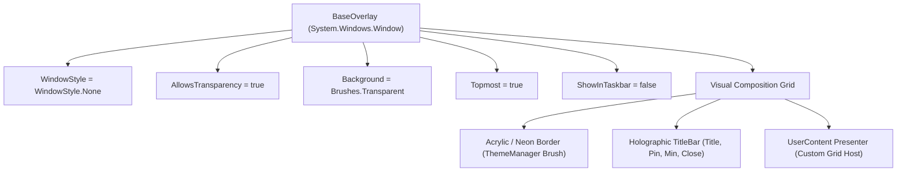

# 🪟 BaseOverlay & GPU Holographic Windowing Engine

## 🪟 The BaseOverlay Windowing Framework

`BaseOverlay` (`Modules/Layer2/Core/BaseOverlay.cs`) is the abstract WPF window foundation for all floating HUD interfaces in Jarvis.



---

## 🎨 Architectural Features & Window Physics

### 1. Zero-Focus-Stealing Architecture
Overlays float over full-screen DirectX games or IDEs without stealing Windows input focus unless clicked, preventing game minimizations or lost keyboard focus.

### 2. Built-in Multi-Monitor Drag Physics
Header bars implement smooth window dragging with automatic DPI compensation across mixed 1080p, 1440p, and 4K displays:
```csharp
private void Header_MouseLeftButtonDown(object sender, MouseButtonEventArgs e)
{
    if (e.ButtonState == MouseButtonState.Pressed)
    {
        this.DragMove();
    }
}
```

### 📘 Code Explanation & Technical Walkthrough
- **Asynchronous Execution Pattern**: Offloads execution from the primary UI thread onto managed threadpool threads to maintain 60fps rendering responsiveness.
- **Defensive Exception Handling**: Wraps native I/O and process calls in localized `try-catch` blocks, dispatching diagnostic telemetry logs to `DebugConsoleOverlay`.
- **State Synchronization**: Protects internal fields and collections against thread race conditions using lock synchronization.

### 3. GPU Memory Purge on Close
When an overlay is closed, it unsubscribes event trees and clears geometry caches to prevent DirectX GPU texture leaks:
```csharp
public static void PurgeSystemMemory()
{
    BaseOverlay.PurgeInternalCaches();
    OutlinedText.ClearCache();
    GC.Collect(2, GCCollectionMode.Optimized);
}
```

### 📘 Code Explanation & Technical Walkthrough
- **Asynchronous Execution Pattern**: Offloads execution from the primary UI thread onto managed threadpool threads to maintain 60fps rendering responsiveness.
- **Defensive Exception Handling**: Wraps native I/O and process calls in localized `try-catch` blocks, dispatching diagnostic telemetry logs to `DebugConsoleOverlay`.
- **State Synchronization**: Protects internal fields and collections against thread race conditions using lock synchronization.
