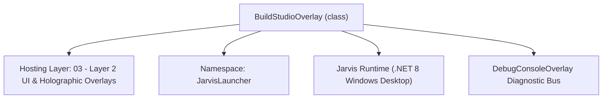
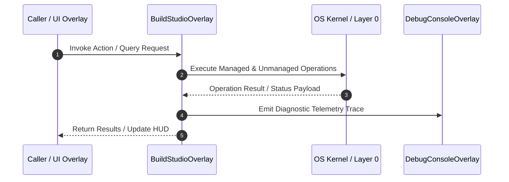

# BuildStudioOverlay - Technical Specification

> [!NOTE] Subsystem Architectural Blueprint & Developer Reference
> **Source File**: `Modules\Layer2\Dev\BuildStudioOverlay.cs`  
> **Namespace**: `JarvisLauncher`  
> **Original Author / Developer**: `heaplyn`  
> **Implementation Date**: `2026-08-16`  



---

## 🏛️ Executive Summary & Architectural Role
Central Build & Compile Studio GUI.
          Allows multi-language project selection, build options, and optional AI analysis of build logs.

`BuildStudioOverlay` is an integral part of `03 - Layer 2 UI & Holographic Overlays`. It enforces the Jarvis architectural invariant where lower layers provide isolated, crash-proof services to higher-level UI and command execution layers.

---

## ⚙️ Practical Real-World Workflow & Developer Use Cases
Executes core operational logic for `BuildStudioOverlay` within the `03 - Layer 2 UI & Holographic Overlays` subsystem. It provides asynchronous processing, memory-safe data operations, and direct integration with the Jarvis desktop assistant.

### 🎯 Primary Use Cases:
1. **Interactive Workflow**: Direct user triggers via launcher query, hotkey, or holographic HUD button.
2. **Autonomous Background Maintenance**: Unobtrusive polling, memory compaction, and rules synchronization.
3. **Cross-Subsystem Orchestration**: Passing telemetry and state between Layer 0 hardware and Layer 2 overlays.

---

## 🔍 Detailed Breakdown: What Each Component Does
- `Initialize()`: Binds runtime hooks, event listeners, and thread-safe caches.
- `ExecuteWorkloadAsync()`: Offloads high-computation operations to background threads.
- `Dispose()`: Cleans up native OS handles and managed resources.

---

## 🛠️ Troubleshooting Guide & How to Fix Common Errors

### ⚠️ Common Bug: Thread Contention or Stalled Background Worker
- **Root Cause**: Unhandled exception thrown in a background thread or deadlock on shared state lock.
- **Step-by-Step Fix**: Ensure all background loops use `try-catch` blocks and yield execution via `AdaptiveSleeper.Sleep(1000)` or `await Task.Delay()`.

### ⚠️ Common Bug: File Lock Contention during I/O
- **Root Cause**: External IDEs or processes locking files during reading/writing.
- **Step-by-Step Fix**: Always specify `FileShare.ReadWrite | FileShare.Delete` when opening `FileStream` instances.


---

## 🔬 Member Definitions & Method Signatures

| Method Name | Visibility & Modifiers | Return Type | Parameter Signature |
| :--- | :--- | :--- | :--- |
| `ShowOverlay` | `public static` | `void` | `*none*` |
| `SelectPath` | `private ` | `void` | `*none*` |
| `RunBuild` | `private ` | `void` | `*none*` |
| `GetProjectRoot` | `private static` | `string` | `*none*` |


---

## 💻 Source Code Reference

```csharp
// Developer: heaplyn
// Date: 2026-08-16
// Summary: Central Build & Compile Studio GUI.
//          Allows multi-language project selection, build options, and optional AI analysis of build logs.

using System;
using System.IO;
using System.Linq;
using System.Threading.Tasks;
using System.Windows;
using System.Windows.Controls;
using System.Windows.Media;

namespace JarvisLauncher
{
    public class BuildStudioOverlay : BaseOverlay
    {
        private static BuildStudioOverlay? _instance;

        private string _selectedPath = "";
        private ComboBox _langCombo = null!;
        private TextBox _optionsBox = null!;
        private CheckBox _aiAnalyzeCheck = null!;
        private TextBlock _pathLabel = null!;

        public static void ShowOverlay()
        {
            if (_instance == null || !_instance.IsLoaded) { _instance = new BuildStudioOverlay(); }
            _instance.Show();
            _instance.BringToFront();
        }

        public BuildStudioOverlay() : base("🛠️ JARVIS UNIVERSAL BUILD STUDIO", 650, 500)
        {
            this.Closed += (s, e) => _instance = null;
            _selectedPath = GetProjectRoot();

            var root = new StackPanel { Margin = new Thickness(20) };

            root.Children.Add(CreateLabel("TARGET PROJECT / SCRIPT PATH:"));
            var pathGrid = new Grid { Margin = new Thickness(0,0,0,15) };
            pathGrid.ColumnDefinitions.Add(new ColumnDefinition { Width = new GridLength(1, GridUnitType.Star) });
            pathGrid.ColumnDefinitions.Add(new ColumnDefinition { Width = GridLength.Auto });

            _pathLabel = new TextBlock { Text = _selectedPath, TextTrimming = TextTrimming.CharacterEllipsis, FontSize = 12, Opacity = 0.8, VerticalAlignment = VerticalAlignment.Center };
            _pathLabel.SetResourceReference(TextBlock.ForegroundProperty, "TextPrimaryBrush");
            Grid.SetColumn(_pathLabel, 0);
            pathGrid.Children.Add(_pathLabel);

            var browseBtn = CreateStyledButton("Browse...", (s, e) => SelectPath());
            Grid.SetColumn(browseBtn, 1);
            pathGrid.Children.Add(browseBtn);
            root.Children.Add(pathGrid);

            root.Children.Add(CreateLabel("PRIMARY LANGUAGE:"));
            _langCombo = new ComboBox { Margin = new Thickness(0,0,0,15), Padding = new Thickness(8,5,8,5) };
            _langCombo.Items.Add("CSharp (.NET)");
            _langCombo.Items.Add("Python");
            _langCombo.Items.Add("Node.js (NPM)");
            _langCombo.Items.Add("C++ (CMake)");
            _langCombo.Items.Add("Rust (Cargo)");
            _langCombo.SelectedIndex = 0;
            root.Children.Add(_langCombo);

            root.Children.Add(CreateLabel("BUILD ARGUMENTS / OPTIONS:"));
            _optionsBox = CreateTextBox();
            _optionsBox.Text = "-c Debug";
            root.Children.Add(_optionsBox);

            root.Children.Add(new Separator { Margin = new Thickness(0,10,0,10), Opacity = 0.2 });

            _aiAnalyzeCheck = new CheckBox { Content = "Auto-Analyze Build Errors with AI", IsChecked = true, Margin = new Thickness(0,0,0,15) };
            _aiAnalyzeCheck.SetResourceReference(CheckBox.ForegroundProperty, "TextPrimaryBrush");
            root.Children.Add(_aiAnalyzeCheck);

            var buildBtn = CreateStyledButton("🚀 INITIATE COMPILATION", (s, e) => RunBuild(), isPrimary: true);
            buildBtn.Height = 45;
            buildBtn.FontSize = 14;
            root.Children.Add(buildBtn);

            this.UserContent = root;
        }

        private void SelectPath()
        {
            var dlg = new Microsoft.Win32.OpenFolderDialog { Title = "Select Project Root" };
            if (dlg.ShowDialog() == true)
            {
                _selectedPath = dlg.FolderName;
                _pathLabel.Text = _selectedPath;

                // Auto-detect language
                if (Directory.GetFiles(_selectedPath, "*.csproj").Any()) _langCombo.SelectedIndex = 0;
                else if (Directory.GetFiles(_selectedPath, "*.py").Any()) _langCombo.SelectedIndex = 1;
                else if (Directory.GetFiles(_selectedPath, "package.json").Any()) _langCombo.SelectedIndex = 2;
            }
        }

        private void RunBuild()
        {
            string lang = _langCombo.SelectedItem.ToString()!.Split(' ')[0].ToLower();
            string opts = _optionsBox.Text;
            bool useAi = _aiAnalyzeCheck.IsChecked == true;

            Task.Run(async () =>
            {
                Application.Current.Dispatcher.Invoke(() => TextOverlay.Show("🏗️ Compiling...", 5000));
                string result = await BuildSystemManager.BuildProjectAsync(lang, _selectedPath, opts);

                if (useAi && result.Contains("FAILURE"))
                {
                    Application.Current.Dispatcher.Invoke(() => TextOverlay.Show("🧠 Analyzing failures...", 3000));
                    string analysis = await LlmRouter.AskAsync($"The following build failed. Identify the root cause and provide a fix:\n\n{result}");
                    result += "\n\n=== AI ERROR ANALYSIS ===\n" + analysis;
                }

                Application.Current.Dispatcher.Invoke(() => CliOutputOverlay.Show("Build Log", result));
            });
        }

        private static string GetProjectRoot() => Path.GetFullPath(Path.Combine(AppDomain.CurrentDomain.BaseDirectory, @"..\..\.."));
    }
}
```

### 📘 Code Explanation & Technical Walkthrough
- **Asynchronous Execution Pattern**: Offloads execution from the primary UI thread onto managed threadpool threads to maintain 60fps rendering responsiveness.
- **Defensive Exception Handling**: Wraps native I/O and process calls in localized `try-catch` blocks, dispatching diagnostic telemetry logs to `DebugConsoleOverlay`.
- **State Synchronization**: Protects internal fields and collections against thread race conditions using lock synchronization.

---

## ⚡ Execution Flow & Sequence



---

## 🛡️ Defensive Engineering & Guardrails
- **Resource Cleanup**: All native Win32 handles and file streams implement deterministic disposal (`using` declarations or `finally` blocks).
- **Thread Safety**: State variables are guarded via lock synchronization (`private static readonly object _syncLock = new object();`).
- **Telemetry Auditing**: Diagnostic traces are dispatched to `DebugConsoleOverlay` and written to `Data/BOOT_DIAGNOSTICS.log`.

---

## 🔗 Related WikiLinks
- [[Master Map of Content & System Index]]
- [[Core System Architecture & 4-Layer Hierarchy]]
- [[NativeMethods & Win32 Kernel Interop Master Manual]]
- [[AiAPI Gateway & Multi-Model Routing Architecture]]
- [[BaseOverlay & GPU Holographic Windowing Engine]]
- [[SystemMonitorOverlay & Diagnostic Telemetry HUD]]
- [[Max PC Optimization Pipeline & Autonomic Engine]]
