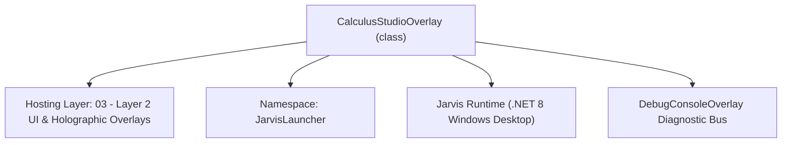
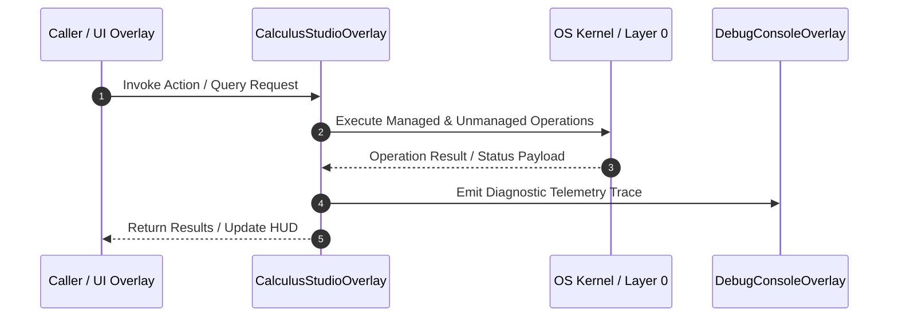

# CalculusStudioOverlay - Technical Specification

> [!NOTE] Subsystem Architectural Blueprint & Developer Reference
> **Source File**: `Modules\Layer2\System\CalculusStudioOverlay.cs`  
> **Namespace**: `JarvisLauncher`  
> **Original Author / Developer**: `heaplyn`  
> **Implementation Date**: `2026-08-17`  



---

## 🏛️ Executive Summary & Architectural Role
Advanced Calculus & Symbolic Math Studio.

`CalculusStudioOverlay` is an integral part of `03 - Layer 2 UI & Holographic Overlays`. It enforces the Jarvis architectural invariant where lower layers provide isolated, crash-proof services to higher-level UI and command execution layers.

---

## ⚙️ Practical Real-World Workflow & Developer Use Cases
Executes core operational logic for `CalculusStudioOverlay` within the `03 - Layer 2 UI & Holographic Overlays` subsystem. It provides asynchronous processing, memory-safe data operations, and direct integration with the Jarvis desktop assistant.

### 🎯 Primary Use Cases:
1. **Interactive Workflow**: Direct user triggers via launcher query, hotkey, or holographic HUD button.
2. **Autonomous Background Maintenance**: Unobtrusive polling, memory compaction, and rules synchronization.
3. **Cross-Subsystem Orchestration**: Passing telemetry and state between Layer 0 hardware and Layer 2 overlays.

---

## 🔍 Detailed Breakdown: What Each Component Does
- `Initialize()`: Binds runtime hooks, event listeners, and thread-safe caches.
- `ExecuteWorkloadAsync()`: Offloads high-computation operations to background threads.
- `Dispose()`: Cleans up native OS handles and managed resources.

---

## 🛠️ Troubleshooting Guide & How to Fix Common Errors

### ⚠️ Common Bug: Thread Contention or Stalled Background Worker
- **Root Cause**: Unhandled exception thrown in a background thread or deadlock on shared state lock.
- **Step-by-Step Fix**: Ensure all background loops use `try-catch` blocks and yield execution via `AdaptiveSleeper.Sleep(1000)` or `await Task.Delay()`.

### ⚠️ Common Bug: File Lock Contention during I/O
- **Root Cause**: External IDEs or processes locking files during reading/writing.
- **Step-by-Step Fix**: Always specify `FileShare.ReadWrite | FileShare.Delete` when opening `FileStream` instances.


---

## 🔬 Member Definitions & Method Signatures

| Method Name | Visibility & Modifiers | Return Type | Parameter Signature |
| :--- | :--- | :--- | :--- |
| `ShowStudio` | `public static` | `void` | `*none*` |
| `AddCommand` | `private ` | `void` | `string cmd` |
| `SolveCurrent` | `private async` | `void` | `*none*` |
| `HandleSlashCommand` | `private ` | `void` | `string cmd` |
| `AddHistoryItem` | `private ` | `Border` | `string q, string r` |
| `UpdateHistoryItem` | `private ` | `void` | `Border i, string r` |


---

## 💻 Source Code Reference

```csharp
// Developer: heaplyn
// Date: 2026-08-17
// Summary: Advanced Calculus & Symbolic Math Studio.

using System;
using System.Collections.Generic;
using System.Windows;
using System.Windows.Controls;
using System.Windows.Media;
using System.Threading.Tasks;
using System.Linq;

namespace JarvisLauncher
{
    public class CalculusStudioOverlay : BaseOverlay
    {
        private static CalculusStudioOverlay? _instance;
        private readonly TextBox _inputBox;
        private readonly StackPanel _historyPanel;
        private readonly ScrollViewer _historyScroll;

        public static void ShowStudio()
        {
            Application.Current.Dispatcher.Invoke(() =>
            {
                if (_instance == null || !_instance.IsLoaded) _instance = new CalculusStudioOverlay();
                _instance.Show();
                _instance.BringToFront();
            });
        }

        private CalculusStudioOverlay() : base("JARVIS CALCULUS STUDIO", 600, 700)
        {
            _instance = this;
            this.Closed += (s, e) => _instance = null;
            WindowPositionManager.RegisterWindow(this, nameof(CalculusStudioOverlay));

            var layout = new Grid { Margin = new Thickness(15) };
            layout.RowDefinitions.Add(new RowDefinition { Height = GridLength.Auto });
            layout.RowDefinitions.Add(new RowDefinition { Height = new GridLength(1, GridUnitType.Star) });
            layout.RowDefinitions.Add(new RowDefinition { Height = GridLength.Auto });

            _inputBox = CreateTextBox(); _inputBox.FontSize = 18;
            _inputBox.KeyDown += (s, e) => { if (e.Key == System.Windows.Input.Key.Enter) SolveCurrent(); };
            Grid.SetRow(_inputBox, 0); layout.Children.Add(_inputBox);

            _historyPanel = new StackPanel();
            _historyScroll = new ScrollViewer { Content = _historyPanel, VerticalScrollBarVisibility = ScrollBarVisibility.Auto };
            Grid.SetRow(_historyScroll, 1); layout.Children.Add(_historyScroll);

            var toolbar = new System.Windows.Controls.Primitives.UniformGrid { Columns = 5, Margin = new Thickness(0, 10, 0, 0) };
            toolbar.Children.Add(CreateStyledButton("DIFF", (s, e) => AddCommand("diff ")));
            toolbar.Children.Add(CreateStyledButton("GRAPH", (s, e) => AddCommand("/graph ")));
            toolbar.Children.Add(CreateStyledButton("TRIG", (s, e) => AddCommand("sin(")));
            toolbar.Children.Add(CreateStyledButton("PI", (s, e) => AddCommand("pi")));
            toolbar.Children.Add(CreateStyledButton("SOLVE", (s, e) => SolveCurrent(), true));
            Grid.SetRow(toolbar, 2); layout.Children.Add(toolbar);

            this.UserContent = layout; _inputBox.Focus();
        }

        private void AddCommand(string cmd) { _inputBox.Text += cmd; _inputBox.CaretIndex = _inputBox.Text.Length; _inputBox.Focus(); }

        private async void SolveCurrent()
        {
            string query = _inputBox.Text.Trim(); if (string.IsNullOrEmpty(query)) return;
            _inputBox.Clear();

            if (query.StartsWith("/")) { HandleSlashCommand(query); return; }

            var item = AddHistoryItem(query, "Calculating...");

            try
            {
                // Run evaluation off-thread to prevent UI hang
                string res = await Task.Run(() => CoreRegistry.Intelligence.Math.Evaluate(query));
                UpdateHistoryItem(item, res);
            }
            catch (Exception ex) { UpdateHistoryItem(item, "Error: " + ex.Message); }
        }

        private void HandleSlashCommand(string cmd)
        {
            string[] parts = cmd.Split(' ', 2);
            string action = parts[0].ToLower();
            string args = parts.Length > 1 ? parts[1] : "";

            switch (action)
            {
                case "/graph":
                    if (string.IsNullOrEmpty(args)) AddHistoryItem(cmd, "Usage: /graph <expression with x>");
                    else { new GraphOverlay(args).Show(); AddHistoryItem(cmd, $"Plotted graph: {args}"); }
                    break;
                case "/clear":
                    _historyPanel.Children.Clear();
                    break;
                case "/analyze":
                    Task.Run(async () => {
                        AddHistoryItem(cmd, "AI performing deep math analysis...");
                        string prompt = $"Perform detailed step-by-step math analysis of: {args}";
                        string res = await CoreRegistry.Intelligence.Llm.AskAsync(prompt);
                        Application.Current.Dispatcher.Invoke(() => AddHistoryItem("AI ANALYSIS", res));
                    });
                    break;
                case "/help":
                    AddHistoryItem(cmd, "Available: /graph <expr>, /analyze <expr>, /clear, /help");
                    break;
                default:
                    AddHistoryItem(cmd, "Unknown slash command.");
                    break;
            }
        }

        private Border AddHistoryItem(string q, string r)
        {
            var b = new Border { Background = new SolidColorBrush(Color.FromArgb(15, 255, 255, 255)), BorderThickness = new Thickness(0, 0, 0, 1), BorderBrush = new SolidColorBrush(Color.FromArgb(30, 255, 255, 255)), Padding = new Thickness(10), Margin = new Thickness(0, 0, 0, 5) };
            var s = new StackPanel();
            s.Children.Add(new TextBlock { Text = q, Foreground = Brushes.Gray, FontSize = 10, FontWeight = FontWeights.Bold });
            s.Children.Add(new TextBlock { Text = r, Foreground = Brushes.White, FontSize = 14, TextWrapping = TextWrapping.Wrap, Margin = new Thickness(0,4,0,0) });
            b.Child = s; _historyPanel.Children.Insert(0, b); return b;
        }

        private void UpdateHistoryItem(Border i, string r) {
            Application.Current.Dispatcher.Invoke(() => {
                var t = (TextBlock)((StackPanel)i.Child).Children[1];
                t.Text = r;
            });
        }
    }
}
```

### 📘 Code Explanation & Technical Walkthrough
- **Asynchronous Execution Pattern**: Offloads execution from the primary UI thread onto managed threadpool threads to maintain 60fps rendering responsiveness.
- **Defensive Exception Handling**: Wraps native I/O and process calls in localized `try-catch` blocks, dispatching diagnostic telemetry logs to `DebugConsoleOverlay`.
- **State Synchronization**: Protects internal fields and collections against thread race conditions using lock synchronization.

---

## ⚡ Execution Flow & Sequence



---

## 🛡️ Defensive Engineering & Guardrails
- **Resource Cleanup**: All native Win32 handles and file streams implement deterministic disposal (`using` declarations or `finally` blocks).
- **Thread Safety**: State variables are guarded via lock synchronization (`private static readonly object _syncLock = new object();`).
- **Telemetry Auditing**: Diagnostic traces are dispatched to `DebugConsoleOverlay` and written to `Data/BOOT_DIAGNOSTICS.log`.

---

## 🔗 Related WikiLinks
- [[Master Map of Content & System Index]]
- [[Core System Architecture & 4-Layer Hierarchy]]
- [[NativeMethods & Win32 Kernel Interop Master Manual]]
- [[AiAPI Gateway & Multi-Model Routing Architecture]]
- [[BaseOverlay & GPU Holographic Windowing Engine]]
- [[SystemMonitorOverlay & Diagnostic Telemetry HUD]]
- [[Max PC Optimization Pipeline & Autonomic Engine]]
