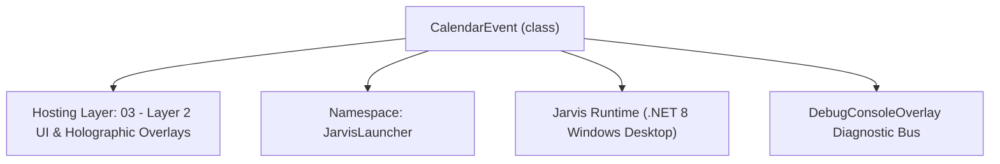
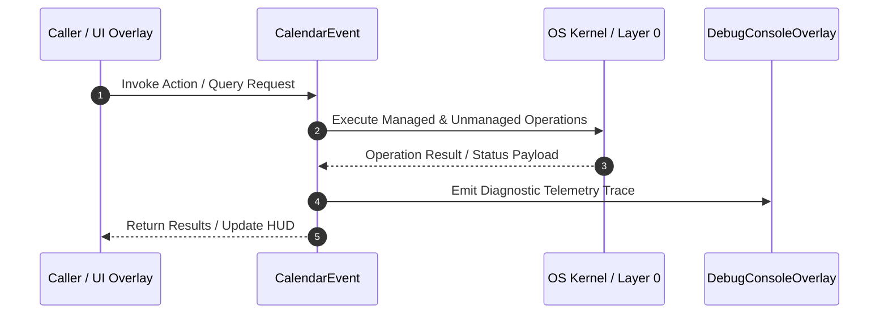

# CalendarOverlay - Technical Specification

> [!NOTE] Subsystem Architectural Blueprint & Developer Reference
> **Source File**: `Modules\Layer2\System\CalendarOverlay.cs`  
> **Namespace**: `JarvisLauncher`  
> **Original Author / Developer**: `copilot`  
> **Implementation Date**: `2026-08-13`  



---

## 🏛️ Executive Summary & Architectural Role
Elegant, glassmorphic Calendar GUI showing month grid, daily events, and allowing visual event creation and deletion.

`CalendarEvent` is an integral part of `03 - Layer 2 UI & Holographic Overlays`. It enforces the Jarvis architectural invariant where lower layers provide isolated, crash-proof services to higher-level UI and command execution layers.

---

## ⚙️ Practical Real-World Workflow & Developer Use Cases
Executes core operational logic for `CalendarOverlay` within the `03 - Layer 2 UI & Holographic Overlays` subsystem. It provides asynchronous processing, memory-safe data operations, and direct integration with the Jarvis desktop assistant.

### 🎯 Primary Use Cases:
1. **Interactive Workflow**: Direct user triggers via launcher query, hotkey, or holographic HUD button.
2. **Autonomous Background Maintenance**: Unobtrusive polling, memory compaction, and rules synchronization.
3. **Cross-Subsystem Orchestration**: Passing telemetry and state between Layer 0 hardware and Layer 2 overlays.

---

## 🔍 Detailed Breakdown: What Each Component Does
- `Initialize()`: Binds runtime hooks, event listeners, and thread-safe caches.
- `ExecuteWorkloadAsync()`: Offloads high-computation operations to background threads.
- `Dispose()`: Cleans up native OS handles and managed resources.

---

## 🛠️ Troubleshooting Guide & How to Fix Common Errors

### ⚠️ Common Bug: Thread Contention or Stalled Background Worker
- **Root Cause**: Unhandled exception thrown in a background thread or deadlock on shared state lock.
- **Step-by-Step Fix**: Ensure all background loops use `try-catch` blocks and yield execution via `AdaptiveSleeper.Sleep(1000)` or `await Task.Delay()`.

### ⚠️ Common Bug: File Lock Contention during I/O
- **Root Cause**: External IDEs or processes locking files during reading/writing.
- **Step-by-Step Fix**: Always specify `FileShare.ReadWrite | FileShare.Delete` when opening `FileStream` instances.


---

## 🔬 Member Definitions & Method Signatures

| Method Name | Visibility & Modifiers | Return Type | Parameter Signature |
| :--- | :--- | :--- | :--- |
| `Open` | `public static` | `void` | `*none*` |
| `LogEvent` | `public static` | `void` | `string title, string dateStr, string timeStr = "All Day", string cat = "General"` |
| `GetFilePath` | `private static` | `string` | `*none*` |
| `LoadEvents` | `public static` | `List<CalendarEvent>` | `*none*` |
| `SaveEvents` | `public static` | `void` | `*none*` |
| `ChangeMonth` | `private ` | `void` | `int delta` |
| `RenderMonth` | `private ` | `void` | `*none*` |
| `RefreshDayEvents` | `private ` | `void` | `*none*` |
| `AddEvent` | `private ` | `void` | `*none*` |
| `DeleteSelectedEvent` | `private ` | `void` | `*none*` |
| `CreateNavButton` | `private ` | `Button` | `string text, RoutedEventHandler onClick` |
| `CreateInputTextBox` | `private ` | `TextBox` | `string placeholder` |
| `CreateFormButton` | `private ` | `Button` | `string text, RoutedEventHandler onClick` |


---

## 💻 Source Code Reference

```csharp
// Developer: copilot
// Date: 2026-08-13
// Summary: Elegant, glassmorphic Calendar GUI showing month grid, daily events, and allowing visual event creation and deletion.

using System;
using System.Collections.Generic;
using System.IO;
using System.Linq;
using System.Text.Json;
using System.Windows;
using System.Windows.Controls;
using System.Windows.Controls.Primitives;
using System.Windows.Input;
using System.Windows.Media;
using System.Windows.Data;

namespace JarvisLauncher
{
    public class CalendarEvent
    {
        public Guid Id { get; set; } = Guid.NewGuid();
        public string Title { get; set; } = string.Empty;
        public string Time { get; set; } = string.Empty;
        public string DateString { get; set; } = string.Empty; // yyyy-MM-dd
        public string Category { get; set; } = "General"; // General | Work | Personal | Meeting
    }

    public class CalendarOverlay : BaseOverlay
    {
        private static CalendarOverlay? _instance;
        private static List<CalendarEvent> _events = new List<CalendarEvent>();
        private static readonly object _lock = new object();

        private DateTime _currentMonthStart;
        private DateTime _selectedDate;

        private readonly TextBlock _monthYearLabel;
        private readonly UniformGrid _daysGrid;
        private readonly TextBlock _selectedDayLabel;
        private readonly ListBox _eventsListBox;

        // Add Event Inputs
        private readonly TextBox _eventTitleInput;
        private readonly TextBox _eventTimeInput;
        private readonly ComboBox _eventCategoryCombo;

        public static void Open()
        {
            Application.Current.Dispatcher.Invoke(() =>
            {
                if (_instance == null)
                {
                    _instance = new CalendarOverlay();
                    _instance.Closed += (s, e) => _instance = null;
                }
                _instance.Show();
            });
        }

        public static void LogEvent(string title, string dateStr, string timeStr = "All Day", string cat = "General")
        {
            lock (_lock)
            {
                LoadEvents();
                _events.Add(new CalendarEvent
                {
                    Title = title,
                    DateString = dateStr,
                    Time = timeStr,
                    Category = cat
                });
                SaveEvents();
            }
            Application.Current.Dispatcher.BeginInvoke(new Action(() =>
            {
                if (_instance != null)
                {
                    _instance.RenderMonth();
                    _instance.RefreshDayEvents();
                }
            }));
        }

        private static string GetFilePath()
        {
            string dataDir = Path.Combine(AppDomain.CurrentDomain.BaseDirectory, "Data");
            if (!Directory.Exists(dataDir))
            {
                string devPath = Path.GetFullPath(Path.Combine(AppDomain.CurrentDomain.BaseDirectory, @"..\..\..\Data"));
                if (Directory.Exists(devPath))
                {
                    dataDir = devPath;
                }
                else
                {
                    Directory.CreateDirectory(dataDir);
                }
            }
            return Path.Combine(dataDir, "CalendarEvents.json");
        }

        public static List<CalendarEvent> LoadEvents()
        {
            lock (_lock)
            {
                try
                {
                    string path = GetFilePath();
                    if (File.Exists(path))
                    {
                        string json = File.ReadAllText(path);
                        _events = JsonSerializer.Deserialize<List<CalendarEvent>>(json) ?? new List<CalendarEvent>();
                    }
                    else
                    {
                        _events = new List<CalendarEvent>();
                    }
                }
                catch
                {
                    _events = new List<CalendarEvent>();
                }
                return _events;
            }
        }

        public static void SaveEvents()
        {
            lock (_lock)
            {
                try
                {
                    string path = GetFilePath();
                    string json = JsonSerializer.Serialize(_events, new JsonSerializerOptions { WriteIndented = true });
                    File.WriteAllText(path, json);
                }
                catch { }
            }
        }

        private CalendarOverlay()
            : base("📅 JARVIS PLANNER & CALENDAR", width: 620, height: 460)
        {
            LoadEvents();
            _selectedDate = DateTime.Today;
            _currentMonthStart = new DateTime(DateTime.Today.Year, DateTime.Today.Month, 1);

            var mainGrid = new Grid { Margin = new Thickness(8) };
            mainGrid.ColumnDefinitions.Add(new ColumnDefinition { Width = new GridLength(360) });
            mainGrid.ColumnDefinitions.Add(new ColumnDefinition { Width = new GridLength(1, GridUnitType.Star) });

            // ================== COLUMN 0: CALENDAR MONTH VIEW ==================
            var leftPanel = new Grid();
            leftPanel.RowDefinitions.Add(new RowDefinition { Height = GridLength.Auto }); // Month selection header
            leftPanel.RowDefinitions.Add(new RowDefinition { Height = GridLength.Auto }); // Days of week labels
            leftPanel.RowDefinitions.Add(new RowDefinition { Height = new GridLength(1, GridUnitType.Star) }); // Month grid

            // Month Header Stack
            var headerStack = new Grid { Margin = new Thickness(0, 0, 0, 8) };
            headerStack.ColumnDefinitions.Add(new ColumnDefinition { Width = GridLength.Auto });
            headerStack.ColumnDefinitions.Add(new ColumnDefinition { Width = new GridLength(1, GridUnitType.Star) });
            headerStack.ColumnDefinitions.Add(new ColumnDefinition { Width = GridLength.Auto });

            var prevBtn = CreateNavButton("◀", (s, e) => ChangeMonth(-1));
            Grid.SetColumn(prevBtn, 0);
            headerStack.Children.Add(prevBtn);

            _monthYearLabel = new TextBlock
            {
                FontSize = 14,
                FontWeight = FontWeights.Bold,
                HorizontalAlignment = HorizontalAlignment.Center,
                VerticalAlignment = VerticalAlignment.Center
            };
            _monthYearLabel.SetResourceReference(TextBlock.FontFamilyProperty, "ActiveFontFamily");
            _monthYearLabel.SetResourceReference(TextBlock.ForegroundProperty, "TextPrimaryBrush");
            Grid.SetColumn(_monthYearLabel, 1);
            headerStack.Children.Add(_monthYearLabel);

            var nextBtn = CreateNavButton("▶", (s, e) => ChangeMonth(1));
            Grid.SetColumn(nextBtn, 2);
            headerStack.Children.Add(nextBtn);

            Grid.SetRow(headerStack, 0);
            leftPanel.Children.Add(headerStack);

            // Days of the Week labels Row
            var dowGrid = new UniformGrid { Columns = 7, Rows = 1, Margin = new Thickness(0, 0, 0, 4) };
            string[] dow = { "Su", "Mo", "Tu", "We", "Th", "Fr", "Sa" };
            foreach (var d in dow)
            {
                var label = new TextBlock
                {
                    Text = d,
                    FontSize = 11,
                    FontWeight = FontWeights.SemiBold,
                    HorizontalAlignment = HorizontalAlignment.Center
                };
                label.SetResourceReference(TextBlock.FontFamilyProperty, "ActiveFontFamily");
                label.SetResourceReference(TextBlock.ForegroundProperty, "TextSecondaryBrush");
                dowGrid.Children.Add(label);
            }
            Grid.SetRow(dowGrid, 1);
            leftPanel.Children.Add(dowGrid);

            // Days grid (UniformGrid 6 rows, 7 cols)
            _daysGrid = new UniformGrid { Columns = 7, Rows = 6 };
            Grid.SetRow(_daysGrid, 2);
            leftPanel.Children.Add(_daysGrid);

            Grid.SetColumn(leftPanel, 0);
            mainGrid.Children.Add(leftPanel);

            // ================== COLUMN 1: SELECTED DAY EVENTS SIDEBAR ==================
            var rightPanel = new Grid { Margin = new Thickness(12, 0, 0, 0) };
            rightPanel.RowDefinitions.Add(new RowDefinition { Height = GridLength.Auto }); // Header info
            rightPanel.RowDefinitions.Add(new RowDefinition { Height = new GridLength(1, GridUnitType.Star) }); // List of events
            rightPanel.RowDefinitions.Add(new RowDefinition { Height = GridLength.Auto }); // Action tools (Add form)

            // Day Header
            _selectedDayLabel = new TextBlock
            {
                Text = "EVENTS ON [DATE]",
                FontSize = 12,
                FontWeight = FontWeights.Bold,
                Margin = new Thickness(0, 0, 0, 8),
                TextWrapping = TextWrapping.Wrap
            };
            _selectedDayLabel.SetResourceReference(TextBlock.FontFamilyProperty, "ActiveFontFamily");
            _selectedDayLabel.SetResourceReference(TextBlock.ForegroundProperty, "TextSecondaryBrush");
            Grid.SetRow(_selectedDayLabel, 0);
            rightPanel.Children.Add(_selectedDayLabel);

            // ListBox
            _eventsListBox = new ListBox
            {
                Background = Brushes.Transparent,
                BorderThickness = new Thickness(0),
                SelectionMode = SelectionMode.Single,
                Margin = new Thickness(0, 0, 0, 8)
            };
            _eventsListBox.SetResourceReference(ListBox.ItemContainerStyleProperty, "ResultItemStyle");

            // Event List DataTemplate
            var template = new DataTemplate();
            var factory = new FrameworkElementFactory(typeof(StackPanel));
            factory.SetValue(StackPanel.OrientationProperty, Orientation.Vertical);

            var titleBlock = new FrameworkElementFactory(typeof(TextBlock));
            titleBlock.SetBinding(TextBlock.TextProperty, new Binding("Title"));
            titleBlock.SetResourceReference(TextBlock.ForegroundProperty, "TextPrimaryBrush");
            titleBlock.SetValue(TextBlock.FontSizeProperty, 12.0);
            titleBlock.SetValue(TextBlock.FontWeightProperty, FontWeights.SemiBold);
            factory.AppendChild(titleBlock);

            var metaBlock = new FrameworkElementFactory(typeof(TextBlock));
            metaBlock.SetBinding(TextBlock.TextProperty, new Binding("Time")); // Combines Time / Category
            metaBlock.SetResourceReference(TextBlock.ForegroundProperty, "TextSecondaryBrush");
            metaBlock.SetValue(TextBlock.FontSizeProperty, 10.0);
            metaBlock.SetValue(TextBlock.MarginProperty, new Thickness(0, 1, 0, 0));
            factory.AppendChild(metaBlock);

            template.VisualTree = factory;
            _eventsListBox.ItemTemplate = template;

            Grid.SetRow(_eventsListBox, 1);
            rightPanel.Children.Add(_eventsListBox);

            // Add Event Form Panel
            var formPanel = new StackPanel();

            _eventTitleInput = CreateInputTextBox("Event Title...");
            formPanel.Children.Add(_eventTitleInput);

            _eventTimeInput = CreateInputTextBox("Time (e.g. 14:00, All Day)...");
            formPanel.Children.Add(_eventTimeInput);

            _eventCategoryCombo = new ComboBox { Height = 24, Margin = new Thickness(0, 0, 0, 6), FontSize = 11 };
            _eventCategoryCombo.Items.Add("General");
            _eventCategoryCombo.Items.Add("Work");
            _eventCategoryCombo.Items.Add("Personal");
            _eventCategoryCombo.Items.Add("Meeting");
            _eventCategoryCombo.SelectedIndex = 0;
            formPanel.Children.Add(_eventCategoryCombo);

            var btnStack = new UniformGrid { Columns = 2, Rows = 1 };

            var addBtn = CreateFormButton("➕ Add", (s, ev) => AddEvent());
            btnStack.Children.Add(addBtn);

            var delBtn = CreateFormButton("🗑️ Delete", (s, ev) => DeleteSelectedEvent());
            btnStack.Children.Add(delBtn);

            formPanel.Children.Add(btnStack);

            Grid.SetRow(formPanel, 2);
            rightPanel.Children.Add(formPanel);

            Grid.SetColumn(rightPanel, 1);
            mainGrid.Children.Add(rightPanel);

            this.UserContent = mainGrid;

            RenderMonth();
            RefreshDayEvents();
        }

        private void ChangeMonth(int delta)
        {
            _currentMonthStart = _currentMonthStart.AddMonths(delta);
            RenderMonth();
        }

        private void RenderMonth()
        {
            _monthYearLabel.Text = _currentMonthStart.ToString("MMMM yyyy").ToUpper();
            _daysGrid.Children.Clear();

            int daysInMonth = DateTime.DaysInMonth(_currentMonthStart.Year, _currentMonthStart.Month);
            int startDayOfWeek = (int)_currentMonthStart.DayOfWeek;

            // Empty slots for padding before month starts
            for (int i = 0; i < startDayOfWeek; i++)
            {
                _daysGrid.Children.Add(new Border { Background = Brushes.Transparent });
            }

            // Fill actual month days
            for (int day = 1; day <= daysInMonth; day++)
            {
                DateTime dayDate = new DateTime(_currentMonthStart.Year, _currentMonthStart.Month, day);
                string dayDateStr = dayDate.ToString("yyyy-MM-dd");

                // Check if this day has events
                bool hasEvents;
                lock (_lock)
                {
                    hasEvents = _events.Any(e => e.DateString == dayDateStr);
                }

                bool isSelected = dayDate == _selectedDate;
                bool isToday = dayDate == DateTime.Today;

                var btn = new Button
                {
                    Content = day.ToString(),
                    Height = 40,
                    Margin = new Thickness(1),
                    Cursor = Cursors.Hand,
                    FontSize = 12,
                    FontWeight = isToday ? FontWeights.Bold : FontWeights.Normal,
                    Tag = dayDate
                };

                // Apply beautiful highlighting depending on states
                if (isSelected)
                {
                    btn.SetResourceReference(Button.BackgroundProperty, "SelectedBackgroundBrush");
                    btn.SetResourceReference(Button.ForegroundProperty, "TextPrimaryBrush");
                    btn.BorderBrush = new SolidColorBrush(Color.FromRgb(140, 100, 240));
                    btn.BorderThickness = new Thickness(2);
                }
                else if (isToday)
                {
                    btn.Background = new SolidColorBrush(Color.FromArgb(40, 255, 255, 255));
                    btn.SetResourceReference(Button.ForegroundProperty, "TextPrimaryBrush");
                    btn.BorderBrush = Brushes.Gray;
                    btn.BorderThickness = new Thickness(1);
                }
                else
                {
                    btn.Background = Brushes.Transparent;
                    btn.SetResourceReference(Button.ForegroundProperty, "TextPrimaryBrush");
                    btn.BorderBrush = Brushes.Transparent;
                }

                // If day has calendar events, add a tiny dot indicator inside cell layout
                if (hasEvents)
                {
                    var container = new Grid();
                    container.Children.Add(new TextBlock 
                    { 
                        Text = day.ToString(),
                        HorizontalAlignment = HorizontalAlignment.Center,
                        VerticalAlignment = VerticalAlignment.Center,
                        FontSize = 12,
                        FontWeight = isToday ? FontWeights.Bold : FontWeights.Normal
                    });

                    // Indicator dot at the bottom
                    var dot = new System.Windows.Shapes.Ellipse
                    {
                        Width = 5,
                        Height = 5,
                        Fill = new SolidColorBrush(Color.FromRgb(0, 235, 140)), // Green event indicator dot
                        VerticalAlignment = VerticalAlignment.Bottom,
                        HorizontalAlignment = HorizontalAlignment.Center,
                        Margin = new Thickness(0, 0, 0, 4)
                    };
                    container.Children.Add(dot);
                    btn.Content = container;
                }

                btn.Click += (s, e) =>
                {
                    if (s is Button b && b.Tag is DateTime dt)
                    {
                        _selectedDate = dt;
                        RenderMonth();
                        RefreshDayEvents();
                    }
                };

                _daysGrid.Children.Add(btn);
            }

            // Fill empty slots for padding at the end of UniformGrid (6 rows * 7 cols = 42 cells)
            int totalCellsFilled = startDayOfWeek + daysInMonth;
            for (int i = totalCellsFilled; i < 42; i++)
            {
                _daysGrid.Children.Add(new Border { Background = Brushes.Transparent });
            }
        }

        private void RefreshDayEvents()
        {
            _selectedDayLabel.Text = $"EVENTS ON: {_selectedDate:dddd, MMM dd yyyy}".ToUpper();
            string selectedDateStr = _selectedDate.ToString("yyyy-MM-dd");

            List<CalendarEvent> dayEvents;
            lock (_lock)
            {
                dayEvents = _events
                    .Where(e => e.DateString == selectedDateStr)
                    .OrderBy(e => e.Time)
                    .ToList();
            }

            // Format strings for presentation
            var itemsList = dayEvents.Select(e => new {
                e.Id,
                e.Title,
                Time = $"🕒 {e.Time} | Category: {e.Category}"
            }).ToList();

            _eventsListBox.ItemsSource = itemsList;
        }

        private void AddEvent()
        {
            string title = _eventTitleInput.Text.Trim();
            if (string.IsNullOrEmpty(title))
            {
                TextOverlay.Show("⚠️ Title cannot be empty!", 2000);
                return;
            }

            string time = _eventTimeInput.Text.Trim();
            if (string.IsNullOrEmpty(time)) time = "All Day";

            string cat = _eventCategoryCombo.SelectedItem as string ?? "General";

            lock (_lock)
            {
                _events.Add(new CalendarEvent
                {
                    Title = title,
                    Time = time,
                    DateString = _selectedDate.ToString("yyyy-MM-dd"),
                    Category = cat
                });
                SaveEvents();
            }

            _eventTitleInput.Text = string.Empty;
            _eventTimeInput.Text = string.Empty;

            RenderMonth();
            RefreshDayEvents();
            TextOverlay.Show("📅 Calendar event added successfully!", 2000);
        }

        private void DeleteSelectedEvent()
        {
            var selectedItem = _eventsListBox.SelectedItem;
            if (selectedItem == null)
            {
                TextOverlay.Show("⚠️ No event selected to delete!", 2000);
                return;
            }

            // Extract Id dynamically
            var prop = selectedItem.GetType().GetProperty("Id");
            if (prop != null)
            {
                Guid id = (Guid)prop.GetValue(selectedItem)!;
                lock (_lock)
                {
                    _events.RemoveAll(e => e.Id == id);
                    SaveEvents();
                }
                RenderMonth();
                RefreshDayEvents();
                TextOverlay.Show("🗑️ Event deleted.", 2000);
            }
        }

        private Button CreateNavButton(string text, RoutedEventHandler onClick)
        {
            var btn = new Button
            {
                Content = text,
                Width = 28,
                Height = 24,
                Cursor = Cursors.Hand,
                FontSize = 10
            };
            btn.SetResourceReference(Button.BackgroundProperty, "HoverBackgroundBrush");
            btn.SetResourceReference(Button.ForegroundProperty, "TextPrimaryBrush");
            btn.Click += onClick;
            return btn;
        }

        private TextBox CreateInputTextBox(string placeholder)
        {
            var box = new TextBox
            {
                Background = Brushes.Transparent,
                BorderThickness = new Thickness(1),
                Padding = new Thickness(4, 3, 4, 3),
                FontSize = 11,
                Margin = new Thickness(0, 0, 0, 6)
            };
            box.SetResourceReference(TextBox.FontFamilyProperty, "ActiveFontFamily");
            box.SetResourceReference(TextBox.ForegroundProperty, "TextPrimaryBrush");
            box.SetResourceReference(TextBox.CaretBrushProperty, "AccentCaretBrush");
            box.SetResourceReference(TextBox.BorderBrushProperty, "SelectedBorderBrush");

            // Fake placeholder hint setup
            box.Text = placeholder;
            box.GotFocus += (s, e) => { if (box.Text == placeholder) box.Text = ""; };
            box.LostFocus += (s, e) => { if (string.IsNullOrWhiteSpace(box.Text)) box.Text = placeholder; };

            return box;
        }

        private Button CreateFormButton(string text, RoutedEventHandler onClick)
        {
            var btn = new Button
            {
                Content = text,
                Height = 26,
                Margin = new Thickness(2, 0, 2, 0),
                Cursor = Cursors.Hand,
                FontSize = 10
            };
            btn.SetResourceReference(Button.BackgroundProperty, "HoverBackgroundBrush");
            btn.SetResourceReference(Button.ForegroundProperty, "TextPrimaryBrush");
            btn.Click += onClick;
            return btn;
        }
    }
}
```

### 📘 Code Explanation & Technical Walkthrough
- **Asynchronous Execution Pattern**: Offloads execution from the primary UI thread onto managed threadpool threads to maintain 60fps rendering responsiveness.
- **Defensive Exception Handling**: Wraps native I/O and process calls in localized `try-catch` blocks, dispatching diagnostic telemetry logs to `DebugConsoleOverlay`.
- **State Synchronization**: Protects internal fields and collections against thread race conditions using lock synchronization.

---

## ⚡ Execution Flow & Sequence



---

## 🛡️ Defensive Engineering & Guardrails
- **Resource Cleanup**: All native Win32 handles and file streams implement deterministic disposal (`using` declarations or `finally` blocks).
- **Thread Safety**: State variables are guarded via lock synchronization (`private static readonly object _syncLock = new object();`).
- **Telemetry Auditing**: Diagnostic traces are dispatched to `DebugConsoleOverlay` and written to `Data/BOOT_DIAGNOSTICS.log`.

---

## 🔗 Related WikiLinks
- [[Master Map of Content & System Index]]
- [[Core System Architecture & 4-Layer Hierarchy]]
- [[NativeMethods & Win32 Kernel Interop Master Manual]]
- [[AiAPI Gateway & Multi-Model Routing Architecture]]
- [[BaseOverlay & GPU Holographic Windowing Engine]]
- [[SystemMonitorOverlay & Diagnostic Telemetry HUD]]
- [[Max PC Optimization Pipeline & Autonomic Engine]]
