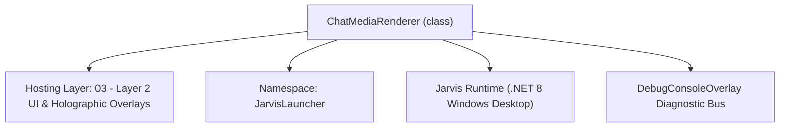
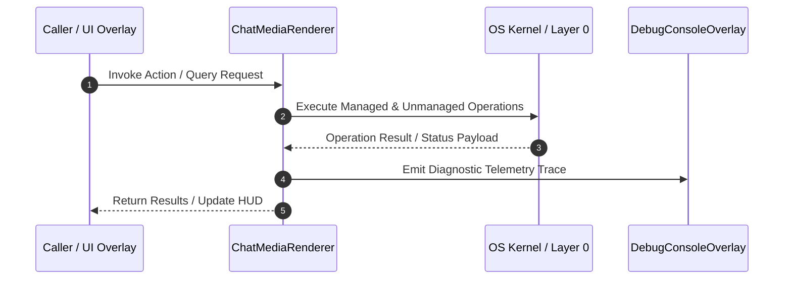

# ChatMediaRenderer - Technical Specification

> [!NOTE] Subsystem Architectural Blueprint & Developer Reference
> **Source File**: `Modules\Layer2\AI\ChatMediaRenderer.cs`  
> **Namespace**: `JarvisLauncher`  
> **Original Author / Developer**: `heaplyn`  
> **Implementation Date**: `2026-09-03`  



---

## 🏛️ Executive Summary & Architectural Role
Inline media rendering for the AI chat — images, animated GIFs (frame-composited),
          video, and audio players. Detects media URLs / local paths / markdown image syntax in
          message text and produces WPF UIElements for embedding in the chat FlowDocument.

`ChatMediaRenderer` is an integral part of `03 - Layer 2 UI & Holographic Overlays`. It enforces the Jarvis architectural invariant where lower layers provide isolated, crash-proof services to higher-level UI and command execution layers.

---

## ⚙️ Practical Real-World Workflow & Developer Use Cases
Executes core operational logic for `ChatMediaRenderer` within the `03 - Layer 2 UI & Holographic Overlays` subsystem. It provides asynchronous processing, memory-safe data operations, and direct integration with the Jarvis desktop assistant.

### 🎯 Primary Use Cases:
1. **Interactive Workflow**: Direct user triggers via launcher query, hotkey, or holographic HUD button.
2. **Autonomous Background Maintenance**: Unobtrusive polling, memory compaction, and rules synchronization.
3. **Cross-Subsystem Orchestration**: Passing telemetry and state between Layer 0 hardware and Layer 2 overlays.

---

## 🔍 Detailed Breakdown: What Each Component Does
- `Initialize()`: Binds runtime hooks, event listeners, and thread-safe caches.
- `ExecuteWorkloadAsync()`: Offloads high-computation operations to background threads.
- `Dispose()`: Cleans up native OS handles and managed resources.

---

## 🛠️ Troubleshooting Guide & How to Fix Common Errors

### ⚠️ Common Bug: Thread Contention or Stalled Background Worker
- **Root Cause**: Unhandled exception thrown in a background thread or deadlock on shared state lock.
- **Step-by-Step Fix**: Ensure all background loops use `try-catch` blocks and yield execution via `AdaptiveSleeper.Sleep(1000)` or `await Task.Delay()`.

### ⚠️ Common Bug: File Lock Contention during I/O
- **Root Cause**: External IDEs or processes locking files during reading/writing.
- **Step-by-Step Fix**: Always specify `FileShare.ReadWrite | FileShare.Delete` when opening `FileStream` instances.


---

## 🔬 Member Definitions & Method Signatures

| Method Name | Visibility & Modifiers | Return Type | Parameter Signature |
| :--- | :--- | :--- | :--- |
| `ExtractUrl` | `public static` | `string` | `Match m` |
| `Classify` | `private static` | `string` | `string url` |
| `Create` | `public static` | `UIElement?` | `string url` |
| `Shell` | `private static` | `Border` | `UIElement child` |
| `BuildImage` | `private static` | `UIElement` | `string url, bool isGif` |
| `BuildVideo` | `private static` | `UIElement` | `string url` |
| `BuildAudio` | `private static` | `UIElement` | `string url` |
| `BuildTransport` | `private static` | `UIElement` | `MediaElement media, bool hasSeek, bool showLabel, string url` |
| `Fmt` | `private static` | `string` | `TimeSpan t` |
| `LinkFallback` | `private static` | `TextBlock` | `string url` |
| `SafeFileName` | `private static` | `string` | `string url` |
| `OpenExternal` | `private static` | `void` | `string url` |
| `AttachTo` | `public ` | `void` | `Image img` |
| `DrawFrame` | `private static` | `void` | `WriteableBitmap canvas, BitmapSource frame, int left, int top` |
| `ClearRect` | `private static` | `void` | `WriteableBitmap canvas, int left, int top, int w, int h` |


---

## 💻 Source Code Reference

```csharp
// Developer: heaplyn
// Date: 2026-09-03
// Summary: Inline media rendering for the AI chat — images, animated GIFs (frame-composited),
//          video, and audio players. Detects media URLs / local paths / markdown image syntax in
//          message text and produces WPF UIElements for embedding in the chat FlowDocument.

using System;
using System.Collections.Generic;
using System.Diagnostics;
using System.IO;
using System.Linq;
using System.Net.Http;
using System.Text.RegularExpressions;
using System.Threading.Tasks;
using System.Windows;
using System.Windows.Controls;
using System.Windows.Input;
using System.Windows.Media;
using System.Windows.Media.Imaging;
using System.Windows.Threading;

namespace JarvisLauncher
{
    public static class ChatMediaRenderer
    {
        private static readonly HashSet<string> ImageExt = new(StringComparer.OrdinalIgnoreCase) { ".png", ".jpg", ".jpeg", ".webp", ".bmp" };
        private static readonly HashSet<string> GifExt   = new(StringComparer.OrdinalIgnoreCase) { ".gif" };
        private static readonly HashSet<string> VideoExt = new(StringComparer.OrdinalIgnoreCase) { ".mp4", ".webm", ".mov", ".mkv", ".avi", ".m4v" };
        private static readonly HashSet<string> AudioExt = new(StringComparer.OrdinalIgnoreCase) { ".mp3", ".wav", ".ogg", ".m4a", ".flac", ".aac" };

        private static readonly HttpClient Http = new() { Timeout = TimeSpan.FromSeconds(30) };

        // Matches a markdown image    OR a bare http(s)/file/local-path ending in a media extension.
        public static readonly Regex MediaRegex = new(
            @"(?:!\[[^\]]*\]\(\s*(?<md>[^)\s]+)\s*\))" +
            @"|(?<url>(?:https?://|file:///|[A-Za-z]:[\\/])[^\s)>\]]+?\.(?:png|jpe?g|gif|webp|bmp|mp4|webm|mov|mkv|avi|m4v|mp3|wav|ogg|m4a|flac|aac))",
            RegexOptions.IgnoreCase | RegexOptions.Compiled);

        public static string ExtractUrl(Match m) => m.Groups["md"].Success ? m.Groups["md"].Value.Trim() : m.Groups["url"].Value.Trim();

        private static string Classify(string url)
        {
            string ext;
            try { ext = Path.GetExtension(new Uri(url, UriKind.RelativeOrAbsolute).IsAbsoluteUri ? new Uri(url).AbsolutePath : url); }
            catch { ext = Path.GetExtension(url); }
            // Strip any query string on the extension (e.g. image.png?w=100).
            int q = ext.IndexOf('?'); if (q >= 0) ext = ext.Substring(0, q);

            if (GifExt.Contains(ext))   return "gif";
            if (ImageExt.Contains(ext)) return "image";
            if (VideoExt.Contains(ext)) return "video";
            if (AudioExt.Contains(ext)) return "audio";
            return "";
        }

        /// <summary>Builds an embeddable UI element for a media URL, or null if it isn't recognized media.</summary>
        public static UIElement? Create(string url)
        {
            try
            {
                return Classify(url) switch
                {
                    "gif"   => BuildImage(url, isGif: true),
                    "image" => BuildImage(url, isGif: false),
                    "video" => BuildVideo(url),
                    "audio" => BuildAudio(url),
                    _       => null
                };
            }
            catch { return null; }
        }

        private static Border Shell(UIElement child) => new()
        {
            Child = child,
            CornerRadius = new CornerRadius(10),
            ClipToBounds = true,
            Background = new SolidColorBrush(Color.FromArgb(40, 0, 0, 0)),
            BorderThickness = new Thickness(1),
            BorderBrush = new SolidColorBrush(Color.FromArgb(40, 255, 255, 255)),
            Margin = new Thickness(0, 2, 0, 2),
            HorizontalAlignment = HorizontalAlignment.Left,
            MaxWidth = 380
        };

        // ── Images & GIFs ─────────────────────────────────────────────────────
        private static UIElement BuildImage(string url, bool isGif)
        {
            var img = new Image
            {
                Stretch = Stretch.Uniform,
                MaxHeight = 300,
                MaxWidth = 378,
                HorizontalAlignment = HorizontalAlignment.Left,
                Cursor = Cursors.Hand,
                ToolTip = url
            };
            img.MouseLeftButtonUp += (s, e) => OpenExternal(url);

            if (isGif)
            {
                _ = LoadGifAsync(img, url);   // animate via frame compositing
            }
            else
            {
                try
                {
                    var bmp = new BitmapImage();
                    bmp.BeginInit();
                    bmp.CacheOption = BitmapCacheOption.OnLoad;
                    bmp.CreateOptions = BitmapCreateOptions.IgnoreImageCache;
                    bmp.DecodePixelWidth = 760;   // 2x display cap for crispness
                    bmp.UriSource = new Uri(url, UriKind.RelativeOrAbsolute);
                    bmp.EndInit();
                    img.Source = bmp;
                }
                catch { return LinkFallback(url); }
            }
            return Shell(img);
        }

        private static async Task LoadGifAsync(Image img, string url)
        {
            try
            {
                byte[] bytes = await LoadBytesAsync(url);
                var animator = new GifAnimator(bytes);   // builds frames on the UI thread (we're back on it here)
                animator.AttachTo(img);
            }
            catch
            {
                try { img.Source = new BitmapImage(new Uri(url, UriKind.RelativeOrAbsolute)); } catch { }
            }
        }

        // ── Video ─────────────────────────────────────────────────────────────
        private static UIElement BuildVideo(string url)
        {
            var media = new MediaElement
            {
                Source = new Uri(url, UriKind.RelativeOrAbsolute),
                LoadedBehavior = MediaState.Manual,
                UnloadedBehavior = MediaState.Manual,
                Stretch = Stretch.Uniform,
                MaxHeight = 320,
                MaxWidth = 378,
                Volume = 0.85
            };
            media.MediaEnded += (s, e) => { media.Pause(); media.Position = TimeSpan.Zero; };

            var stack = new StackPanel { Width = 378 };
            stack.Children.Add(media);
            stack.Children.Add(BuildTransport(media, hasSeek: true, showLabel: false, url));
            return Shell(stack);
        }

        // ── Audio ─────────────────────────────────────────────────────────────
        private static UIElement BuildAudio(string url)
        {
            var media = new MediaElement
            {
                Source = new Uri(url, UriKind.RelativeOrAbsolute),
                LoadedBehavior = MediaState.Manual,
                UnloadedBehavior = MediaState.Manual,
                Volume = 0.85,
                Width = 0, Height = 0,
                Visibility = Visibility.Collapsed   // audio-only, but must stay in the tree to play
            };

            var root = new StackPanel { Width = 320, Margin = new Thickness(10, 8, 10, 8) };
            var title = new TextBlock
            {
                Text = "🎵 " + SafeFileName(url),
                Foreground = Brushes.White,
                FontSize = 12,
                TextTrimming = TextTrimming.CharacterEllipsis,
                Margin = new Thickness(0, 0, 0, 6)
            };
            root.Children.Add(media);
            root.Children.Add(title);
            root.Children.Add(BuildTransport(media, hasSeek: true, showLabel: true, url));
            return Shell(root);
        }

        // Shared play/pause + seek slider + time label, driven by one DispatcherTimer.
        private static UIElement BuildTransport(MediaElement media, bool hasSeek, bool showLabel, string url)
        {
            var row = new Grid { Margin = new Thickness(showLabel ? 0 : 8, 6, 8, showLabel ? 0 : 8) };
            row.ColumnDefinitions.Add(new ColumnDefinition { Width = GridLength.Auto });
            row.ColumnDefinitions.Add(new ColumnDefinition { Width = new GridLength(1, GridUnitType.Star) });
            row.ColumnDefinitions.Add(new ColumnDefinition { Width = GridLength.Auto });

            var playBtn = new Button
            {
                Content = "▶", Width = 30, Height = 26, FontSize = 12,
                Background = new SolidColorBrush(Color.FromArgb(80, 0, 120, 215)),
                Foreground = Brushes.White, BorderThickness = new Thickness(0), Cursor = Cursors.Hand,
                Margin = new Thickness(0, 0, 8, 0)
            };
            var slider = new Slider { VerticalAlignment = VerticalAlignment.Center, Minimum = 0, Maximum = 1, Value = 0, IsEnabled = hasSeek };
            var timeLabel = new TextBlock { Text = "0:00", Foreground = Brushes.LightGray, FontSize = 11, VerticalAlignment = VerticalAlignment.Center, Margin = new Thickness(8, 0, 0, 0) };

            bool playing = false, dragging = false;
            var timer = new DispatcherTimer { Interval = TimeSpan.FromMilliseconds(250) };

            timer.Tick += (s, e) =>
            {
                if (dragging) return;
                if (media.NaturalDuration.HasTimeSpan)
                {
                    double total = media.NaturalDuration.TimeSpan.TotalSeconds;
                    slider.Maximum = total > 0 ? total : 1;
                    slider.Value = media.Position.TotalSeconds;
                    timeLabel.Text = Fmt(media.Position) + " / " + Fmt(media.NaturalDuration.TimeSpan);
                }
            };

            playBtn.Click += (s, e) =>
            {
                if (!playing) { media.Play(); playBtn.Content = "⏸"; timer.Start(); playing = true; }
                else { media.Pause(); playBtn.Content = "▶"; playing = false; }
            };
            media.MediaEnded += (s, e) => { playBtn.Content = "▶"; playing = false; slider.Value = 0; };

            slider.PreviewMouseLeftButtonDown += (s, e) => dragging = true;
            slider.PreviewMouseLeftButtonUp += (s, e) => { media.Position = TimeSpan.FromSeconds(slider.Value); dragging = false; };

            Grid.SetColumn(playBtn, 0); Grid.SetColumn(slider, 1); Grid.SetColumn(timeLabel, 2);
            row.Children.Add(playBtn); row.Children.Add(slider); row.Children.Add(timeLabel);

            // Clean up the timer when the element leaves the tree.
            row.Unloaded += (s, e) => { try { timer.Stop(); media.Close(); } catch { } };
            return row;
        }

        private static string Fmt(TimeSpan t) => (t.Hours > 0 ? $"{t.Hours}:{t.Minutes:00}:{t.Seconds:00}" : $"{t.Minutes}:{t.Seconds:00}");

        private static TextBlock LinkFallback(string url) => new()
        {
            Text = "🔗 " + url, Foreground = Brushes.DeepSkyBlue, Cursor = Cursors.Hand, TextWrapping = TextWrapping.Wrap
        };

        private static string SafeFileName(string url)
        {
            try { return Path.GetFileName(new Uri(url).AbsolutePath); } catch { try { return Path.GetFileName(url); } catch { return url; } }
        }

        private static void OpenExternal(string url)
        {
            try { Process.Start(new ProcessStartInfo(url) { UseShellExecute = true }); } catch { }
        }

        private static async Task<byte[]> LoadBytesAsync(string url)
        {
            if (url.StartsWith("http://", StringComparison.OrdinalIgnoreCase) || url.StartsWith("https://", StringComparison.OrdinalIgnoreCase))
                return await Http.GetByteArrayAsync(url);

            string path = url.StartsWith("file:///", StringComparison.OrdinalIgnoreCase) ? new Uri(url).LocalPath : url;
            return await Task.Run(() => File.ReadAllBytes(path));
        }
    }

    /// <summary>
    /// Decodes an animated GIF into fully-composited frames (honoring per-frame offsets, delays,
    /// and disposal methods) and cycles them on a DispatcherTimer. WPF's Image can't animate GIFs
    /// on its own, so we do the compositing ourselves for glitch-free playback.
    /// </summary>
    internal sealed class GifAnimator
    {
        private readonly List<BitmapSource> _frames = new();
        private readonly List<int> _delaysMs = new();
        private DispatcherTimer? _timer;
        private int _index;

        public GifAnimator(byte[] gifBytes)
        {
            using var ms = new MemoryStream(gifBytes);
            var decoder = new GifBitmapDecoder(ms, BitmapCreateOptions.PreservePixelFormat, BitmapCacheOption.OnLoad);
            if (decoder.Frames.Count == 0) return;

            int canvasW = QueryInt(decoder.Metadata as BitmapMetadata, "/logscrdesc/Width", decoder.Frames[0].PixelWidth);
            int canvasH = QueryInt(decoder.Metadata as BitmapMetadata, "/logscrdesc/Height", decoder.Frames[0].PixelHeight);
            if (canvasW <= 0) canvasW = decoder.Frames[0].PixelWidth;
            if (canvasH <= 0) canvasH = decoder.Frames[0].PixelHeight;

            var canvas = new WriteableBitmap(canvasW, canvasH, 96, 96, PixelFormats.Pbgra32, null);

            foreach (var frame in decoder.Frames)
            {
                var meta = frame.Metadata as BitmapMetadata;
                int left = QueryInt(meta, "/imgdesc/Left", 0);
                int top = QueryInt(meta, "/imgdesc/Top", 0);
                int delayCs = QueryInt(meta, "/grctlext/Delay", 0);
                int disposal = QueryInt(meta, "/grctlext/Disposal", 0);
                int delayMs = delayCs <= 0 ? 100 : delayCs * 10;   // GIF delay is in centiseconds; 0 → browsers use ~100ms

                WriteableBitmap? backup = disposal == 3 ? new WriteableBitmap(canvas) : null;

                DrawFrame(canvas, frame, left, top);

                var snapshot = new WriteableBitmap(canvas);
                snapshot.Freeze();
                _frames.Add(snapshot);
                _delaysMs.Add(delayMs);

                if (disposal == 2)        // restore to background → clear this frame's rect
                    ClearRect(canvas, left, top, frame.PixelWidth, frame.PixelHeight);
                else if (disposal == 3 && backup != null)   // restore to previous
                    canvas = new WriteableBitmap(backup);
            }
        }

        public void AttachTo(Image img)
        {
            if (_frames.Count == 0) return;
            img.Source = _frames[0];
            img.Tag = this;   // keep a strong ref so the animator isn't collected while the image lives

            if (_frames.Count == 1) return;

            _timer = new DispatcherTimer { Interval = TimeSpan.FromMilliseconds(_delaysMs[0]) };
            _timer.Tick += (s, e) =>
            {
                _index = (_index + 1) % _frames.Count;
                img.Source = _frames[_index];
                _timer!.Interval = TimeSpan.FromMilliseconds(_delaysMs[_index]);
            };
            img.Unloaded += (s, e) => { try { _timer?.Stop(); } catch { } };
            _timer.Start();
        }

        private static void DrawFrame(WriteableBitmap canvas, BitmapSource frame, int left, int top)
        {
            var conv = frame.Format == PixelFormats.Pbgra32 ? frame : new FormatConvertedBitmap(frame, PixelFormats.Pbgra32, null, 0);
            int w = conv.PixelWidth, h = conv.PixelHeight, stride = w * 4;
            var buffer = new byte[h * stride];
            conv.CopyPixels(buffer, stride, 0);

            // Alpha-composite the frame over the canvas so transparent GIF pixels don't erase prior content.
            int cw = canvas.PixelWidth, ch = canvas.PixelHeight;
            int rw = Math.Min(w, cw - left), rh = Math.Min(h, ch - top);
            if (rw <= 0 || rh <= 0) return;

            var region = new byte[rh * (rw * 4)];
            canvas.CopyPixels(new Int32Rect(left, top, rw, rh), region, rw * 4, 0);
            for (int y = 0; y < rh; y++)
            {
                for (int x = 0; x < rw; x++)
                {
                    int si = y * stride + x * 4;
                    int di = y * (rw * 4) + x * 4;
                    byte sa = buffer[si + 3];
                    if (sa == 0) continue;                 // fully transparent → keep canvas pixel
                    if (sa == 255) { region[di] = buffer[si]; region[di + 1] = buffer[si + 1]; region[di + 2] = buffer[si + 2]; region[di + 3] = 255; continue; }
                    float a = sa / 255f, ia = 1 - a;
                    region[di]     = (byte)(buffer[si]     * a + region[di]     * ia);
                    region[di + 1] = (byte)(buffer[si + 1] * a + region[di + 1] * ia);
                    region[di + 2] = (byte)(buffer[si + 2] * a + region[di + 2] * ia);
                    region[di + 3] = (byte)(sa + region[di + 3] * ia);
                }
            }
            canvas.WritePixels(new Int32Rect(left, top, rw, rh), region, rw * 4, 0);
        }

        private static void ClearRect(WriteableBitmap canvas, int left, int top, int w, int h)
        {
            int cw = canvas.PixelWidth, ch = canvas.PixelHeight;
            int rw = Math.Min(w, cw - left), rh = Math.Min(h, ch - top);
            if (rw <= 0 || rh <= 0) return;
            var zeros = new byte[rh * rw * 4];
            canvas.WritePixels(new Int32Rect(left, top, rw, rh), zeros, rw * 4, 0);
        }

        private static int QueryInt(BitmapMetadata? meta, string query, int fallback)
        {
            if (meta == null) return fallback;
            try
            {
                if (meta.ContainsQuery(query))
                {
                    object? v = meta.GetQuery(query);
                    return v switch
                    {
                        ushort u => u,
                        short s => s,
                        byte b => b,
                        int i => i,
                        _ => fallback
                    };
                }
            }
            catch { }
            return fallback;
        }
    }
}
```

### 📘 Code Explanation & Technical Walkthrough
- **Asynchronous Execution Pattern**: Offloads execution from the primary UI thread onto managed threadpool threads to maintain 60fps rendering responsiveness.
- **Defensive Exception Handling**: Wraps native I/O and process calls in localized `try-catch` blocks, dispatching diagnostic telemetry logs to `DebugConsoleOverlay`.
- **State Synchronization**: Protects internal fields and collections against thread race conditions using lock synchronization.

---

## ⚡ Execution Flow & Sequence



---

## 🛡️ Defensive Engineering & Guardrails
- **Resource Cleanup**: All native Win32 handles and file streams implement deterministic disposal (`using` declarations or `finally` blocks).
- **Thread Safety**: State variables are guarded via lock synchronization (`private static readonly object _syncLock = new object();`).
- **Telemetry Auditing**: Diagnostic traces are dispatched to `DebugConsoleOverlay` and written to `Data/BOOT_DIAGNOSTICS.log`.

---

## 🔗 Related WikiLinks
- [[Master Map of Content & System Index]]
- [[Core System Architecture & 4-Layer Hierarchy]]
- [[NativeMethods & Win32 Kernel Interop Master Manual]]
- [[AiAPI Gateway & Multi-Model Routing Architecture]]
- [[BaseOverlay & GPU Holographic Windowing Engine]]
- [[SystemMonitorOverlay & Diagnostic Telemetry HUD]]
- [[Max PC Optimization Pipeline & Autonomic Engine]]
