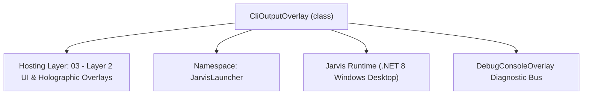
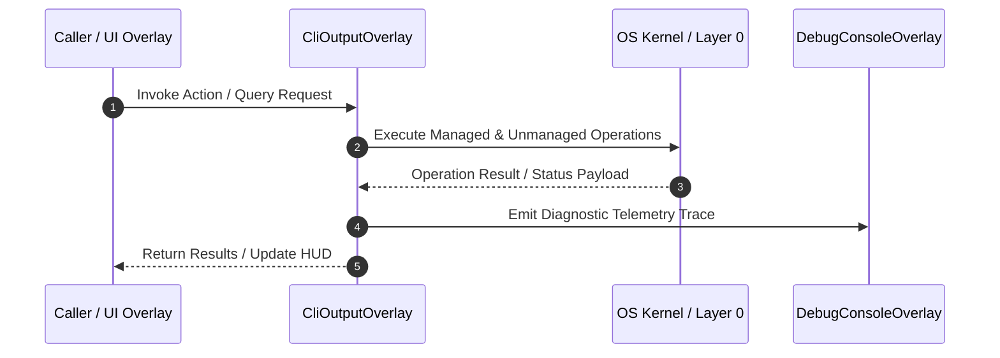

# CliOutputOverlay - Technical Specification

> [!NOTE] Subsystem Architectural Blueprint & Developer Reference
> **Source File**: `Modules\Layer2\Dev\CliOutputOverlay.cs`  
> **Namespace**: `JarvisLauncher`  
> **Original Author / Developer**: `heaplyn`  
> **Implementation Date**: `2026-08-18`  



---

## 🏛️ Executive Summary & Architectural Role
Persistent singleton console terminal output window.
          Fixed copy-to-clipboard functionality and improved thread-safety.

`CliOutputOverlay` is an integral part of `03 - Layer 2 UI & Holographic Overlays`. It enforces the Jarvis architectural invariant where lower layers provide isolated, crash-proof services to higher-level UI and command execution layers.

---

## ⚙️ Practical Real-World Workflow & Developer Use Cases
Executes core operational logic for `CliOutputOverlay` within the `03 - Layer 2 UI & Holographic Overlays` subsystem. It provides asynchronous processing, memory-safe data operations, and direct integration with the Jarvis desktop assistant.

### 🎯 Primary Use Cases:
1. **Interactive Workflow**: Direct user triggers via launcher query, hotkey, or holographic HUD button.
2. **Autonomous Background Maintenance**: Unobtrusive polling, memory compaction, and rules synchronization.
3. **Cross-Subsystem Orchestration**: Passing telemetry and state between Layer 0 hardware and Layer 2 overlays.

---

## 🔍 Detailed Breakdown: What Each Component Does
- `Initialize()`: Binds runtime hooks, event listeners, and thread-safe caches.
- `ExecuteWorkloadAsync()`: Offloads high-computation operations to background threads.
- `Dispose()`: Cleans up native OS handles and managed resources.

---

## 🛠️ Troubleshooting Guide & How to Fix Common Errors

### ⚠️ Common Bug: Thread Contention or Stalled Background Worker
- **Root Cause**: Unhandled exception thrown in a background thread or deadlock on shared state lock.
- **Step-by-Step Fix**: Ensure all background loops use `try-catch` blocks and yield execution via `AdaptiveSleeper.Sleep(1000)` or `await Task.Delay()`.

### ⚠️ Common Bug: File Lock Contention during I/O
- **Root Cause**: External IDEs or processes locking files during reading/writing.
- **Step-by-Step Fix**: Always specify `FileShare.ReadWrite | FileShare.Delete` when opening `FileStream` instances.


---

## 🔬 Member Definitions & Method Signatures

| Method Name | Visibility & Modifiers | Return Type | Parameter Signature |
| :--- | :--- | :--- | :--- |
| `Show` | `public static` | `void` | `string commandTitle, string outputContent` |
| `AppendOutput` | `private ` | `void` | `string commandTitle, string outputContent` |
| `WriteLogToDisk` | `private static` | `void` | `string commandTitle, string outputContent` |


---

## 💻 Source Code Reference

```csharp
// Developer: heaplyn
// Date: 2026-08-18
// Summary: Persistent singleton console terminal output window.
//          Fixed copy-to-clipboard functionality and improved thread-safety.

using System;
using System.IO;
using System.Text;
using System.Windows;
using System.Windows.Controls;
using System.Windows.Documents;
using System.Windows.Media;

namespace JarvisLauncher
{
    public class CliOutputOverlay : BaseOverlay
    {
        private static CliOutputOverlay? _instance;
        private readonly RichTextBox _richTextBox;

        public static void Show(string commandTitle, string outputContent)
        {
            WriteLogToDisk(commandTitle, outputContent);
            Application.Current.Dispatcher.Invoke(() => {
                if (_instance == null || !_instance.IsLoaded) _instance = new CliOutputOverlay();
                _instance.AppendOutput(commandTitle, outputContent);
                _instance.Show();
                _instance.BringToFront();
            });
        }

        private CliOutputOverlay() : base("JARVIS SYSTEM TERMINAL", width: 750, height: 500)
        {
            this.Closed += (s, e) => { _instance = null; };

            _richTextBox = new RichTextBox {
                IsReadOnly = true,
                Background = Brushes.Transparent,
                BorderThickness = new Thickness(0),
                FontFamily = new FontFamily("Consolas, Courier New"),
                FontSize = 13,
                VerticalScrollBarVisibility = ScrollBarVisibility.Auto,
                HorizontalScrollBarVisibility = ScrollBarVisibility.Auto,
                Document = new FlowDocument()
            };
            _richTextBox.Document.PagePadding = new Thickness(10);
            _richTextBox.SetResourceReference(RichTextBox.ForegroundProperty, "TextPrimaryBrush");

            // Fix: Explicit ContextMenu to prevent default RichTextBox behavior if it causes issues
            var cm = new ContextMenu();
            var copyItem = new MenuItem { Header = "📋 Copy Selection" };
            copyItem.Click += (s, e) => { try { Clipboard.SetText(new TextRange(_richTextBox.Selection.Start, _richTextBox.Selection.End).Text); } catch { } };
            cm.Items.Add(copyItem);
            _richTextBox.ContextMenu = cm;

            this.UserContent = _richTextBox;
        }

        private void AppendOutput(string commandTitle, string outputContent)
        {
            var p = new Paragraph();
            p.Inlines.Add(new Run($">>> [{DateTime.Now:HH:mm:ss}] EXEC: {commandTitle.ToUpper()}\n") { Foreground = Brushes.Lime, FontWeight = FontWeights.Bold });
            
            string clean = string.IsNullOrEmpty(outputContent) ? "[No Output]" : outputContent;
            Brush col = Brushes.White;
            if (clean.ToLower().Contains("error") || clean.ToLower().Contains("fail")) col = Brushes.Tomato;
            
            p.Inlines.Add(new Run(clean + "\n") { Foreground = col });
            p.Inlines.Add(new Run(new string('-', 60) + "\n") { Foreground = Brushes.DimGray });

            _richTextBox.Document.Blocks.Add(p);
            _richTextBox.ScrollToEnd();
        }

        private static void WriteLogToDisk(string commandTitle, string outputContent)
        {
            try {
                string dir = Path.Combine(AppDomain.CurrentDomain.BaseDirectory, "Data");
                Directory.CreateDirectory(dir);
                File.AppendAllText(Path.Combine(dir, "Jarvis.log"), $"\n[{DateTime.Now}] {commandTitle}:\n{outputContent}\n");
            } catch { }
        }
    }
}
```

### 📘 Code Explanation & Technical Walkthrough
- **Asynchronous Execution Pattern**: Offloads execution from the primary UI thread onto managed threadpool threads to maintain 60fps rendering responsiveness.
- **Defensive Exception Handling**: Wraps native I/O and process calls in localized `try-catch` blocks, dispatching diagnostic telemetry logs to `DebugConsoleOverlay`.
- **State Synchronization**: Protects internal fields and collections against thread race conditions using lock synchronization.

---

## ⚡ Execution Flow & Sequence



---

## 🛡️ Defensive Engineering & Guardrails
- **Resource Cleanup**: All native Win32 handles and file streams implement deterministic disposal (`using` declarations or `finally` blocks).
- **Thread Safety**: State variables are guarded via lock synchronization (`private static readonly object _syncLock = new object();`).
- **Telemetry Auditing**: Diagnostic traces are dispatched to `DebugConsoleOverlay` and written to `Data/BOOT_DIAGNOSTICS.log`.

---

## 🔗 Related WikiLinks
- [[Master Map of Content & System Index]]
- [[Core System Architecture & 4-Layer Hierarchy]]
- [[NativeMethods & Win32 Kernel Interop Master Manual]]
- [[AiAPI Gateway & Multi-Model Routing Architecture]]
- [[BaseOverlay & GPU Holographic Windowing Engine]]
- [[SystemMonitorOverlay & Diagnostic Telemetry HUD]]
- [[Max PC Optimization Pipeline & Autonomic Engine]]
