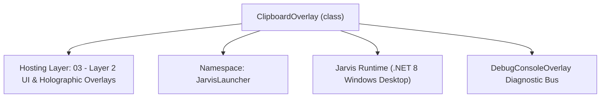
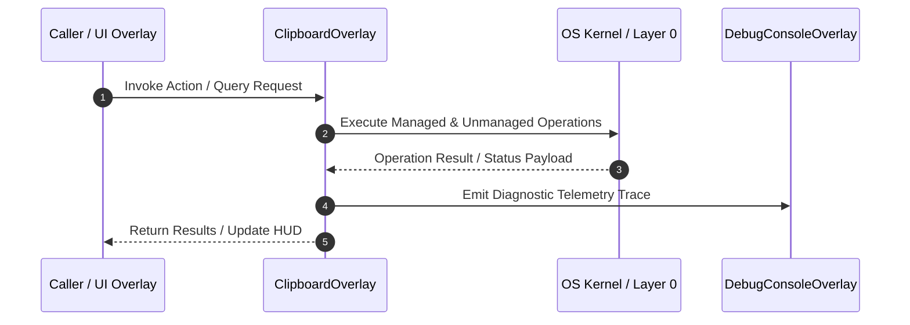

# ClipboardOverlay - Technical Specification

> [!NOTE] Subsystem Architectural Blueprint & Developer Reference
> **Source File**: `Modules\Layer2\System\ClipboardOverlay.cs`  
> **Namespace**: `JarvisLauncher`  
> **Original Author / Developer**: `heaplyn`  
> **Implementation Date**: `2026-08-10`  



---

## 🏛️ Executive Summary & Architectural Role
Draggable, searchable glassmorphic Clipboard History GUI overlay.
          Supports copying clips, pinning items to the top, deleting entries, and filtering list.

`ClipboardOverlay` is an integral part of `03 - Layer 2 UI & Holographic Overlays`. It enforces the Jarvis architectural invariant where lower layers provide isolated, crash-proof services to higher-level UI and command execution layers.

---

## ⚙️ Practical Real-World Workflow & Developer Use Cases
Executes core operational logic for `ClipboardOverlay` within the `03 - Layer 2 UI & Holographic Overlays` subsystem. It provides asynchronous processing, memory-safe data operations, and direct integration with the Jarvis desktop assistant.

### 🎯 Primary Use Cases:
1. **Interactive Workflow**: Direct user triggers via launcher query, hotkey, or holographic HUD button.
2. **Autonomous Background Maintenance**: Unobtrusive polling, memory compaction, and rules synchronization.
3. **Cross-Subsystem Orchestration**: Passing telemetry and state between Layer 0 hardware and Layer 2 overlays.

---

## 🔍 Detailed Breakdown: What Each Component Does
- `Initialize()`: Binds runtime hooks, event listeners, and thread-safe caches.
- `ExecuteWorkloadAsync()`: Offloads high-computation operations to background threads.
- `Dispose()`: Cleans up native OS handles and managed resources.

---

## 🛠️ Troubleshooting Guide & How to Fix Common Errors

### ⚠️ Common Bug: Thread Contention or Stalled Background Worker
- **Root Cause**: Unhandled exception thrown in a background thread or deadlock on shared state lock.
- **Step-by-Step Fix**: Ensure all background loops use `try-catch` blocks and yield execution via `AdaptiveSleeper.Sleep(1000)` or `await Task.Delay()`.

### ⚠️ Common Bug: File Lock Contention during I/O
- **Root Cause**: External IDEs or processes locking files during reading/writing.
- **Step-by-Step Fix**: Always specify `FileShare.ReadWrite | FileShare.Delete` when opening `FileStream` instances.


---

## 🔬 Member Definitions & Method Signatures

| Method Name | Visibility & Modifiers | Return Type | Parameter Signature |
| :--- | :--- | :--- | :--- |
| `Open` | `public static` | `void` | `*none*` |
| `RefreshList` | `private ` | `void` | `*none*` |
| `CreateItemRow` | `private ` | `Border` | `ClipboardItem item, bool isPinned` |
| `TogglePinItem` | `private ` | `void` | `string content` |
| `GetPinnedFilePath` | `private ` | `string` | `*none*` |
| `LoadPinnedClips` | `private ` | `void` | `*none*` |
| `SavePinnedClips` | `private ` | `void` | `*none*` |


---

## 💻 Source Code Reference

```csharp
// Developer: heaplyn
// Date: 2026-08-10
// Summary: Draggable, searchable glassmorphic Clipboard History GUI overlay.
//          Supports copying clips, pinning items to the top, deleting entries, and filtering list.

using System;
using System.IO;
using System.Linq;
using System.Text.Json;
using System.Windows;
using System.Windows.Controls;
using System.Windows.Input;
using System.Windows.Media;
using System.Collections.Generic;

namespace JarvisLauncher
{
    public class ClipboardOverlay : BaseOverlay
    {
        private static ClipboardOverlay? _instance;
        private readonly TextBox _searchTextBox;
        private readonly StackPanel _itemsPanel;
        private readonly ScrollViewer _scrollViewer;
        private List<string> _pinnedClips = new List<string>();

        public static void Open()
        {
            Application.Current.Dispatcher.Invoke(() =>
            {
                if (_instance == null)
                {
                    _instance = new ClipboardOverlay();
                    _instance.Closed += (s, e) => _instance = null;
                }
                _instance.Show();
            });
        }

        private ClipboardOverlay()
            : base("📋 CLIPBOARD HISTORY MANAGER", width: 380, height: 480)
        {
            LoadPinnedClips();

            var mainGrid = new Grid { Margin = new Thickness(8) };
            mainGrid.RowDefinitions.Add(new RowDefinition { Height = GridLength.Auto }); // Search
            mainGrid.RowDefinitions.Add(new RowDefinition { Height = new GridLength(1, GridUnitType.Star) }); // Scroll list
            mainGrid.RowDefinitions.Add(new RowDefinition { Height = GridLength.Auto }); // Actions

            // Search box
            _searchTextBox = new TextBox
            {
                FontSize = 13,
                FontFamily = new FontFamily("Segoe UI"),
                Padding = new Thickness(6, 4, 6, 4),
                Margin = new Thickness(0, 0, 0, 8)
            };
            _searchTextBox.SetResourceReference(TextBox.BackgroundProperty, "HoverBackgroundBrush");
            _searchTextBox.SetResourceReference(TextBox.ForegroundProperty, "TextPrimaryBrush");
            _searchTextBox.SetResourceReference(TextBox.BorderBrushProperty, "WindowBorderBrush");
            _searchTextBox.SetResourceReference(TextBox.CaretBrushProperty, "AccentCaretBrush");
            
            // Add placeholder hint inside text box
            var placeholder = new TextBlock
            {
                Text = "🔍 Search clipboard history...",
                FontSize = 13,
                Foreground = Brushes.Gray,
                IsHitTestVisible = false,
                Margin = new Thickness(8, 5, 0, 0)
            };
            
            var searchGrid = new Grid();
            searchGrid.Children.Add(_searchTextBox);
            searchGrid.Children.Add(placeholder);
            
            _searchTextBox.TextChanged += (s, e) =>
            {
                placeholder.Visibility = string.IsNullOrEmpty(_searchTextBox.Text) ? Visibility.Visible : Visibility.Collapsed;
                RefreshList();
            };

            Grid.SetRow(searchGrid, 0);
            mainGrid.Children.Add(searchGrid);

            // Scroll Viewer & Panel
            _scrollViewer = new ScrollViewer
            {
                VerticalScrollBarVisibility = ScrollBarVisibility.Auto,
                Margin = new Thickness(0, 0, 0, 8)
            };

            _itemsPanel = new StackPanel();
            _scrollViewer.Content = _itemsPanel;
            Grid.SetRow(_scrollViewer, 1);
            mainGrid.Children.Add(_scrollViewer);

            // Bottom Actions Bar
            var bottomGrid = new Grid();
            bottomGrid.ColumnDefinitions.Add(new ColumnDefinition { Width = new GridLength(1, GridUnitType.Star) });
            bottomGrid.ColumnDefinitions.Add(new ColumnDefinition { Width = GridLength.Auto });

            var clearAllBtn = new Button
            {
                Content = "🧹 Clear Clipboard History",
                Padding = new Thickness(10, 4, 10, 4),
                Cursor = Cursors.Hand,
                FontSize = 12,
                FontFamily = new FontFamily("Segoe UI")
            };
            clearAllBtn.SetResourceReference(Button.BackgroundProperty, "HoverBackgroundBrush");
            clearAllBtn.SetResourceReference(Button.ForegroundProperty, "TextPrimaryBrush");
            clearAllBtn.Click += (s, e) =>
            {
                ClipboardHistoryManager.ClearHistory();
                RefreshList();
                TextOverlay.Show("🧹 Clipboard history cleared!", 2500);
            };
            Grid.SetColumn(clearAllBtn, 0);
            bottomGrid.Children.Add(clearAllBtn);

            Grid.SetRow(bottomGrid, 2);
            mainGrid.Children.Add(bottomGrid);

            this.UserContent = mainGrid;

            this.Loaded += (s, e) => _searchTextBox.Focus();

            RefreshList();
        }

        private void RefreshList()
        {
            _itemsPanel.Children.Clear();
            string filter = _searchTextBox.Text.Trim().ToLower();

            var rawHistory = ClipboardHistoryManager.GetHistory();
            var shownHistory = new List<ClipboardItem>();

            foreach (var item in rawHistory)
            {
                if (string.IsNullOrEmpty(filter) || item.Content.ToLower().Contains(filter))
                {
                    shownHistory.Add(item);
                }
            }

            // Group pinned items to the top, followed by other history items
            var pinnedItems = shownHistory.Where(item => _pinnedClips.Contains(item.Content)).ToList();
            var unpinnedItems = shownHistory.Where(item => !_pinnedClips.Contains(item.Content)).ToList();

            if (pinnedItems.Count == 0 && unpinnedItems.Count == 0)
            {
                var noItemsText = new TextBlock
                {
                    Text = "No history items found.",
                    HorizontalAlignment = HorizontalAlignment.Center,
                    Margin = new Thickness(0, 20, 0, 0),
                    FontStyle = FontStyles.Italic,
                    FontSize = 13
                };
                noItemsText.SetResourceReference(TextBlock.ForegroundProperty, "TextSecondaryBrush");
                _itemsPanel.Children.Add(noItemsText);
                return;
            }

            // Render Pinned Section
            if (pinnedItems.Count > 0)
            {
                var pinnedHeader = new TextBlock
                {
                    Text = "📌 PINNED ITEMS",
                    FontSize = 10,
                    FontWeight = FontWeights.Bold,
                    Margin = new Thickness(0, 4, 0, 4)
                };
                pinnedHeader.SetResourceReference(TextBlock.ForegroundProperty, "SelectedBorderBrush");
                _itemsPanel.Children.Add(pinnedHeader);

                foreach (var item in pinnedItems)
                {
                    _itemsPanel.Children.Add(CreateItemRow(item, isPinned: true));
                }
            }

            // Render Recent Section
            if (unpinnedItems.Count > 0)
            {
                var recentHeader = new TextBlock
                {
                    Text = "🕒 RECENT ITEMS",
                    FontSize = 10,
                    FontWeight = FontWeights.Bold,
                    Margin = new Thickness(0, 10, 0, 4)
                };
                recentHeader.SetResourceReference(TextBlock.ForegroundProperty, "TextSecondaryBrush");
                _itemsPanel.Children.Add(recentHeader);

                foreach (var item in unpinnedItems)
                {
                    _itemsPanel.Children.Add(CreateItemRow(item, isPinned: false));
                }
            }
        }

        private Border CreateItemRow(ClipboardItem item, bool isPinned)
        {
            var rowBorder = new Border
            {
                Background = new SolidColorBrush(Color.FromArgb(15, 255, 255, 255)),
                CornerRadius = new CornerRadius(6),
                Padding = new Thickness(8),
                Margin = new Thickness(0, 3, 0, 3),
                BorderThickness = new Thickness(1)
            };
            rowBorder.SetResourceReference(Border.BorderBrushProperty, "WindowBorderBrush");

            var grid = new Grid();
            grid.ColumnDefinitions.Add(new ColumnDefinition { Width = new GridLength(1, GridUnitType.Star) }); // Content
            grid.ColumnDefinitions.Add(new ColumnDefinition { Width = GridLength.Auto }); // Pin Btn
            grid.ColumnDefinitions.Add(new ColumnDefinition { Width = GridLength.Auto }); // Del Btn

            // Content Area (Click to copy)
            var textStack = new StackPanel { Cursor = Cursors.Hand };
            textStack.MouseLeftButtonDown += (s, e) =>
            {
                try
                {
                    Clipboard.SetText(item.Content);
                    TextOverlay.Show("📋 Copied to Clipboard!", 2000);
                    FadeOutAndClose();
                }
                catch (Exception ex)
                {
                    TextOverlay.Show($"⚠️ Copy Failed: {ex.Message}", 3000);
                }
            };

            string singleLine = item.Content.Replace("\r", " ").Replace("\n", " ").Trim();
            string preview = singleLine.Length > 80 ? singleLine.Substring(0, 80) + "..." : singleLine;

            var contentTextBlock = new TextBlock
            {
                Text = preview,
                TextWrapping = TextWrapping.NoWrap,
                TextTrimming = TextTrimming.CharacterEllipsis,
                FontSize = 12
            };
            contentTextBlock.SetResourceReference(TextBlock.ForegroundProperty, "TextPrimaryBrush");

            var timeTextBlock = new TextBlock
            {
                Text = item.Timestamp.ToString("yyyy-MM-dd HH:mm:ss"),
                FontSize = 10,
                Margin = new Thickness(0, 2, 0, 0)
            };
            timeTextBlock.SetResourceReference(TextBlock.ForegroundProperty, "TextSecondaryBrush");

            textStack.Children.Add(contentTextBlock);
            textStack.Children.Add(timeTextBlock);

            Grid.SetColumn(textStack, 0);
            grid.Children.Add(textStack);

            // Button controls panel
            var controlsStack = new StackPanel { Orientation = Orientation.Horizontal };

            // Pin / Unpin button
            var pinBtn = new Button
            {
                Content = "📌",
                Background = Brushes.Transparent,
                BorderThickness = new Thickness(0),
                Cursor = Cursors.Hand,
                FontSize = 11,
                Margin = new Thickness(4, 0, 0, 0),
                VerticalAlignment = VerticalAlignment.Center,
                Opacity = isPinned ? 1.0 : 0.4
            };
            pinBtn.Click += (s, e) => TogglePinItem(item.Content);
            controlsStack.Children.Add(pinBtn);

            // Delete button
            var delBtn = new Button
            {
                Content = "❌",
                Background = Brushes.Transparent,
                BorderThickness = new Thickness(0),
                Cursor = Cursors.Hand,
                FontSize = 10,
                Margin = new Thickness(6, 0, 0, 0),
                VerticalAlignment = VerticalAlignment.Center,
                Opacity = 0.4
            };
            delBtn.MouseEnter += (s, e) => delBtn.Opacity = 1.0;
            delBtn.MouseLeave += (s, e) => delBtn.Opacity = 0.4;
            delBtn.Click += (s, e) =>
            {
                var history = ClipboardHistoryManager.GetHistory();
                var match = history.FirstOrDefault(h => h.Content == item.Content);
                if (match != null)
                {
                    ClipboardHistoryManager.ClearHistory();
                    foreach (var h in history)
                    {
                        if (h.Content != item.Content)
                        {
                            ClipboardHistoryManager.AddHistoryItem(h.Content);
                        }
                    }
                }
                _pinnedClips.Remove(item.Content);
                SavePinnedClips();
                RefreshList();
            };
            controlsStack.Children.Add(delBtn);

            Grid.SetColumn(controlsStack, 1);
            grid.Children.Add(controlsStack);

            rowBorder.Child = grid;

            rowBorder.MouseEnter += (s, e) => rowBorder.Background = new SolidColorBrush(Color.FromArgb(30, 255, 255, 255));
            rowBorder.MouseLeave += (s, e) => rowBorder.Background = new SolidColorBrush(Color.FromArgb(15, 255, 255, 255));

            return rowBorder;
        }

        private void TogglePinItem(string content)
        {
            if (_pinnedClips.Contains(content))
            {
                _pinnedClips.Remove(content);
                TextOverlay.Show("📌 Unpinned Clipboard Item", 2000);
            }
            else
            {
                _pinnedClips.Add(content);
                TextOverlay.Show("📌 Pinned Clipboard Item", 2000);
            }

            SavePinnedClips();
            RefreshList();
        }

        private string GetPinnedFilePath()
        {
            string dataDir = Path.Combine(AppDomain.CurrentDomain.BaseDirectory, "Data");
            if (!Directory.Exists(dataDir)) Directory.CreateDirectory(dataDir);
            return Path.Combine(dataDir, "PinnedClips.json");
        }

        private void LoadPinnedClips()
        {
            try
            {
                string file = GetPinnedFilePath();
                if (File.Exists(file))
                {
                    string json = File.ReadAllText(file);
                    var items = JsonSerializer.Deserialize<List<string>>(json);
                    if (items != null)
                    {
                        _pinnedClips = items;
                    }
                }
            }
            catch { }
        }

        private void SavePinnedClips()
        {
            try
            {
                string file = GetPinnedFilePath();
                string json = JsonSerializer.Serialize(_pinnedClips, new JsonSerializerOptions { WriteIndented = true });
                File.WriteAllText(file, json);
            }
            catch { }
        }
    }
}
```

### 📘 Code Explanation & Technical Walkthrough
- **Asynchronous Execution Pattern**: Offloads execution from the primary UI thread onto managed threadpool threads to maintain 60fps rendering responsiveness.
- **Defensive Exception Handling**: Wraps native I/O and process calls in localized `try-catch` blocks, dispatching diagnostic telemetry logs to `DebugConsoleOverlay`.
- **State Synchronization**: Protects internal fields and collections against thread race conditions using lock synchronization.

---

## ⚡ Execution Flow & Sequence



---

## 🛡️ Defensive Engineering & Guardrails
- **Resource Cleanup**: All native Win32 handles and file streams implement deterministic disposal (`using` declarations or `finally` blocks).
- **Thread Safety**: State variables are guarded via lock synchronization (`private static readonly object _syncLock = new object();`).
- **Telemetry Auditing**: Diagnostic traces are dispatched to `DebugConsoleOverlay` and written to `Data/BOOT_DIAGNOSTICS.log`.

---

## 🔗 Related WikiLinks
- [[Master Map of Content & System Index]]
- [[Core System Architecture & 4-Layer Hierarchy]]
- [[NativeMethods & Win32 Kernel Interop Master Manual]]
- [[AiAPI Gateway & Multi-Model Routing Architecture]]
- [[BaseOverlay & GPU Holographic Windowing Engine]]
- [[SystemMonitorOverlay & Diagnostic Telemetry HUD]]
- [[Max PC Optimization Pipeline & Autonomic Engine]]
