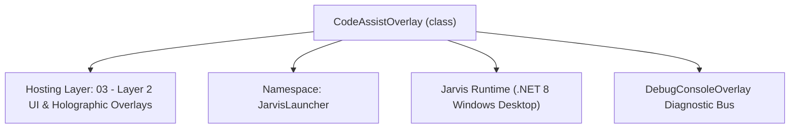
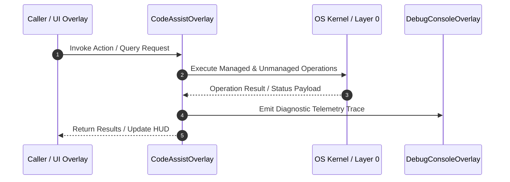

# CodeAssistOverlay - Technical Specification

> [!NOTE] Subsystem Architectural Blueprint & Developer Reference
> **Source File**: `Modules\Layer2\System\CodeAssistOverlay.cs`  
> **Namespace**: `JarvisLauncher`  
> **Original Author / Developer**: `heaplyn`  
> **Implementation Date**: `2026-08-13`  



---

## 🏛️ Executive Summary & Architectural Role
WPF Side Panel Overlay for displaying real-time AI code suggestions and screen analysis.
 Integrates with CodeAssistManager, docking to the right of the screen automatically.

`CodeAssistOverlay` is an integral part of `03 - Layer 2 UI & Holographic Overlays`. It enforces the Jarvis architectural invariant where lower layers provide isolated, crash-proof services to higher-level UI and command execution layers.

---

## ⚙️ Practical Real-World Workflow & Developer Use Cases
Executes core operational logic for `CodeAssistOverlay` within the `03 - Layer 2 UI & Holographic Overlays` subsystem. It provides asynchronous processing, memory-safe data operations, and direct integration with the Jarvis desktop assistant.

### 🎯 Primary Use Cases:
1. **Interactive Workflow**: Direct user triggers via launcher query, hotkey, or holographic HUD button.
2. **Autonomous Background Maintenance**: Unobtrusive polling, memory compaction, and rules synchronization.
3. **Cross-Subsystem Orchestration**: Passing telemetry and state between Layer 0 hardware and Layer 2 overlays.

---

## 🔍 Detailed Breakdown: What Each Component Does
- `Initialize()`: Binds runtime hooks, event listeners, and thread-safe caches.
- `ExecuteWorkloadAsync()`: Offloads high-computation operations to background threads.
- `Dispose()`: Cleans up native OS handles and managed resources.

---

## 🛠️ Troubleshooting Guide & How to Fix Common Errors

### ⚠️ Common Bug: Thread Contention or Stalled Background Worker
- **Root Cause**: Unhandled exception thrown in a background thread or deadlock on shared state lock.
- **Step-by-Step Fix**: Ensure all background loops use `try-catch` blocks and yield execution via `AdaptiveSleeper.Sleep(1000)` or `await Task.Delay()`.

### ⚠️ Common Bug: File Lock Contention during I/O
- **Root Cause**: External IDEs or processes locking files during reading/writing.
- **Step-by-Step Fix**: Always specify `FileShare.ReadWrite | FileShare.Delete` when opening `FileStream` instances.


---

## 🔬 Member Definitions & Method Signatures

| Method Name | Visibility & Modifiers | Return Type | Parameter Signature |
| :--- | :--- | :--- | :--- |
| `ShowOverlay` | `public static` | `void` | `*none*` |
| `HideOverlay` | `public static` | `void` | `*none*` |
| `RefreshUiState` | `private ` | `void` | `*none*` |
| `CreateButton` | `private static` | `Button` | `string content` |


---

## 💻 Source Code Reference

```csharp
// Developer: heaplyn
// Date: 2026-08-13
// Summary: WPF Side Panel Overlay for displaying real-time AI code suggestions and screen analysis.
// Integrates with CodeAssistManager, docking to the right of the screen automatically.

using System;
using System.Threading.Tasks;
using System.Windows;
using System.Windows.Controls;
using System.Windows.Input;
using System.Windows.Media;

namespace JarvisLauncher
{
    public class CodeAssistOverlay : BaseOverlay
    {
        private static CodeAssistOverlay? _instance;

        private TextBlock _statusText = null!;
        private TextBlock _filesText = null!;
        private TextBox _adviceBox = null!;
        private Button _toggleBtn = null!;

        public static void ShowOverlay()
        {
            if (_instance == null || !_instance.IsLoaded || !_instance.IsVisible)
            {
                _instance = new CodeAssistOverlay();
                _instance.Show();
            }
            else
            {
                _instance.Activate();
                _instance.BringToFront();
                _instance.Focus();
            }
        }

        public static void HideOverlay()
        {
            _instance?.FadeOutAndHide();
        }

        public CodeAssistOverlay() : base("🤖 AI REAL-TIME CODE ASSIST SIDEBAR", 360, 680)
        {
            this.Closed += (s, e) => { _instance = null; };

            // Dock to the right of the primary work area
            var workArea = SystemParameters.WorkArea;
            this.Left = workArea.Width - this.Width - 10;
            this.Top = (workArea.Height - this.Height) / 2;

            var mainGrid = new Grid { Margin = new Thickness(8) };
            mainGrid.RowDefinitions.Add(new RowDefinition { Height = GridLength.Auto });                     // Status header
            mainGrid.RowDefinitions.Add(new RowDefinition { Height = new GridLength(1, GridUnitType.Star) }); // Scroll advice
            mainGrid.RowDefinitions.Add(new RowDefinition { Height = GridLength.Auto });                     // Action controls

            // Status header
            var headerStack = new StackPanel { Margin = new Thickness(0, 0, 0, 8) };
            _statusText = new TextBlock
            {
                Text = CodeAssistManager.IsRunning ? "🟢 CODE ASSIST ACTIVE (8s Loop)" : "🔴 Code Assist Suspended",
                FontSize = 12,
                FontWeight = FontWeights.Bold,
                Foreground = CodeAssistManager.IsRunning ? Brushes.LimeGreen : Brushes.OrangeRed,
                Margin = new Thickness(0, 0, 0, 2)
            };
            headerStack.Children.Add(_statusText);

            _filesText = new TextBlock
            {
                Text = "Files: Detecting workspace files...",
                FontSize = 10,
                Foreground = Brushes.Gray,
                TextWrapping = TextWrapping.Wrap
            };
            headerStack.Children.Add(_filesText);
            Grid.SetRow(headerStack, 0);
            mainGrid.Children.Add(headerStack);

            // Advice log box
            _adviceBox = new TextBox
            {
                AcceptsReturn = true,
                TextWrapping = TextWrapping.Wrap,
                FontSize = 11.5,
                Padding = new Thickness(8),
                IsReadOnly = true,
                VerticalScrollBarVisibility = ScrollBarVisibility.Auto,
                Text = CodeAssistManager.CurrentCodeAdvice
            };
            _adviceBox.SetResourceReference(TextBox.BackgroundProperty, "WindowBackgroundBrush");
            _adviceBox.SetResourceReference(TextBox.ForegroundProperty, "TextPrimaryBrush");
            Grid.SetRow(_adviceBox, 1);
            mainGrid.Children.Add(_adviceBox);

            // Action controls
            var controlStack = new StackPanel { Margin = new Thickness(0, 8, 0, 0) };

            _toggleBtn = CreateButton(CodeAssistManager.IsRunning ? "🛑 Turn Off Code Assist" : "🚀 Turn On Code Assist");
            _toggleBtn.FontWeight = FontWeights.Bold;
            _toggleBtn.Click += (s, e) =>
            {
                CodeAssistManager.Toggle();
                RefreshUiState();
            };
            controlStack.Children.Add(_toggleBtn);

            var queryManualBtn = CreateButton("🧠 Force AI Query Assist");
            queryManualBtn.Click += async (s, e) =>
            {
                queryManualBtn.IsEnabled = false;
                _adviceBox.Text = "⏳ Capture screen & scanning files, querying AI...";
                // Trigger one iteration manually
                await Task.Run(async () =>
                {
                    // Call manager tick directly
                    try
                    {
                        CodeAssistManager.Start();
                        // wait a bit
                        await Task.Delay(100);
                    }
                    catch { }
                });
                queryManualBtn.IsEnabled = true;
            };
            controlStack.Children.Add(queryManualBtn);

            Grid.SetRow(controlStack, 2);
            mainGrid.Children.Add(controlStack);

            this.UserContent = mainGrid;

            // Subscribe to live events
            CodeAssistManager.OnAdviceUpdated += advice =>
            {
                Application.Current.Dispatcher.Invoke(() =>
                {
                    _adviceBox.Text = advice;
                    _filesText.Text = $"Files: {CodeAssistManager.LastAnalyzedFiles}";
                });
            };

            CodeAssistManager.OnStateChanged += active =>
            {
                Application.Current.Dispatcher.Invoke(() =>
                {
                    RefreshUiState();
                });
            };

            RefreshUiState();
        }

        private void RefreshUiState()
        {
            bool running = CodeAssistManager.IsRunning;
            _statusText.Text = running ? "🟢 CODE ASSIST ACTIVE (8s Loop)" : "🔴 Code Assist Suspended";
            _statusText.Foreground = running ? Brushes.LimeGreen : Brushes.OrangeRed;
            _toggleBtn.Content = running ? "🛑 Turn Off Code Assist" : "🚀 Turn On Code Assist";
            _filesText.Text = $"Files: {CodeAssistManager.LastAnalyzedFiles}";
        }

        private static Button CreateButton(string content)
        {
            return new Button
            {
                Content = content,
                Margin = new Thickness(0, 2, 0, 4),
                Padding = new Thickness(8, 6, 8, 6),
                FontSize = 11,
                Cursor = Cursors.Hand
            };
        }
    }
}
```

### 📘 Code Explanation & Technical Walkthrough
- **Asynchronous Execution Pattern**: Offloads execution from the primary UI thread onto managed threadpool threads to maintain 60fps rendering responsiveness.
- **Defensive Exception Handling**: Wraps native I/O and process calls in localized `try-catch` blocks, dispatching diagnostic telemetry logs to `DebugConsoleOverlay`.
- **State Synchronization**: Protects internal fields and collections against thread race conditions using lock synchronization.

---

## ⚡ Execution Flow & Sequence



---

## 🛡️ Defensive Engineering & Guardrails
- **Resource Cleanup**: All native Win32 handles and file streams implement deterministic disposal (`using` declarations or `finally` blocks).
- **Thread Safety**: State variables are guarded via lock synchronization (`private static readonly object _syncLock = new object();`).
- **Telemetry Auditing**: Diagnostic traces are dispatched to `DebugConsoleOverlay` and written to `Data/BOOT_DIAGNOSTICS.log`.

---

## 🔗 Related WikiLinks
- [[Master Map of Content & System Index]]
- [[Core System Architecture & 4-Layer Hierarchy]]
- [[NativeMethods & Win32 Kernel Interop Master Manual]]
- [[AiAPI Gateway & Multi-Model Routing Architecture]]
- [[BaseOverlay & GPU Holographic Windowing Engine]]
- [[SystemMonitorOverlay & Diagnostic Telemetry HUD]]
- [[Max PC Optimization Pipeline & Autonomic Engine]]
