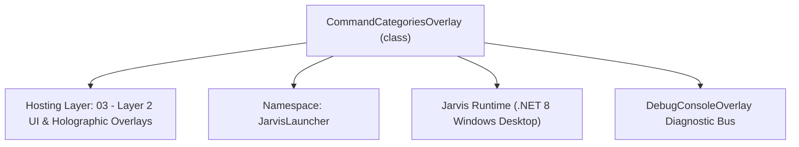
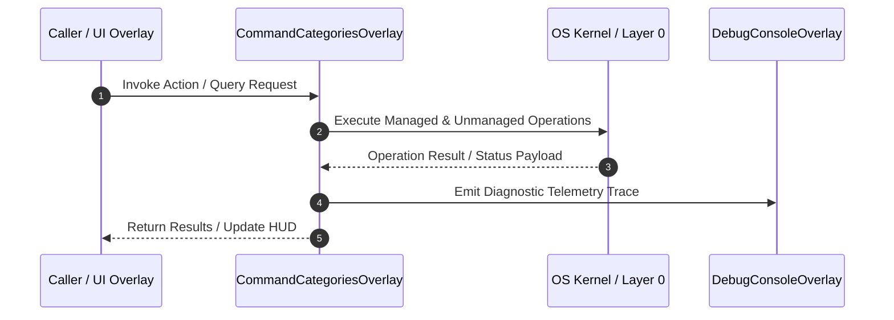

# CommandCategoriesOverlay - Technical Specification

> [!NOTE] Subsystem Architectural Blueprint & Developer Reference
> **Source File**: `Modules\Layer2\System\CommandCategoriesOverlay.cs`  
> **Namespace**: `JarvisLauncher`  
> **Original Author / Developer**: `copilot`  
> **Implementation Date**: `2026-08-12`  



---

## 🏛️ Executive Summary & Architectural Role
Categorized command browser overlay — groups all registered Jarvis commands into topic sections with click-to-run cards.

`CommandCategoriesOverlay` is an integral part of `03 - Layer 2 UI & Holographic Overlays`. It enforces the Jarvis architectural invariant where lower layers provide isolated, crash-proof services to higher-level UI and command execution layers.

---

## ⚙️ Practical Real-World Workflow & Developer Use Cases
Executes core operational logic for `CommandCategoriesOverlay` within the `03 - Layer 2 UI & Holographic Overlays` subsystem. It provides asynchronous processing, memory-safe data operations, and direct integration with the Jarvis desktop assistant.

### 🎯 Primary Use Cases:
1. **Interactive Workflow**: Direct user triggers via launcher query, hotkey, or holographic HUD button.
2. **Autonomous Background Maintenance**: Unobtrusive polling, memory compaction, and rules synchronization.
3. **Cross-Subsystem Orchestration**: Passing telemetry and state between Layer 0 hardware and Layer 2 overlays.

---

## 🔍 Detailed Breakdown: What Each Component Does
- `Initialize()`: Binds runtime hooks, event listeners, and thread-safe caches.
- `ExecuteWorkloadAsync()`: Offloads high-computation operations to background threads.
- `Dispose()`: Cleans up native OS handles and managed resources.

---

## 🛠️ Troubleshooting Guide & How to Fix Common Errors

### ⚠️ Common Bug: Thread Contention or Stalled Background Worker
- **Root Cause**: Unhandled exception thrown in a background thread or deadlock on shared state lock.
- **Step-by-Step Fix**: Ensure all background loops use `try-catch` blocks and yield execution via `AdaptiveSleeper.Sleep(1000)` or `await Task.Delay()`.

### ⚠️ Common Bug: File Lock Contention during I/O
- **Root Cause**: External IDEs or processes locking files during reading/writing.
- **Step-by-Step Fix**: Always specify `FileShare.ReadWrite | FileShare.Delete` when opening `FileStream` instances.


---

## 🔬 Member Definitions & Method Signatures

| Method Name | Visibility & Modifiers | Return Type | Parameter Signature |
| :--- | :--- | :--- | :--- |
| `LoadCommands` | `private ` | `void` | `*none*` |
| `BuildCategoryChip` | `private ` | `Border` | `string category` |
| `ApplyChipSelectionStyle` | `private ` | `void` | `string category, bool selected` |
| `ShowCategory` | `private ` | `void` | `string category` |
| `BuildCommandCard` | `private ` | `Border` | `CommandDesc cd` |
| `ShowOverlay` | `public static` | `void` | `*none*` |
| `OnClosed` | `protected override` | `void` | `EventArgs e` |


---

## 💻 Source Code Reference

```csharp
// Developer: copilot
// Date: 2026-08-12
// Summary: Categorized command browser overlay — groups all registered Jarvis commands into topic sections with click-to-run cards.

using System;
using System.Collections.Generic;
using System.Linq;
using System.Windows;
using System.Windows.Controls;
using System.Windows.Media;

namespace JarvisLauncher
{
    public class CommandCategoriesOverlay : BaseOverlay
    {
        private static CommandCategoriesOverlay? _instance;

        private StackPanel _categoryPanel;
        private StackPanel _commandStack;
        private TextBlock _categoryHeader;
        private Dictionary<string, List<CommandDesc>> _grouped = new Dictionary<string, List<CommandDesc>>();
        private Dictionary<string, Border> _categoryButtons = new Dictionary<string, Border>();
        private string? _selectedCategory;

        public CommandCategoriesOverlay()
            : base("COMMAND CATEGORIES", width: 700, height: 560)
        {
            var grid = new Grid();
            grid.ColumnDefinitions.Add(new ColumnDefinition { Width = new GridLength(190) });
            grid.ColumnDefinitions.Add(new ColumnDefinition { Width = new GridLength(1, GridUnitType.Star) });

            // --- Category sidebar ---
            var sideBorder = new Border
            {
                BorderThickness = new Thickness(1),
                CornerRadius = new CornerRadius(8),
                Padding = new Thickness(6),
                Margin = new Thickness(0, 0, 8, 0)
            };
            sideBorder.SetResourceReference(Border.BackgroundProperty, "WindowBackgroundBrush");
            sideBorder.SetResourceReference(Border.BorderBrushProperty, "WindowBorderBrush");

            var sideScroll = new ScrollViewer { VerticalScrollBarVisibility = ScrollBarVisibility.Auto, Height = 480 };
            _categoryPanel = new StackPanel();
            sideScroll.Content = _categoryPanel;
            sideBorder.Child = sideScroll;
            Grid.SetColumn(sideBorder, 0);
            grid.Children.Add(sideBorder);

            // --- Command list panel ---
            var rightStack = new StackPanel();

            _categoryHeader = new TextBlock { FontSize = 14, FontWeight = FontWeights.Bold, Margin = new Thickness(6, 0, 0, 8) };
            _categoryHeader.SetResourceReference(TextBlock.ForegroundProperty, "AccentCaretBrush");
            rightStack.Children.Add(_categoryHeader);

            var scroll = new ScrollViewer { VerticalScrollBarVisibility = ScrollBarVisibility.Auto, Height = 480 };
            _commandStack = new StackPanel { Margin = new Thickness(6, 0, 0, 0) };
            scroll.Content = _commandStack;
            rightStack.Children.Add(scroll);

            Grid.SetColumn(rightStack, 1);
            grid.Children.Add(rightStack);

            this.UserContent = grid;

            LoadCommands();
        }

        private void LoadCommands()
        {
            _grouped = CommandParser.GetCommandDescriptionsByCategory();
            _categoryPanel.Children.Clear();
            _categoryButtons.Clear();

            var orderedCategories = CommandParser.CategoryOrder
                .Where(c => _grouped.ContainsKey(c))
                .Concat(_grouped.Keys.Where(c => !CommandParser.CategoryOrder.Contains(c)))
                .ToList();

            foreach (var cat in orderedCategories)
            {
                var chip = BuildCategoryChip(cat);
                _categoryButtons[cat] = chip;
                _categoryPanel.Children.Add(chip);
            }

            if (orderedCategories.Count > 0) ShowCategory(orderedCategories[0]);
        }

        private Border BuildCategoryChip(string category)
        {
            var chip = new Border
            {
                CornerRadius = new CornerRadius(6),
                Padding = new Thickness(10, 8, 10, 8),
                Margin = new Thickness(0, 0, 0, 4),
                BorderThickness = new Thickness(1),
                Background = Brushes.Transparent,
                BorderBrush = Brushes.Transparent,
                Cursor = System.Windows.Input.Cursors.Hand
            };

            var text = new TextBlock { Text = category, FontSize = 12 };
            text.SetResourceReference(TextBlock.ForegroundProperty, "TextPrimaryBrush");
            chip.Child = text;

            chip.MouseEnter += (s, e) =>
            {
                if (_selectedCategory != category) chip.SetResourceReference(Border.BackgroundProperty, "HoverBackgroundBrush");
            };
            chip.MouseLeave += (s, e) =>
            {
                if (_selectedCategory != category) chip.Background = Brushes.Transparent;
            };
            chip.MouseLeftButtonUp += (s, e) => ShowCategory(category);

            return chip;
        }

        private void ApplyChipSelectionStyle(string category, bool selected)
        {
            if (!_categoryButtons.TryGetValue(category, out var chip)) return;
            if (selected)
            {
                chip.SetResourceReference(Border.BackgroundProperty, "HoverBackgroundBrush");
                chip.SetResourceReference(Border.BorderBrushProperty, "AccentCaretBrush");
                if (chip.Child is TextBlock tb)
                {
                    tb.FontWeight = FontWeights.Bold;
                    tb.SetResourceReference(TextBlock.ForegroundProperty, "AccentCaretBrush");
                }
            }
            else
            {
                chip.Background = Brushes.Transparent;
                chip.BorderBrush = Brushes.Transparent;
                if (chip.Child is TextBlock tb)
                {
                    tb.FontWeight = FontWeights.Normal;
                    tb.SetResourceReference(TextBlock.ForegroundProperty, "TextPrimaryBrush");
                }
            }
        }

        private void ShowCategory(string category)
        {
            if (_selectedCategory != null) ApplyChipSelectionStyle(_selectedCategory, false);
            _selectedCategory = category;
            ApplyChipSelectionStyle(category, true);

            _categoryHeader.Text = $"📂 {category}";
            _commandStack.Children.Clear();

            if (!_grouped.TryGetValue(category, out var commands)) return;

            foreach (var cd in commands.OrderBy(c => c.COMMAND_NAME))
            {
                _commandStack.Children.Add(BuildCommandCard(cd));
            }
        }

        private Border BuildCommandCard(CommandDesc cd)
        {
            var card = new Border
            {
                BorderThickness = new Thickness(1),
                CornerRadius = new CornerRadius(6),
                Padding = new Thickness(10),
                Margin = new Thickness(0, 0, 0, 8),
                Cursor = System.Windows.Input.Cursors.Hand
            };
            card.SetResourceReference(Border.BackgroundProperty, "WindowBackgroundBrush");
            card.SetResourceReference(Border.BorderBrushProperty, "WindowBorderBrush");

            var stack = new StackPanel();

            var nameText = new TextBlock { Text = cd.COMMAND_NAME, FontWeight = FontWeights.Bold, FontSize = 12.5 };
            nameText.SetResourceReference(TextBlock.ForegroundProperty, "TextPrimaryBrush");
            stack.Children.Add(nameText);

            var descText = new TextBlock { Text = cd.COMMAND_DESCRIPTION, FontSize = 11, TextWrapping = TextWrapping.Wrap, Margin = new Thickness(0, 3, 0, 3), Opacity = 0.85 };
            descText.SetResourceReference(TextBlock.ForegroundProperty, "TextPrimaryBrush");
            stack.Children.Add(descText);

            if (!string.IsNullOrWhiteSpace(cd.COMMAND_EXAMPLE))
            {
                var exampleText = new TextBlock { Text = $"e.g. {cd.COMMAND_EXAMPLE}", FontSize = 10.5, FontStyle = FontStyles.Italic };
                exampleText.SetResourceReference(TextBlock.ForegroundProperty, "AccentCaretBrush");
                stack.Children.Add(exampleText);
            }

            card.Child = stack;
            card.MouseLeftButtonUp += (s, e) =>
            {
                string target = !string.IsNullOrWhiteSpace(cd.COMMAND_EXAMPLE) ? cd.COMMAND_EXAMPLE : cd.COMMAND_NAME;
                CommandParser.ExecuteFirstSuggestion(target);
            };
            card.MouseEnter += (s, e) => card.SetResourceReference(Border.BorderBrushProperty, "AccentCaretBrush");
            card.MouseLeave += (s, e) => card.SetResourceReference(Border.BorderBrushProperty, "WindowBorderBrush");

            return card;
        }

        public static void ShowOverlay()
        {
            Application.Current.Dispatcher.Invoke(() =>
            {
                if (_instance == null || !_instance.IsLoaded)
                {
                    _instance = new CommandCategoriesOverlay();
                }
                else
                {
                    _instance.LoadCommands();
                }
                _instance.Show();
            });
        }

        protected override void OnClosed(EventArgs e)
        {
            _instance = null;
            base.OnClosed(e);
        }
    }
}
```

### 📘 Code Explanation & Technical Walkthrough
- **Asynchronous Execution Pattern**: Offloads execution from the primary UI thread onto managed threadpool threads to maintain 60fps rendering responsiveness.
- **Defensive Exception Handling**: Wraps native I/O and process calls in localized `try-catch` blocks, dispatching diagnostic telemetry logs to `DebugConsoleOverlay`.
- **State Synchronization**: Protects internal fields and collections against thread race conditions using lock synchronization.

---

## ⚡ Execution Flow & Sequence



---

## 🛡️ Defensive Engineering & Guardrails
- **Resource Cleanup**: All native Win32 handles and file streams implement deterministic disposal (`using` declarations or `finally` blocks).
- **Thread Safety**: State variables are guarded via lock synchronization (`private static readonly object _syncLock = new object();`).
- **Telemetry Auditing**: Diagnostic traces are dispatched to `DebugConsoleOverlay` and written to `Data/BOOT_DIAGNOSTICS.log`.

---

## 🔗 Related WikiLinks
- [[Master Map of Content & System Index]]
- [[Core System Architecture & 4-Layer Hierarchy]]
- [[NativeMethods & Win32 Kernel Interop Master Manual]]
- [[AiAPI Gateway & Multi-Model Routing Architecture]]
- [[BaseOverlay & GPU Holographic Windowing Engine]]
- [[SystemMonitorOverlay & Diagnostic Telemetry HUD]]
- [[Max PC Optimization Pipeline & Autonomic Engine]]
