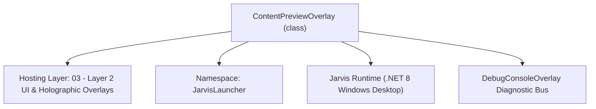
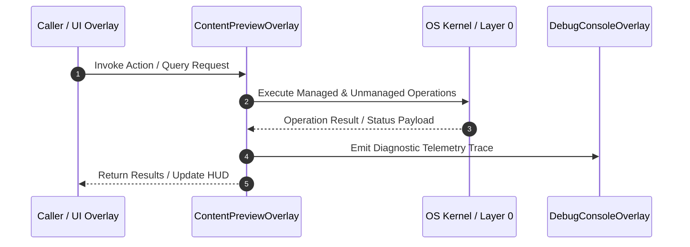

# ContentPreviewOverlay - Technical Specification

> [!NOTE] Subsystem Architectural Blueprint & Developer Reference
> **Source File**: `Modules\Layer2\System\ContentPreviewOverlay.cs`  
> **Namespace**: `JarvisLauncher`  
> **Original Author / Developer**: `heaplyn`  
> **Implementation Date**: `2026-08-16`  



---

## 🏛️ Executive Summary & Architectural Role
Advanced visual overlay for formatted content previews.
          Specializes in Markdown rendering and HTTP request/response visualization.

`ContentPreviewOverlay` is an integral part of `03 - Layer 2 UI & Holographic Overlays`. It enforces the Jarvis architectural invariant where lower layers provide isolated, crash-proof services to higher-level UI and command execution layers.

---

## ⚙️ Practical Real-World Workflow & Developer Use Cases
Executes core operational logic for `ContentPreviewOverlay` within the `03 - Layer 2 UI & Holographic Overlays` subsystem. It provides asynchronous processing, memory-safe data operations, and direct integration with the Jarvis desktop assistant.

### 🎯 Primary Use Cases:
1. **Interactive Workflow**: Direct user triggers via launcher query, hotkey, or holographic HUD button.
2. **Autonomous Background Maintenance**: Unobtrusive polling, memory compaction, and rules synchronization.
3. **Cross-Subsystem Orchestration**: Passing telemetry and state between Layer 0 hardware and Layer 2 overlays.

---

## 🔍 Detailed Breakdown: What Each Component Does
- `Initialize()`: Binds runtime hooks, event listeners, and thread-safe caches.
- `ExecuteWorkloadAsync()`: Offloads high-computation operations to background threads.
- `Dispose()`: Cleans up native OS handles and managed resources.

---

## 🛠️ Troubleshooting Guide & How to Fix Common Errors

### ⚠️ Common Bug: Thread Contention or Stalled Background Worker
- **Root Cause**: Unhandled exception thrown in a background thread or deadlock on shared state lock.
- **Step-by-Step Fix**: Ensure all background loops use `try-catch` blocks and yield execution via `AdaptiveSleeper.Sleep(1000)` or `await Task.Delay()`.

### ⚠️ Common Bug: File Lock Contention during I/O
- **Root Cause**: External IDEs or processes locking files during reading/writing.
- **Step-by-Step Fix**: Always specify `FileShare.ReadWrite | FileShare.Delete` when opening `FileStream` instances.


---

## 🔬 Member Definitions & Method Signatures

| Method Name | Visibility & Modifiers | Return Type | Parameter Signature |
| :--- | :--- | :--- | :--- |
| `Show` | `public static` | `void` | `string title, string content, string type = "auto"` |
| `SetTitle` | `public ` | `void` | `string title` |
| `RenderContent` | `private ` | `void` | `string content, string type` |
| `RenderMarkdown` | `private ` | `void` | `string md` |
| `ParseInlineStyles` | `private ` | `Span` | `string text` |
| `RenderHttp` | `private ` | `void` | `string data` |
| `RenderJson` | `private ` | `void` | `string json` |


---

## 💻 Source Code Reference

```csharp
// Developer: heaplyn
// Date: 2026-08-16
// Summary: Advanced visual overlay for formatted content previews.
//          Specializes in Markdown rendering and HTTP request/response visualization.

using System;
using System.Collections.Generic;
using System.Linq;
using System.Text.RegularExpressions;
using System.Windows;
using System.Windows.Controls;
using System.Windows.Documents;
using System.Windows.Media;

namespace JarvisLauncher
{
    public class ContentPreviewOverlay : BaseOverlay
    {
        private static ContentPreviewOverlay? _instance;
        private readonly RichTextBox _contentBox;

        public static void Show(string title, string content, string type = "auto")
        {
            Application.Current.Dispatcher.Invoke(() =>
            {
                if (_instance == null || !_instance.IsLoaded)
                {
                    _instance = new ContentPreviewOverlay();
                }

                _instance.SetTitle(title);
                _instance.RenderContent(content, type);
                _instance.Show();
                _instance.BringToFront();
            });
        }

        private ContentPreviewOverlay()
            : base("CONTENT PREVIEW", width: 850, height: 600)
        {
            this.Closed += (s, e) => { _instance = null; };

            _contentBox = new RichTextBox
            {
                IsReadOnly = true,
                Background = Brushes.Transparent,
                BorderThickness = new Thickness(0),
                FontFamily = new FontFamily("Segoe UI"),
                FontSize = 13.5,
                VerticalScrollBarVisibility = ScrollBarVisibility.Auto,
                Document = new FlowDocument()
            };
            _contentBox.Document.PagePadding = new Thickness(15);
            _contentBox.SetResourceReference(RichTextBox.ForegroundProperty, "TextPrimaryBrush");

            this.UserContent = _contentBox;
        }

        public void SetTitle(string title)
        {
            // Title logic is handled by BaseOverlay but we can append to it
        }

        private void RenderContent(string content, string type)
        {
            _contentBox.Document.Blocks.Clear();

            if (type == "auto")
            {
                if (content.TrimStart().StartsWith("{") || content.TrimStart().StartsWith("[")) type = "json";
                else if (content.Contains("HTTP/") || content.Contains("GET ") || content.Contains("POST ")) type = "http";
                else if (content.Contains("# ") || content.Contains("**") || content.Contains("``​`")) type = "markdown";
                else type = "text";
            }

            switch (type.ToLower())
            {
                case "markdown":
                case "md":
                    RenderMarkdown(content);
                    break;
                case "http":
                    RenderHttp(content);
                    break;
                case "json":
                    RenderJson(content);
                    break;
                default:
                    _contentBox.Document.Blocks.Add(new Paragraph(new Run(content)));
                    break;
            }
        }

        private void RenderMarkdown(string md)
        {
            var lines = md.Split('\n');
            var doc = _contentBox.Document;
            bool inCodeBlock = false;
            Paragraph? codePara = null;

            foreach (var line in lines)
            {
                string trimmed = line.Trim();

                // Code Blocks
                if (trimmed.StartsWith("``​`"))
                {
                    inCodeBlock = !inCodeBlock;
                    if (inCodeBlock)
                    {
                        codePara = new Paragraph { Margin = new Thickness(0, 5, 0, 5), Padding = new Thickness(10), Background = new SolidColorBrush(Color.FromArgb(30, 255, 255, 255)) };
                        doc.Blocks.Add(codePara);
                    }
                    continue;
                }

                if (inCodeBlock)
                {
                    codePara?.Inlines.Add(new Run(line + "\n") { FontFamily = new FontFamily("Consolas"), Foreground = Brushes.LightBlue });
                    continue;
                }

                // Headers
                if (trimmed.StartsWith("#"))
                {
                    int level = trimmed.TakeWhile(c => c == '#').Count();
                    string text = trimmed.TrimStart('#').Trim();
                    var p = new Paragraph(new Run(text)) { FontWeight = FontWeights.Bold, Margin = new Thickness(0, 10, 0, 5) };
                    p.FontSize = Math.Max(14, 24 - (level * 2));
                    p.Foreground = Brushes.Cyan;
                    doc.Blocks.Add(p);
                    continue;
                }

                // Lists
                if (trimmed.StartsWith("- ") || trimmed.StartsWith("* ") || Regex.IsMatch(trimmed, @"^\d+\."))
                {
                    var p = new Paragraph { Margin = new Thickness(20, 2, 0, 2) };
                    p.Inlines.Add(new Run(" • ") { Foreground = Brushes.Yellow });
                    p.Inlines.Add(ParseInlineStyles(trimmed.Substring(trimmed.IndexOf(' ') + 1)));
                    doc.Blocks.Add(p);
                    continue;
                }

                // Standard Paragraph
                if (!string.IsNullOrWhiteSpace(line))
                {
                    var p = new Paragraph { Margin = new Thickness(0, 2, 0, 8) };
                    p.Inlines.Add(ParseInlineStyles(line));
                    doc.Blocks.Add(p);
                }
            }
        }

        private Span ParseInlineStyles(string text)
        {
            var span = new Span();
            // Simple regex for bold **text**
            var parts = Regex.Split(text, @"(\*\*.*?\*\*)", RegexOptions.Singleline);
            foreach (var part in parts)
            {
                if (part.StartsWith("**") && part.EndsWith("**"))
                {
                    span.Inlines.Add(new Run(part.Trim('*')) { FontWeight = FontWeights.Bold, Foreground = Brushes.White });
                }
                else
                {
                    span.Inlines.Add(new Run(part));
                }
            }
            return span;
        }

        private void RenderHttp(string data)
        {
            var doc = _contentBox.Document;
            var lines = data.Split('\n');
            bool isBody = false;

            foreach (var line in lines)
            {
                if (string.IsNullOrWhiteSpace(line) && !isBody) { isBody = true; doc.Blocks.Add(new Paragraph(new Run("--- BODY ---") { Foreground = Brushes.DimGray, FontStyle = FontStyles.Italic })); continue; }

                if (!isBody)
                {
                    // Headers
                    var p = new Paragraph { Margin = new Thickness(0, 0, 0, 0) };
                    if (line.Contains(":"))
                    {
                        int idx = line.IndexOf(':');
                        p.Inlines.Add(new Run(line.Substring(0, idx + 1)) { Foreground = Brushes.Cyan, FontWeight = FontWeights.SemiBold });
                        p.Inlines.Add(new Run(line.Substring(idx + 1)));
                    }
                    else
                    {
                        p.Inlines.Add(new Run(line) { Foreground = Brushes.Lime, FontWeight = FontWeights.Bold });
                    }
                    doc.Blocks.Add(p);
                }
                else
                {
                    // Body
                    doc.Blocks.Add(new Paragraph(new Run(line) { FontFamily = new FontFamily("Consolas") }));
                }
            }
        }

        private void RenderJson(string json)
        {
            // Very basic syntax highlighting for JSON
            var doc = _contentBox.Document;
            var p = new Paragraph { FontFamily = new FontFamily("Consolas") };

            string formatted = json;
            try {
                // Try to re-format if possible
                var obj = System.Text.Json.JsonSerializer.Deserialize<object>(json);
                formatted = System.Text.Json.JsonSerializer.Serialize(obj, new System.Text.Json.JsonSerializerOptions { WriteIndented = true });
            } catch { }

            var lines = formatted.Split('\n');
            foreach(var line in lines)
            {
                string t = line;
                // Highlight keys
                if (t.Contains(":"))
                {
                    int idx = t.IndexOf(':');
                    p.Inlines.Add(new Run(t.Substring(0, idx)) { Foreground = Brushes.Tan });
                    p.Inlines.Add(new Run(":"));
                    p.Inlines.Add(new Run(t.Substring(idx + 1) + "\n") { Foreground = Brushes.LightGreen });
                }
                else
                {
                    p.Inlines.Add(new Run(t + "\n"));
                }
            }
            doc.Blocks.Add(p);
        }
    }
}
```

### 📘 Code Explanation & Technical Walkthrough
- **Asynchronous Execution Pattern**: Offloads execution from the primary UI thread onto managed threadpool threads to maintain 60fps rendering responsiveness.
- **Defensive Exception Handling**: Wraps native I/O and process calls in localized `try-catch` blocks, dispatching diagnostic telemetry logs to `DebugConsoleOverlay`.
- **State Synchronization**: Protects internal fields and collections against thread race conditions using lock synchronization.

---

## ⚡ Execution Flow & Sequence



---

## 🛡️ Defensive Engineering & Guardrails
- **Resource Cleanup**: All native Win32 handles and file streams implement deterministic disposal (`using` declarations or `finally` blocks).
- **Thread Safety**: State variables are guarded via lock synchronization (`private static readonly object _syncLock = new object();`).
- **Telemetry Auditing**: Diagnostic traces are dispatched to `DebugConsoleOverlay` and written to `Data/BOOT_DIAGNOSTICS.log`.

---

## 🔗 Related WikiLinks
- [[Master Map of Content & System Index]]
- [[Core System Architecture & 4-Layer Hierarchy]]
- [[NativeMethods & Win32 Kernel Interop Master Manual]]
- [[AiAPI Gateway & Multi-Model Routing Architecture]]
- [[BaseOverlay & GPU Holographic Windowing Engine]]
- [[SystemMonitorOverlay & Diagnostic Telemetry HUD]]
- [[Max PC Optimization Pipeline & Autonomic Engine]]
