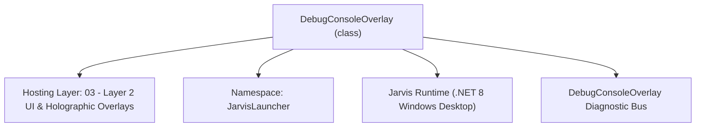
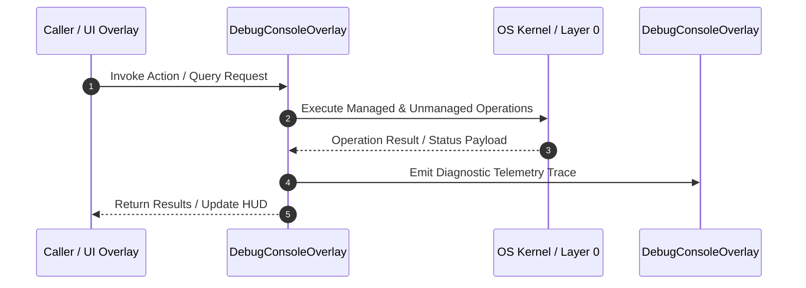

# DebugConsoleOverlay - Technical Specification

> [!NOTE] Subsystem Architectural Blueprint & Developer Reference
> **Source File**: `Modules\Layer2\System\DebugConsoleOverlay.cs`  
> **Namespace**: `JarvisLauncher`  
> **Original Author / Developer**: `heaplyn`  
> **Implementation Date**: `2026-08-18`  



---

## 🏛️ Executive Summary & Architectural Role
Advanced real-time Debug Console overlay for monitoring internal Jarvis events.
          Hardened logging to be thread-safe and non-blocking.
          Fixed UI deadlock by removing synchronous dispatcher calls from log path.

`DebugConsoleOverlay` is an integral part of `03 - Layer 2 UI & Holographic Overlays`. It enforces the Jarvis architectural invariant where lower layers provide isolated, crash-proof services to higher-level UI and command execution layers.

---

## ⚙️ Practical Real-World Workflow & Developer Use Cases
Executes core operational logic for `DebugConsoleOverlay` within the `03 - Layer 2 UI & Holographic Overlays` subsystem. It provides asynchronous processing, memory-safe data operations, and direct integration with the Jarvis desktop assistant.

### 🎯 Primary Use Cases:
1. **Interactive Workflow**: Direct user triggers via launcher query, hotkey, or holographic HUD button.
2. **Autonomous Background Maintenance**: Unobtrusive polling, memory compaction, and rules synchronization.
3. **Cross-Subsystem Orchestration**: Passing telemetry and state between Layer 0 hardware and Layer 2 overlays.

---

## 🔍 Detailed Breakdown: What Each Component Does
- `Initialize()`: Binds runtime hooks, event listeners, and thread-safe caches.
- `ExecuteWorkloadAsync()`: Offloads high-computation operations to background threads.
- `Dispose()`: Cleans up native OS handles and managed resources.

---

## 🛠️ Troubleshooting Guide & How to Fix Common Errors

### ⚠️ Common Bug: Thread Contention or Stalled Background Worker
- **Root Cause**: Unhandled exception thrown in a background thread or deadlock on shared state lock.
- **Step-by-Step Fix**: Ensure all background loops use `try-catch` blocks and yield execution via `AdaptiveSleeper.Sleep(1000)` or `await Task.Delay()`.

### ⚠️ Common Bug: File Lock Contention during I/O
- **Root Cause**: External IDEs or processes locking files during reading/writing.
- **Step-by-Step Fix**: Always specify `FileShare.ReadWrite | FileShare.Delete` when opening `FileStream` instances.


---

## 🔬 Member Definitions & Method Signatures

| Method Name | Visibility & Modifiers | Return Type | Parameter Signature |
| :--- | :--- | :--- | :--- |
| `ShowOverlay` | `public static` | `void` | `*none*` |
| `ShowConsole` | `public static` | `void` | `*none*` |
| `Log` | `public static` | `void` | `string category, string message` |
| `LogVerbose` | `public static` | `void` | `string category, string message, bool isMinimal = false` |
| `LogInternal` | `private static` | `void` | `string category, string message, bool isVerbose` |
| `RequestUpdate` | `private ` | `void` | `*none*` |
| `ExecuteDebugCommand` | `private ` | `void` | `*none*` |
| `UpdateView` | `private ` | `void` | `*none*` |


---

## 💻 Source Code Reference

```csharp
// Developer: heaplyn
// Date: 2026-08-18
// Summary: Advanced real-time Debug Console overlay for monitoring internal Jarvis events.
//          Hardened logging to be thread-safe and non-blocking.
//          Fixed UI deadlock by removing synchronous dispatcher calls from log path.

using System;
using System.IO;
using System.Linq;
using System.Text;
using System.Windows;
using System.Windows.Controls;
using System.Windows.Documents;
using System.Windows.Media;
using System.Windows.Threading;
using System.Collections.Generic;
using System.Diagnostics;

namespace JarvisLauncher
{
    public class DebugConsoleOverlay : BaseOverlay
    {
        private static DebugConsoleOverlay? _instance;
        private static readonly List<LogEntry> _history = new List<LogEntry>();
        private static readonly int _maxHistory = 2000;
        private static readonly object _lock = new object();
        private static string LogDir => Path.Combine(PathHandler.GetDataDirectory(), "Logs", "Debug");

        private readonly RichTextBox _consoleBox;
        private readonly TextBlock _statusLabel;
        private readonly TextBox _searchBox;
        private readonly ComboBox _categoryFilterCombo;
        private readonly TextBox _commandInputBox;

        private class LogEntry
        {
            public string Category { get; set; } = string.Empty;
            public string Message { get; set; } = string.Empty;
            public string Timestamp { get; set; } = string.Empty;
            public bool IsVerbose { get; set; }
        }

        public static void ShowOverlay()
        {
            Application.Current.Dispatcher.Invoke(() => {
                if (_instance == null || !_instance.IsLoaded) _instance = new DebugConsoleOverlay();
                _instance.Show(); _instance.BringToFront();
            });
        }

        public static void ShowConsole() => ShowOverlay();

        public static void Log(string category, string message) => LogInternal(category, message, false);
        public static void LogVerbose(string category, string message, bool isMinimal = false) => LogInternal(category, message, true);

        private static void LogInternal(string category, string message, bool isVerbose)
        {
            string ts = DateTime.Now.ToString("HH:mm:ss.fff");
            string upperCat = category.ToUpper();

            // 1. Immediate File Log (Thread-safe, date-split)
            try {
                if (!Directory.Exists(LogDir)) Directory.CreateDirectory(LogDir);
                string logPath = Path.Combine(LogDir, $"Debug_{DateTime.Now:yyyy-MM-dd}.log");
                lock (_lock) {
                    File.AppendAllText(logPath, $"[{ts}] {(isVerbose ? "[VERBOSE] " : "")}[{upperCat}] {message}\n");
                }
            } catch { }

            // 2. Dispatch to UI for Visual Console (Throttled)
            var entry = new LogEntry { Category = category, Message = message, Timestamp = ts, IsVerbose = isVerbose };
            lock (_history) {
                _history.Add(entry);
                if (_history.Count > _maxHistory) _history.RemoveAt(0);
            }

            if (_instance != null) {
                _instance.RequestUpdate();
            }
        }

        private bool _updateRequested = false;
        private void RequestUpdate() {
            if (_updateRequested) return;
            _updateRequested = true;
            Application.Current?.Dispatcher?.BeginInvoke(new Action(() => {
                _updateRequested = false;
                UpdateView();
            }), DispatcherPriority.Background);
        }

        private DebugConsoleOverlay() : base("🛠️ JARVIS DEBUG & DIAGNOSTICS", width: 850, height: 650)
        {
            _instance = this;
            this.Closed += (s, e) => { _instance = null; };
            var mainGrid = new Grid { Margin = new Thickness(12) };
            mainGrid.RowDefinitions.Add(new RowDefinition { Height = GridLength.Auto });
            mainGrid.RowDefinitions.Add(new RowDefinition { Height = new GridLength(1, GridUnitType.Star) });
            mainGrid.RowDefinitions.Add(new RowDefinition { Height = GridLength.Auto });

            var filterGrid = new Grid { Margin = new Thickness(0, 0, 0, 10) };
            filterGrid.ColumnDefinitions.Add(new ColumnDefinition { Width = GridLength.Auto });
            filterGrid.ColumnDefinitions.Add(new ColumnDefinition { Width = new GridLength(180) });
            filterGrid.ColumnDefinitions.Add(new ColumnDefinition { Width = GridLength.Auto });
            filterGrid.ColumnDefinitions.Add(new ColumnDefinition { Width = new GridLength(130) });
            filterGrid.ColumnDefinitions.Add(new ColumnDefinition { Width = new GridLength(1, GridUnitType.Star) });

            filterGrid.Children.Add(new TextBlock { Text = "🔍 Search:", VerticalAlignment = VerticalAlignment.Center, Margin = new Thickness(0,0,8,0) });
            _searchBox = new TextBox { Height = 24, Margin = new Thickness(55,0,0,0) };
            _searchBox.TextChanged += (s, e) => UpdateView();
            Grid.SetColumn(_searchBox, 1); filterGrid.Children.Add(_searchBox);

            _categoryFilterCombo = new ComboBox { Height = 24, Margin = new Thickness(20,0,0,0), Width = 120 };
            foreach (var c in new[] { "ALL", "AI", "ACTION", "BRIDGE", "ERROR", "SYSTEM", "NEURAL" }) _categoryFilterCombo.Items.Add(c);
            _categoryFilterCombo.SelectedIndex = 0; _categoryFilterCombo.SelectionChanged += (s, e) => UpdateView();
            Grid.SetColumn(_categoryFilterCombo, 3); filterGrid.Children.Add(_categoryFilterCombo);

            _statusLabel = new TextBlock { HorizontalAlignment = HorizontalAlignment.Right, VerticalAlignment = VerticalAlignment.Center, FontSize = 10, Opacity = 0.7 };
            Grid.SetColumn(_statusLabel, 4); filterGrid.Children.Add(_statusLabel);
            Grid.SetRow(filterGrid, 0); mainGrid.Children.Add(filterGrid);

            _consoleBox = new RichTextBox { IsReadOnly = true, Background = new SolidColorBrush(Color.FromArgb(230, 10, 8, 16)), BorderThickness = new Thickness(1), BorderBrush = Brushes.DimGray, FontFamily = new FontFamily("Consolas"), FontSize = 11, VerticalScrollBarVisibility = ScrollBarVisibility.Auto };
            _consoleBox.Document.PagePadding = new Thickness(6);
            Grid.SetRow(_consoleBox, 1); mainGrid.Children.Add(_consoleBox);

            var replGrid = new Grid { Margin = new Thickness(0, 10, 0, 0) };
            replGrid.ColumnDefinitions.Add(new ColumnDefinition { Width = new GridLength(1, GridUnitType.Star) });
            replGrid.ColumnDefinitions.Add(new ColumnDefinition { Width = GridLength.Auto });
            replGrid.ColumnDefinitions.Add(new ColumnDefinition { Width = GridLength.Auto });

            _commandInputBox = new TextBox { Height = 26, FontFamily = new FontFamily("Consolas"), VerticalContentAlignment = VerticalAlignment.Center, Padding = new Thickness(5,0,5,0), Background = new SolidColorBrush(Color.FromArgb(40, 255,255,255)), Foreground = Brushes.White, BorderBrush = Brushes.DimGray };
            _commandInputBox.PreviewKeyDown += (s, e) => { if (e.Key == System.Windows.Input.Key.Enter) { ExecuteDebugCommand(); e.Handled = true; } };
            Grid.SetColumn(_commandInputBox, 0); replGrid.Children.Add(_commandInputBox);

            var clearBtn = new Button { Content = "🧹 Clear", Width = 80, Margin = new Thickness(8,0,0,0) };
            clearBtn.Click += (s, e) => { lock (_history) _history.Clear(); UpdateView(); };
            Grid.SetColumn(clearBtn, 1); replGrid.Children.Add(clearBtn);

            var folderBtn = new Button { Content = "📂 Logs", Width = 80, Margin = new Thickness(8,0,0,0) };
            folderBtn.Click += (s, e) => { try { if (!Directory.Exists(LogDir)) Directory.CreateDirectory(LogDir); Process.Start("explorer.exe", LogDir); } catch { } };
            Grid.SetColumn(folderBtn, 2); replGrid.Children.Add(folderBtn);

            Grid.SetRow(replGrid, 2); mainGrid.Children.Add(replGrid);
            this.UserContent = mainGrid;

            var timer = new DispatcherTimer { Interval = TimeSpan.FromSeconds(2) };
            timer.Tick += (s, e) => { _statusLabel.Text = $"Mem: {GC.GetTotalMemory(false) / 1024 / 1024}MB | History: {_history.Count}"; };
            timer.Start();

            UpdateView();
        }

        private void ExecuteDebugCommand() {
            string cmd = _commandInputBox.Text.Trim(); if (string.IsNullOrEmpty(cmd)) return;
            _commandInputBox.Text = ""; Log("Action", "> " + cmd);
            CommandParser.ExecuteFirstSuggestion(cmd);
        }

        private void UpdateView() {
            if (_consoleBox == null) return;
            string filter = _searchBox?.Text.ToLower() ?? "";
            string catFilter = _categoryFilterCombo?.SelectedItem as string ?? "ALL";

            _consoleBox.Document.Blocks.Clear();
            var p = new Paragraph();

            lock (_history) {
                foreach (var entry in _history.TakeLast(500)) {
                    string upperCat = entry.Category.ToUpper();
                    if (catFilter != "ALL" && !upperCat.Contains(catFilter)) continue;
                    if (!string.IsNullOrEmpty(filter) && !entry.Message.ToLower().Contains(filter)) continue;

                    Brush col = entry.IsVerbose ? Brushes.Gray : Brushes.White;
                    if (upperCat.Contains("ERROR") || upperCat.Contains("FAIL") || upperCat.Contains("FAULT")) col = Brushes.Tomato;
                    else if (upperCat.Contains("AI") || upperCat.Contains("NEURAL")) col = Brushes.SpringGreen;
                    else if (upperCat.Contains("ACTION")) col = Brushes.Lime;
                    else if (upperCat.Contains("BRIDGE")) col = Brushes.Plum;

                    p.Inlines.Add(new Run($"[{entry.Timestamp}] ") { Foreground = Brushes.DimGray });
                    p.Inlines.Add(new Run($"[{upperCat}] ") { Foreground = col, FontWeight = FontWeights.Bold });
                    p.Inlines.Add(new Run(entry.Message + "\n") { Foreground = col });
                }
            }
            _consoleBox.Document.Blocks.Add(p); _consoleBox.ScrollToEnd();
        }
    }
}
```

### 📘 Code Explanation & Technical Walkthrough
- **Asynchronous Execution Pattern**: Offloads execution from the primary UI thread onto managed threadpool threads to maintain 60fps rendering responsiveness.
- **Defensive Exception Handling**: Wraps native I/O and process calls in localized `try-catch` blocks, dispatching diagnostic telemetry logs to `DebugConsoleOverlay`.
- **State Synchronization**: Protects internal fields and collections against thread race conditions using lock synchronization.

---

## ⚡ Execution Flow & Sequence



---

## 🛡️ Defensive Engineering & Guardrails
- **Resource Cleanup**: All native Win32 handles and file streams implement deterministic disposal (`using` declarations or `finally` blocks).
- **Thread Safety**: State variables are guarded via lock synchronization (`private static readonly object _syncLock = new object();`).
- **Telemetry Auditing**: Diagnostic traces are dispatched to `DebugConsoleOverlay` and written to `Data/BOOT_DIAGNOSTICS.log`.

---

## 🔗 Related WikiLinks
- [[Master Map of Content & System Index]]
- [[Core System Architecture & 4-Layer Hierarchy]]
- [[NativeMethods & Win32 Kernel Interop Master Manual]]
- [[AiAPI Gateway & Multi-Model Routing Architecture]]
- [[BaseOverlay & GPU Holographic Windowing Engine]]
- [[SystemMonitorOverlay & Diagnostic Telemetry HUD]]
- [[Max PC Optimization Pipeline & Autonomic Engine]]
