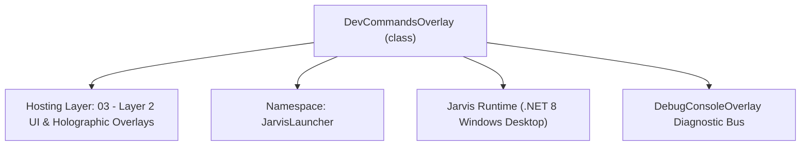
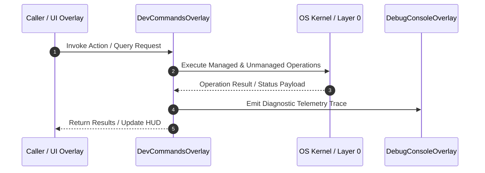

# DevCommandsOverlay - Technical Specification

> [!NOTE] Subsystem Architectural Blueprint & Developer Reference
> **Source File**: `Modules\Layer2\Dev\DevCommandsOverlay.cs`  
> **Namespace**: `JarvisLauncher`  
> **Original Author / Developer**: `heaplyn`  
> **Implementation Date**: `2026-08-20`  



---

## 🏛️ Executive Summary & Architectural Role
Interactive Glassmorphic Developer Command Deck overlay.
          Allows quick clipboard copying or PowerShell direct execution of common programming commands.

`DevCommandsOverlay` is an integral part of `03 - Layer 2 UI & Holographic Overlays`. It enforces the Jarvis architectural invariant where lower layers provide isolated, crash-proof services to higher-level UI and command execution layers.

---

## ⚙️ Practical Real-World Workflow & Developer Use Cases
Executes core operational logic for `DevCommandsOverlay` within the `03 - Layer 2 UI & Holographic Overlays` subsystem. It provides asynchronous processing, memory-safe data operations, and direct integration with the Jarvis desktop assistant.

### 🎯 Primary Use Cases:
1. **Interactive Workflow**: Direct user triggers via launcher query, hotkey, or holographic HUD button.
2. **Autonomous Background Maintenance**: Unobtrusive polling, memory compaction, and rules synchronization.
3. **Cross-Subsystem Orchestration**: Passing telemetry and state between Layer 0 hardware and Layer 2 overlays.

---

## 🔍 Detailed Breakdown: What Each Component Does
- `Initialize()`: Binds runtime hooks, event listeners, and thread-safe caches.
- `ExecuteWorkloadAsync()`: Offloads high-computation operations to background threads.
- `Dispose()`: Cleans up native OS handles and managed resources.

---

## 🛠️ Troubleshooting Guide & How to Fix Common Errors

### ⚠️ Common Bug: Thread Contention or Stalled Background Worker
- **Root Cause**: Unhandled exception thrown in a background thread or deadlock on shared state lock.
- **Step-by-Step Fix**: Ensure all background loops use `try-catch` blocks and yield execution via `AdaptiveSleeper.Sleep(1000)` or `await Task.Delay()`.

### ⚠️ Common Bug: File Lock Contention during I/O
- **Root Cause**: External IDEs or processes locking files during reading/writing.
- **Step-by-Step Fix**: Always specify `FileShare.ReadWrite | FileShare.Delete` when opening `FileStream` instances.


---

## 🔬 Member Definitions & Method Signatures

| Method Name | Visibility & Modifiers | Return Type | Parameter Signature |
| :--- | :--- | :--- | :--- |
| `Open` | `public static` | `void` | `*none*` |
| `RenderCommands` | `private ` | `void` | `*none*` |
| `CreateCommandRow` | `private ` | `UIElement` | `DevCommand cmd` |


---

## 💻 Source Code Reference

```csharp
// Developer: heaplyn
// Date: 2026-08-20
// Summary: Interactive Glassmorphic Developer Command Deck overlay.
//          Allows quick clipboard copying or PowerShell direct execution of common programming commands.

using System;
using System.Collections.Generic;
using System.IO;
using System.Linq;
using System.Threading.Tasks;
using System.Windows;
using System.Windows.Controls;
using System.Windows.Input;
using System.Windows.Media;

namespace JarvisLauncher
{
    public class DevCommandsOverlay : BaseOverlay
    {
        private static DevCommandsOverlay? _instance;

        private readonly ListBox _categoryList;
        private readonly StackPanel _commandsPanel;
        private readonly TextBox _searchBox;
        private string _activeCategory = "All";
        private string _searchQuery = "";

        public class DevCommand
        {
            public string Title { get; set; } = "";
            public string CommandText { get; set; } = "";
            public string Category { get; set; } = "";
            public string Description { get; set; } = "";
        }

        private static readonly List<DevCommand> DefaultCommands = new List<DevCommand>
        {
            // Git
            new DevCommand { Title = "Git Status", CommandText = "git status", Category = "Git", Description = "Check modified and untracked files" },
            new DevCommand { Title = "Git Pull", CommandText = "git pull", Category = "Git", Description = "Fetch and merge changes from remote" },
            new DevCommand { Title = "Git Push", CommandText = "git push", Category = "Git", Description = "Upload local commits to remote" },
            new DevCommand { Title = "Git Commit Quick", CommandText = "git add . && git commit -m \"Quick save\"", Category = "Git", Description = "Add all and commit changes" },
            new DevCommand { Title = "Git Log One-Line", CommandText = "git log --oneline -n 10", Category = "Git", Description = "Show last 10 commits on one line" },
            new DevCommand { Title = "Git Reset Hard", CommandText = "git reset --hard HEAD", Category = "Git", Description = "Discard all uncommitted changes" },
            new DevCommand { Title = "Git Clean Force", CommandText = "git clean -fd", Category = "Git", Description = "Remove untracked files and directories" },

            // Docker
            new DevCommand { Title = "Docker List Containers", CommandText = "docker ps", Category = "Docker", Description = "List running docker containers" },
            new DevCommand { Title = "Docker List All", CommandText = "docker ps -a", Category = "Docker", Description = "List all containers (running & stopped)" },
            new DevCommand { Title = "Docker Images", CommandText = "docker images", Category = "Docker", Description = "List locally downloaded images" },
            new DevCommand { Title = "Docker Compose Up", CommandText = "docker-compose up -d", Category = "Docker", Description = "Build and run containers in background" },
            new DevCommand { Title = "Docker Compose Down", CommandText = "docker-compose down", Category = "Docker", Description = "Stop and remove compose containers" },
            new DevCommand { Title = "Docker System Prune", CommandText = "docker system prune -a --volumes -f", Category = "Docker", Description = "Clean unused container caches and volumes" },

            // .NET (dotnet)
            new DevCommand { Title = "Dotnet Run", CommandText = "dotnet run", Category = "Dotnet", Description = "Compile and run active project" },
            new DevCommand { Title = "Dotnet Build", CommandText = "dotnet build", Category = "Dotnet", Description = "Compile active project/solution" },
            new DevCommand { Title = "Dotnet Clean", CommandText = "dotnet clean", Category = "Dotnet", Description = "Remove build folders (bin/obj)" },
            new DevCommand { Title = "Dotnet Test", CommandText = "dotnet test", Category = "Dotnet", Description = "Run unit tests" },
            new DevCommand { Title = "Dotnet Publish Release", CommandText = "dotnet publish -c Release", Category = "Dotnet", Description = "Publish release binaries" },

            // Node / NPM
            new DevCommand { Title = "NPM Install", CommandText = "npm install", Category = "NPM", Description = "Install package dependencies" },
            new DevCommand { Title = "NPM Run Dev", CommandText = "npm run dev", Category = "NPM", Description = "Start hot-reloading dev server" },
            new DevCommand { Title = "NPM Run Build", CommandText = "npm run build", Category = "NPM", Description = "Compile app for production" },
            new DevCommand { Title = "NPM Audit Fix", CommandText = "npm audit fix", Category = "NPM", Description = "Automatically patch package vulnerabilities" },

            // Python
            new DevCommand { Title = "Create Virtualenv", CommandText = "python -m venv venv", Category = "Python", Description = "Create a local venv directory" },
            new DevCommand { Title = "Install Requirements", CommandText = "pip install -r requirements.txt", Category = "Python", Description = "Install pip dependencies" },
            new DevCommand { Title = "Freeze Requirements", CommandText = "pip freeze > requirements.txt", Category = "Python", Description = "Save active dependencies" },

            // System / Network
            new DevCommand { Title = "SSID & IP Config", CommandText = "ipconfig", Category = "System", Description = "Show local IP configuration" },
            new DevCommand { Title = "Ping Google", CommandText = "ping google.com -n 4", Category = "System", Description = "Test latency to Google servers" },
            new DevCommand { Title = "Active TCP Ports", CommandText = "netstat -ano", Category = "System", Description = "Audit listening and active network ports" },
            new DevCommand { Title = "Active Processes", CommandText = "tasklist", Category = "System", Description = "List running Windows processes" }
        };

        public static void Open()
        {
            Application.Current.Dispatcher.Invoke(() =>
            {
                if (_instance == null || !_instance.IsLoaded)
                {
                    _instance = new DevCommandsOverlay();
                    _instance.Closed += (s, e) => _instance = null;
                }
                _instance.Show();
                _instance.BringToFront();
            });
        }

        private DevCommandsOverlay() : base("🛠️ JARVIS DEVELOPER COMMAND DECK", width: 780, height: 520)
        {
            var mainGrid = new Grid { Margin = new Thickness(10) };
            mainGrid.ColumnDefinitions.Add(new ColumnDefinition { Width = new GridLength(200) });
            mainGrid.ColumnDefinitions.Add(new ColumnDefinition { Width = new GridLength(1, GridUnitType.Star) });

            // --- Left Sidebar ---
            var sidebar = new Grid();
            sidebar.RowDefinitions.Add(new RowDefinition { Height = new GridLength(1, GridUnitType.Star) });
            sidebar.RowDefinitions.Add(new RowDefinition { Height = GridLength.Auto }); // Settings Toggle area

            // 1. Categories List
            _categoryList = new ListBox
            {
                Background = Brushes.Transparent,
                BorderThickness = new Thickness(0, 0, 1, 0),
                BorderBrush = Brushes.DimGray,
                Margin = new Thickness(0, 0, 10, 0)
            };
            _categoryList.Items.Add("All");
            _categoryList.Items.Add("Git");
            _categoryList.Items.Add("Docker");
            _categoryList.Items.Add("Dotnet");
            _categoryList.Items.Add("NPM");
            _categoryList.Items.Add("Python");
            _categoryList.Items.Add("System");
            _categoryList.SelectedIndex = 0;
            _categoryList.SelectionChanged += (s, e) =>
            {
                if (_categoryList.SelectedItem is string cat)
                {
                    _activeCategory = cat;
                    RenderCommands();
                }
            };
            Grid.SetRow(_categoryList, 0);
            sidebar.Children.Add(_categoryList);

            // 2. Hide Dev Libs Settings Checkbox
            var settingsStack = new StackPanel { Margin = new Thickness(0, 10, 10, 0) };
            var hideLibsBox = new CheckBox
            {
                Content = "Hide node_modules / bin / obj",
                IsChecked = SettingsManager.Current.HIDE_DEV_LIBS,
                Foreground = Brushes.White,
                Cursor = Cursors.Hand,
                ToolTip = "Filters out build artifacts and package dependencies from Mobile Hub listings."
            };
            hideLibsBox.Checked += (s, e) => { SettingsManager.Current.HIDE_DEV_LIBS = true; SettingsManager.Save(); };
            hideLibsBox.Unchecked += (s, e) => { SettingsManager.Current.HIDE_DEV_LIBS = false; SettingsManager.Save(); };
            settingsStack.Children.Add(hideLibsBox);
            Grid.SetRow(settingsStack, 1);
            sidebar.Children.Add(settingsStack);

            Grid.SetColumn(sidebar, 0);
            mainGrid.Children.Add(sidebar);

            // --- Right Content Panel ---
            var contentGrid = new Grid();
            contentGrid.RowDefinitions.Add(new RowDefinition { Height = GridLength.Auto }); // Search
            contentGrid.RowDefinitions.Add(new RowDefinition { Height = new GridLength(1, GridUnitType.Star) }); // Scrollable commands

            // 1. Search Box
            var searchGrid = new Grid { Margin = new Thickness(0, 0, 0, 10) };
            searchGrid.ColumnDefinitions.Add(new ColumnDefinition { Width = new GridLength(1, GridUnitType.Star) });

            _searchBox = new TextBox
            {
                Height = 28,
                FontSize = 12,
                Padding = new Thickness(6, 4, 6, 4),
                VerticalContentAlignment = VerticalAlignment.Center
            };
            _searchBox.SetResourceReference(TextBox.BackgroundProperty, "WindowBackgroundBrush");
            _searchBox.SetResourceReference(TextBox.ForegroundProperty, "TextPrimaryBrush");
            _searchBox.SetResourceReference(TextBox.BorderBrushProperty, "WindowBorderBrush");
            _searchBox.SetResourceReference(TextBox.CaretBrushProperty, "AccentCaretBrush");
            _searchBox.TextChanged += (s, e) =>
            {
                _searchQuery = _searchBox.Text.Trim().ToLower();
                RenderCommands();
            };

            var placeholder = new TextBlock
            {
                Text = "🔍 Search programming commands...",
                Foreground = Brushes.Gray,
                FontSize = 12,
                VerticalAlignment = VerticalAlignment.Center,
                Margin = new Thickness(8, 0, 0, 0),
                IsHitTestVisible = false
            };

            _searchBox.GotFocus += (s, e) => placeholder.Visibility = Visibility.Collapsed;
            _searchBox.LostFocus += (s, e) => placeholder.Visibility = string.IsNullOrEmpty(_searchBox.Text) ? Visibility.Visible : Visibility.Collapsed;

            searchGrid.Children.Add(_searchBox);
            searchGrid.Children.Add(placeholder);
            Grid.SetRow(searchGrid, 0);
            contentGrid.Children.Add(searchGrid);

            // 2. Scrollable Commands
            _commandsPanel = new StackPanel();
            var scroll = new ScrollViewer
            {
                Content = _commandsPanel,
                VerticalScrollBarVisibility = ScrollBarVisibility.Auto,
                Margin = new Thickness(0, 0, 5, 0)
            };
            Grid.SetRow(scroll, 1);
            contentGrid.Children.Add(scroll);

            Grid.SetColumn(contentGrid, 1);
            mainGrid.Children.Add(contentGrid);

            this.UserContent = mainGrid;

            RenderCommands();
        }

        private void RenderCommands()
        {
            _commandsPanel.Children.Clear();

            var filtered = DefaultCommands.AsEnumerable();

            if (_activeCategory != "All")
            {
                filtered = filtered.Where(c => c.Category.Equals(_activeCategory, StringComparison.OrdinalIgnoreCase));
            }

            if (!string.IsNullOrEmpty(_searchQuery))
            {
                filtered = filtered.Where(c => c.Title.ToLower().Contains(_searchQuery) ||
                                               c.CommandText.ToLower().Contains(_searchQuery) ||
                                               c.Description.ToLower().Contains(_searchQuery));
            }

            var list = filtered.ToList();

            if (list.Count == 0)
            {
                _commandsPanel.Children.Add(new TextBlock
                {
                    Text = "No programming commands match your filters.",
                    Foreground = Brushes.Gray,
                    FontSize = 12,
                    HorizontalAlignment = HorizontalAlignment.Center,
                    Margin = new Thickness(20)
                });
                return;
            }

            foreach (var cmd in list)
            {
                _commandsPanel.Children.Add(CreateCommandRow(cmd));
            }
        }

        private UIElement CreateCommandRow(DevCommand cmd)
        {
            var border = new Border
            {
                Background = new SolidColorBrush(Color.FromArgb(12, 255, 255, 255)),
                BorderThickness = new Thickness(1),
                BorderBrush = new SolidColorBrush(Color.FromArgb(15, 255, 255, 255)),
                CornerRadius = new CornerRadius(6),
                Padding = new Thickness(10, 8, 10, 8),
                Margin = new Thickness(0, 0, 0, 6)
            };

            var grid = new Grid();
            grid.ColumnDefinitions.Add(new ColumnDefinition { Width = new GridLength(1, GridUnitType.Star) });
            grid.ColumnDefinitions.Add(new ColumnDefinition { Width = GridLength.Auto });

            // Left Stack: Title, Command Template, Description
            var detailsStack = new StackPanel();
            
            var titleHeader = new StackPanel { Orientation = Orientation.Horizontal };
            titleHeader.Children.Add(new TextBlock { Text = cmd.Title, FontWeight = FontWeights.Bold, Foreground = Brushes.Cyan, FontSize = 12 });
            titleHeader.Children.Add(new TextBlock { Text = $"  •  {cmd.Category}", Foreground = Brushes.Gray, FontSize = 10, VerticalAlignment = VerticalAlignment.Center });
            detailsStack.Children.Add(titleHeader);

            var codeBox = new TextBox
            {
                Text = cmd.CommandText,
                IsReadOnly = true,
                Background = new SolidColorBrush(Color.FromArgb(40, 0, 0, 0)),
                Foreground = Brushes.SpringGreen,
                FontFamily = new FontFamily("Consolas"),
                FontSize = 11,
                BorderThickness = new Thickness(1),
                BorderBrush = new SolidColorBrush(Color.FromArgb(20, 255, 255, 255)),
                Padding = new Thickness(6, 4, 6, 4),
                Margin = new Thickness(0, 4, 0, 4),
                TextWrapping = TextWrapping.Wrap
            };
            detailsStack.Children.Add(codeBox);

            detailsStack.Children.Add(new TextBlock { Text = cmd.Description, Foreground = Brushes.LightGray, FontSize = 10 });
            Grid.SetColumn(detailsStack, 0);
            grid.Children.Add(detailsStack);

            // Right Stack: Action Buttons
            var actionStack = new StackPanel { Orientation = Orientation.Horizontal, VerticalAlignment = VerticalAlignment.Center, Margin = new Thickness(10, 0, 0, 0) };

            var copyBtn = CreateStyledButton("📋 Copy", (s, e) =>
            {
                try
                {
                    Clipboard.SetText(cmd.CommandText);
                    TextOverlay.Show("📋 Copied to Clipboard!", 1500);
                }
                catch (Exception ex)
                {
                    TextOverlay.Show($"⚠️ Copy Failed: {ex.Message}", 2000);
                }
            }, fontSize: 10);
            actionStack.Children.Add(copyBtn);

            var runBtn = CreateStyledButton("⚡ Run", (s, e) =>
            {
                _ = ExecuteCommandAsync(cmd.Title, cmd.CommandText);
            }, isPrimary: true, fontSize: 10);
            actionStack.Children.Add(runBtn);

            Grid.SetColumn(actionStack, 1);
            grid.Children.Add(actionStack);

            border.Child = grid;
            return border;
        }

        private static async Task ExecuteCommandAsync(string title, string commandText)
        {
            CliOutputOverlay.Show(title, "Running command...\n");
            try
            {
                using var process = new System.Diagnostics.Process();
                process.StartInfo = new System.Diagnostics.ProcessStartInfo
                {
                    FileName = "powershell.exe",
                    Arguments = $"-NoProfile -Command \"{commandText}\"",
                    UseShellExecute = false,
                    RedirectStandardOutput = true,
                    RedirectStandardError = true,
                    CreateNoWindow = true
                };

                var output = new System.Text.StringBuilder();
                process.OutputDataReceived += (s, e) => { if (e.Data != null) output.AppendLine(e.Data); };
                process.ErrorDataReceived += (s, e) => { if (e.Data != null) output.AppendLine(e.Data); };

                process.Start();
                process.BeginOutputReadLine();
                process.BeginErrorReadLine();

                await process.WaitForExitAsync();
                CliOutputOverlay.Show(title, output.ToString());
            }
            catch (Exception ex)
            {
                CliOutputOverlay.Show(title, $"Error running command:\n{ex.Message}");
            }
        }
    }
}
```

### 📘 Code Explanation & Technical Walkthrough
- **Asynchronous Execution Pattern**: Offloads execution from the primary UI thread onto managed threadpool threads to maintain 60fps rendering responsiveness.
- **Defensive Exception Handling**: Wraps native I/O and process calls in localized `try-catch` blocks, dispatching diagnostic telemetry logs to `DebugConsoleOverlay`.
- **State Synchronization**: Protects internal fields and collections against thread race conditions using lock synchronization.

---

## ⚡ Execution Flow & Sequence



---

## 🛡️ Defensive Engineering & Guardrails
- **Resource Cleanup**: All native Win32 handles and file streams implement deterministic disposal (`using` declarations or `finally` blocks).
- **Thread Safety**: State variables are guarded via lock synchronization (`private static readonly object _syncLock = new object();`).
- **Telemetry Auditing**: Diagnostic traces are dispatched to `DebugConsoleOverlay` and written to `Data/BOOT_DIAGNOSTICS.log`.

---

## 🔗 Related WikiLinks
- [[Master Map of Content & System Index]]
- [[Core System Architecture & 4-Layer Hierarchy]]
- [[NativeMethods & Win32 Kernel Interop Master Manual]]
- [[AiAPI Gateway & Multi-Model Routing Architecture]]
- [[BaseOverlay & GPU Holographic Windowing Engine]]
- [[SystemMonitorOverlay & Diagnostic Telemetry HUD]]
- [[Max PC Optimization Pipeline & Autonomic Engine]]
