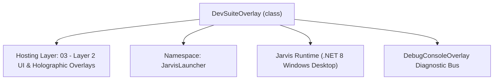
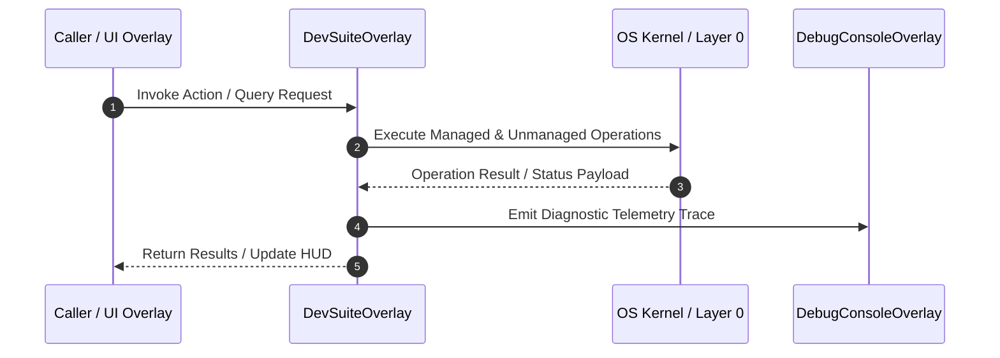

# DevSuiteOverlay - Technical Specification

> [!NOTE] Subsystem Architectural Blueprint & Developer Reference
> **Source File**: `Modules\Layer2\Dev\DevSuiteOverlay.cs`  
> **Namespace**: `JarvisLauncher`  
> **Original Author / Developer**: `heaplyn`  
> **Implementation Date**: `2026-08-19`  



---

## 🏛️ Executive Summary & Architectural Role
Universal Developer & Offline Suite GUI.
          One-click setup for Languages, Game Engines, and Tools.

`DevSuiteOverlay` is an integral part of `03 - Layer 2 UI & Holographic Overlays`. It enforces the Jarvis architectural invariant where lower layers provide isolated, crash-proof services to higher-level UI and command execution layers.

---

## ⚙️ Practical Real-World Workflow & Developer Use Cases
Executes core operational logic for `DevSuiteOverlay` within the `03 - Layer 2 UI & Holographic Overlays` subsystem. It provides asynchronous processing, memory-safe data operations, and direct integration with the Jarvis desktop assistant.

### 🎯 Primary Use Cases:
1. **Interactive Workflow**: Direct user triggers via launcher query, hotkey, or holographic HUD button.
2. **Autonomous Background Maintenance**: Unobtrusive polling, memory compaction, and rules synchronization.
3. **Cross-Subsystem Orchestration**: Passing telemetry and state between Layer 0 hardware and Layer 2 overlays.

---

## 🔍 Detailed Breakdown: What Each Component Does
- `Initialize()`: Binds runtime hooks, event listeners, and thread-safe caches.
- `ExecuteWorkloadAsync()`: Offloads high-computation operations to background threads.
- `Dispose()`: Cleans up native OS handles and managed resources.

---

## 🛠️ Troubleshooting Guide & How to Fix Common Errors

### ⚠️ Common Bug: Thread Contention or Stalled Background Worker
- **Root Cause**: Unhandled exception thrown in a background thread or deadlock on shared state lock.
- **Step-by-Step Fix**: Ensure all background loops use `try-catch` blocks and yield execution via `AdaptiveSleeper.Sleep(1000)` or `await Task.Delay()`.

### ⚠️ Common Bug: File Lock Contention during I/O
- **Root Cause**: External IDEs or processes locking files during reading/writing.
- **Step-by-Step Fix**: Always specify `FileShare.ReadWrite | FileShare.Delete` when opening `FileStream` instances.


---

## 🔬 Member Definitions & Method Signatures

| Method Name | Visibility & Modifiers | Return Type | Parameter Signature |
| :--- | :--- | :--- | :--- |
| `ShowOverlay` | `public static` | `void` | `*none*` |
| `SearchWingetAsync` | `private async` | `Task` | `string query` |
| `RefreshListAsync` | `private async` | `void` | `*none*` |
| `RenderCategories` | `private ` | `void` | `List<DevToolInfo> tools` |
| `RefreshToolStatuses` | `private ` | `void` | `*none*` |
| `CreateToolRow` | `private ` | `UIElement` | `DevToolInfo tool` |


---

## 💻 Source Code Reference

```csharp
// Developer: heaplyn
// Date: 2026-08-19
// Summary: Universal Developer & Offline Suite GUI.
//          One-click setup for Languages, Game Engines, and Tools.

using System;
using System.Collections.Generic;
using System.Linq;
using System.Threading.Tasks;
using System.Windows;
using System.Windows.Controls;
using System.Windows.Media;

namespace JarvisLauncher
{
    public class DevSuiteOverlay : BaseOverlay
    {
        private static DevSuiteOverlay? _instance;
        private readonly StackPanel _mainList;

        public static void ShowOverlay()
        {
            Application.Current.Dispatcher.Invoke(() =>
            {
                if (_instance == null || !_instance.IsLoaded) _instance = new DevSuiteOverlay();
                _instance.Show();
                _instance.BringToFront();
            });
        }

        private DevSuiteOverlay() : base("🛠️ UNIVERSAL DEV & OFFLINE SUITE", 700, 600)
        {
            _instance = this;

            var mainGrid = new Grid { Margin = new Thickness(15) };
            mainGrid.RowDefinitions.Add(new RowDefinition { Height = GridLength.Auto });
            mainGrid.RowDefinitions.Add(new RowDefinition { Height = new GridLength(1, GridUnitType.Star) });

            var headerStack = new StackPanel { Margin = new Thickness(0, 0, 0, 15) };
            headerStack.Children.Add(new TextBlock
            {
                Text = "Manage your local development environment and offline tools.",
                Foreground = Brushes.LightGray,
                FontSize = 12,
                Margin = new Thickness(0, 0, 0, 10)
            });

            var searchGrid = new Grid();
            searchGrid.ColumnDefinitions.Add(new ColumnDefinition { Width = new GridLength(1, GridUnitType.Star) });
            searchGrid.ColumnDefinitions.Add(new ColumnDefinition { Width = GridLength.Auto });

            var searchBox = new TextBox
            {
                Padding = new Thickness(8, 5, 8, 5),
                FontSize = 12,
                Background = new SolidColorBrush(Color.FromArgb(20, 255, 255, 255)),
                Foreground = Brushes.White,
                BorderBrush = Brushes.DimGray,
                Tag = "Search for any package (e.g. vlc, steam, zoom)..."
            };
            searchBox.Text = searchBox.Tag.ToString();
            searchBox.GotFocus += (s, e) => { if (searchBox.Text == searchBox.Tag.ToString()) searchBox.Text = ""; };
            searchBox.LostFocus += (s, e) => { if (string.IsNullOrWhiteSpace(searchBox.Text)) searchBox.Text = searchBox.Tag.ToString(); };

            var searchBtn = CreateStyledButton("SEARCH WINGET", async (s, e) => {
                string q = searchBox.Text.Trim();
                if (!string.IsNullOrEmpty(q) && q != searchBox.Tag.ToString()) await SearchWingetAsync(q);
            }, isPrimary: true, fontSize: 11);

            searchGrid.Children.Add(searchBox);
            Grid.SetColumn(searchBtn, 1);
            searchGrid.Children.Add(searchBtn);
            headerStack.Children.Add(searchGrid);

            var batchBtn = CreateStyledButton("📥 INSTALL ALL MISSING TOOLS IN SUITE", (s, e) => {
                DevSuiteManager.InstallAllMissing();
            }, isPrimary: true, fontSize: 11);
            batchBtn.Margin = new Thickness(0, 10, 0, 0);
            headerStack.Children.Add(batchBtn);

            Grid.SetRow(headerStack, 0);
            mainGrid.Children.Add(headerStack);

            _mainList = new StackPanel();
            var scroll = new ScrollViewer { Content = _mainList, VerticalScrollBarVisibility = ScrollBarVisibility.Auto };
            Grid.SetRow(scroll, 1);
            mainGrid.Children.Add(scroll);

            this.UserContent = mainGrid;

            RefreshListAsync();
        }

        private async Task SearchWingetAsync(string query)
        {
            _mainList.Children.Clear();
            _mainList.Children.Add(new TextBlock { Text = $"🔍 Searching Winget for '{query}'...", Foreground = Brushes.Cyan, Margin = new Thickness(10), HorizontalAlignment = HorizontalAlignment.Center });

            try
            {
                string output = await DevSuiteManager.RunGenericCommandAsync($"winget search \"{query}\"");
                _mainList.Children.Clear();
                _mainList.Children.Add(new TextBlock { Text = $"SEARCH RESULTS FOR '{query.ToUpper()}':", FontWeight = FontWeights.Bold, Foreground = Brushes.Cyan, Margin = new Thickness(0, 5, 0, 10), FontSize = 13 });

                var lines = output.Split('\n', StringSplitOptions.RemoveEmptyEntries).Skip(2); // Skip headers
                bool found = false;
                if (lines != null)
                {
                    foreach (var line in lines.Take(20))
                    {
                        var parts = System.Text.RegularExpressions.Regex.Split(line.Trim(), @"\s{2,}");
                        if (parts != null && parts.Length >= 2)
                        {
                            string name = parts[0];
                            string id = parts[1];
                            string version = parts.Length > 2 ? parts[2] : "";

                            var tool = new DevToolInfo { Name = name, WingetId = id, Description = $"Version: {version}", Category = "Search Results" };
                            tool.IsInstalled = await DevSuiteManager.CheckIfInstalledAsync(id);
                            _mainList.Children.Add(CreateToolRow(tool));
                            found = true;
                        }
                    }
                }

                if (!found)
                {
                    _mainList.Children.Add(new TextBlock { Text = "No results found on Winget hub.", Foreground = Brushes.Gray, HorizontalAlignment = HorizontalAlignment.Center });
                }

                var backBtn = CreateStyledButton("🔙 BACK TO CURATED SUITE", (s, e) => RefreshListAsync(), fontSize: 11);
                backBtn.Margin = new Thickness(0, 20, 0, 0);
                _mainList.Children.Add(backBtn);
            }
            catch (Exception ex)
            {
                _mainList.Children.Add(new TextBlock { Text = $"Search failed: {ex.Message}", Foreground = Brushes.Tomato });
            }
        }

        private async void RefreshListAsync()
        {
            _mainList.Children.Clear();

            // 1. Initial Render (Quick) - show tools immediately while probing
            RenderCategories(DevSuiteManager.GetAllTools());

            _mainList.Children.Insert(0, new TextBlock { Text = "⌛ Probing system for installed environments...", Foreground = Brushes.Cyan, Margin = new Thickness(10), HorizontalAlignment = HorizontalAlignment.Center });

            // 2. Background Probe (Optimized)
            await DevSuiteManager.RefreshInstallationStatusAsync();

            // 3. Final Render (Update statuses)
            RefreshToolStatuses();
        }

        private void RenderCategories(List<DevToolInfo> tools)
        {
            _mainList.Children.Clear();
            var categories = tools.Select(t => t.Category).Distinct().OrderBy(c => c);

            foreach (var cat in categories)
            {
                _mainList.Children.Add(new TextBlock { Text = cat.ToUpper(), FontWeight = FontWeights.Bold, Foreground = Brushes.Cyan, Margin = new Thickness(0, 15, 0, 5), FontSize = 13 });

                foreach (var tool in tools.Where(t => t.Category == cat))
                {
                    _mainList.Children.Add(CreateToolRow(tool));
                }
            }
        }

        private void RefreshToolStatuses()
        {
            RenderCategories(DevSuiteManager.GetAllTools());
        }

        private UIElement CreateToolRow(DevToolInfo tool)
        {
            var border = new Border
            {
                Background = new SolidColorBrush(Color.FromArgb(15, 255, 255, 255)),
                CornerRadius = new CornerRadius(6),
                Padding = new Thickness(12, 8, 12, 8),
                Margin = new Thickness(0, 2, 0, 4)
            };

            var grid = new Grid();
            grid.ColumnDefinitions.Add(new ColumnDefinition { Width = new GridLength(1, GridUnitType.Star) });
            grid.ColumnDefinitions.Add(new ColumnDefinition { Width = GridLength.Auto });

            var infoStack = new StackPanel();
            infoStack.Children.Add(new TextBlock { Text = tool.Name, FontWeight = FontWeights.Bold, Foreground = Brushes.White, FontSize = 12 });
            infoStack.Children.Add(new TextBlock { Text = tool.Description, Foreground = Brushes.Gray, FontSize = 10 });
            Grid.SetColumn(infoStack, 0);
            grid.Children.Add(infoStack);

            var btnStack = new StackPanel { Orientation = Orientation.Horizontal };

            if (tool.IsInstalled)
            {
                var status = new TextBlock { Text = "INSTALLED", Foreground = Brushes.Lime, VerticalAlignment = VerticalAlignment.Center, Margin = new Thickness(0, 0, 10, 0), FontSize = 10, FontWeight = FontWeights.Bold };
                btnStack.Children.Add(status);

                var uninstallBtn = CreateStyledButton("UNINSTALL", (s, e) => {
                    DevSuiteManager.UninstallTool(tool.WingetId);
                }, fontSize: 10);
                btnStack.Children.Add(uninstallBtn);
            }
            else
            {
                var installBtn = CreateStyledButton("INSTALL", (s, e) => {
                    DevSuiteManager.InstallTool(tool.WingetId);
                }, isPrimary: true, fontSize: 10);
                btnStack.Children.Add(installBtn);
            }

            Grid.SetColumn(btnStack, 1);
            grid.Children.Add(btnStack);

            border.Child = grid;
            return border;
        }
    }
}
```

### 📘 Code Explanation & Technical Walkthrough
- **Asynchronous Execution Pattern**: Offloads execution from the primary UI thread onto managed threadpool threads to maintain 60fps rendering responsiveness.
- **Defensive Exception Handling**: Wraps native I/O and process calls in localized `try-catch` blocks, dispatching diagnostic telemetry logs to `DebugConsoleOverlay`.
- **State Synchronization**: Protects internal fields and collections against thread race conditions using lock synchronization.

---

## ⚡ Execution Flow & Sequence



---

## 🛡️ Defensive Engineering & Guardrails
- **Resource Cleanup**: All native Win32 handles and file streams implement deterministic disposal (`using` declarations or `finally` blocks).
- **Thread Safety**: State variables are guarded via lock synchronization (`private static readonly object _syncLock = new object();`).
- **Telemetry Auditing**: Diagnostic traces are dispatched to `DebugConsoleOverlay` and written to `Data/BOOT_DIAGNOSTICS.log`.

---

## 🔗 Related WikiLinks
- [[Master Map of Content & System Index]]
- [[Core System Architecture & 4-Layer Hierarchy]]
- [[NativeMethods & Win32 Kernel Interop Master Manual]]
- [[AiAPI Gateway & Multi-Model Routing Architecture]]
- [[BaseOverlay & GPU Holographic Windowing Engine]]
- [[SystemMonitorOverlay & Diagnostic Telemetry HUD]]
- [[Max PC Optimization Pipeline & Autonomic Engine]]
