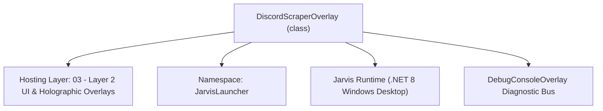
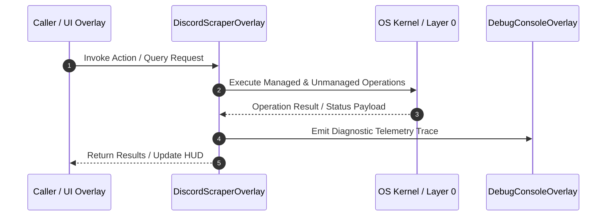

# DiscordScraperOverlay - Technical Specification

> [!NOTE] Subsystem Architectural Blueprint & Developer Reference
> **Source File**: `Modules\Layer2\System\DiscordScraperOverlay.cs`  
> **Namespace**: `JarvisLauncher`  
> **Original Author / Developer**: `heaplyn`  
> **Implementation Date**: `2026-08-20`  



---

## 🏛️ Executive Summary & Architectural Role
Interactive Glassmorphic Discord Message Scraper and Exporter Overlay.
          Allows users to configure bot credentials, load active guilds/channels/DMs, 
          preview messages, and export logs directly to markdown files.

`DiscordScraperOverlay` is an integral part of `03 - Layer 2 UI & Holographic Overlays`. It enforces the Jarvis architectural invariant where lower layers provide isolated, crash-proof services to higher-level UI and command execution layers.

---

## ⚙️ Practical Real-World Workflow & Developer Use Cases
Executes core operational logic for `DiscordScraperOverlay` within the `03 - Layer 2 UI & Holographic Overlays` subsystem. It provides asynchronous processing, memory-safe data operations, and direct integration with the Jarvis desktop assistant.

### 🎯 Primary Use Cases:
1. **Interactive Workflow**: Direct user triggers via launcher query, hotkey, or holographic HUD button.
2. **Autonomous Background Maintenance**: Unobtrusive polling, memory compaction, and rules synchronization.
3. **Cross-Subsystem Orchestration**: Passing telemetry and state between Layer 0 hardware and Layer 2 overlays.

---

## 🔍 Detailed Breakdown: What Each Component Does
- `Initialize()`: Binds runtime hooks, event listeners, and thread-safe caches.
- `ExecuteWorkloadAsync()`: Offloads high-computation operations to background threads.
- `Dispose()`: Cleans up native OS handles and managed resources.

---

## 🛠️ Troubleshooting Guide & How to Fix Common Errors

### ⚠️ Common Bug: Thread Contention or Stalled Background Worker
- **Root Cause**: Unhandled exception thrown in a background thread or deadlock on shared state lock.
- **Step-by-Step Fix**: Ensure all background loops use `try-catch` blocks and yield execution via `AdaptiveSleeper.Sleep(1000)` or `await Task.Delay()`.

### ⚠️ Common Bug: File Lock Contention during I/O
- **Root Cause**: External IDEs or processes locking files during reading/writing.
- **Step-by-Step Fix**: Always specify `FileShare.ReadWrite | FileShare.Delete` when opening `FileStream` instances.


---

## 🔬 Member Definitions & Method Signatures

| Method Name | Visibility & Modifiers | Return Type | Parameter Signature |
| :--- | :--- | :--- | :--- |
| `Open` | `public static` | `void` | `*none*` |
| `SaveAndConnect` | `private async` | `void` | `*none*` |
| `GuildComboBox_SelectionChanged` | `private async` | `void` | `object sender, SelectionChangedEventArgs e` |
| `ChannelListBox_SelectionChanged` | `private async` | `void` | `object sender, SelectionChangedEventArgs e` |
| `ExportMessages` | `private async` | `void` | `*none*` |


---

## 💻 Source Code Reference

```csharp
// Developer: heaplyn
// Date: 2026-08-20
// Summary: Interactive Glassmorphic Discord Message Scraper and Exporter Overlay.
//          Allows users to configure bot credentials, load active guilds/channels/DMs, 
//          preview messages, and export logs directly to markdown files.

using System;
using System.Collections.Generic;
using System.IO;
using System.Linq;
using System.Threading.Tasks;
using System.Windows;
using System.Windows.Controls;
using System.Windows.Input;
using System.Windows.Media;

namespace JarvisLauncher
{
    public class DiscordScraperOverlay : BaseOverlay
    {
        private static DiscordScraperOverlay? _instance;

        private readonly TextBox _tokenInput;
        private readonly ComboBox _guildComboBox;
        private readonly ListBox _channelListBox;
        private readonly ListBox _messagesListBox;
        private readonly TextBlock _statusLabel;
        private readonly Button _exportBtn;
        private readonly Button _connectBtn;

        private List<DiscordGuildInfo> _guilds = new();
        private List<DiscordChannelInfo> _channels = new();
        private List<DiscordMessageInfo> _activeMessages = new();

        public static void Open()
        {
            Application.Current.Dispatcher.Invoke(() =>
            {
                if (_instance == null || !_instance.IsLoaded)
                {
                    _instance = new DiscordScraperOverlay();
                    _instance.Closed += (s, e) => _instance = null;
                }
                _instance.Show();
                _instance.BringToFront();
            });
        }

        private DiscordScraperOverlay() : base("💬 DISCORD MESSAGE LOGGER & EXPORTER", width: 820, height: 550)
        {
            var mainGrid = new Grid { Margin = new Thickness(12) };
            mainGrid.RowDefinitions.Add(new RowDefinition { Height = GridLength.Auto }); // Token row
            mainGrid.RowDefinitions.Add(new RowDefinition { Height = GridLength.Auto }); // Guild selection
            mainGrid.RowDefinitions.Add(new RowDefinition { Height = new GridLength(1, GridUnitType.Star) }); // Lists panels
            mainGrid.RowDefinitions.Add(new RowDefinition { Height = GridLength.Auto }); // Status & Export

            // --- Row 0: Token Input ---
            var tokenGrid = new Grid { Margin = new Thickness(0, 0, 0, 10) };
            tokenGrid.ColumnDefinitions.Add(new ColumnDefinition { Width = GridLength.Auto });
            tokenGrid.ColumnDefinitions.Add(new ColumnDefinition { Width = new GridLength(1, GridUnitType.Star) });
            tokenGrid.ColumnDefinitions.Add(new ColumnDefinition { Width = GridLength.Auto });

            var tokenLabel = CreateLabel("BOT TOKEN:", 11, true);
            BaseOverlay.SetLabelForeground(tokenLabel, Brushes.Cyan);
            tokenLabel.Margin = new Thickness(0, 0, 10, 0);
            tokenLabel.VerticalAlignment = VerticalAlignment.Center;
            tokenGrid.Children.Add(tokenLabel);

            _tokenInput = new TextBox
            {
                Height = 26,
                FontSize = 11,
                Padding = new Thickness(6, 3, 6, 3),
                VerticalContentAlignment = VerticalAlignment.Center,
                Text = SettingsManager.Current.DISCORD_BOT_TOKEN
            };
            _tokenInput.SetResourceReference(TextBox.BackgroundProperty, "WindowBackgroundBrush");
            _tokenInput.SetResourceReference(TextBox.ForegroundProperty, "TextPrimaryBrush");
            _tokenInput.SetResourceReference(TextBox.BorderBrushProperty, "WindowBorderBrush");
            _tokenInput.SetResourceReference(TextBox.CaretBrushProperty, "AccentCaretBrush");
            Grid.SetColumn(_tokenInput, 1);
            tokenGrid.Children.Add(_tokenInput);

            _connectBtn = CreateStyledButton("CONNECT / SAVE", (s, e) => SaveAndConnect(), isPrimary: true, fontSize: 10);
            _connectBtn.Margin = new Thickness(10, 0, 0, 0);
            Grid.SetColumn(_connectBtn, 2);
            tokenGrid.Children.Add(_connectBtn);

            Grid.SetRow(tokenGrid, 0);
            mainGrid.Children.Add(tokenGrid);

            // --- Row 1: Guild Selector ---
            var guildGrid = new Grid { Margin = new Thickness(0, 0, 0, 12) };
            guildGrid.ColumnDefinitions.Add(new ColumnDefinition { Width = GridLength.Auto });
            guildGrid.ColumnDefinitions.Add(new ColumnDefinition { Width = new GridLength(1, GridUnitType.Star) });

            var guildLabel = CreateLabel("SELECT SERVER:", 11, true);
            BaseOverlay.SetLabelForeground(guildLabel, Brushes.Cyan);
            guildLabel.Margin = new Thickness(0, 0, 10, 0);
            guildLabel.VerticalAlignment = VerticalAlignment.Center;
            guildGrid.Children.Add(guildLabel);

            _guildComboBox = new ComboBox { Height = 26, FontSize = 11, VerticalContentAlignment = VerticalAlignment.Center };
            _guildComboBox.SelectionChanged += GuildComboBox_SelectionChanged;
            Grid.SetColumn(_guildComboBox, 1);
            guildGrid.Children.Add(_guildComboBox);

            Grid.SetRow(guildGrid, 1);
            mainGrid.Children.Add(guildGrid);

            // --- Row 2: Columns Panel (Channels & Messages) ---
            var columnsGrid = new Grid();
            columnsGrid.ColumnDefinitions.Add(new ColumnDefinition { Width = new GridLength(260) });
            columnsGrid.ColumnDefinitions.Add(new ColumnDefinition { Width = new GridLength(1, GridUnitType.Star) });

            // Left column: Channels/DMs list
            var leftStack = new Grid { Margin = new Thickness(0, 0, 10, 0) };
            leftStack.RowDefinitions.Add(new RowDefinition { Height = GridLength.Auto });
            leftStack.RowDefinitions.Add(new RowDefinition { Height = new GridLength(1, GridUnitType.Star) });

            var chanLabel = CreateLabel("CHANNELS / DIRECT MESSAGES:", 10, true);
            BaseOverlay.SetLabelForeground(chanLabel, Brushes.Gray);
            leftStack.Children.Add(chanLabel);

            _channelListBox = new ListBox
            {
                Background = new SolidColorBrush(Color.FromArgb(10, 255, 255, 255)),
                BorderBrush = new SolidColorBrush(Color.FromArgb(15, 255, 255, 255)),
                BorderThickness = new Thickness(1),
                Margin = new Thickness(0, 5, 0, 0)
            };
            _channelListBox.SelectionChanged += ChannelListBox_SelectionChanged;
            Grid.SetRow(_channelListBox, 1);
            leftStack.Children.Add(_channelListBox);
            columnsGrid.Children.Add(leftStack);

            // Right column: Message log list
            var rightStack = new Grid();
            rightStack.RowDefinitions.Add(new RowDefinition { Height = GridLength.Auto });
            rightStack.RowDefinitions.Add(new RowDefinition { Height = new GridLength(1, GridUnitType.Star) });

            var msgLabel = CreateLabel("PREVIEW MESSAGES (RECENT 50):", 10, true);
            BaseOverlay.SetLabelForeground(msgLabel, Brushes.Gray);
            rightStack.Children.Add(msgLabel);

            _messagesListBox = new ListBox
            {
                Background = new SolidColorBrush(Color.FromArgb(5, 0, 0, 0)),
                BorderBrush = new SolidColorBrush(Color.FromArgb(15, 255, 255, 255)),
                BorderThickness = new Thickness(1),
                Margin = new Thickness(0, 5, 0, 0)
            };
            Grid.SetRow(_messagesListBox, 1);
            rightStack.Children.Add(_messagesListBox);

            Grid.SetColumn(rightStack, 1);
            columnsGrid.Children.Add(rightStack);

            Grid.SetRow(columnsGrid, 2);
            mainGrid.Children.Add(columnsGrid);

            // --- Row 3: Status & Bottom Actions ---
            var bottomGrid = new Grid { Margin = new Thickness(0, 10, 0, 0) };
            bottomGrid.ColumnDefinitions.Add(new ColumnDefinition { Width = new GridLength(1, GridUnitType.Star) });
            bottomGrid.ColumnDefinitions.Add(new ColumnDefinition { Width = GridLength.Auto });

            _statusLabel = new TextBlock
            {
                Text = "Ready. Configure token and click connect.",
                Foreground = Brushes.Gray,
                FontSize = 11,
                VerticalAlignment = VerticalAlignment.Center
            };
            bottomGrid.Children.Add(_statusLabel);

            _exportBtn = CreateStyledButton("📥 EXPORT MESSAGES TO MARKDOWN FILE", (s, e) => ExportMessages(), isPrimary: true, fontSize: 11);
            _exportBtn.IsEnabled = false;
            Grid.SetColumn(_exportBtn, 1);
            bottomGrid.Children.Add(_exportBtn);

            Grid.SetRow(bottomGrid, 3);
            mainGrid.Children.Add(bottomGrid);

            this.UserContent = mainGrid;

            if (DiscordScraperManager.HasToken)
            {
                SaveAndConnect();
            }
        }

        private async void SaveAndConnect()
        {
            string token = _tokenInput.Text.Trim();
            if (string.IsNullOrEmpty(token))
            {
                _statusLabel.Text = "⚠️ Bot token is empty.";
                _statusLabel.Foreground = Brushes.Tomato;
                return;
            }

            DiscordScraperManager.SaveBotToken(token);
            _statusLabel.Text = "Connecting to Discord...";
            _statusLabel.Foreground = Brushes.Cyan;
            _connectBtn.IsEnabled = false;

            try
            {
                _guilds = await DiscordScraperManager.GetGuildsAsync();
                _guildComboBox.Items.Clear();

                _guildComboBox.Items.Add("💬 Direct Messages (DMs)");
                foreach (var g in _guilds)
                {
                    _guildComboBox.Items.Add($"📂 {g.Name}");
                }

                _guildComboBox.SelectedIndex = 0;
                _statusLabel.Text = $"Connected! Loaded {_guilds.Count} guilds.";
                _statusLabel.Foreground = Brushes.Lime;
            }
            catch (Exception ex)
            {
                _statusLabel.Text = $"Connection failed: {ex.Message}";
                _statusLabel.Foreground = Brushes.Tomato;
            }
            finally
            {
                _connectBtn.IsEnabled = true;
            }
        }

        private async void GuildComboBox_SelectionChanged(object sender, SelectionChangedEventArgs e)
        {
            int index = _guildComboBox.SelectedIndex;
            if (index < 0) return;

            _channelListBox.Items.Clear();
            _messagesListBox.ItemsSource = null;
            _exportBtn.IsEnabled = false;

            _statusLabel.Text = "Loading channels...";
            _statusLabel.Foreground = Brushes.Cyan;

            try
            {
                if (index == 0) // DMs
                {
                    _channels = await DiscordScraperManager.GetDMsAsync();
                    foreach (var c in _channels)
                    {
                        _channelListBox.Items.Add($"👤 {c.Name}");
                    }
                    _statusLabel.Text = $"Loaded {_channels.Count} DM channels.";
                    _statusLabel.Foreground = Brushes.Lime;
                }
                else
                {
                    var guild = _guilds[index - 1];
                    _channels = await DiscordScraperManager.GetChannelsAsync(guild.Id);
                    foreach (var c in _channels)
                    {
                        _channelListBox.Items.Add($"# {c.Name}");
                    }
                    _statusLabel.Text = $"Loaded {_channels.Count} text channels.";
                    _statusLabel.Foreground = Brushes.Lime;
                }
            }
            catch (Exception ex)
            {
                _statusLabel.Text = $"Failed to load: {ex.Message}";
                _statusLabel.Foreground = Brushes.Tomato;
            }
        }

        private async void ChannelListBox_SelectionChanged(object sender, SelectionChangedEventArgs e)
        {
            int index = _channelListBox.SelectedIndex;
            if (index < 0 || index >= _channels.Count) return;

            var channel = _channels[index];
            _statusLabel.Text = $"Loading messages for '{channel.Name}'...";
            _statusLabel.Foreground = Brushes.Cyan;
            _exportBtn.IsEnabled = false;

            try
            {
                _activeMessages = await DiscordScraperManager.GetRecentMessagesAsync(channel.Id, 50);
                
                var displayList = _activeMessages.Select(m => {
                    string cleanTime = m.Timestamp;
                    if (DateTime.TryParse(m.Timestamp, out var dt)) cleanTime = dt.ToString("yyyy-MM-dd HH:mm:ss");
                    return $"[{cleanTime}] {m.Author}: {m.Content}";
                }).ToList();

                _messagesListBox.ItemsSource = displayList;
                _statusLabel.Text = $"Loaded {displayList.Count} messages.";
                _statusLabel.Foreground = Brushes.Lime;
                _exportBtn.IsEnabled = _activeMessages.Count > 0;
            }
            catch (Exception ex)
            {
                _statusLabel.Text = $"Failed to load messages: {ex.Message}";
                _statusLabel.Foreground = Brushes.Tomato;
                _messagesListBox.ItemsSource = null;
            }
        }

        private async void ExportMessages()
        {
            int index = _channelListBox.SelectedIndex;
            if (index < 0 || index >= _channels.Count) return;

            var channel = _channels[index];
            _statusLabel.Text = "Exporting messages...";
            _statusLabel.Foreground = Brushes.Cyan;

            try
            {
                string path = await DiscordScraperManager.ExportChannelMessagesToFileAsync(channel.Id, channel.Name, 100);
                _statusLabel.Text = $"Exported successfully to: {Path.GetFileName(path)}";
                _statusLabel.Foreground = Brushes.Lime;
                
                TextOverlay.Show($"📝 Chat logs saved to Downloads folder!", 3000);
            }
            catch (Exception ex)
            {
                _statusLabel.Text = $"Export failed: {ex.Message}";
                _statusLabel.Foreground = Brushes.Tomato;
            }
        }
    }
}
```

### 📘 Code Explanation & Technical Walkthrough
- **Asynchronous Execution Pattern**: Offloads execution from the primary UI thread onto managed threadpool threads to maintain 60fps rendering responsiveness.
- **Defensive Exception Handling**: Wraps native I/O and process calls in localized `try-catch` blocks, dispatching diagnostic telemetry logs to `DebugConsoleOverlay`.
- **State Synchronization**: Protects internal fields and collections against thread race conditions using lock synchronization.

---

## ⚡ Execution Flow & Sequence



---

## 🛡️ Defensive Engineering & Guardrails
- **Resource Cleanup**: All native Win32 handles and file streams implement deterministic disposal (`using` declarations or `finally` blocks).
- **Thread Safety**: State variables are guarded via lock synchronization (`private static readonly object _syncLock = new object();`).
- **Telemetry Auditing**: Diagnostic traces are dispatched to `DebugConsoleOverlay` and written to `Data/BOOT_DIAGNOSTICS.log`.

---

## 🔗 Related WikiLinks
- [[Master Map of Content & System Index]]
- [[Core System Architecture & 4-Layer Hierarchy]]
- [[NativeMethods & Win32 Kernel Interop Master Manual]]
- [[AiAPI Gateway & Multi-Model Routing Architecture]]
- [[BaseOverlay & GPU Holographic Windowing Engine]]
- [[SystemMonitorOverlay & Diagnostic Telemetry HUD]]
- [[Max PC Optimization Pipeline & Autonomic Engine]]
