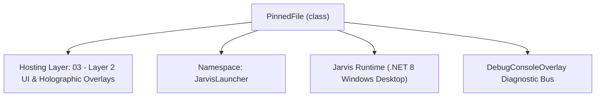
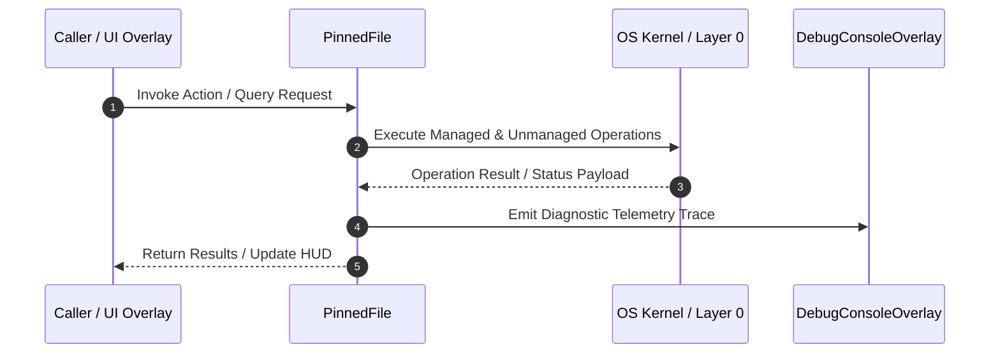

# FileGridOverlay - Technical Specification

> [!NOTE] Subsystem Architectural Blueprint & Developer Reference
> **Source File**: `Modules\Layer2\Dev\FileGridOverlay.cs`  
> **Namespace**: `JarvisLauncher`  
> **Original Author / Developer**: `heaplyn`  
> **Implementation Date**: `2026-08-09`  



---

## 🏛️ Executive Summary & Architectural Role
Glassmorphic file launcher grid overlay displaying pinned files as interactive dashboard cards. Supports visual pinning, opening, and removing files.

`PinnedFile` is an integral part of `03 - Layer 2 UI & Holographic Overlays`. It enforces the Jarvis architectural invariant where lower layers provide isolated, crash-proof services to higher-level UI and command execution layers.

---

## ⚙️ Practical Real-World Workflow & Developer Use Cases
Executes core operational logic for `FileGridOverlay` within the `03 - Layer 2 UI & Holographic Overlays` subsystem. It provides asynchronous processing, memory-safe data operations, and direct integration with the Jarvis desktop assistant.

### 🎯 Primary Use Cases:
1. **Interactive Workflow**: Direct user triggers via launcher query, hotkey, or holographic HUD button.
2. **Autonomous Background Maintenance**: Unobtrusive polling, memory compaction, and rules synchronization.
3. **Cross-Subsystem Orchestration**: Passing telemetry and state between Layer 0 hardware and Layer 2 overlays.

---

## 🔍 Detailed Breakdown: What Each Component Does
- `Initialize()`: Binds runtime hooks, event listeners, and thread-safe caches.
- `ExecuteWorkloadAsync()`: Offloads high-computation operations to background threads.
- `Dispose()`: Cleans up native OS handles and managed resources.

---

## 🛠️ Troubleshooting Guide & How to Fix Common Errors

### ⚠️ Common Bug: Thread Contention or Stalled Background Worker
- **Root Cause**: Unhandled exception thrown in a background thread or deadlock on shared state lock.
- **Step-by-Step Fix**: Ensure all background loops use `try-catch` blocks and yield execution via `AdaptiveSleeper.Sleep(1000)` or `await Task.Delay()`.

### ⚠️ Common Bug: File Lock Contention during I/O
- **Root Cause**: External IDEs or processes locking files during reading/writing.
- **Step-by-Step Fix**: Always specify `FileShare.ReadWrite | FileShare.Delete` when opening `FileStream` instances.


---

## 🔬 Member Definitions & Method Signatures

| Method Name | Visibility & Modifiers | Return Type | Parameter Signature |
| :--- | :--- | :--- | :--- |
| `OpenDashboard` | `public static` | `void` | `*none*` |
| `RefreshGrid` | `public ` | `void` | `*none*` |
| `CreateFileCard` | `private ` | `Border` | `PinnedFile file` |
| `CreateAddCard` | `private ` | `Border` | `*none*` |
| `PromptAndPinFile` | `private ` | `void` | `*none*` |
| `GetPinnedJsonPath` | `public static` | `string` | `*none*` |
| `LoadPinnedFiles` | `public static` | `List<PinnedFile>` | `*none*` |
| `SavePinnedFiles` | `public static` | `void` | `List<PinnedFile> files` |
| `PinFile` | `public static` | `void` | `string filePath` |
| `UnpinFile` | `public static` | `void` | `string filePath` |
| `OpenNatively` | `private static` | `void` | `string filePath` |
| `GetExtensionEmoji` | `private static` | `string` | `string path` |
| `GetProjectRoot` | `private static` | `string` | `*none*` |


---

## 💻 Source Code Reference

```csharp
// Developer: heaplyn
// Date: 2026-08-09
// Summary: Glassmorphic file launcher grid overlay displaying pinned files as interactive dashboard cards. Supports visual pinning, opening, and removing files.

using System;
using System.Collections.Generic;
using System.Diagnostics;
using System.IO;
using System.Text.Json;
using System.Windows;
using System.Windows.Controls;
using System.Windows.Input;
using System.Windows.Media;

namespace JarvisLauncher
{
    public class PinnedFile
    {
        public string FilePath { get; set; } = string.Empty;
        public string FriendlyName { get; set; } = string.Empty;
        public DateTime PinnedAt { get; set; } = DateTime.Now;
    }

    public class FileGridOverlay : BaseOverlay
    {
        private static FileGridOverlay? _instance;
        private readonly WrapPanel _wrapPanel;

        public static void OpenDashboard()
        {
            Application.Current.Dispatcher.Invoke(() =>
            {
                if (_instance == null)
                {
                    _instance = new FileGridOverlay();
                }

                _instance.RefreshGrid();
                _instance.Show();
            });
        }

        private FileGridOverlay()
            : base("JARVIS FILE LAUNCHPAD", width: 550, height: 420)
        {
            this.Closed += (s, e) => { _instance = null; };

            var rootGrid = new Grid();
            rootGrid.RowDefinitions.Add(new RowDefinition { Height = new GridLength(1, GridUnitType.Star) });

            // ScrollViewer wrapping WrapPanel for scrollable Grid columns
            var scrollViewer = new ScrollViewer
            {
                VerticalScrollBarVisibility = ScrollBarVisibility.Auto,
                HorizontalScrollBarVisibility = ScrollBarVisibility.Disabled,
                Padding = new Thickness(6)
            };

            _wrapPanel = new WrapPanel
            {
                Orientation = Orientation.Horizontal,
                HorizontalAlignment = HorizontalAlignment.Left
            };

            scrollViewer.Content = _wrapPanel;
            Grid.SetRow(scrollViewer, 0);
            rootGrid.Children.Add(scrollViewer);

            this.UserContent = rootGrid;
        }

        public void RefreshGrid()
        {
            _wrapPanel.Children.Clear();

            var pinnedFiles = LoadPinnedFiles();

            // Render existing file cards
            foreach (var file in pinnedFiles)
            {
                var card = CreateFileCard(file);
                _wrapPanel.Children.Add(card);
            }

            // Render the special "+" Add Card
            var addCard = CreateAddCard();
            _wrapPanel.Children.Add(addCard);
        }

        private Border CreateFileCard(PinnedFile file)
        {
            var cardBorder = new Border
            {
                Width = 100,
                Height = 100,
                Margin = new Thickness(8),
                CornerRadius = new CornerRadius(8),
                Background = new SolidColorBrush(Color.FromArgb(15, 255, 255, 255)),
                BorderBrush = new SolidColorBrush(Color.FromArgb(20, 255, 255, 255)),
                BorderThickness = new Thickness(1),
                Cursor = Cursors.Hand,
                ToolTip = file.FilePath
            };

            // Card layout stack
            var stack = new StackPanel
            {
                VerticalAlignment = VerticalAlignment.Center,
                HorizontalAlignment = HorizontalAlignment.Center,
                Margin = new Thickness(4)
            };

            // Icon TextBlock based on extension
            string emoji = GetExtensionEmoji(file.FilePath);
            var iconBlock = new TextBlock
            {
                Text = emoji,
                FontSize = 28,
                HorizontalAlignment = HorizontalAlignment.Center
            };
            stack.Children.Add(iconBlock);

            // Filename text block
            string filename = Path.GetFileName(file.FilePath);
            if (string.IsNullOrEmpty(filename)) filename = file.FilePath;
            
            var textBlock = new TextBlock
            {
                Text = filename,
                FontSize = 10,
                FontFamily = new FontFamily("Segoe UI Semibold"),
                TextAlignment = TextAlignment.Center,
                TextWrapping = TextWrapping.Wrap,
                MaxHeight = 32,
                Margin = new Thickness(0, 6, 0, 0)
            };
            textBlock.SetResourceReference(TextBlock.ForegroundProperty, "TextPrimaryBrush");
            stack.Children.Add(textBlock);

            cardBorder.Child = stack;

            // Hover interactions
            cardBorder.MouseEnter += (s, e) =>
            {
                cardBorder.Background = new SolidColorBrush(Color.FromArgb(30, 255, 255, 255));
                cardBorder.BorderBrush = (Brush)Application.Current.Resources["SelectedBorderBrush"];
            };
            cardBorder.MouseLeave += (s, e) =>
            {
                cardBorder.Background = new SolidColorBrush(Color.FromArgb(15, 255, 255, 255));
                cardBorder.BorderBrush = new SolidColorBrush(Color.FromArgb(20, 255, 255, 255));
            };

            // Double click / Click to execute natively
            cardBorder.MouseDown += (s, e) =>
            {
                if (e.ChangedButton == MouseButton.Left)
                {
                    OpenNatively(file.FilePath);
                }
            };

            // Context Menu to unpin
            var contextMenu = new ContextMenu();
            var deleteItem = new MenuItem { Header = "Unpin File" };
            deleteItem.Click += (s, e) =>
            {
                UnpinFile(file.FilePath);
                RefreshGrid();
            };
            contextMenu.Items.Add(deleteItem);
            cardBorder.ContextMenu = contextMenu;

            return cardBorder;
        }

        private Border CreateAddCard()
        {
            var addBorder = new Border
            {
                Width = 100,
                Height = 100,
                Margin = new Thickness(8),
                CornerRadius = new CornerRadius(8),
                Background = Brushes.Transparent,
                BorderBrush = new SolidColorBrush(Color.FromArgb(40, 255, 255, 255)),
                BorderThickness = new Thickness(1.5),
                Cursor = Cursors.Hand,
                ToolTip = "Pin a new file to the dashboard"
            };

            // Make border dashed
            var dashedStroke = new DoubleCollection(new double[] { 4, 3 });
            // Since WPF border doesn't support dashed property out of the box without templates, we can style it via hover accents
            
            var stack = new StackPanel
            {
                VerticalAlignment = VerticalAlignment.Center,
                HorizontalAlignment = HorizontalAlignment.Center
            };

            var iconBlock = new TextBlock
            {
                Text = "➕",
                FontSize = 24,
                HorizontalAlignment = HorizontalAlignment.Center
            };
            stack.Children.Add(iconBlock);

            var textBlock = new TextBlock
            {
                Text = "Pin File",
                Foreground = (Brush)Application.Current.Resources["TextSecondaryBrush"],
                FontSize = 10,
                FontFamily = new FontFamily("Segoe UI Semibold"),
                HorizontalAlignment = HorizontalAlignment.Center,
                Margin = new Thickness(0, 4, 0, 0)
            };
            stack.Children.Add(textBlock);

            addBorder.Child = stack;

            // Hover interactions
            addBorder.MouseEnter += (s, e) =>
            {
                addBorder.Background = new SolidColorBrush(Color.FromArgb(15, 255, 255, 255));
                addBorder.BorderBrush = (Brush)Application.Current.Resources["SelectedBorderBrush"];
            };
            addBorder.MouseLeave += (s, e) =>
            {
                addBorder.Background = Brushes.Transparent;
                addBorder.BorderBrush = new SolidColorBrush(Color.FromArgb(40, 255, 255, 255));
            };

            addBorder.MouseDown += (s, e) =>
            {
                if (e.ChangedButton == MouseButton.Left)
                {
                    PromptAndPinFile();
                }
            };

            return addBorder;
        }

        private void PromptAndPinFile()
        {
            var openFileDialog = new Microsoft.Win32.OpenFileDialog
            {
                Title = "Select File to Pin to Dashboard",
                Filter = "All Files (*.*)|*.*"
            };

            if (openFileDialog.ShowDialog() == true)
            {
                PinFile(openFileDialog.FileName);
                RefreshGrid();
            }
        }

        public static string GetPinnedJsonPath()
        {
            string dataDir = Path.Combine(AppDomain.CurrentDomain.BaseDirectory, "Data");
            if (!Directory.Exists(dataDir))
            {
                string devPath = Path.GetFullPath(Path.Combine(AppDomain.CurrentDomain.BaseDirectory, @"..\..\..\Data"));
                if (Directory.Exists(devPath))
                {
                    dataDir = devPath;
                }
                else
                {
                    Directory.CreateDirectory(dataDir);
                }
            }
            return Path.Combine(dataDir, "PinnedFiles.json");
        }

        public static List<PinnedFile> LoadPinnedFiles()
        {
            try
            {
                string path = GetPinnedJsonPath();
                if (File.Exists(path))
                {
                    string json = File.ReadAllText(path);
                    return JsonSerializer.Deserialize<List<PinnedFile>>(json) ?? new List<PinnedFile>();
                }
            }
            catch { }
            return new List<PinnedFile>();
        }

        public static void SavePinnedFiles(List<PinnedFile> files)
        {
            try
            {
                string path = GetPinnedJsonPath();
                string json = JsonSerializer.Serialize(files, new JsonSerializerOptions { WriteIndented = true });
                File.WriteAllText(path, json);
            }
            catch (Exception ex)
            {
                TextOverlay.Show($"⚠️ Failed to save dashboard: {ex.Message}", 3000);
            }
        }

        public static void PinFile(string filePath)
        {
            var files = LoadPinnedFiles();
            
            // Check if already pinned
            if (files.Exists(f => f.FilePath.Equals(filePath, StringComparison.OrdinalIgnoreCase)))
            {
                TextOverlay.Show("ℹ️ File is already pinned to dashboard", 2500);
                return;
            }

            files.Add(new PinnedFile
            {
                FilePath = filePath,
                FriendlyName = Path.GetFileName(filePath),
                PinnedAt = DateTime.Now
            });

            SavePinnedFiles(files);
            TextOverlay.Show($"📌 Pinned: {Path.GetFileName(filePath)}", 2500);
        }

        public static void UnpinFile(string filePath)
        {
            var files = LoadPinnedFiles();
            int removed = files.RemoveAll(f => f.FilePath.Equals(filePath, StringComparison.OrdinalIgnoreCase));
            
            if (removed > 0)
            {
                SavePinnedFiles(files);
                TextOverlay.Show($"🗑️ Unpinned: {Path.GetFileName(filePath)}", 2500);
            }
        }

        private static void OpenNatively(string filePath)
        {
            try
            {
                Process.Start(new ProcessStartInfo
                {
                    FileName = filePath,
                    UseShellExecute = true
                });
                TextOverlay.Show($"🚀 Opening: {Path.GetFileName(filePath)}", 2000);
            }
            catch (Exception ex)
            {
                TextOverlay.Show($"⚠️ Open failed: {ex.Message}", 3000);
            }
        }

        private static string GetExtensionEmoji(string path)
        {
            if (Directory.Exists(path)) return "📁";

            string ext = Path.GetExtension(path).ToLower();
            switch (ext)
            {
                case ".txt":
                case ".md":
                case ".doc":
                case ".docx":
                case ".rtf":
                case ".pdf":
                    return "📄";

                case ".cs":
                case ".xaml":
                case ".js":
                case ".ts":
                case ".json":
                case ".xml":
                case ".html":
                case ".css":
                case ".py":
                case ".cpp":
                case ".h":
                case ".bat":
                case ".ps1":
                case ".vbs":
                case ".sh":
                    return "💻";

                case ".mp3":
                case ".wav":
                case ".ogg":
                case ".flac":
                case ".m4a":
                    return "🎵";

                case ".mp4":
                case ".mkv":
                case ".avi":
                case ".mov":
                case ".wmv":
                    return "🎥";

                case ".png":
                case ".jpg":
                case ".jpeg":
                case ".gif":
                case ".bmp":
                case ".ico":
                case ".svg":
                    return "🖼️";

                case ".exe":
                case ".msi":
                case ".lnk":
                    return "⚙️";

                case ".zip":
                case ".rar":
                case ".7z":
                case ".tar":
                case ".gz":
                    return "📦";

                default:
                    return "📎";
            }
        }

        private static string GetProjectRoot()
        {
            string devPath = Path.GetFullPath(Path.Combine(AppDomain.CurrentDomain.BaseDirectory, @"..\..\.."));
            if (Directory.Exists(Path.Combine(devPath, "Modules")))
            {
                return devPath;
            }
            return AppDomain.CurrentDomain.BaseDirectory;
        }
    }
}
```

### 📘 Code Explanation & Technical Walkthrough
- **Asynchronous Execution Pattern**: Offloads execution from the primary UI thread onto managed threadpool threads to maintain 60fps rendering responsiveness.
- **Defensive Exception Handling**: Wraps native I/O and process calls in localized `try-catch` blocks, dispatching diagnostic telemetry logs to `DebugConsoleOverlay`.
- **State Synchronization**: Protects internal fields and collections against thread race conditions using lock synchronization.

---

## ⚡ Execution Flow & Sequence



---

## 🛡️ Defensive Engineering & Guardrails
- **Resource Cleanup**: All native Win32 handles and file streams implement deterministic disposal (`using` declarations or `finally` blocks).
- **Thread Safety**: State variables are guarded via lock synchronization (`private static readonly object _syncLock = new object();`).
- **Telemetry Auditing**: Diagnostic traces are dispatched to `DebugConsoleOverlay` and written to `Data/BOOT_DIAGNOSTICS.log`.

---

## 🔗 Related WikiLinks
- [[Master Map of Content & System Index]]
- [[Core System Architecture & 4-Layer Hierarchy]]
- [[NativeMethods & Win32 Kernel Interop Master Manual]]
- [[AiAPI Gateway & Multi-Model Routing Architecture]]
- [[BaseOverlay & GPU Holographic Windowing Engine]]
- [[SystemMonitorOverlay & Diagnostic Telemetry HUD]]
- [[Max PC Optimization Pipeline & Autonomic Engine]]
