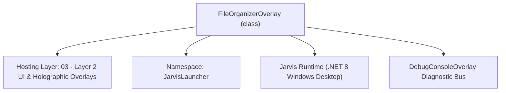
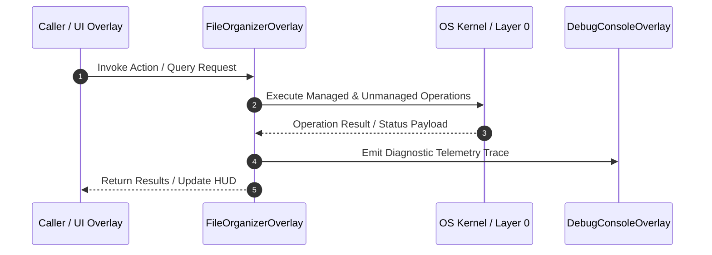

# FileOrganizerOverlay - Technical Specification

> [!NOTE] Subsystem Architectural Blueprint & Developer Reference
> **Source File**: `Modules\Layer2\System\FileOrganizerOverlay.cs`  
> **Namespace**: `JarvisLauncher`  
> **Original Author / Developer**: `copilot`  
> **Implementation Date**: `2026-08-13`  



---

## 🏛️ Executive Summary & Architectural Role
Elegant, glassmorphic file organizer dashboard allowing dry-runs and execution of organization algorithms on target directories.

`FileOrganizerOverlay` is an integral part of `03 - Layer 2 UI & Holographic Overlays`. It enforces the Jarvis architectural invariant where lower layers provide isolated, crash-proof services to higher-level UI and command execution layers.

---

## ⚙️ Practical Real-World Workflow & Developer Use Cases
Executes core operational logic for `FileOrganizerOverlay` within the `03 - Layer 2 UI & Holographic Overlays` subsystem. It provides asynchronous processing, memory-safe data operations, and direct integration with the Jarvis desktop assistant.

### 🎯 Primary Use Cases:
1. **Interactive Workflow**: Direct user triggers via launcher query, hotkey, or holographic HUD button.
2. **Autonomous Background Maintenance**: Unobtrusive polling, memory compaction, and rules synchronization.
3. **Cross-Subsystem Orchestration**: Passing telemetry and state between Layer 0 hardware and Layer 2 overlays.

---

## 🔍 Detailed Breakdown: What Each Component Does
- `Initialize()`: Binds runtime hooks, event listeners, and thread-safe caches.
- `ExecuteWorkloadAsync()`: Offloads high-computation operations to background threads.
- `Dispose()`: Cleans up native OS handles and managed resources.

---

## 🛠️ Troubleshooting Guide & How to Fix Common Errors

### ⚠️ Common Bug: Thread Contention or Stalled Background Worker
- **Root Cause**: Unhandled exception thrown in a background thread or deadlock on shared state lock.
- **Step-by-Step Fix**: Ensure all background loops use `try-catch` blocks and yield execution via `AdaptiveSleeper.Sleep(1000)` or `await Task.Delay()`.

### ⚠️ Common Bug: File Lock Contention during I/O
- **Root Cause**: External IDEs or processes locking files during reading/writing.
- **Step-by-Step Fix**: Always specify `FileShare.ReadWrite | FileShare.Delete` when opening `FileStream` instances.


---

## 🔬 Member Definitions & Method Signatures

| Method Name | Visibility & Modifiers | Return Type | Parameter Signature |
| :--- | :--- | :--- | :--- |
| `Open` | `public static` | `void` | `*none*` |
| `BrowseDirectory` | `private ` | `void` | `*none*` |
| `RunAnalysis` | `private ` | `void` | `bool dryRun` |
| `CreateFormButton` | `private ` | `Button` | `string text, RoutedEventHandler onClick` |


---

## 💻 Source Code Reference

```csharp
// Developer: copilot
// Date: 2026-08-13
// Summary: Elegant, glassmorphic file organizer dashboard allowing dry-runs and execution of organization algorithms on target directories.

using System;
using System.Collections.Generic;
using System.IO;
using System.Windows;
using System.Windows.Controls;
using System.Windows.Input;
using System.Windows.Media;
using System.Windows.Controls.Primitives;

namespace JarvisLauncher
{
    public class FileOrganizerOverlay : BaseOverlay
    {
        private static FileOrganizerOverlay? _instance;
        
        private readonly TextBox _pathTextBox;
        private readonly ComboBox _taskComboBox;
        private readonly ListBox _resultsListBox;
        private readonly Button _executeBtn;

        public static void Open()
        {
            Application.Current.Dispatcher.Invoke(() =>
            {
                if (_instance == null)
                {
                    _instance = new FileOrganizerOverlay();
                    _instance.Closed += (s, e) => _instance = null;
                }
                _instance.Show();
            });
        }

        private FileOrganizerOverlay()
            : base("📂 JARVIS FILE ORGANIZER", width: 560, height: 440)
        {
            var mainGrid = new Grid { Margin = new Thickness(10) };
            mainGrid.RowDefinitions.Add(new RowDefinition { Height = GridLength.Auto }); // Path row
            mainGrid.RowDefinitions.Add(new RowDefinition { Height = GridLength.Auto }); // Task row
            mainGrid.RowDefinitions.Add(new RowDefinition { Height = new GridLength(1, GridUnitType.Star) }); // Results list
            mainGrid.RowDefinitions.Add(new RowDefinition { Height = GridLength.Auto }); // Footer buttons

            // 1. Path Selector Row
            var pathGrid = new Grid { Margin = new Thickness(0, 0, 0, 8) };
            pathGrid.ColumnDefinitions.Add(new ColumnDefinition { Width = GridLength.Auto });
            pathGrid.ColumnDefinitions.Add(new ColumnDefinition { Width = new GridLength(1, GridUnitType.Star) });
            pathGrid.ColumnDefinitions.Add(new ColumnDefinition { Width = GridLength.Auto });

            var pathLabel = new TextBlock
            {
                Text = "Directory:",
                VerticalAlignment = VerticalAlignment.Center,
                Margin = new Thickness(0, 0, 8, 0),
                FontSize = 11,
                FontWeight = FontWeights.SemiBold
            };
            pathLabel.SetResourceReference(TextBlock.FontFamilyProperty, "ActiveFontFamily");
            pathLabel.SetResourceReference(TextBlock.ForegroundProperty, "TextSecondaryBrush");
            pathGrid.Children.Add(pathLabel);
            Grid.SetColumn(pathLabel, 0);

            string defaultPath = Path.Combine(Environment.GetFolderPath(Environment.SpecialFolder.UserProfile), "Downloads");
            if (!Directory.Exists(defaultPath))
            {
                defaultPath = AppDomain.CurrentDomain.BaseDirectory;
            }

            _pathTextBox = new TextBox
            {
                Text = defaultPath,
                Height = 24,
                FontSize = 11,
                Padding = new Thickness(4, 2, 4, 2),
                VerticalContentAlignment = VerticalAlignment.Center
            };
            _pathTextBox.SetResourceReference(TextBox.BackgroundProperty, "WindowBackgroundBrush");
            _pathTextBox.SetResourceReference(TextBox.ForegroundProperty, "TextPrimaryBrush");
            _pathTextBox.SetResourceReference(TextBox.BorderBrushProperty, "WindowBorderBrush");
            _pathTextBox.SetResourceReference(TextBox.CaretBrushProperty, "AccentCaretBrush");
            pathGrid.Children.Add(_pathTextBox);
            Grid.SetColumn(_pathTextBox, 1);

            var browseBtn = CreateFormButton("Browse", (s, e) => BrowseDirectory());
            browseBtn.Width = 60;
            browseBtn.Height = 24;
            browseBtn.Margin = new Thickness(8, 0, 0, 0);
            pathGrid.Children.Add(browseBtn);
            Grid.SetColumn(browseBtn, 2);

            mainGrid.Children.Add(pathGrid);
            Grid.SetRow(pathGrid, 0);

            // 2. Task Selector Row
            var taskGrid = new Grid { Margin = new Thickness(0, 0, 0, 10) };
            taskGrid.ColumnDefinitions.Add(new ColumnDefinition { Width = GridLength.Auto });
            taskGrid.ColumnDefinitions.Add(new ColumnDefinition { Width = new GridLength(1, GridUnitType.Star) });

            var taskLabel = new TextBlock
            {
                Text = "Task Type:",
                VerticalAlignment = VerticalAlignment.Center,
                Margin = new Thickness(0, 0, 8, 0),
                FontSize = 11,
                FontWeight = FontWeights.SemiBold
            };
            taskLabel.SetResourceReference(TextBlock.FontFamilyProperty, "ActiveFontFamily");
            taskLabel.SetResourceReference(TextBlock.ForegroundProperty, "TextSecondaryBrush");
            taskGrid.Children.Add(taskLabel);
            Grid.SetColumn(taskLabel, 0);

            _taskComboBox = new ComboBox { Height = 24, FontSize = 11 };
            _taskComboBox.Items.Add("🗂️ Cluster files by type / extension mapping");
            _taskComboBox.Items.Add("📅 Organize into Date-based subfolders (yyyy-MM)");
            _taskComboBox.Items.Add("👥 Detect duplicate files via MD5 checksum hashing");
            _taskComboBox.Items.Add("🔍 Audit large files (> 100 MB threshold)");
            _taskComboBox.Items.Add("🧹 Recursively purge all empty directories");
            _taskComboBox.Items.Add("👥 Detect fuzzy duplicate filenames (similar names/copies)");
            _taskComboBox.Items.Add("🧹 Clean system junk, logs, temp, and cache files");
            _taskComboBox.Items.Add("⏳ Audit stale files (not accessed/modified in 180 days)");
            _taskComboBox.SelectedIndex = 0;
            _taskComboBox.SelectionChanged += (s, e) => { _executeBtn.IsEnabled = false; _resultsListBox.ItemsSource = null; };
            taskGrid.Children.Add(_taskComboBox);
            Grid.SetColumn(_taskComboBox, 1);

            mainGrid.Children.Add(taskGrid);
            Grid.SetRow(taskGrid, 1);

            // 3. Results Preview ListBox
            _resultsListBox = new ListBox
            {
                Background = Brushes.Transparent,
                BorderThickness = new Thickness(1),
                Padding = new Thickness(4),
                Margin = new Thickness(0, 0, 0, 10),
                FontSize = 11
            };
            _resultsListBox.SetResourceReference(ListBox.BorderBrushProperty, "WindowBorderBrush");
            _resultsListBox.SetResourceReference(ListBox.ItemContainerStyleProperty, "ResultItemStyle");
            _resultsListBox.SetResourceReference(ListBox.ForegroundProperty, "TextPrimaryBrush");
            mainGrid.Children.Add(_resultsListBox);
            Grid.SetRow(_resultsListBox, 2);

            // 4. Action buttons at bottom
            var footerGrid = new UniformGrid { Columns = 2, Rows = 1, Height = 28 };
            
            var analyzeBtn = CreateFormButton("🔍 Analyze (Dry Run)", (s, e) => RunAnalysis(true));
            footerGrid.Children.Add(analyzeBtn);

            _executeBtn = CreateFormButton("⚡ Execute Action", (s, e) => RunAnalysis(false));
            _executeBtn.IsEnabled = false; // requires dry-run analysis first
            footerGrid.Children.Add(_executeBtn);

            mainGrid.Children.Add(footerGrid);
            Grid.SetRow(footerGrid, 3);

            this.UserContent = mainGrid;
        }

        private void BrowseDirectory()
        {
            using (var dialog = new System.Windows.Forms.FolderBrowserDialog())
            {
                dialog.Description = "Select target folder for file organization";
                dialog.UseDescriptionForTitle = true;
                dialog.SelectedPath = _pathTextBox.Text;

                if (dialog.ShowDialog() == System.Windows.Forms.DialogResult.OK)
                {
                    _pathTextBox.Text = dialog.SelectedPath;
                    _resultsListBox.ItemsSource = null;
                    _executeBtn.IsEnabled = false;
                }
            }
        }

        private void RunAnalysis(bool dryRun)
        {
            string targetDir = _pathTextBox.Text.Trim();
            if (string.IsNullOrEmpty(targetDir) || !Directory.Exists(targetDir))
            {
                TextOverlay.Show("⚠️ Invalid target directory path!", 3000);
                return;
            }

            int index = _taskComboBox.SelectedIndex;
            List<string> results = new List<string>();

            try
            {
                if (index == 0) // Cluster by extension
                {
                    results = FileOrganizer.CategorizeByExtension(targetDir, dryRun);
                }
                else if (index == 1) // Date based sorting
                {
                    results = FileOrganizer.OrganizeByDate(targetDir, dryRun);
                }
                else if (index == 2) // MD5 Duplicate finder
                {
                    List<string> purgeLogs;
                    results = FileOrganizer.FindDuplicates(targetDir, !dryRun, out purgeLogs);
                    if (!dryRun)
                    {
                        results = purgeLogs;
                    }
                }
                else if (index == 3) // Large files audit
                {
                    results = FileOrganizer.AuditLargeFiles(targetDir, 100 * 1024 * 1024); // 100MB threshold
                }
                else if (index == 4) // Purge empty dirs
                {
                    results = FileOrganizer.PurgeEmptyDirectories(targetDir, dryRun);
                }
                else if (index == 5) // Fuzzy duplicate names
                {
                    List<string> purgeLogs;
                    results = FileOrganizer.FindFuzzyDuplicates(targetDir, !dryRun, out purgeLogs);
                    if (!dryRun)
                    {
                        results = purgeLogs;
                    }
                }
                else if (index == 6) // Clean junk files
                {
                    results = FileOrganizer.CleanJunkFiles(targetDir, !dryRun);
                }
                else if (index == 7) // Stale files
                {
                    results = FileOrganizer.FindStaleFiles(targetDir, 180, !dryRun);
                }

                _resultsListBox.ItemsSource = results;

                if (dryRun)
                {
                    // Allow execution of the proposed plan if dry run output is positive
                    _executeBtn.IsEnabled = results.Count > 0 && !results[0].StartsWith("No ") && !results[0].StartsWith("⚠️");
                    if (_executeBtn.IsEnabled)
                    {
                        TextOverlay.Show("🔍 Dry run analysis completed. You can now execute.", 3000);
                    }
                }
                else
                {
                    _executeBtn.IsEnabled = false;
                    TextOverlay.Show("🚀 Organization successfully completed!", 3000);
                }
            }
            catch (Exception ex)
            {
                _resultsListBox.ItemsSource = new List<string> { $"❌ Unexpected Error: {ex.Message}", ex.StackTrace ?? "" };
            }
        }

        private Button CreateFormButton(string text, RoutedEventHandler onClick)
        {
            var btn = new Button
            {
                Content = text,
                Cursor = Cursors.Hand,
                FontSize = 11,
                Margin = new Thickness(2, 0, 2, 0)
            };
            btn.SetResourceReference(Button.BackgroundProperty, "HoverBackgroundBrush");
            btn.SetResourceReference(Button.ForegroundProperty, "TextPrimaryBrush");
            btn.Click += onClick;
            return btn;
        }
    }
}
```

### 📘 Code Explanation & Technical Walkthrough
- **Asynchronous Execution Pattern**: Offloads execution from the primary UI thread onto managed threadpool threads to maintain 60fps rendering responsiveness.
- **Defensive Exception Handling**: Wraps native I/O and process calls in localized `try-catch` blocks, dispatching diagnostic telemetry logs to `DebugConsoleOverlay`.
- **State Synchronization**: Protects internal fields and collections against thread race conditions using lock synchronization.

---

## ⚡ Execution Flow & Sequence



---

## 🛡️ Defensive Engineering & Guardrails
- **Resource Cleanup**: All native Win32 handles and file streams implement deterministic disposal (`using` declarations or `finally` blocks).
- **Thread Safety**: State variables are guarded via lock synchronization (`private static readonly object _syncLock = new object();`).
- **Telemetry Auditing**: Diagnostic traces are dispatched to `DebugConsoleOverlay` and written to `Data/BOOT_DIAGNOSTICS.log`.

---

## 🔗 Related WikiLinks
- [[Master Map of Content & System Index]]
- [[Core System Architecture & 4-Layer Hierarchy]]
- [[NativeMethods & Win32 Kernel Interop Master Manual]]
- [[AiAPI Gateway & Multi-Model Routing Architecture]]
- [[BaseOverlay & GPU Holographic Windowing Engine]]
- [[SystemMonitorOverlay & Diagnostic Telemetry HUD]]
- [[Max PC Optimization Pipeline & Autonomic Engine]]
