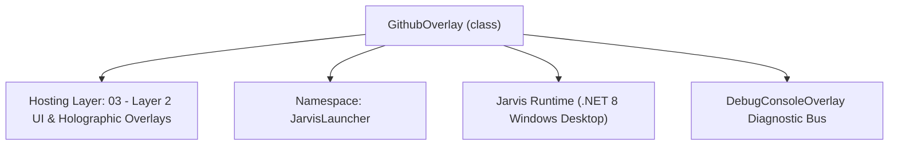
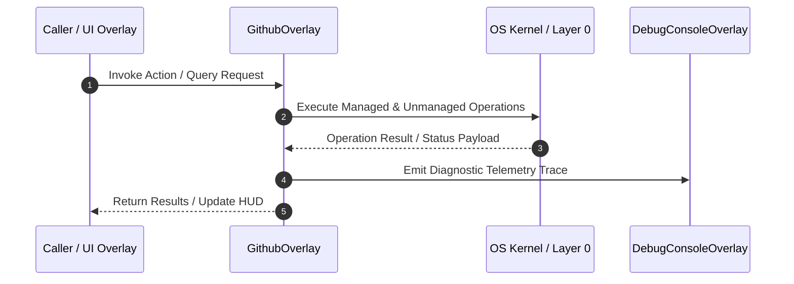

# GithubOverlay - Technical Specification

> [!NOTE] Subsystem Architectural Blueprint & Developer Reference
> **Source File**: `Modules\Layer2\System\GithubOverlay.cs`  
> **Namespace**: `JarvisLauncher`  
> **Original Author / Developer**: `heaplyn`  
> **Implementation Date**: `2026-08-17`  



---

## 🏛️ Executive Summary & Architectural Role
Glassmorphic GitHub & Repository Management Studio.
          Integrates AI commit generation, status tracking, and 1-click sync.

`GithubOverlay` is an integral part of `03 - Layer 2 UI & Holographic Overlays`. It enforces the Jarvis architectural invariant where lower layers provide isolated, crash-proof services to higher-level UI and command execution layers.

---

## ⚙️ Practical Real-World Workflow & Developer Use Cases
Executes core operational logic for `GithubOverlay` within the `03 - Layer 2 UI & Holographic Overlays` subsystem. It provides asynchronous processing, memory-safe data operations, and direct integration with the Jarvis desktop assistant.

### 🎯 Primary Use Cases:
1. **Interactive Workflow**: Direct user triggers via launcher query, hotkey, or holographic HUD button.
2. **Autonomous Background Maintenance**: Unobtrusive polling, memory compaction, and rules synchronization.
3. **Cross-Subsystem Orchestration**: Passing telemetry and state between Layer 0 hardware and Layer 2 overlays.

---

## 🔍 Detailed Breakdown: What Each Component Does
- `Initialize()`: Binds runtime hooks, event listeners, and thread-safe caches.
- `ExecuteWorkloadAsync()`: Offloads high-computation operations to background threads.
- `Dispose()`: Cleans up native OS handles and managed resources.

---

## 🛠️ Troubleshooting Guide & How to Fix Common Errors

### ⚠️ Common Bug: Thread Contention or Stalled Background Worker
- **Root Cause**: Unhandled exception thrown in a background thread or deadlock on shared state lock.
- **Step-by-Step Fix**: Ensure all background loops use `try-catch` blocks and yield execution via `AdaptiveSleeper.Sleep(1000)` or `await Task.Delay()`.

### ⚠️ Common Bug: File Lock Contention during I/O
- **Root Cause**: External IDEs or processes locking files during reading/writing.
- **Step-by-Step Fix**: Always specify `FileShare.ReadWrite | FileShare.Delete` when opening `FileStream` instances.


---

## 🔬 Member Definitions & Method Signatures

| Method Name | Visibility & Modifiers | Return Type | Parameter Signature |
| :--- | :--- | :--- | :--- |
| `ShowOverlay` | `public static` | `void` | `*none*` |
| `RefreshRepoData` | `private async` | `void` | `*none*` |
| `RunGitAction` | `private async` | `void` | `string cmd` |
| `PushManual` | `private async` | `void` | `*none*` |
| `PushWithAi` | `private async` | `void` | `*none*` |
| `RunGit` | `private async` | `Task<string>` | `string args` |
| `GetProjectRoot` | `private ` | `string` | `*none*` |
| `CreateLinkButton` | `private static` | `Button` | `string content, string url` |


---

## 💻 Source Code Reference

```csharp
// Developer: heaplyn
// Date: 2026-08-17
// Summary: Glassmorphic GitHub & Repository Management Studio.
//          Integrates AI commit generation, status tracking, and 1-click sync.

using System;
using System.Collections.Generic;
using System.Diagnostics;
using System.IO;
using System.Linq;
using System.Text;
using System.Threading.Tasks;
using System.Windows;
using System.Windows.Controls;
using System.Windows.Controls.Primitives;
using System.Windows.Input;
using System.Windows.Media;

namespace JarvisLauncher
{
    public class GithubOverlay : BaseOverlay
    {
        private static GithubOverlay? _instance;

        private TextBlock _branchText = null!;
        private TextBlock _statusSummary = null!;
        private StackPanel _commitStack = null!;
        private TextBox _commitMsgBox = null!;
        private Button _syncBtn = null!;
        private Button _aiPushBtn = null!;

        public static void ShowOverlay()
        {
            Application.Current.Dispatcher.Invoke(() =>
            {
                if (_instance == null || !_instance.IsLoaded) _instance = new GithubOverlay();
                _instance.Show();
                _instance.BringToFront();
                _instance.RefreshRepoData();
            });
        }

        public GithubOverlay()
            : base("GITHUB REPOSITORY STUDIO", width: 620, height: 650)
        {
            var workArea = SystemParameters.WorkArea;
            this.Left = (workArea.Width - this.Width) / 2;
            this.Top = (workArea.Height - this.Height) / 2;

            var root = new Grid { Margin = new Thickness(15) };
            root.RowDefinitions.Add(new RowDefinition { Height = GridLength.Auto }); // Header Info
            root.RowDefinitions.Add(new RowDefinition { Height = new GridLength(1, GridUnitType.Star) }); // Commits/Changes
            root.RowDefinitions.Add(new RowDefinition { Height = GridLength.Auto }); // Commit Input
            root.RowDefinitions.Add(new RowDefinition { Height = GridLength.Auto }); // Actions

            // ── 1. Repository Header ──────────────────────────────────────────────
            var header = new StackPanel { Margin = new Thickness(0, 0, 0, 15) };
            _branchText = new TextBlock { Text = "Branch: loading...", FontSize = 14, FontWeight = FontWeights.Bold, Foreground = Brushes.Cyan };
            header.Children.Add(_branchText);

            _statusSummary = new TextBlock { Text = "Status: Calculating drift...", FontSize = 11, Foreground = Brushes.Gray, Margin = new Thickness(0, 4, 0, 0) };
            header.Children.Add(_statusSummary);

            var openRepoBtn = CreateLinkButton("🔗 View on GitHub.com", "https://github.com/Heaplyn/Jarvis");
            header.Children.Add(openRepoBtn);

            Grid.SetRow(header, 0);
            root.Children.Add(header);

            // ── 2. Commits & Changes List ──────────────────────────────────────────
            var scroll = new ScrollViewer { VerticalScrollBarVisibility = ScrollBarVisibility.Auto, Margin = new Thickness(0, 0, 0, 10) };
            _commitStack = new StackPanel();
            scroll.Content = _commitStack;
            Grid.SetRow(scroll, 1);
            root.Children.Add(scroll);

            // ── 3. Commit Input ──────────────────────────────────────────────────
            var inputArea = new StackPanel { Margin = new Thickness(0, 10, 0, 10) };
            inputArea.Children.Add(new TextBlock { Text = "COMMIT MESSAGE", FontSize = 10, FontWeight = FontWeights.Bold, Foreground = Brushes.DimGray, Margin = new Thickness(0,0,0,4) });

            _commitMsgBox = new TextBox {
                AcceptsReturn = true, TextWrapping = TextWrapping.Wrap, Height = 60, FontSize = 13, Padding = new Thickness(8),
                Background = new SolidColorBrush(Color.FromArgb(30, 255, 255, 255)), Foreground = Brushes.White, BorderThickness = new Thickness(1), BorderBrush = Brushes.DimGray
            };
            inputArea.Children.Add(_commitMsgBox);

            Grid.SetRow(inputArea, 2);
            root.Children.Add(inputArea);

            // ── 4. Actions ───────────────────────────────────────────────────────
            var actions = new UniformGrid { Columns = 3, Height = 45 };

            _syncBtn = CreateStyledButton("🔄 Pull Updates", (s, e) => RunGitAction("pull"));
            actions.Children.Add(_syncBtn);

            var manualPushBtn = CreateStyledButton("🚀 Manual Push", (s, e) => PushManual(), isPrimary: true);
            actions.Children.Add(manualPushBtn);

            _aiPushBtn = CreateStyledButton("🧠 AI Push", (s, e) => PushWithAi(), isPrimary: true);
            _aiPushBtn.Background = new SolidColorBrush(Color.FromArgb(100, 138, 43, 226)); // Purple AI tint
            actions.Children.Add(_aiPushBtn);

            Grid.SetRow(actions, 3);
            root.Children.Add(actions);

            this.UserContent = root;
        }

        private async void RefreshRepoData()
        {
            _branchText.Text = "Branch: " + await RunGit("rev-parse --abbrev-ref HEAD");
            _statusSummary.Text = "Status: Synchronizing with remote...";

            _commitStack.Children.Clear();
            _commitStack.Children.Add(new TextBlock { Text = "RECENT COMMITS", FontSize = 10, FontWeight = FontWeights.Bold, Foreground = Brushes.DimGray, Margin = new Thickness(0,0,0,8) });

            string logs = await RunGit("log --oneline -n 12");
            foreach (var line in logs.Split('\n', StringSplitOptions.RemoveEmptyEntries))
            {
                var border = new Border { Padding = new Thickness(10, 8, 10, 8), Margin = new Thickness(0, 0, 0, 4), CornerRadius = new CornerRadius(6), Background = new SolidColorBrush(Color.FromArgb(15, 255, 255, 255)) };
                var sp = new StackPanel();
                var parts = line.Split(' ', 2);
                sp.Children.Add(new TextBlock { Text = parts[0], Foreground = Brushes.Cyan, FontSize = 10, FontWeight = FontWeights.Bold });
                if (parts.Length > 1) sp.Children.Add(new TextBlock { Text = parts[1], Foreground = Brushes.White, FontSize = 12, TextWrapping = TextWrapping.Wrap });
                border.Child = sp;
                _commitStack.Children.Add(border);
            }

            string status = await RunGit("status -s");
            _statusSummary.Text = string.IsNullOrWhiteSpace(status) ? "Status: ✅ Repository Clean" : $"Status: ⚠️ {status.Split('\n').Length} Uncommitted Changes";
        }

        private async void RunGitAction(string cmd)
        {
            TextOverlay.Show($"⚡ Git: {cmd}...", 2000);
            string res = await RunGit(cmd);
            CliOutputOverlay.Show($"Git {cmd}", res);
            RefreshRepoData();
        }

        private async void PushManual()
        {
            string msg = _commitMsgBox.Text.Trim();
            if (string.IsNullOrEmpty(msg)) { TextOverlay.Show("⚠️ Please enter a commit message.", 2500); return; }

            _commitMsgBox.Text = "";
            TextOverlay.Show("🚀 Pushing to GitHub...", 3000);
            await RunGit("add .");
            await RunGit($"commit -m \"{msg}\"");
            string res = await RunGit("push origin HEAD");
            CliOutputOverlay.Show("GitHub Push", res);
            RefreshRepoData();
        }

        private async void PushWithAi()
        {
            TextOverlay.Show("🧠 AI is analyzing changes...", 3000);
            string diff = await RunGit("diff HEAD");
            if (string.IsNullOrWhiteSpace(diff)) { TextOverlay.Show("✅ No changes to push.", 2500); return; }

            string prompt = $"Write a 1-line professional git commit message for these changes:\n\n{diff.Take(4000)}";
            string aiMsg = await CoreRegistry.Intelligence.Llm.AskAsync(prompt);
            aiMsg = aiMsg.Trim().Replace("\"", "");

            _commitMsgBox.Text = aiMsg;
            TextOverlay.Show($"✨ AI generated: {aiMsg}", 4000);
        }

        private async Task<string> RunGit(string args)
        {
            try {
                var psi = new ProcessStartInfo {
                    FileName = "git", Arguments = args, WorkingDirectory = GetProjectRoot(),
                    UseShellExecute = false, RedirectStandardOutput = true, CreateNoWindow = true
                };
                using var proc = Process.Start(psi);
                if (proc == null) return "Error starting git.";
                return (await proc.StandardOutput.ReadToEndAsync()).Trim();
            } catch (Exception ex) { return "Git Error: " + ex.Message; }
        }

        private string GetProjectRoot()
        {
            string devPath = Path.GetFullPath(Path.Combine(AppDomain.CurrentDomain.BaseDirectory, @"..\..\.."));
            return Directory.Exists(Path.Combine(devPath, ".git")) ? devPath : AppDomain.CurrentDomain.BaseDirectory;
        }

        private static Button CreateLinkButton(string content, string url) { var b = new Button { Content = content, Background = Brushes.Transparent, BorderThickness = new Thickness(0,0,0,1), Foreground = Brushes.Cyan, Cursor = Cursors.Hand, HorizontalAlignment = HorizontalAlignment.Left, FontSize = 10 }; b.Click += (s, e) => Process.Start(new ProcessStartInfo { FileName = url, UseShellExecute = true }); return b; }
    }
}
```

### 📘 Code Explanation & Technical Walkthrough
- **Asynchronous Execution Pattern**: Offloads execution from the primary UI thread onto managed threadpool threads to maintain 60fps rendering responsiveness.
- **Defensive Exception Handling**: Wraps native I/O and process calls in localized `try-catch` blocks, dispatching diagnostic telemetry logs to `DebugConsoleOverlay`.
- **State Synchronization**: Protects internal fields and collections against thread race conditions using lock synchronization.

---

## ⚡ Execution Flow & Sequence



---

## 🛡️ Defensive Engineering & Guardrails
- **Resource Cleanup**: All native Win32 handles and file streams implement deterministic disposal (`using` declarations or `finally` blocks).
- **Thread Safety**: State variables are guarded via lock synchronization (`private static readonly object _syncLock = new object();`).
- **Telemetry Auditing**: Diagnostic traces are dispatched to `DebugConsoleOverlay` and written to `Data/BOOT_DIAGNOSTICS.log`.

---

## 🔗 Related WikiLinks
- [[Master Map of Content & System Index]]
- [[Core System Architecture & 4-Layer Hierarchy]]
- [[NativeMethods & Win32 Kernel Interop Master Manual]]
- [[AiAPI Gateway & Multi-Model Routing Architecture]]
- [[BaseOverlay & GPU Holographic Windowing Engine]]
- [[SystemMonitorOverlay & Diagnostic Telemetry HUD]]
- [[Max PC Optimization Pipeline & Autonomic Engine]]
