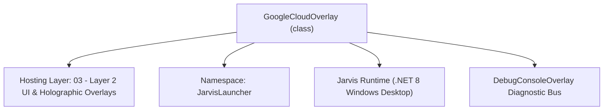
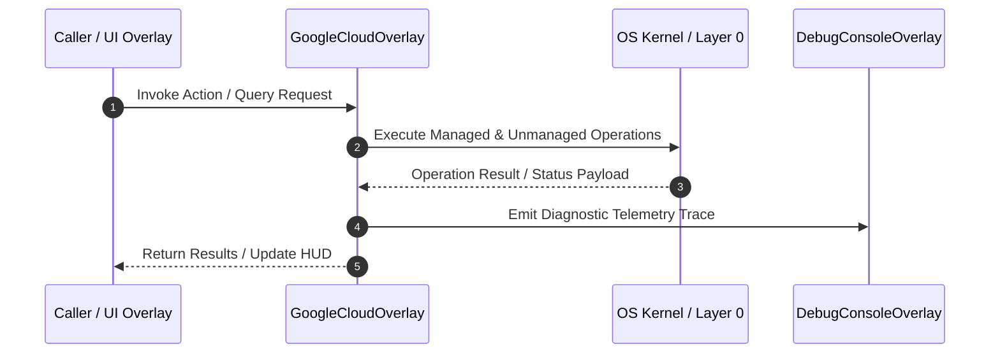

# GoogleCloudOverlay - Technical Specification

> [!NOTE] Subsystem Architectural Blueprint & Developer Reference
> **Source File**: `Modules\Layer2\System\GoogleCloudOverlay.cs`  
> **Namespace**: `JarvisLauncher`  
> **Original Author / Developer**: `heaplyn`  
> **Implementation Date**: `2026-08-18`  



---

## 🏛️ Executive Summary & Architectural Role
Interactive Management Dashboard for Google Cloud Platform Services.
          Replicated "APIs & Services" console feel with Traffic/Error metrics.
          Integrated Gemini Cloud Assist for automated GCP orchestration.

`GoogleCloudOverlay` is an integral part of `03 - Layer 2 UI & Holographic Overlays`. It enforces the Jarvis architectural invariant where lower layers provide isolated, crash-proof services to higher-level UI and command execution layers.

---

## ⚙️ Practical Real-World Workflow & Developer Use Cases
Executes core operational logic for `GoogleCloudOverlay` within the `03 - Layer 2 UI & Holographic Overlays` subsystem. It provides asynchronous processing, memory-safe data operations, and direct integration with the Jarvis desktop assistant.

### 🎯 Primary Use Cases:
1. **Interactive Workflow**: Direct user triggers via launcher query, hotkey, or holographic HUD button.
2. **Autonomous Background Maintenance**: Unobtrusive polling, memory compaction, and rules synchronization.
3. **Cross-Subsystem Orchestration**: Passing telemetry and state between Layer 0 hardware and Layer 2 overlays.

---

## 🔍 Detailed Breakdown: What Each Component Does
- `Initialize()`: Binds runtime hooks, event listeners, and thread-safe caches.
- `ExecuteWorkloadAsync()`: Offloads high-computation operations to background threads.
- `Dispose()`: Cleans up native OS handles and managed resources.

---

## 🛠️ Troubleshooting Guide & How to Fix Common Errors

### ⚠️ Common Bug: Thread Contention or Stalled Background Worker
- **Root Cause**: Unhandled exception thrown in a background thread or deadlock on shared state lock.
- **Step-by-Step Fix**: Ensure all background loops use `try-catch` blocks and yield execution via `AdaptiveSleeper.Sleep(1000)` or `await Task.Delay()`.

### ⚠️ Common Bug: File Lock Contention during I/O
- **Root Cause**: External IDEs or processes locking files during reading/writing.
- **Step-by-Step Fix**: Always specify `FileShare.ReadWrite | FileShare.Delete` when opening `FileStream` instances.


---

## 🔬 Member Definitions & Method Signatures

| Method Name | Visibility & Modifiers | Return Type | Parameter Signature |
| :--- | :--- | :--- | :--- |
| `ShowOverlay` | `public static` | `void` | `*none*` |
| `SwitchTab` | `private ` | `void` | `string tab` |
| `RunAssistQuery` | `private async` | `Task` | `*none*` |
| `RefreshDashboard` | `private async` | `Task` | `*none*` |
| `RefreshFiles` | `private async` | `Task` | `*none*` |
| `RunTranslation` | `private async` | `Task` | `string l` |
| `PromptUpload` | `private ` | `void` | `*none*` |
| `PromptVision` | `private ` | `void` | `*none*` |
| `CreateMetricCard` | `private ` | `Border` | `string title, out TextBlock valLabel, Brush color` |
| `CreateSidebarItem` | `private ` | `UIElement` | `string text, Action onClick` |
| `CreateHeader` | `private static` | `TextBlock` | `string t` |
| `CreateSmallBtn` | `private ` | `Button` | `string c, RoutedEventHandler h` |


---

## 💻 Source Code Reference

```csharp
// Developer: heaplyn
// Date: 2026-08-18
// Summary: Interactive Management Dashboard for Google Cloud Platform Services.
//          Replicated "APIs & Services" console feel with Traffic/Error metrics.
//          Integrated Gemini Cloud Assist for automated GCP orchestration.

using System;
using System.Collections.Generic;
using System.IO;
using System.Linq;
using System.Threading.Tasks;
using System.Windows;
using System.Windows.Controls;
using System.Windows.Media;
using System.Windows.Input;
using System.Windows.Shapes;
using System.Windows.Controls.Primitives;

namespace JarvisLauncher
{
    public class GoogleCloudOverlay : BaseOverlay
    {
        private static GoogleCloudOverlay? _instance;
        private readonly StackPanel _fileListPanel;
        private readonly StackPanel _servicesListPanel;
        private readonly TextBox _translationInput;
        private readonly TextBlock _translationOutput;
        private readonly TextBox _assistInput;
        private readonly TextBlock _assistOutput;
        private readonly TextBlock _trafficLabel;
        private readonly TextBlock _errorLabel;
        private readonly Border _dashboardPanel;
        private readonly Border _storagePanel;
        private readonly Border _translationPanel;
        private readonly Border _visionPanel;
        private readonly Border _assistPanel;

        public static void ShowOverlay()
        {
            Application.Current.Dispatcher.Invoke(() => {
                if (_instance == null || !_instance.IsLoaded) _instance = new GoogleCloudOverlay();
                _instance.Show(); _instance.BringToFront();
            });
        }

        private GoogleCloudOverlay() : base("💠 GOOGLE CLOUD COMMAND CENTER", 950, 750)
        {
            _instance = this;
            var layoutGrid = new Grid { Margin = new Thickness(10) };
            layoutGrid.ColumnDefinitions.Add(new ColumnDefinition { Width = new GridLength(220) }); // Sidebar
            layoutGrid.ColumnDefinitions.Add(new ColumnDefinition { Width = new GridLength(1, GridUnitType.Star) }); // Content

            // --- Sidebar (Like GCP Console) ---
            var sidebar = new StackPanel { Background = new SolidColorBrush(Color.FromArgb(20, 0, 0, 0)), Margin = new Thickness(0,0,10,0) };
            sidebar.Children.Add(CreateSidebarItem("📊 Dashboard", () => SwitchTab("DASH")));
            sidebar.Children.Add(CreateSidebarItem("🤖 Gemini Cloud Assist", () => SwitchTab("ASSIST")));
            sidebar.Children.Add(CreateSidebarItem("🗄️ Cloud Storage", () => SwitchTab("STORAGE")));
            sidebar.Children.Add(CreateSidebarItem("🌐 Translation", () => SwitchTab("TRANS")));
            sidebar.Children.Add(CreateSidebarItem("👁️ Vision AI", () => SwitchTab("VISION")));
            sidebar.Children.Add(new Separator { Background = Brushes.DimGray, Margin = new Thickness(10,15,10,15) });
            sidebar.Children.Add(CreateSidebarItem("🔑 Credentials", () => SettingsOverlay.OpenSettings()));

            Grid.SetColumn(sidebar, 0); layoutGrid.Children.Add(sidebar);

            // --- Content Area ---
            var contentGrid = new Grid();
            Grid.SetColumn(contentGrid, 1); layoutGrid.Children.Add(contentGrid);

            // 1. Tab: Dashboard (Metrics)
            _dashboardPanel = new Border();
            var dashStack = new StackPanel();
            dashStack.Children.Add(CreateHeader("Project Health Overview"));
            var metricsGrid = new UniformGrid { Columns = 2, Margin = new Thickness(0,20,0,20) };
            metricsGrid.Children.Add(CreateMetricCard("Traffic", out _trafficLabel, Brushes.SpringGreen));
            metricsGrid.Children.Add(CreateMetricCard("Errors", out _errorLabel, Brushes.Tomato));
            dashStack.Children.Add(metricsGrid);
            dashStack.Children.Add(CreateHeader("Recent API Activity"));
            _servicesListPanel = new StackPanel();
            dashStack.Children.Add(new ScrollViewer { Content = _servicesListPanel, Height = 300 });
            _dashboardPanel.Child = dashStack;
            contentGrid.Children.Add(_dashboardPanel);

            // 2. Tab: Assist
            _assistPanel = new Border { Visibility = Visibility.Collapsed };
            var assistStack = new StackPanel();
            assistStack.Children.Add(CreateHeader("Gemini Cloud Assist"));
            assistStack.Children.Add(new TextBlock { Text = "Ask Gemini to manage infrastructure, analyze costs, or investigate issues.", Foreground = Brushes.Gray, Margin = new Thickness(0,0,0,10) });
            _assistInput = new TextBox { Height = 100, TextWrapping = TextWrapping.Wrap, Margin = new Thickness(0,0,0,10), Background = new SolidColorBrush(Color.FromArgb(40, 0,0,0)), Foreground = Brushes.White, Padding = new Thickness(8) };
            assistStack.Children.Add(_assistInput);
            assistStack.Children.Add(CreateSmallBtn("🧠 Ask Cloud Assist", async (s, e) => await RunAssistQuery()));
            _assistOutput = new TextBlock { Margin = new Thickness(0,20,0,0), TextWrapping = TextWrapping.Wrap, Foreground = Brushes.Cyan };
            assistStack.Children.Add(new ScrollViewer { Content = _assistOutput, Height = 300 });
            _assistPanel.Child = assistStack;
            contentGrid.Children.Add(_assistPanel);

            // 3. Tab: Storage
            _storagePanel = new Border { Visibility = Visibility.Collapsed };
            var storageStack = new StackPanel();
            storageStack.Children.Add(CreateHeader("Cloud Storage Browser"));
            var storageTools = new StackPanel { Orientation = Orientation.Horizontal, Margin = new Thickness(0,5,0,10) };
            storageTools.Children.Add(CreateSmallBtn("🔄 Refresh", async (s, e) => await RefreshFiles()));
            storageTools.Children.Add(CreateSmallBtn("📤 Upload", (s, e) => PromptUpload()));
            storageStack.Children.Add(storageTools);
            _fileListPanel = new StackPanel();
            storageStack.Children.Add(new ScrollViewer { Content = _fileListPanel, Height = 450 });
            _storagePanel.Child = storageStack;
            contentGrid.Children.Add(_storagePanel);

            // 4. Tab: Translation
            _translationPanel = new Border { Visibility = Visibility.Collapsed };
            var transStack = new StackPanel();
            transStack.Children.Add(CreateHeader("Translation Studio"));
            _translationInput = new TextBox { Height = 80, TextWrapping = TextWrapping.Wrap, Margin = new Thickness(0,5,0,10), Background = new SolidColorBrush(Color.FromArgb(40,0,0,0)), Foreground = Brushes.White, Padding = new Thickness(8) };
            transStack.Children.Add(_translationInput);
            var transBar = new StackPanel { Orientation = Orientation.Horizontal };
            transBar.Children.Add(CreateSmallBtn("English", async (s, e) => await RunTranslation("en")));
            transBar.Children.Add(CreateSmallBtn("Spanish", async (s, e) => await RunTranslation("es")));
            transStack.Children.Add(transBar);
            _translationOutput = new TextBlock { Margin = new Thickness(0,10,0,0), Foreground = Brushes.Cyan, TextWrapping = TextWrapping.Wrap };
            transStack.Children.Add(_translationOutput);
            _translationPanel.Child = transStack;
            contentGrid.Children.Add(_translationPanel);

            // 5. Tab: Vision
            _visionPanel = new Border { Visibility = Visibility.Collapsed };
            var visionStack = new StackPanel();
            visionStack.Children.Add(CreateHeader("Vision Intelligence"));
            visionStack.Children.Add(CreateSmallBtn("📸 Analyze Image", (s, e) => PromptVision()));
            _visionPanel.Child = visionStack;
            contentGrid.Children.Add(_visionPanel);

            this.UserContent = layoutGrid;
            _ = RefreshDashboard();
        }

        private void SwitchTab(string tab)
        {
            _dashboardPanel.Visibility = tab == "DASH" ? Visibility.Visible : Visibility.Collapsed;
            _assistPanel.Visibility = tab == "ASSIST" ? Visibility.Visible : Visibility.Collapsed;
            _storagePanel.Visibility = tab == "STORAGE" ? Visibility.Visible : Visibility.Collapsed;
            _translationPanel.Visibility = tab == "TRANS" ? Visibility.Visible : Visibility.Collapsed;
            _visionPanel.Visibility = tab == "VISION" ? Visibility.Visible : Visibility.Collapsed;
        }

        private async Task RunAssistQuery()
        {
            string q = _assistInput.Text.Trim(); if (string.IsNullOrEmpty(q)) return;
            _assistOutput.Text = "Querying Gemini Cloud Assist...";
            string res = await GoogleCloudManager.AskCloudAssistAsync(q);
            _assistOutput.Text = res;
        }

        private async Task RefreshDashboard()
        {
            try {
                var metrics = await GoogleCloudManager.GetQuickMetricsAsync();
                _trafficLabel.Text = metrics["Traffic (Requests/sec)"].ToString("N0") + " req/s";
                _errorLabel.Text = metrics["Errors (Last 24h)"].ToString("N0") + " errors";
                _servicesListPanel.Children.Clear();
                var svcs = await GoogleCloudManager.ListEnabledServicesAsync();
                foreach (var s in svcs) _servicesListPanel.Children.Add(new TextBlock { Text = "✅ " + s, Foreground = Brushes.White, Margin = new Thickness(5,2,5,2), FontSize = 12 });
            } catch { }
        }

        private async Task RefreshFiles() {
            _fileListPanel.Children.Clear();
            var objects = await GoogleCloudManager.ListBucketObjectsAsync();
            foreach (var obj in objects) _fileListPanel.Children.Add(new TextBlock { Text = "📄 " + obj, Foreground = Brushes.White, Margin = new Thickness(5), FontSize = 12 });
        }

        private async Task RunTranslation(string l) {
            _translationOutput.Text = "Translating...";
            _translationOutput.Text = await GoogleCloudManager.TranslateTextAsync(_translationInput.Text, l);
        }

        private void PromptUpload() {
            var dlg = new Microsoft.Win32.OpenFileDialog();
            if (dlg.ShowDialog() == true) {
                Task.Run(async () => {
                    bool ok = await GoogleCloudManager.UploadToBucketAsync(dlg.FileName);
                    Application.Current.Dispatcher.Invoke(() => TextOverlay.Show(ok ? "✅ Uploaded" : "❌ Failed", 2000));
                });
            }
        }

        private void PromptVision() {
            var dlg = new Microsoft.Win32.OpenFileDialog { Filter = "Images|*.jpg;*.png" };
            if (dlg.ShowDialog() == true) {
                Task.Run(async () => {
                    string res = await GoogleCloudManager.DetectLabelsAsync(dlg.FileName);
                    Application.Current.Dispatcher.Invoke(() => { ChatOverlay.ShowChat(); ChatOverlay.SubmitTextMessage("Vision: " + res); });
                });
            }
        }

        private Border CreateMetricCard(string title, out TextBlock valLabel, Brush color) {
            var b = new Border { Background = new SolidColorBrush(Color.FromArgb(30, 255,255,255)), Padding = new Thickness(20), Margin = new Thickness(5), CornerRadius = new CornerRadius(8), BorderThickness = new Thickness(1), BorderBrush = Brushes.DimGray };
            var s = new StackPanel();
            s.Children.Add(new TextBlock { Text = title, FontSize = 12, Foreground = Brushes.Gray });
            valLabel = new TextBlock { Text = "...", FontSize = 24, FontWeight = FontWeights.Bold, Foreground = color, Margin = new Thickness(0,10,0,0) };
            s.Children.Add(valLabel);
            b.Child = s; return b;
        }

        private UIElement CreateSidebarItem(string text, Action onClick) {
            var btn = new Button { Content = text, HorizontalContentAlignment = HorizontalAlignment.Left, Padding = new Thickness(15,10,15,10), Background = Brushes.Transparent, BorderThickness = new Thickness(0), Foreground = Brushes.LightGray, Cursor = Cursors.Hand };
            btn.Click += (s, e) => onClick(); return btn;
        }

        private static TextBlock CreateHeader(string t) => new TextBlock { Text = t, FontSize = 16, FontWeight = FontWeights.Bold, Foreground = Brushes.Cyan, Margin = new Thickness(0,0,0,15) };
        private Button CreateSmallBtn(string c, RoutedEventHandler h) => new Button { Content = c, Padding = new Thickness(10,4,10,4), Margin = new Thickness(0,0,5,0), Background = new SolidColorBrush(Color.FromArgb(40, 255,255,255)), Foreground = Brushes.White, FontSize = 10, Cursor = Cursors.Hand };
    }
}
```

### 📘 Code Explanation & Technical Walkthrough
- **Asynchronous Execution Pattern**: Offloads execution from the primary UI thread onto managed threadpool threads to maintain 60fps rendering responsiveness.
- **Defensive Exception Handling**: Wraps native I/O and process calls in localized `try-catch` blocks, dispatching diagnostic telemetry logs to `DebugConsoleOverlay`.
- **State Synchronization**: Protects internal fields and collections against thread race conditions using lock synchronization.

---

## ⚡ Execution Flow & Sequence



---

## 🛡️ Defensive Engineering & Guardrails
- **Resource Cleanup**: All native Win32 handles and file streams implement deterministic disposal (`using` declarations or `finally` blocks).
- **Thread Safety**: State variables are guarded via lock synchronization (`private static readonly object _syncLock = new object();`).
- **Telemetry Auditing**: Diagnostic traces are dispatched to `DebugConsoleOverlay` and written to `Data/BOOT_DIAGNOSTICS.log`.

---

## 🔗 Related WikiLinks
- [[Master Map of Content & System Index]]
- [[Core System Architecture & 4-Layer Hierarchy]]
- [[NativeMethods & Win32 Kernel Interop Master Manual]]
- [[AiAPI Gateway & Multi-Model Routing Architecture]]
- [[BaseOverlay & GPU Holographic Windowing Engine]]
- [[SystemMonitorOverlay & Diagnostic Telemetry HUD]]
- [[Max PC Optimization Pipeline & Autonomic Engine]]
