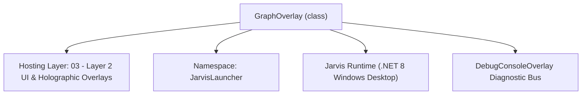
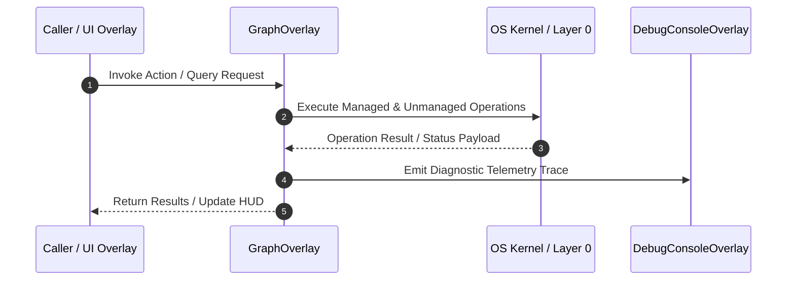

# GraphOverlay - Technical Specification

> [!NOTE] Subsystem Architectural Blueprint & Developer Reference
> **Source File**: `Modules\Layer2\System\GraphOverlay.cs`  
> **Namespace**: `JarvisLauncher`  
> **Original Author / Developer**: `heaplyn`  
> **Implementation Date**: `2026-08-17`  



---

## 🏛️ Executive Summary & Architectural Role
High-performance function plotter for the Calculus Studio.

`GraphOverlay` is an integral part of `03 - Layer 2 UI & Holographic Overlays`. It enforces the Jarvis architectural invariant where lower layers provide isolated, crash-proof services to higher-level UI and command execution layers.

---

## ⚙️ Practical Real-World Workflow & Developer Use Cases
Executes core operational logic for `GraphOverlay` within the `03 - Layer 2 UI & Holographic Overlays` subsystem. It provides asynchronous processing, memory-safe data operations, and direct integration with the Jarvis desktop assistant.

### 🎯 Primary Use Cases:
1. **Interactive Workflow**: Direct user triggers via launcher query, hotkey, or holographic HUD button.
2. **Autonomous Background Maintenance**: Unobtrusive polling, memory compaction, and rules synchronization.
3. **Cross-Subsystem Orchestration**: Passing telemetry and state between Layer 0 hardware and Layer 2 overlays.

---

## 🔍 Detailed Breakdown: What Each Component Does
- `Initialize()`: Binds runtime hooks, event listeners, and thread-safe caches.
- `ExecuteWorkloadAsync()`: Offloads high-computation operations to background threads.
- `Dispose()`: Cleans up native OS handles and managed resources.

---

## 🛠️ Troubleshooting Guide & How to Fix Common Errors

### ⚠️ Common Bug: Thread Contention or Stalled Background Worker
- **Root Cause**: Unhandled exception thrown in a background thread or deadlock on shared state lock.
- **Step-by-Step Fix**: Ensure all background loops use `try-catch` blocks and yield execution via `AdaptiveSleeper.Sleep(1000)` or `await Task.Delay()`.

### ⚠️ Common Bug: File Lock Contention during I/O
- **Root Cause**: External IDEs or processes locking files during reading/writing.
- **Step-by-Step Fix**: Always specify `FileShare.ReadWrite | FileShare.Delete` when opening `FileStream` instances.


---

## 🔬 Member Definitions & Method Signatures

| Method Name | Visibility & Modifiers | Return Type | Parameter Signature |
| :--- | :--- | :--- | :--- |
| `Plot` | `private ` | `void` | `*none*` |


---

## 💻 Source Code Reference

```csharp
// Developer: heaplyn
// Date: 2026-08-17
// Summary: High-performance function plotter for the Calculus Studio.

using System;
using System.Collections.Generic;
using System.Windows;
using System.Windows.Controls;
using System.Windows.Media;
using System.Windows.Shapes;
using System.Linq;

namespace JarvisLauncher
{
    public class GraphOverlay : BaseOverlay
    {
        private readonly Canvas _canvas;
        private string _equation = "";

        public GraphOverlay(string equation) : base($"GRAPH: {equation}", 600, 600)
        {
            _equation = equation;
            _canvas = new Canvas { Background = new SolidColorBrush(Color.FromArgb(20, 0, 0, 0)), Margin = new Thickness(10) };
            this.UserContent = _canvas;
            this.Loaded += (s, e) => Plot();
        }

        private void Plot()
        {
            _canvas.Children.Clear();
            double w = _canvas.ActualWidth;
            double h = _canvas.ActualHeight;
            if (w == 0 || h == 0) return;

            // Draw Axes
            var xAxis = new Line { X1 = 0, Y1 = h / 2, X2 = w, Y2 = h / 2, Stroke = Brushes.Gray, StrokeThickness = 1 };
            var yAxis = new Line { X1 = w / 2, Y1 = 0, X2 = w / 2, Y2 = h, Stroke = Brushes.Gray, StrokeThickness = 1 };
            _canvas.Children.Add(xAxis); _canvas.Children.Add(yAxis);

            // Simple Plotting (x from -10 to 10)
            var points = new List<Point>();
            double scale = 30; // pixels per unit
            for (double x = -10; x <= 10; x += 0.1)
            {
                string expr = _equation.Replace("x", $"({x})");
                string res = CoreRegistry.Intelligence.Math.Evaluate(expr);
                if (double.TryParse(res, out double y))
                {
                    double screenX = (w / 2) + (x * scale);
                    double screenY = (h / 2) - (y * scale);
                    if (screenY >= 0 && screenY <= h) points.Add(new Point(screenX, screenY));
                }
            }

            for (int i = 0; i < points.Count - 1; i++)
            {
                var line = new Line { X1 = points[i].X, Y1 = points[i].Y, X2 = points[i+1].X, Y2 = points[i+1].Y, Stroke = Brushes.Cyan, StrokeThickness = 2 };
                _canvas.Children.Add(line);
            }
        }
    }
}

```

### 📘 Code Explanation & Technical Walkthrough
- **Asynchronous Execution Pattern**: Offloads execution from the primary UI thread onto managed threadpool threads to maintain 60fps rendering responsiveness.
- **Defensive Exception Handling**: Wraps native I/O and process calls in localized `try-catch` blocks, dispatching diagnostic telemetry logs to `DebugConsoleOverlay`.
- **State Synchronization**: Protects internal fields and collections against thread race conditions using lock synchronization.

---

## ⚡ Execution Flow & Sequence



---

## 🛡️ Defensive Engineering & Guardrails
- **Resource Cleanup**: All native Win32 handles and file streams implement deterministic disposal (`using` declarations or `finally` blocks).
- **Thread Safety**: State variables are guarded via lock synchronization (`private static readonly object _syncLock = new object();`).
- **Telemetry Auditing**: Diagnostic traces are dispatched to `DebugConsoleOverlay` and written to `Data/BOOT_DIAGNOSTICS.log`.

---

## 🔗 Related WikiLinks
- [[Master Map of Content & System Index]]
- [[Core System Architecture & 4-Layer Hierarchy]]
- [[NativeMethods & Win32 Kernel Interop Master Manual]]
- [[AiAPI Gateway & Multi-Model Routing Architecture]]
- [[BaseOverlay & GPU Holographic Windowing Engine]]
- [[SystemMonitorOverlay & Diagnostic Telemetry HUD]]
- [[Max PC Optimization Pipeline & Autonomic Engine]]
