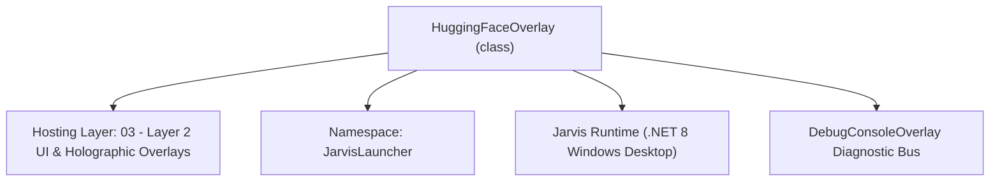
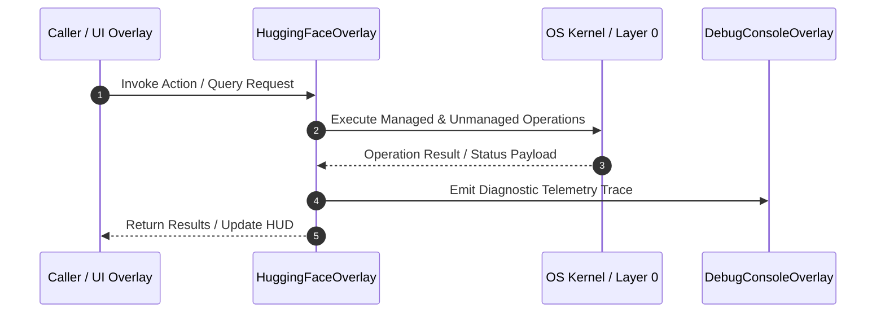

# HuggingFaceOverlay - Technical Specification

> [!NOTE] Subsystem Architectural Blueprint & Developer Reference
> **Source File**: `Modules\Layer2\System\HuggingFaceOverlay.cs`  
> **Namespace**: `JarvisLauncher`  
> **Original Author / Developer**: `heaplyn`  
> **Implementation Date**: `2026-08-13`  



---

## 🏛️ Executive Summary & Architectural Role
Hugging Face Model Hub & Internet Grabber Studio Overlay.
 Provides live model searching, 1-click GGUF downloaders, Hugging Face CLI auto-installer, & Ollama GGUF importer.

`HuggingFaceOverlay` is an integral part of `03 - Layer 2 UI & Holographic Overlays`. It enforces the Jarvis architectural invariant where lower layers provide isolated, crash-proof services to higher-level UI and command execution layers.

---

## ⚙️ Practical Real-World Workflow & Developer Use Cases
Executes core operational logic for `HuggingFaceOverlay` within the `03 - Layer 2 UI & Holographic Overlays` subsystem. It provides asynchronous processing, memory-safe data operations, and direct integration with the Jarvis desktop assistant.

### 🎯 Primary Use Cases:
1. **Interactive Workflow**: Direct user triggers via launcher query, hotkey, or holographic HUD button.
2. **Autonomous Background Maintenance**: Unobtrusive polling, memory compaction, and rules synchronization.
3. **Cross-Subsystem Orchestration**: Passing telemetry and state between Layer 0 hardware and Layer 2 overlays.

---

## 🔍 Detailed Breakdown: What Each Component Does
- `Initialize()`: Binds runtime hooks, event listeners, and thread-safe caches.
- `ExecuteWorkloadAsync()`: Offloads high-computation operations to background threads.
- `Dispose()`: Cleans up native OS handles and managed resources.

---

## 🛠️ Troubleshooting Guide & How to Fix Common Errors

### ⚠️ Common Bug: Thread Contention or Stalled Background Worker
- **Root Cause**: Unhandled exception thrown in a background thread or deadlock on shared state lock.
- **Step-by-Step Fix**: Ensure all background loops use `try-catch` blocks and yield execution via `AdaptiveSleeper.Sleep(1000)` or `await Task.Delay()`.

### ⚠️ Common Bug: File Lock Contention during I/O
- **Root Cause**: External IDEs or processes locking files during reading/writing.
- **Step-by-Step Fix**: Always specify `FileShare.ReadWrite | FileShare.Delete` when opening `FileStream` instances.


---

## 🔬 Member Definitions & Method Signatures

| Method Name | Visibility & Modifiers | Return Type | Parameter Signature |
| :--- | :--- | :--- | :--- |
| `PerformSearchAsync` | `private async` | `Task` | `*none*` |
| `CreateHeader` | `private static` | `TextBlock` | `string title` |
| `CreateTextBox` | `private static` | `TextBox` | `string initialText` |
| `CreateButton` | `private static` | `Button` | `string content` |
| `ShowOverlay` | `public static` | `void` | `*none*` |


---

## 💻 Source Code Reference

```csharp
// Developer: heaplyn
// Date: 2026-08-13
// Summary: Hugging Face Model Hub & Internet Grabber Studio Overlay.
// Provides live model searching, 1-click GGUF downloaders, Hugging Face CLI auto-installer, & Ollama GGUF importer.

using System;
using System.Collections.Generic;
using System.Diagnostics;
using System.Threading.Tasks;
using System.Windows;
using System.Windows.Controls;
using System.Windows.Controls.Primitives;
using System.Windows.Input;
using System.Windows.Media;

namespace JarvisLauncher
{
    public class HuggingFaceOverlay : BaseOverlay
    {
        private static HuggingFaceOverlay? _instance;

        private TextBox _searchBox = null!;
        private StackPanel _resultsStack = null!;
        private TextBlock _statusText = null!;

        public HuggingFaceOverlay()
            : base("HUGGING FACE MODEL HUB & INTERNET GRABBER", width: 560, height: 680)
        {
            var workArea = SystemParameters.WorkArea;
            this.Left = (workArea.Width - this.Width) / 2;
            this.Top = (workArea.Height - this.Height) / 2;

            var scroll = new ScrollViewer { VerticalScrollBarVisibility = ScrollBarVisibility.Auto };
            var root = new StackPanel { Margin = new Thickness(6) };
            scroll.Content = root;

            // ── Header & HF CLI Installer ─────────────────────────────────────────────
            root.Children.Add(CreateHeader("🤗 Hugging Face Hub & Model Grabber"));

            var installCliBtn = CreateButton("📥 Auto-Install Hugging Face CLI (pip)");
            installCliBtn.Click += (s, e) => HuggingFaceManager.AutoInstallHfCli();
            root.Children.Add(installCliBtn);

            // ── Live Search Bar ───────────────────────────────────────────────────────
            root.Children.Add(CreateHeader("🔍 Search Hugging Face Models"));

            var searchGrid = new Grid { Margin = new Thickness(0, 4, 0, 8) };
            searchGrid.ColumnDefinitions.Add(new ColumnDefinition { Width = new GridLength(1, GridUnitType.Star) });
            searchGrid.ColumnDefinitions.Add(new ColumnDefinition { Width = GridLength.Auto });

            _searchBox = CreateTextBox("gguf");
            Grid.SetColumn(_searchBox, 0);
            searchGrid.Children.Add(_searchBox);

            var searchBtn = CreateButton("🔎 Search");
            searchBtn.Margin = new Thickness(6, 0, 0, 0);
            searchBtn.Click += async (s, e) => await PerformSearchAsync();
            Grid.SetColumn(searchBtn, 1);
            searchGrid.Children.Add(searchBtn);

            root.Children.Add(searchGrid);

            // ── 1-Click Popular Preset Model Grabbers ────────────────────────────────
            root.Children.Add(CreateHeader("⚡ 1-Click Trending Model Grabbers"));

            var presetGrid = new UniformGrid { Columns = 2, Margin = new Thickness(0, 4, 0, 8) };

            var grabDeepseek = CreateButton("🧠 Grab DeepSeek R1 GGUF");
            grabDeepseek.Click += (s, e) => HuggingFaceManager.DownloadModelRepo("unsloth/DeepSeek-R1-Distill-Qwen-7B-GGUF");
            presetGrid.Children.Add(grabDeepseek);

            var grabLlama = CreateButton("🦙 Grab Llama 3.2 3B GGUF");
            grabLlama.Click += (s, e) => HuggingFaceManager.DownloadModelRepo("bartowski/Llama-3.2-3B-Instruct-GGUF");
            presetGrid.Children.Add(grabLlama);

            var grabMistral = CreateButton("⚡ Grab Mistral 7B GGUF");
            grabMistral.Click += (s, e) => HuggingFaceManager.DownloadModelRepo("TheBloke/Mistral-7B-Instruct-v0.2-GGUF");
            presetGrid.Children.Add(grabMistral);

            var grabQwen = CreateButton("💻 Grab Qwen 2.5 Coder GGUF");
            grabQwen.Click += (s, e) => HuggingFaceManager.DownloadModelRepo("bartowski/Qwen2.5-Coder-7B-Instruct-GGUF");
            presetGrid.Children.Add(grabQwen);

            var grabGemma = CreateButton("🔬 Grab Gemma 2 2B GGUF");
            grabGemma.Click += (s, e) => HuggingFaceManager.DownloadModelRepo("bartowski/gemma-2-2b-it-GGUF");
            presetGrid.Children.Add(grabGemma);

            var grabFlux = CreateButton("🎨 Grab Flux.1 Dev GGUF");
            grabFlux.Click += (s, e) => HuggingFaceManager.DownloadModelRepo("city96/FLUX.1-dev-gguf");
            presetGrid.Children.Add(grabFlux);

            root.Children.Add(presetGrid);

            // ── Search Results List ───────────────────────────────────────────────────
            root.Children.Add(CreateHeader("📦 Search Results"));
            _resultsStack = new StackPanel { Margin = new Thickness(0, 4, 0, 8) };
            root.Children.Add(_resultsStack);

            _statusText = new TextBlock
            {
                FontSize = 11,
                TextWrapping = TextWrapping.Wrap,
                Margin = new Thickness(0, 4, 0, 0)
            };
            _statusText.SetResourceReference(TextBlock.ForegroundProperty, "TextSecondaryBrush");
            root.Children.Add(_statusText);

            this.UserContent = scroll;

            // Trigger initial search
            Task.Run(async () => await PerformSearchAsync());
        }

        private async Task PerformSearchAsync()
        {
            string query = _searchBox.Text.Trim();
            if (string.IsNullOrEmpty(query)) query = "gguf";

            Application.Current.Dispatcher.Invoke(() =>
            {
                _resultsStack.Children.Clear();
                var loading = new TextBlock { Text = $"⏳ Searching Hugging Face Hub for '{query}'...", FontSize = 12, FontStyle = FontStyles.Italic };
                loading.SetResourceReference(TextBlock.ForegroundProperty, "TextSecondaryBrush");
                _resultsStack.Children.Add(loading);
            });

            var items = await HuggingFaceManager.SearchModelsAsync(query, 12);

            Application.Current.Dispatcher.Invoke(() =>
            {
                _resultsStack.Children.Clear();
                if (items.Count == 0)
                {
                    var empty = new TextBlock { Text = "No Hugging Face models found matching query.", FontSize = 12, FontStyle = FontStyles.Italic };
                    empty.SetResourceReference(TextBlock.ForegroundProperty, "TextSecondaryBrush");
                    _resultsStack.Children.Add(empty);
                    return;
                }

                foreach (var item in items)
                {
                    var card = new Border
                    {
                        CornerRadius = new CornerRadius(6),
                        Padding = new Thickness(10, 8, 10, 8),
                        Margin = new Thickness(0, 0, 0, 6)
                    };
                    card.SetResourceReference(Border.BackgroundProperty, "CardBackgroundBrush");

                    var stack = new StackPanel();

                    var title = new TextBlock
                    {
                        Text = $"📦 {item.modelId}",
                        FontSize = 13,
                        FontWeight = FontWeights.Bold
                    };
                    title.SetResourceReference(TextBlock.ForegroundProperty, "TextPrimaryBrush");
                    stack.Children.Add(title);

                    var meta = new TextBlock
                    {
                        Text = $"📥 {item.downloads:N0} downloads  |  ❤️ {item.likes:N0} likes  |  🏷️ {item.pipeline_tag}",
                        FontSize = 11,
                        Margin = new Thickness(0, 2, 0, 6)
                    };
                    meta.SetResourceReference(TextBlock.ForegroundProperty, "TextSecondaryBrush");
                    stack.Children.Add(meta);

                    var downloadBtn = CreateButton("📥 Grab Model Repo via HF CLI");
                    string targetRepo = item.modelId;
                    downloadBtn.Click += (s, e) => HuggingFaceManager.DownloadModelRepo(targetRepo);
                    stack.Children.Add(downloadBtn);

                    card.Child = stack;
                    _resultsStack.Children.Add(card);
                }
            });
        }

        private static TextBlock CreateHeader(string title)
        {
            var header = new TextBlock
            {
                Text = title,
                FontSize = 13,
                FontWeight = FontWeights.Bold,
                Margin = new Thickness(0, 8, 0, 4)
            };
            header.SetResourceReference(TextBlock.ForegroundProperty, "TextPrimaryBrush");
            return header;
        }

        private static TextBox CreateTextBox(string initialText)
        {
            var tb = new TextBox
            {
                Text = initialText ?? "",
                Margin = new Thickness(0, 0, 0, 6),
                Padding = new Thickness(6, 4, 6, 4),
                FontSize = 12
            };
            return tb;
        }

        private static Button CreateButton(string content)
        {
            var btn = new Button
            {
                Content = content,
                Margin = new Thickness(0, 2, 0, 2),
                Padding = new Thickness(8, 5, 8, 5),
                FontSize = 12,
                Cursor = Cursors.Hand
            };
            return btn;
        }

        public static void ShowOverlay()
        {
            if (_instance == null || !_instance.IsLoaded)
            {
                _instance = new HuggingFaceOverlay();
                _instance.Show();
            }
            else
            {
                _instance.Activate();
            }
        }
    }
}
```

### 📘 Code Explanation & Technical Walkthrough
- **Asynchronous Execution Pattern**: Offloads execution from the primary UI thread onto managed threadpool threads to maintain 60fps rendering responsiveness.
- **Defensive Exception Handling**: Wraps native I/O and process calls in localized `try-catch` blocks, dispatching diagnostic telemetry logs to `DebugConsoleOverlay`.
- **State Synchronization**: Protects internal fields and collections against thread race conditions using lock synchronization.

---

## ⚡ Execution Flow & Sequence



---

## 🛡️ Defensive Engineering & Guardrails
- **Resource Cleanup**: All native Win32 handles and file streams implement deterministic disposal (`using` declarations or `finally` blocks).
- **Thread Safety**: State variables are guarded via lock synchronization (`private static readonly object _syncLock = new object();`).
- **Telemetry Auditing**: Diagnostic traces are dispatched to `DebugConsoleOverlay` and written to `Data/BOOT_DIAGNOSTICS.log`.

---

## 🔗 Related WikiLinks
- [[Master Map of Content & System Index]]
- [[Core System Architecture & 4-Layer Hierarchy]]
- [[NativeMethods & Win32 Kernel Interop Master Manual]]
- [[AiAPI Gateway & Multi-Model Routing Architecture]]
- [[BaseOverlay & GPU Holographic Windowing Engine]]
- [[SystemMonitorOverlay & Diagnostic Telemetry HUD]]
- [[Max PC Optimization Pipeline & Autonomic Engine]]
