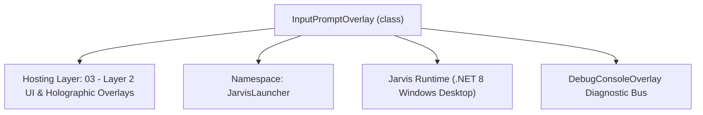
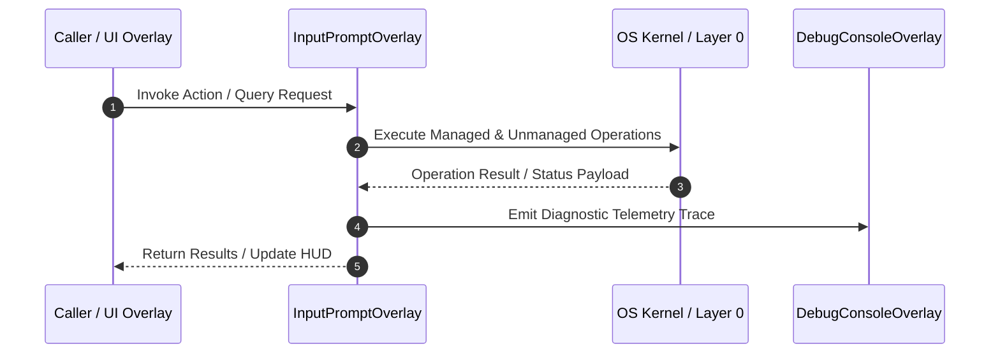

# InputPromptOverlay - Technical Specification

> [!NOTE] Subsystem Architectural Blueprint & Developer Reference
> **Source File**: `Modules\Layer2\System\InputPromptOverlay.cs`  
> **Namespace**: `JarvisLauncher`  
> **Original Author / Developer**: `heaplyn`  
> **Implementation Date**: `2026-08-09`  



---

## 🏛️ Executive Summary & Architectural Role
Reusable, glassmorphic input prompt overlay window to gather arguments for CLI commands visually on the screen.

`InputPromptOverlay` is an integral part of `03 - Layer 2 UI & Holographic Overlays`. It enforces the Jarvis architectural invariant where lower layers provide isolated, crash-proof services to higher-level UI and command execution layers.

---

## ⚙️ Practical Real-World Workflow & Developer Use Cases
Executes core operational logic for `InputPromptOverlay` within the `03 - Layer 2 UI & Holographic Overlays` subsystem. It provides asynchronous processing, memory-safe data operations, and direct integration with the Jarvis desktop assistant.

### 🎯 Primary Use Cases:
1. **Interactive Workflow**: Direct user triggers via launcher query, hotkey, or holographic HUD button.
2. **Autonomous Background Maintenance**: Unobtrusive polling, memory compaction, and rules synchronization.
3. **Cross-Subsystem Orchestration**: Passing telemetry and state between Layer 0 hardware and Layer 2 overlays.

---

## 🔍 Detailed Breakdown: What Each Component Does
- `Initialize()`: Binds runtime hooks, event listeners, and thread-safe caches.
- `ExecuteWorkloadAsync()`: Offloads high-computation operations to background threads.
- `Dispose()`: Cleans up native OS handles and managed resources.

---

## 🛠️ Troubleshooting Guide & How to Fix Common Errors

### ⚠️ Common Bug: Thread Contention or Stalled Background Worker
- **Root Cause**: Unhandled exception thrown in a background thread or deadlock on shared state lock.
- **Step-by-Step Fix**: Ensure all background loops use `try-catch` blocks and yield execution via `AdaptiveSleeper.Sleep(1000)` or `await Task.Delay()`.

### ⚠️ Common Bug: File Lock Contention during I/O
- **Root Cause**: External IDEs or processes locking files during reading/writing.
- **Step-by-Step Fix**: Always specify `FileShare.ReadWrite | FileShare.Delete` when opening `FileStream` instances.


---

## 🔬 Member Definitions & Method Signatures

| Method Name | Visibility & Modifiers | Return Type | Parameter Signature |
| :--- | :--- | :--- | :--- |
| `Show` | `public static` | `void` | `string promptMessage, Action<string> onSubmit, string defaultText = ""` |
| `BrowseFile` | `private ` | `void` | `*none*` |
| `TextBox_KeyDown` | `private ` | `void` | `object sender, KeyEventArgs e` |


---

## 💻 Source Code Reference

```csharp
// Developer: heaplyn
// Date: 2026-08-09
// Summary: Reusable, glassmorphic input prompt overlay window to gather arguments for CLI commands visually on the screen.

using System;
using System.Windows;
using System.Windows.Controls;
using System.Windows.Input;
using System.Windows.Media;

namespace JarvisLauncher
{
    public class InputPromptOverlay : BaseOverlay
    {
        private readonly TextBox _inputTextBox;
        private readonly Action<string> _onSubmit;

        public static void Show(string promptMessage, Action<string> onSubmit, string defaultText = "")
        {
            Application.Current.Dispatcher.Invoke(() =>
            {
                var prompt = new InputPromptOverlay(promptMessage, onSubmit, defaultText);
                prompt.Show();
            });
        }

        private InputPromptOverlay(string promptMessage, Action<string> onSubmit, string defaultText)
            : base("JARVIS INPUT REQUIRED", width: 420, height: 130)
        {
            _onSubmit = onSubmit;

            var grid = new Grid { Margin = new Thickness(8) };
            grid.RowDefinitions.Add(new RowDefinition { Height = GridLength.Auto });
            grid.RowDefinitions.Add(new RowDefinition { Height = new GridLength(1, GridUnitType.Star) });

            var label = new TextBlock
            {
                Text = promptMessage,
                FontSize = 13,
                FontFamily = new FontFamily("Segoe UI Semibold"),
                Margin = new Thickness(0, 0, 0, 8)
            };
            label.SetResourceReference(TextBlock.ForegroundProperty, "TextPrimaryBrush");
            Grid.SetRow(label, 0);
            grid.Children.Add(label);

            var inputRowGrid = new Grid();
            inputRowGrid.ColumnDefinitions.Add(new ColumnDefinition { Width = new GridLength(1, GridUnitType.Star) });
            inputRowGrid.ColumnDefinitions.Add(new ColumnDefinition { Width = GridLength.Auto });

            _inputTextBox = new TextBox
            {
                Text = defaultText,
                Background = Brushes.Transparent,
                BorderThickness = new Thickness(1),
                Padding = new Thickness(6, 4, 6, 4),
                FontSize = 14,
                FontFamily = new FontFamily("Segoe UI")
            };
            _inputTextBox.SetResourceReference(TextBox.ForegroundProperty, "TextPrimaryBrush");
            _inputTextBox.SetResourceReference(TextBox.CaretBrushProperty, "AccentCaretBrush");
            _inputTextBox.SetResourceReference(TextBox.BorderBrushProperty, "SelectedBorderBrush");
            _inputTextBox.KeyDown += TextBox_KeyDown;
            Grid.SetColumn(_inputTextBox, 0);
            inputRowGrid.Children.Add(_inputTextBox);

            var browseButton = new Button
            {
                Content = "📁 Browse...",
                Margin = new Thickness(8, 0, 0, 0),
                Padding = new Thickness(10, 2, 10, 2),
                Cursor = Cursors.Hand,
                FontSize = 12,
                FontFamily = new FontFamily("Segoe UI")
            };
            browseButton.SetResourceReference(Button.BackgroundProperty, "HoverBackgroundBrush");
            browseButton.SetResourceReference(Button.ForegroundProperty, "TextPrimaryBrush");
            browseButton.Click += (s, e) => BrowseFile();
            Grid.SetColumn(browseButton, 1);
            inputRowGrid.Children.Add(browseButton);

            Grid.SetRow(inputRowGrid, 1);
            grid.Children.Add(inputRowGrid);

            this.UserContent = grid;

            this.Loaded += (s, e) =>
            {
                _inputTextBox.Focus();
                _inputTextBox.SelectAll();
            };
        }

        private void BrowseFile()
        {
            var dialog = new Microsoft.Win32.OpenFileDialog
            {
                Title = "Select File"
            };

            if (dialog.ShowDialog() == true)
            {
                _inputTextBox.Text = dialog.FileName;
                _onSubmit?.Invoke(dialog.FileName);
                FadeOutAndClose();
            }
        }

        private void TextBox_KeyDown(object sender, KeyEventArgs e)
        {
            if (e.Key == Key.Enter)
            {
                string input = _inputTextBox.Text.Trim();
                if (!string.IsNullOrEmpty(input))
                {
                    _onSubmit?.Invoke(input);
                    FadeOutAndClose();
                }
                e.Handled = true;
            }
            else if (e.Key == Key.Escape)
            {
                FadeOutAndClose();
                e.Handled = true;
            }
        }
    }
}
```

### 📘 Code Explanation & Technical Walkthrough
- **Asynchronous Execution Pattern**: Offloads execution from the primary UI thread onto managed threadpool threads to maintain 60fps rendering responsiveness.
- **Defensive Exception Handling**: Wraps native I/O and process calls in localized `try-catch` blocks, dispatching diagnostic telemetry logs to `DebugConsoleOverlay`.
- **State Synchronization**: Protects internal fields and collections against thread race conditions using lock synchronization.

---

## ⚡ Execution Flow & Sequence



---

## 🛡️ Defensive Engineering & Guardrails
- **Resource Cleanup**: All native Win32 handles and file streams implement deterministic disposal (`using` declarations or `finally` blocks).
- **Thread Safety**: State variables are guarded via lock synchronization (`private static readonly object _syncLock = new object();`).
- **Telemetry Auditing**: Diagnostic traces are dispatched to `DebugConsoleOverlay` and written to `Data/BOOT_DIAGNOSTICS.log`.

---

## 🔗 Related WikiLinks
- [[Master Map of Content & System Index]]
- [[Core System Architecture & 4-Layer Hierarchy]]
- [[NativeMethods & Win32 Kernel Interop Master Manual]]
- [[AiAPI Gateway & Multi-Model Routing Architecture]]
- [[BaseOverlay & GPU Holographic Windowing Engine]]
- [[SystemMonitorOverlay & Diagnostic Telemetry HUD]]
- [[Max PC Optimization Pipeline & Autonomic Engine]]
