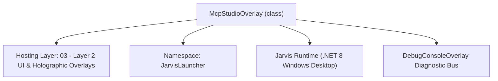
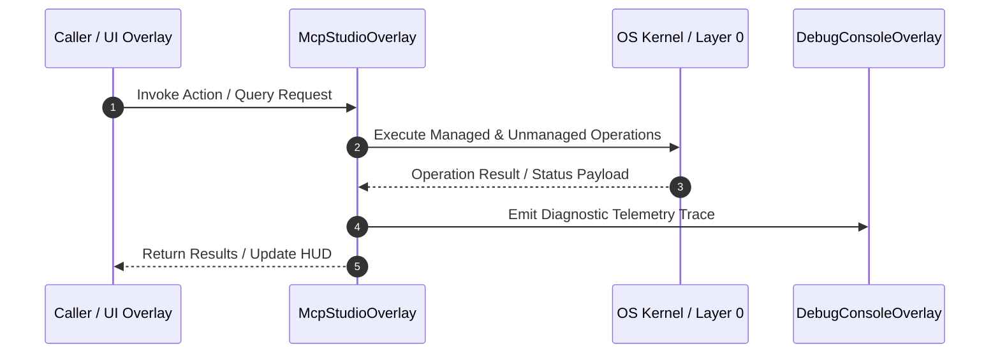

# McpStudioOverlay - Technical Specification

> [!NOTE] Subsystem Architectural Blueprint & Developer Reference
> **Source File**: `Modules\Layer2\Dev\McpStudioOverlay.cs`  
> **Namespace**: `JarvisLauncher`  
> **Original Author / Developer**: `heaplyn`  
> **Implementation Date**: `2026-08-13`  



---

## 🏛️ Executive Summary & Architectural Role
Glassmorphic Model Context Protocol (MCP) Registry Studio Overlay.
 Allows adding, editing, pinging, and managing MCP servers, transports, and tool definitions.

`McpStudioOverlay` is an integral part of `03 - Layer 2 UI & Holographic Overlays`. It enforces the Jarvis architectural invariant where lower layers provide isolated, crash-proof services to higher-level UI and command execution layers.

---

## ⚙️ Practical Real-World Workflow & Developer Use Cases
Executes core operational logic for `McpStudioOverlay` within the `03 - Layer 2 UI & Holographic Overlays` subsystem. It provides asynchronous processing, memory-safe data operations, and direct integration with the Jarvis desktop assistant.

### 🎯 Primary Use Cases:
1. **Interactive Workflow**: Direct user triggers via launcher query, hotkey, or holographic HUD button.
2. **Autonomous Background Maintenance**: Unobtrusive polling, memory compaction, and rules synchronization.
3. **Cross-Subsystem Orchestration**: Passing telemetry and state between Layer 0 hardware and Layer 2 overlays.

---

## 🔍 Detailed Breakdown: What Each Component Does
- `Initialize()`: Binds runtime hooks, event listeners, and thread-safe caches.
- `ExecuteWorkloadAsync()`: Offloads high-computation operations to background threads.
- `Dispose()`: Cleans up native OS handles and managed resources.

---

## 🛠️ Troubleshooting Guide & How to Fix Common Errors

### ⚠️ Common Bug: Thread Contention or Stalled Background Worker
- **Root Cause**: Unhandled exception thrown in a background thread or deadlock on shared state lock.
- **Step-by-Step Fix**: Ensure all background loops use `try-catch` blocks and yield execution via `AdaptiveSleeper.Sleep(1000)` or `await Task.Delay()`.

### ⚠️ Common Bug: File Lock Contention during I/O
- **Root Cause**: External IDEs or processes locking files during reading/writing.
- **Step-by-Step Fix**: Always specify `FileShare.ReadWrite | FileShare.Delete` when opening `FileStream` instances.


---

## 🔬 Member Definitions & Method Signatures

| Method Name | Visibility & Modifiers | Return Type | Parameter Signature |
| :--- | :--- | :--- | :--- |
| `ShowOverlay` | `public static` | `void` | `*none*` |
| `RefreshServerList` | `private ` | `void` | `*none*` |
| `CreateHeader` | `private static` | `TextBlock` | `string title` |
| `CreateButton` | `private static` | `Button` | `string content` |


---

## 💻 Source Code Reference

```csharp
// Developer: heaplyn
// Date: 2026-08-13
// Summary: Glassmorphic Model Context Protocol (MCP) Registry Studio Overlay.
// Allows adding, editing, pinging, and managing MCP servers, transports, and tool definitions.

using System;
using System.Collections.Generic;
using System.Diagnostics;
using System.IO;
using System.Threading.Tasks;
using System.Windows;
using System.Windows.Controls;
using System.Windows.Controls.Primitives;
using System.Windows.Input;
using System.Windows.Media;

namespace JarvisLauncher
{
    public class McpStudioOverlay : BaseOverlay
    {
        private static McpStudioOverlay? _instance;

        private StackPanel _serverListStack = null!;
        private TextBox _nameBox = null!;
        private TextBox _commandBox = null!;
        private TextBox _argsBox = null!;

        public static void ShowOverlay()
        {
            if (_instance == null || !_instance.IsLoaded || !_instance.IsVisible)
            {
                _instance = new McpStudioOverlay();
                _instance.Show();
            }
            else
            {
                _instance.Activate();
                _instance.BringToFront();
                _instance.Focus();
            }
        }

        public McpStudioOverlay() : base("⚡ MODEL CONTEXT PROTOCOL (MCP) REGISTRY STUDIO", 780, 640)
        {
            this.Closed += (s, e) => { _instance = null; };

            var workArea = SystemParameters.WorkArea;
            this.Left = (workArea.Width - this.Width) / 2;
            this.Top = (workArea.Height - this.Height) / 2;

            var mainGrid = new Grid { Margin = new Thickness(10) };
            mainGrid.RowDefinitions.Add(new RowDefinition { Height = GridLength.Auto });                     // Header
            mainGrid.RowDefinitions.Add(new RowDefinition { Height = new GridLength(1, GridUnitType.Star) }); // Server List
            mainGrid.RowDefinitions.Add(new RowDefinition { Height = GridLength.Auto });                     // Add Form / Presets

            // ── Header ─────────────────────────────────────────────────────────────
            var headerStack = new StackPanel { Margin = new Thickness(0, 0, 0, 10) };
            headerStack.Children.Add(CreateHeader("⚡ Registered MCP Servers & Tool Providers"));

            var info = new TextBlock
            {
                Text = "Manage Model Context Protocol (MCP) servers (Roblox, Filesystem, Brave Search, Memory, GitHub) for AI tools and context.",
                FontSize = 11,
                TextWrapping = TextWrapping.Wrap,
                Margin = new Thickness(0, 2, 0, 0)
            };
            info.SetResourceReference(TextBlock.ForegroundProperty, "TextSecondaryBrush");
            headerStack.Children.Add(info);
            Grid.SetRow(headerStack, 0);
            mainGrid.Children.Add(headerStack);

            // ── Server List Container ──────────────────────────────────────────────
            var scroll = new ScrollViewer { VerticalScrollBarVisibility = ScrollBarVisibility.Auto, Margin = new Thickness(0, 0, 0, 10) };
            _serverListStack = new StackPanel();
            scroll.Content = _serverListStack;
            Grid.SetRow(scroll, 1);
            mainGrid.Children.Add(scroll);

            // ── Add Server & Preset Controls ───────────────────────────────────────
            var bottomStack = new StackPanel();
            bottomStack.Children.Add(CreateHeader("🚀 1-Click Preset MCP Servers"));

            var presetGrid = new UniformGrid { Columns = 3, Margin = new Thickness(0, 4, 0, 10) };

            var btnRoblox = CreateButton("🎮 Roblox Studio MCP");
            btnRoblox.Click += (s, e) =>
            {
                McpManager.AddServer(new McpServerConfig
                {
                    Name = "Roblox_Studio",
                    Transport = "STDIO",
                    Command = "cmd.exe",
                    Args = new List<string> { "/c", "cd /d %LOCALAPPDATA%\\Roblox && .\\mcp.bat" }
                });
                RefreshServerList();
                TextOverlay.Show("🎮 Roblox Studio MCP Server Added!", 2500);
            };
            presetGrid.Children.Add(btnRoblox);

            var btnFs = CreateButton("📁 Filesystem MCP");
            btnFs.Click += (s, e) =>
            {
                McpManager.AddServer(new McpServerConfig
                {
                    Name = "Filesystem",
                    Transport = "STDIO",
                    Command = "npx",
                    Args = new List<string> { "-y", "@modelcontextprotocol/server-filesystem", Environment.GetFolderPath(Environment.SpecialFolder.UserProfile) }
                });
                RefreshServerList();
                TextOverlay.Show("📁 Filesystem MCP Server Added!", 2500);
            };
            presetGrid.Children.Add(btnFs);

            var btnBrave = CreateButton("🔍 Brave Search MCP");
            btnBrave.Click += (s, e) =>
            {
                McpManager.AddServer(new McpServerConfig
                {
                    Name = "Brave_Search",
                    Transport = "STDIO",
                    Command = "npx",
                    Args = new List<string> { "-y", "@modelcontextprotocol/server-brave-search" }
                });
                RefreshServerList();
                TextOverlay.Show("🔍 Brave Search MCP Added!", 2500);
            };
            presetGrid.Children.Add(btnBrave);

            bottomStack.Children.Add(presetGrid);

            // Manual Add Form
            bottomStack.Children.Add(CreateHeader("➕ Add Custom MCP Server"));
            var formGrid = new Grid { Margin = new Thickness(0, 4, 0, 4) };
            formGrid.ColumnDefinitions.Add(new ColumnDefinition { Width = new GridLength(1, GridUnitType.Star) });
            formGrid.ColumnDefinitions.Add(new ColumnDefinition { Width = new GridLength(1.5, GridUnitType.Star) });
            formGrid.ColumnDefinitions.Add(new ColumnDefinition { Width = new GridLength(2, GridUnitType.Star) });

            _nameBox = new TextBox { Text = "Server_Name", Padding = new Thickness(4), Margin = new Thickness(0, 0, 4, 0) };
            _commandBox = new TextBox { Text = "cmd.exe / npx / python", Padding = new Thickness(4), Margin = new Thickness(0, 0, 4, 0) };
            _argsBox = new TextBox { Text = "arguments...", Padding = new Thickness(4) };

            Grid.SetColumn(_nameBox, 0);
            Grid.SetColumn(_commandBox, 1);
            Grid.SetColumn(_argsBox, 2);
            formGrid.Children.Add(_nameBox);
            formGrid.Children.Add(_commandBox);
            formGrid.Children.Add(_argsBox);
            bottomStack.Children.Add(formGrid);

            var addBtn = CreateButton("➕ Register MCP Server");
            addBtn.Height = 32;
            addBtn.FontWeight = FontWeights.Bold;
            addBtn.Click += (s, e) =>
            {
                string name = _nameBox.Text.Trim();
                string cmd = _commandBox.Text.Trim();
                string argsStr = _argsBox.Text.Trim();

                if (string.IsNullOrEmpty(name) || string.IsNullOrEmpty(cmd))
                {
                    TextOverlay.Show("⚠️ Name and Command are required!", 2500);
                    return;
                }

                var argsList = argsStr.Split(' ', StringSplitOptions.RemoveEmptyEntries);
                McpManager.AddServer(new McpServerConfig
                {
                    Name = name,
                    Command = cmd,
                    Args = new List<string>(argsList)
                });
                RefreshServerList();
                TextOverlay.Show($"⚡ Registered MCP Server: {name}", 2500);
            };
            bottomStack.Children.Add(addBtn);

            // Raw JSON Pasting Area
            bottomStack.Children.Add(CreateHeader("📋 Paste Raw MCP JSON Config (e.g. mcpServers / voicebox)"));

            var jsonBoxStack = new StackPanel { Margin = new Thickness(0, 2, 0, 6) };
            var rawJsonBox = new TextBox
            {
                Height = 70,
                AcceptsReturn = true,
                TextWrapping = TextWrapping.Wrap,
                FontSize = 11,
                Padding = new Thickness(6),
                Text = "{\n  \"mcpServers\": {\n    \"voicebox\": {\n      \"command\": \"C:\\\\Program Files\\\\Voicebox\\\\voicebox-mcp.exe\",\n      \"env\": { \"VOICEBOX_CLIENT_ID\": \"claude-code\" }\n    }\n  }\n}"
            };
            rawJsonBox.SetResourceReference(TextBox.BackgroundProperty, "WindowBackgroundBrush");
            rawJsonBox.SetResourceReference(TextBox.ForegroundProperty, "TextPrimaryBrush");
            jsonBoxStack.Children.Add(rawJsonBox);

            var pasteJsonBtn = CreateButton("⚡ Paste & Import Raw JSON Config");
            pasteJsonBtn.FontWeight = FontWeights.Bold;
            pasteJsonBtn.Click += (s, e) =>
            {
                if (Clipboard.ContainsText())
                {
                    rawJsonBox.Text = Clipboard.GetText();
                }

                string textToImport = rawJsonBox.Text.Trim();
                int imported = McpManager.ImportRawJsonConfig(textToImport);
                if (imported > 0)
                {
                    RefreshServerList();
                    TextOverlay.Show($"✅ Imported {imported} MCP Server(s) from JSON!", 3000);
                }
                else
                {
                    TextOverlay.Show("⚠️ Invalid MCP JSON payload or no servers found.", 3000);
                }
            };
            jsonBoxStack.Children.Add(pasteJsonBtn);
            bottomStack.Children.Add(jsonBoxStack);

            Grid.SetRow(bottomStack, 2);
            mainGrid.Children.Add(bottomStack);

            this.UserContent = mainGrid;
            RefreshServerList();
        }

        private void RefreshServerList()
        {
            _serverListStack.Children.Clear();
            McpManager.LoadConfig();

            if (McpManager.Servers.Count == 0)
            {
                _serverListStack.Children.Add(new TextBlock { Text = "No MCP servers configured yet. Add a preset or custom server below!", FontSize = 11, Foreground = Brushes.Gray });
                return;
            }

            foreach (var s in McpManager.Servers)
            {
                var card = new Border
                {
                    CornerRadius = new CornerRadius(8),
                    Padding = new Thickness(10),
                    Margin = new Thickness(0, 0, 0, 8)
                };
                card.SetResourceReference(Border.BackgroundProperty, "CardBackgroundBrush");

                var cardGrid = new Grid();
                cardGrid.ColumnDefinitions.Add(new ColumnDefinition { Width = new GridLength(1, GridUnitType.Star) });
                cardGrid.ColumnDefinitions.Add(new ColumnDefinition { Width = GridLength.Auto });

                var infoStack = new StackPanel();
                var titleText = new TextBlock { Text = $"⚡ {s.Name} [{s.Transport}]", FontSize = 12, FontWeight = FontWeights.Bold };
                titleText.SetResourceReference(TextBlock.ForegroundProperty, "TextPrimaryBrush");
                infoStack.Children.Add(titleText);

                string cmdLine = $"{s.Command} {string.Join(" ", s.Args)}";
                var cmdText = new TextBlock { Text = cmdLine, FontSize = 10, TextWrapping = TextWrapping.Wrap };
                cmdText.SetResourceReference(TextBlock.ForegroundProperty, "TextSecondaryBrush");
                infoStack.Children.Add(cmdText);

                Grid.SetColumn(infoStack, 0);
                cardGrid.Children.Add(infoStack);

                var btnStack = new StackPanel { Orientation = Orientation.Horizontal };

                var testBtn = CreateButton("⚡ Test Connection");
                testBtn.Margin = new Thickness(0, 0, 4, 0);
                testBtn.Click += async (sender, e) =>
                {
                    testBtn.Content = "⏳ Testing...";
                    bool ok = await McpManager.TestServerConnectionAsync(s);
                    testBtn.Content = ok ? "🟢 Connected" : "🔴 Error";
                    TextOverlay.Show(ok ? $"🟢 MCP Server '{s.Name}' Active!" : $"🔴 MCP Server '{s.Name}' Error!", 3000);
                };
                btnStack.Children.Add(testBtn);

                var delBtn = CreateButton("❌ Remove");
                delBtn.Click += (sender, e) =>
                {
                    McpManager.RemoveServer(s.Name);
                    RefreshServerList();
                    TextOverlay.Show($"❌ Removed MCP Server: {s.Name}", 2500);
                };
                btnStack.Children.Add(delBtn);

                Grid.SetColumn(btnStack, 1);
                cardGrid.Children.Add(btnStack);

                card.Child = cardGrid;
                _serverListStack.Children.Add(card);
            }
        }

        private static TextBlock CreateHeader(string title)
        {
            var header = new TextBlock
            {
                Text = title,
                FontSize = 13,
                FontWeight = FontWeights.Bold,
                Margin = new Thickness(0, 6, 0, 4)
            };
            header.SetResourceReference(TextBlock.ForegroundProperty, "TextPrimaryBrush");
            return header;
        }

        private static Button CreateButton(string content)
        {
            var btn = new Button
            {
                Content = content,
                Margin = new Thickness(0, 2, 0, 2),
                Padding = new Thickness(8, 5, 8, 5),
                FontSize = 11,
                Cursor = Cursors.Hand
            };
            return btn;
        }
    }
}
```

### 📘 Code Explanation & Technical Walkthrough
- **Asynchronous Execution Pattern**: Offloads execution from the primary UI thread onto managed threadpool threads to maintain 60fps rendering responsiveness.
- **Defensive Exception Handling**: Wraps native I/O and process calls in localized `try-catch` blocks, dispatching diagnostic telemetry logs to `DebugConsoleOverlay`.
- **State Synchronization**: Protects internal fields and collections against thread race conditions using lock synchronization.

---

## ⚡ Execution Flow & Sequence



---

## 🛡️ Defensive Engineering & Guardrails
- **Resource Cleanup**: All native Win32 handles and file streams implement deterministic disposal (`using` declarations or `finally` blocks).
- **Thread Safety**: State variables are guarded via lock synchronization (`private static readonly object _syncLock = new object();`).
- **Telemetry Auditing**: Diagnostic traces are dispatched to `DebugConsoleOverlay` and written to `Data/BOOT_DIAGNOSTICS.log`.

---

## 🔗 Related WikiLinks
- [[Master Map of Content & System Index]]
- [[Core System Architecture & 4-Layer Hierarchy]]
- [[NativeMethods & Win32 Kernel Interop Master Manual]]
- [[AiAPI Gateway & Multi-Model Routing Architecture]]
- [[BaseOverlay & GPU Holographic Windowing Engine]]
- [[SystemMonitorOverlay & Diagnostic Telemetry HUD]]
- [[Max PC Optimization Pipeline & Autonomic Engine]]
