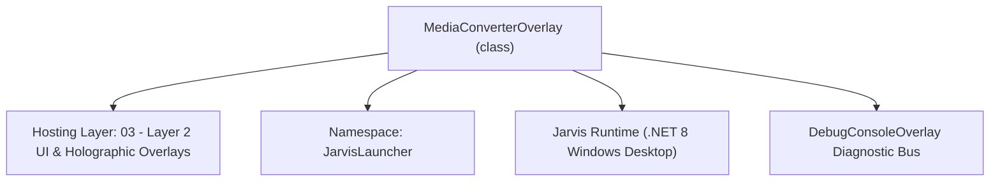
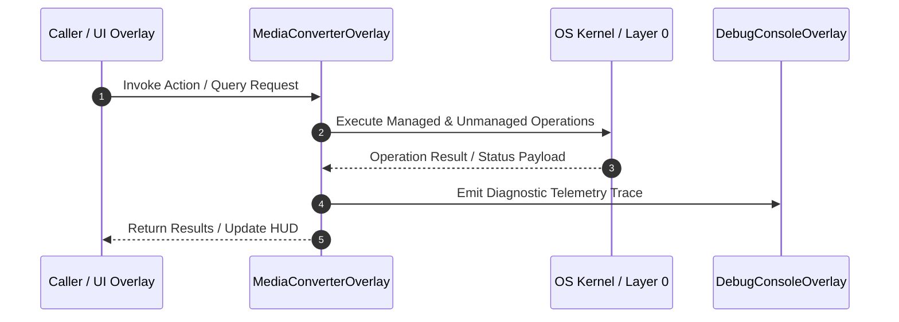

# MediaConverterOverlay - Technical Specification

> [!NOTE] Subsystem Architectural Blueprint & Developer Reference
> **Source File**: `Modules\Layer2\Media\MediaConverterOverlay.cs`  
> **Namespace**: `JarvisLauncher`  
> **Original Author / Developer**: `heaplyn`  
> **Implementation Date**: `2026-08-13`  



---

## 🏛️ Executive Summary & Architectural Role
Universal Glassmorphic Media Converter Studio Overlay.
 Supports 1-click WEBP to PNG, GIF to MP4, MP4 to GIF, PNG to WEBP, MP3 to WAV, MOV to MP4, and custom media format conversions.

`MediaConverterOverlay` is an integral part of `03 - Layer 2 UI & Holographic Overlays`. It enforces the Jarvis architectural invariant where lower layers provide isolated, crash-proof services to higher-level UI and command execution layers.

---

## ⚙️ Practical Real-World Workflow & Developer Use Cases
Executes core operational logic for `MediaConverterOverlay` within the `03 - Layer 2 UI & Holographic Overlays` subsystem. It provides asynchronous processing, memory-safe data operations, and direct integration with the Jarvis desktop assistant.

### 🎯 Primary Use Cases:
1. **Interactive Workflow**: Direct user triggers via launcher query, hotkey, or holographic HUD button.
2. **Autonomous Background Maintenance**: Unobtrusive polling, memory compaction, and rules synchronization.
3. **Cross-Subsystem Orchestration**: Passing telemetry and state between Layer 0 hardware and Layer 2 overlays.

---

## 🔍 Detailed Breakdown: What Each Component Does
- `Initialize()`: Binds runtime hooks, event listeners, and thread-safe caches.
- `ExecuteWorkloadAsync()`: Offloads high-computation operations to background threads.
- `Dispose()`: Cleans up native OS handles and managed resources.

---

## 🛠️ Troubleshooting Guide & How to Fix Common Errors

### ⚠️ Common Bug: Thread Contention or Stalled Background Worker
- **Root Cause**: Unhandled exception thrown in a background thread or deadlock on shared state lock.
- **Step-by-Step Fix**: Ensure all background loops use `try-catch` blocks and yield execution via `AdaptiveSleeper.Sleep(1000)` or `await Task.Delay()`.

### ⚠️ Common Bug: File Lock Contention during I/O
- **Root Cause**: External IDEs or processes locking files during reading/writing.
- **Step-by-Step Fix**: Always specify `FileShare.ReadWrite | FileShare.Delete` when opening `FileStream` instances.


---

## 🔬 Member Definitions & Method Signatures

| Method Name | Visibility & Modifiers | Return Type | Parameter Signature |
| :--- | :--- | :--- | :--- |
| `ShowOverlay` | `public static` | `void` | `string initialInputFile = "", string defaultTargetFormat = ""` |
| `SetTargetFormat` | `private ` | `void` | `string fmt` |
| `AutoDetectTargetFormat` | `private ` | `void` | `string filePath` |
| `ExecuteConversionAsync` | `private async` | `Task` | `*none*` |
| `CreateHeader` | `private static` | `TextBlock` | `string title` |
| `CreateLabel` | `private static` | `TextBlock` | `string text` |
| `CreateButton` | `private static` | `Button` | `string content` |


---

## 💻 Source Code Reference

```csharp
// Developer: heaplyn
// Date: 2026-08-13
// Summary: Universal Glassmorphic Media Converter Studio Overlay.
// Supports 1-click WEBP to PNG, GIF to MP4, MP4 to GIF, PNG to WEBP, MP3 to WAV, MOV to MP4, and custom media format conversions.

using System;
using System.Diagnostics;
using System.IO;
using System.Threading.Tasks;
using System.Windows;
using System.Windows.Controls;
using System.Windows.Controls.Primitives;
using System.Windows.Input;
using System.Windows.Media;
using Microsoft.Win32;

namespace JarvisLauncher
{
    public class MediaConverterOverlay : BaseOverlay
    {
        private static MediaConverterOverlay? _instance;

        private TextBox _inputFileBox = null!;
        private ComboBox _targetFormatCombo = null!;
        private ComboBox _qualityCombo = null!;
        private TextBlock _statusText = null!;
        private Button _convertBtn = null!;

        public static void ShowOverlay(string initialInputFile = "", string defaultTargetFormat = "")
        {
            if (_instance == null || !_instance.IsLoaded || !_instance.IsVisible)
            {
                _instance = new MediaConverterOverlay(initialInputFile, defaultTargetFormat);
                _instance.Show();
            }
            else
            {
                if (!string.IsNullOrEmpty(initialInputFile)) _instance._inputFileBox.Text = initialInputFile;
                if (!string.IsNullOrEmpty(defaultTargetFormat)) _instance.SetTargetFormat(defaultTargetFormat);
                _instance.Activate();
                _instance.BringToFront();
                _instance.Focus();
            }
        }

        public MediaConverterOverlay(string initialInputFile = "", string defaultTargetFormat = "")
            : base("⚡ UNIVERSAL MEDIA CONVERTER STUDIO", width: 620, height: 560)
        {
            this.Closed += (s, e) => { _instance = null; };

            var workArea = SystemParameters.WorkArea;
            this.Left = (workArea.Width - this.Width) / 2;
            this.Top = (workArea.Height - this.Height) / 2;

            var scroll = new ScrollViewer { VerticalScrollBarVisibility = ScrollBarVisibility.Auto };
            var root = new StackPanel { Margin = new Thickness(8) };
            scroll.Content = root;

            root.Children.Add(CreateHeader("🎬 Convert Image, Video & Audio Files"));

            var info = new TextBlock
            {
                Text = "Convert between WEBP, PNG, JPG, GIF, MP4, MP3, WAV, MOV, MKV, and M4A with 1-click ultra-fast FFmpeg processing.",
                FontSize = 11,
                TextWrapping = TextWrapping.Wrap,
                Margin = new Thickness(0, 0, 0, 8)
            };
            info.SetResourceReference(TextBlock.ForegroundProperty, "TextSecondaryBrush");
            root.Children.Add(info);

            // File Selection Grid
            root.Children.Add(CreateLabel("Input Media File (Drag & Drop or Browse):"));
            var fileGrid = new Grid { Margin = new Thickness(0, 2, 0, 8) };
            fileGrid.ColumnDefinitions.Add(new ColumnDefinition { Width = new GridLength(1, GridUnitType.Star) });
            fileGrid.ColumnDefinitions.Add(new ColumnDefinition { Width = GridLength.Auto });

            _inputFileBox = new TextBox
            {
                Text = initialInputFile,
                Padding = new Thickness(6, 6, 6, 6),
                FontSize = 12,
                AllowDrop = true
            };
            _inputFileBox.PreviewDragOver += (s, e) => { e.Handled = true; e.Effects = DragDropEffects.Copy; };
            _inputFileBox.Drop += (s, e) =>
            {
                if (e.Data.GetDataPresent(DataFormats.FileDrop))
                {
                    string[] files = (string[])e.Data.GetData(DataFormats.FileDrop);
                    if (files.Length > 0)
                    {
                        _inputFileBox.Text = files[0];
                        AutoDetectTargetFormat(files[0]);
                    }
                }
            };
            Grid.SetColumn(_inputFileBox, 0);
            fileGrid.Children.Add(_inputFileBox);

            var browseBtn = CreateButton("📂 Browse...");
            browseBtn.Margin = new Thickness(6, 0, 0, 0);
            browseBtn.Click += (s, e) =>
            {
                var dlg = new OpenFileDialog
                {
                    Title = "Select Media File to Convert",
                    Filter = "All Media Files|*.webp;*.png;*.jpg;*.gif;*.mp4;*.mp3;*.wav;*.mov;*.mkv;*.m4a;*.webm;*.avi;*.flac|All Files|*.*"
                };
                if (dlg.ShowDialog() == true)
                {
                    _inputFileBox.Text = dlg.FileName;
                    AutoDetectTargetFormat(dlg.FileName);
                }
            };
            Grid.SetColumn(browseBtn, 1);
            fileGrid.Children.Add(browseBtn);
            root.Children.Add(fileGrid);

            // Target Format & Quality Grid
            root.Children.Add(CreateLabel("Target Format:"));
            _targetFormatCombo = new ComboBox
            {
                Margin = new Thickness(0, 2, 0, 8),
                Padding = new Thickness(8, 6, 8, 6),
                FontSize = 12
            };
            string[] formats = new[] { "png", "webp", "jpg", "mp4", "gif", "mp3", "wav", "mov", "mkv", "m4a", "webm", "avi" };
            foreach (var fmt in formats) _targetFormatCombo.Items.Add(fmt.ToUpper());
            _targetFormatCombo.SelectedIndex = 0;
            if (!string.IsNullOrEmpty(defaultTargetFormat)) SetTargetFormat(defaultTargetFormat);
            root.Children.Add(_targetFormatCombo);

            root.Children.Add(CreateLabel("Conversion Quality & Preset:"));
            _qualityCombo = new ComboBox
            {
                Margin = new Thickness(0, 2, 0, 10),
                Padding = new Thickness(8, 6, 8, 6),
                FontSize = 12
            };
            _qualityCombo.Items.Add("High Quality / Lossless");
            _qualityCombo.Items.Add("Balanced Performance (Recommended)");
            _qualityCombo.Items.Add("Compact / Smaller File Size");
            _qualityCombo.SelectedIndex = 1;
            root.Children.Add(_qualityCombo);

            // Quick Preset Buttons
            root.Children.Add(CreateHeader("⚡ 1-Click Quick Presets"));
            var presetGrid = new UniformGrid { Columns = 3, Margin = new Thickness(0, 4, 0, 10) };

            var btnWebp2Png = CreateButton("🖼️ WEBP ➔ PNG");
            btnWebp2Png.Click += (s, e) => SetTargetFormat("png");
            presetGrid.Children.Add(btnWebp2Png);

            var btnGif2Mp4 = CreateButton("🎞️ GIF ➔ MP4");
            btnGif2Mp4.Click += (s, e) => SetTargetFormat("mp4");
            presetGrid.Children.Add(btnGif2Mp4);

            var btnMp42Gif = CreateButton("🎬 MP4 ➔ GIF");
            btnMp42Gif.Click += (s, e) => SetTargetFormat("gif");
            presetGrid.Children.Add(btnMp42Gif);

            var btnPng2Webp = CreateButton("🌐 PNG ➔ WEBP");
            btnPng2Webp.Click += (s, e) => SetTargetFormat("webp");
            presetGrid.Children.Add(btnPng2Webp);

            var btnMp32Wav = CreateButton("🎵 MP3 ➔ WAV");
            btnMp32Wav.Click += (s, e) => SetTargetFormat("wav");
            presetGrid.Children.Add(btnMp32Wav);

            var btnExtractAudio = CreateButton("🔊 Extract MP3 Audio");
            btnExtractAudio.Click += (s, e) => SetTargetFormat("mp3");
            presetGrid.Children.Add(btnExtractAudio);

            root.Children.Add(presetGrid);

            // Action Button
            _convertBtn = CreateButton("⚡ Convert Media File Now");
            _convertBtn.Height = 36;
            _convertBtn.FontWeight = FontWeights.Bold;
            _convertBtn.Click += async (s, e) => await ExecuteConversionAsync();
            root.Children.Add(_convertBtn);

            _statusText = new TextBlock
            {
                FontSize = 11,
                TextWrapping = TextWrapping.Wrap,
                Margin = new Thickness(0, 8, 0, 0)
            };
            _statusText.SetResourceReference(TextBlock.ForegroundProperty, "TextSecondaryBrush");
            root.Children.Add(_statusText);

            this.UserContent = scroll;
        }

        private void SetTargetFormat(string fmt)
        {
            string search = fmt.Trim().ToUpper();
            foreach (var item in _targetFormatCombo.Items)
            {
                if (item is string s && s.Equals(search, StringComparison.OrdinalIgnoreCase))
                {
                    _targetFormatCombo.SelectedItem = item;
                    break;
                }
            }
        }

        private void AutoDetectTargetFormat(string filePath)
        {
            string ext = Path.GetExtension(filePath).ToLower();
            if (ext == ".webp") SetTargetFormat("png");
            else if (ext == ".gif") SetTargetFormat("mp4");
            else if (ext == ".mp4") SetTargetFormat("gif");
            else if (ext == ".png") SetTargetFormat("webp");
            else if (ext == ".mp3") SetTargetFormat("wav");
            else if (ext == ".wav") SetTargetFormat("mp3");
            else if (ext == ".mov" || ext == ".mkv" || ext == ".avi") SetTargetFormat("mp4");
        }

        private async Task ExecuteConversionAsync()
        {
            string inputPath = _inputFileBox.Text.Trim().Trim('"', '\'');
            if (string.IsNullOrEmpty(inputPath) || !File.Exists(inputPath))
            {
                TextOverlay.Show("⚠️ Please select a valid existing input file!", 2500);
                return;
            }

            string targetExt = (_targetFormatCombo.SelectedItem as string ?? "PNG").ToLower();
            string outputPath = Path.ChangeExtension(inputPath, "." + targetExt);

            // Avoid overwriting input file
            if (outputPath.Equals(inputPath, StringComparison.OrdinalIgnoreCase))
            {
                outputPath = Path.Combine(
                    Path.GetDirectoryName(inputPath) ?? "",
                    Path.GetFileNameWithoutExtension(inputPath) + "_converted." + targetExt);
            }

            _convertBtn.IsEnabled = false;
            _statusText.Text = $"⏳ Converting '{Path.GetFileName(inputPath)}' ➔ '{Path.GetFileName(outputPath)}'...";
            TextOverlay.Show($"⏳ Converting to .{targetExt.ToUpper()}...", 3000);

            bool success = await ConvertMediaAsync(inputPath, outputPath, targetExt, _qualityCombo.SelectedIndex);

            _convertBtn.IsEnabled = true;
            if (success)
            {
                _statusText.Text = $"✅ Conversion Complete!\nSaved to: {outputPath}";
                TextOverlay.Show($"✅ Saved: {Path.GetFileName(outputPath)}", 3000);
                System.Diagnostics.Process.Start("explorer.exe", $"/select,\"{outputPath}\"");
            }
            else
            {
                _statusText.Text = $"❌ Conversion Failed. Ensure FFmpeg is installed or file is supported.";
                TextOverlay.Show($"❌ Conversion Failed!", 3000);
            }
        }

        public static async Task<bool> ConvertMediaAsync(string input, string output, string targetExt, int qualityIdx = 1)
        {
            return await Task.Run(() =>
            {
                try
                {
                    string ffmpegExe = Path.Combine(AppDomain.CurrentDomain.BaseDirectory, "ffmpeg.exe");
                    if (!File.Exists(ffmpegExe)) ffmpegExe = "ffmpeg";

                    string args = "";
                    targetExt = targetExt.ToLower();

                    if (targetExt == "png")
                    {
                        args = $"-y -i \"{input}\" \"{output}\"";
                    }
                    else if (targetExt == "webp")
                    {
                        int q = qualityIdx == 0 ? 95 : (qualityIdx == 2 ? 70 : 85);
                        args = $"-y -i \"{input}\" -quality {q} \"{output}\"";
                    }
                    else if (targetExt == "mp4")
                    {
                        string crf = qualityIdx == 0 ? "18" : (qualityIdx == 2 ? "28" : "23");
                        args = $"-y -i \"{input}\" -movflags faststart -pix_fmt yuv420p -vf \"scale=trunc(iw/2)*2:trunc(ih/2)*2\" -c:v libx264 -crf {crf} -c:a aac \"{output}\"";
                    }
                    else if (targetExt == "gif")
                    {
                        int fps = qualityIdx == 0 ? 24 : (qualityIdx == 2 ? 10 : 15);
                        args = $"-y -i \"{input}\" -vf \"fps={fps},scale=480:-1:flags=lanczos\" \"{output}\"";
                    }
                    else if (targetExt == "mp3")
                    {
                        string bitrate = qualityIdx == 0 ? "320k" : (qualityIdx == 2 ? "128k" : "192k");
                        args = $"-y -i \"{input}\" -vn -b:a {bitrate} \"{output}\"";
                    }
                    else if (targetExt == "wav")
                    {
                        args = $"-y -i \"{input}\" -vn -acodec pcm_s16le -ar 44100 \"{output}\"";
                    }
                    else
                    {
                        args = $"-y -i \"{input}\" \"{output}\"";
                    }

                    var psi = new ProcessStartInfo
                    {
                        FileName = ffmpegExe,
                        Arguments = args,
                        CreateNoWindow = true,
                        UseShellExecute = false,
                        RedirectStandardError = true
                    };

                    using var proc = Process.Start(psi);
                    if (proc == null) return false;

                    string err = proc.StandardError.ReadToEnd();
                    proc.WaitForExit();

                    return proc.ExitCode == 0 && File.Exists(output);
                }
                catch (Exception ex)
                {
                    System.Diagnostics.Debug.WriteLine($"Media conversion error: {ex.Message}");
                    return false;
                }
            });
        }

        private static TextBlock CreateHeader(string title)
        {
            var header = new TextBlock
            {
                Text = title,
                FontSize = 13,
                FontWeight = FontWeights.Bold,
                Margin = new Thickness(0, 8, 0, 4)
            };
            header.SetResourceReference(TextBlock.ForegroundProperty, "TextPrimaryBrush");
            return header;
        }

        private static TextBlock CreateLabel(string text)
        {
            var lbl = new TextBlock
            {
                Text = text,
                FontSize = 11,
                Margin = new Thickness(0, 4, 0, 2)
            };
            lbl.SetResourceReference(TextBlock.ForegroundProperty, "TextSecondaryBrush");
            return lbl;
        }

        private static Button CreateButton(string content)
        {
            var btn = new Button
            {
                Content = content,
                Margin = new Thickness(0, 2, 0, 2),
                Padding = new Thickness(8, 5, 8, 5),
                FontSize = 11,
                Cursor = Cursors.Hand
            };
            return btn;
        }
    }
}
```

### 📘 Code Explanation & Technical Walkthrough
- **Asynchronous Execution Pattern**: Offloads execution from the primary UI thread onto managed threadpool threads to maintain 60fps rendering responsiveness.
- **Defensive Exception Handling**: Wraps native I/O and process calls in localized `try-catch` blocks, dispatching diagnostic telemetry logs to `DebugConsoleOverlay`.
- **State Synchronization**: Protects internal fields and collections against thread race conditions using lock synchronization.

---

## ⚡ Execution Flow & Sequence



---

## 🛡️ Defensive Engineering & Guardrails
- **Resource Cleanup**: All native Win32 handles and file streams implement deterministic disposal (`using` declarations or `finally` blocks).
- **Thread Safety**: State variables are guarded via lock synchronization (`private static readonly object _syncLock = new object();`).
- **Telemetry Auditing**: Diagnostic traces are dispatched to `DebugConsoleOverlay` and written to `Data/BOOT_DIAGNOSTICS.log`.

---

## 🔗 Related WikiLinks
- [[Master Map of Content & System Index]]
- [[Core System Architecture & 4-Layer Hierarchy]]
- [[NativeMethods & Win32 Kernel Interop Master Manual]]
- [[AiAPI Gateway & Multi-Model Routing Architecture]]
- [[BaseOverlay & GPU Holographic Windowing Engine]]
- [[SystemMonitorOverlay & Diagnostic Telemetry HUD]]
- [[Max PC Optimization Pipeline & Autonomic Engine]]
