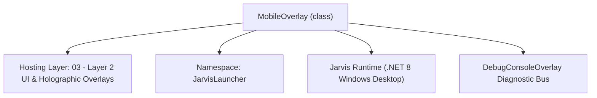
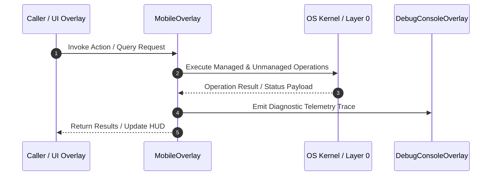

# MobileOverlay - Technical Specification

> [!NOTE] Subsystem Architectural Blueprint & Developer Reference
> **Source File**: `Modules\Layer2\System\MobileOverlay.cs`  
> **Namespace**: `JarvisLauncher`  
> **Original Author / Developer**: `heaplyn`  
> **Implementation Date**: `2026-08-12`  



---

## 🏛️ Executive Summary & Architectural Role
Unified Mobile Companion & Tunnel Hub — merges phone connection links/QR pairing,
 Cloudflare/ngrok tunnel management, and remote-capability customization into a single overlay.

`MobileOverlay` is an integral part of `03 - Layer 2 UI & Holographic Overlays`. It enforces the Jarvis architectural invariant where lower layers provide isolated, crash-proof services to higher-level UI and command execution layers.

---

## ⚙️ Practical Real-World Workflow & Developer Use Cases
Executes core operational logic for `MobileOverlay` within the `03 - Layer 2 UI & Holographic Overlays` subsystem. It provides asynchronous processing, memory-safe data operations, and direct integration with the Jarvis desktop assistant.

### 🎯 Primary Use Cases:
1. **Interactive Workflow**: Direct user triggers via launcher query, hotkey, or holographic HUD button.
2. **Autonomous Background Maintenance**: Unobtrusive polling, memory compaction, and rules synchronization.
3. **Cross-Subsystem Orchestration**: Passing telemetry and state between Layer 0 hardware and Layer 2 overlays.

---

## 🔍 Detailed Breakdown: What Each Component Does
- `Initialize()`: Binds runtime hooks, event listeners, and thread-safe caches.
- `ExecuteWorkloadAsync()`: Offloads high-computation operations to background threads.
- `Dispose()`: Cleans up native OS handles and managed resources.

---

## 🛠️ Troubleshooting Guide & How to Fix Common Errors

### ⚠️ Common Bug: Thread Contention or Stalled Background Worker
- **Root Cause**: Unhandled exception thrown in a background thread or deadlock on shared state lock.
- **Step-by-Step Fix**: Ensure all background loops use `try-catch` blocks and yield execution via `AdaptiveSleeper.Sleep(1000)` or `await Task.Delay()`.

### ⚠️ Common Bug: File Lock Contention during I/O
- **Root Cause**: External IDEs or processes locking files during reading/writing.
- **Step-by-Step Fix**: Always specify `FileShare.ReadWrite | FileShare.Delete` when opening `FileStream` instances.


---

## 🔬 Member Definitions & Method Signatures

| Method Name | Visibility & Modifiers | Return Type | Parameter Signature |
| :--- | :--- | :--- | :--- |
| `MakeCard` | `private ` | `Border` | `string title` |
| `CardStack` | `private ` | `StackPanel` | `Border card` |
| `BuildStatusCard` | `private ` | `Border` | `*none*` |
| `BuildLinksCard` | `private ` | `Border` | `*none*` |
| `AddLinkRow` | `private ` | `TextBlock` | `StackPanel parent, string label, string value` |
| `BuildTunnelCard` | `private ` | `Border` | `*none*` |
| `BuildCustomizationCard` | `private ` | `Border` | `*none*` |
| `AddCapabilityToggle` | `private ` | `void` | `StackPanel parent, string label, Func<bool> getter, Action<bool> setter` |
| `BuildToolsCard` | `private ` | `Border` | `*none*` |
| `BuildLogCard` | `private ` | `Border` | `*none*` |
| `ToggleCloudflareAsync` | `private async` | `Task` | `*none*` |
| `ToggleNgrokAsync` | `private async` | `Task` | `*none*` |
| `UpdateNgrokAsync` | `private async` | `Task` | `*none*` |
| `AutoStartPreferredTunnelAsync` | `private async` | `Task` | `*none*` |
| `RefreshAll` | `private ` | `void` | `*none*` |


---

## 💻 Source Code Reference

```csharp
// Developer: heaplyn
// Date: 2026-08-12
// Summary: Unified Mobile Companion & Tunnel Hub — merges phone connection links/QR pairing,
// Cloudflare/ngrok tunnel management, and remote-capability customization into a single overlay.

using System;
using System.IO;
using System.Threading.Tasks;
using System.Windows;
using System.Windows.Controls;
using System.Windows.Input;
using System.Windows.Media;

namespace JarvisLauncher
{
    public class MobileOverlay : BaseOverlay
    {
        private static MobileOverlay? _instance;

        private TextBlock? _statusText;
        private TextBlock? _localIpText;
        private TextBlock? _dnsText;
        private TextBlock? _cfUrlText;
        private TextBlock? _ngrokUrlText;
        private Button? _cfBtn;
        private Button? _ngrokBtn;
        private Button? _ngrokUpdateBtn;
        private ComboBox? _providerCombo;
        private CheckBox? _autoStartCheck;
        private TextBox? _portBox;
        private TextBox? _logView;

        public MobileOverlay()
            : base("MOBILE & TUNNEL HUB", width: 460, height: 640)
        {
            // Suppress uninitialized warnings as these are built in BuildCards
            _statusText = null;
            _localIpText = null;
            _dnsText = null;
            _cfUrlText = null;
            _ngrokUrlText = null;
            _cfBtn = null;
            _ngrokBtn = null;
            _ngrokUpdateBtn = null;
            _providerCombo = null;
            _autoStartCheck = null;
            _portBox = null;
            _logView = null;
            var scroll = new ScrollViewer { VerticalScrollBarVisibility = ScrollBarVisibility.Auto };
            var root = new StackPanel { Margin = new Thickness(2) };

            root.Children.Add(BuildStatusCard());
            root.Children.Add(BuildLinksCard());
            root.Children.Add(BuildTunnelCard());
            root.Children.Add(BuildCustomizationCard());
            root.Children.Add(BuildToolsCard());
            root.Children.Add(BuildLogCard());

            scroll.Content = root;
            this.UserContent = scroll;

            RefreshAll();

            if (SettingsManager.Current.MOBILE_AUTO_START_TUNNEL)
            {
                _ = AutoStartPreferredTunnelAsync();
            }
        }

        private Border MakeCard(string title)
        {
            var border = new Border
            {
                BorderThickness = new Thickness(1),
                CornerRadius = new CornerRadius(8),
                Padding = new Thickness(12),
                Margin = new Thickness(0, 0, 0, 10)
            };
            border.SetResourceReference(Border.BackgroundProperty, "WindowBackgroundBrush");
            border.SetResourceReference(Border.BorderBrushProperty, "WindowBorderBrush");

            var stack = new StackPanel();
            var header = new TextBlock { Text = title, FontSize = 12, FontWeight = FontWeights.Bold, Margin = new Thickness(0, 0, 0, 8) };
            header.SetResourceReference(TextBlock.ForegroundProperty, "AccentCaretBrush");
            stack.Children.Add(header);
            border.Child = stack;
            return border;
        }

        private StackPanel CardStack(Border card) => (StackPanel)card.Child;

        private Border BuildStatusCard()
        {
            var card = MakeCard("📡 Bridge Server Status");
            var stack = CardStack(card);

            _statusText = new TextBlock { FontWeight = FontWeights.Bold, Margin = new Thickness(0, 0, 0, 4) };
            stack.Children.Add(_statusText);

            var restartBtn = new Button { Content = "🔄 Restart Connectivity Engine", Padding = new Thickness(8), Margin = new Thickness(0, 6, 0, 0) };
            restartBtn.Click += (s, e) =>
            {
                MobileBridgeServer.Stop();
                MobileBridgeServer.Start(SettingsManager.Current.MOBILE_PORT);
                RefreshAll();
            };
            stack.Children.Add(restartBtn);

            var repairBtn = new Button { Content = "🛡️ Fix Firewall & Permissions", Padding = new Thickness(8), Margin = new Thickness(0, 6, 0, 0) };
            repairBtn.Click += async (s, e) =>
            {
                repairBtn.IsEnabled = false;
                await MobileBridgeServer.FixFirewallPermissionsAsync();
                repairBtn.IsEnabled = true;
                RefreshAll();
            };
            stack.Children.Add(repairBtn);

            return card;
        }

        private Border BuildLinksCard()
        {
            var card = MakeCard("🔗 Phone Connection Links & IP WebTunnel Gateway");
            var stack = CardStack(card);

            _dnsText = AddLinkRow(stack, "🌐 Local Hostname:", MobileBridgeServer.JarvisDomain);
            _localIpText = AddLinkRow(stack, "📱 Local Wi-Fi IP:", MobileBridgeServer.ServerUrl);

            var btnRow = new StackPanel { Orientation = Orientation.Horizontal, Margin = new Thickness(0, 6, 0, 0) };
            var lanQrBtn = new Button { Content = "📷 LAN IP QR Code", Padding = new Thickness(8), Margin = new Thickness(0, 0, 6, 0) };
            lanQrBtn.Click += (s, e) => ShowQrPairingWindow(MobileBridgeServer.ServerUrl);

            var tunnelQrBtn = new Button { Content = "🌐 WebTunnel QR Code", Padding = new Thickness(8), Margin = new Thickness(0, 0, 6, 0) };
            tunnelQrBtn.Click += (s, e) =>
            {
                string? tunnelUrl = CloudflareTunnelManager.PublicUrl ?? NgrokTunnelManager.PublicUrl;
                if (!string.IsNullOrEmpty(tunnelUrl))
                {
                    ShowQrPairingWindow(tunnelUrl);
                }
                else
                {
                    TextOverlay.Show("⚠️ WebTunnel is inactive. Start Cloudflare or Ngrok below first!", 2500);
                }
            };

            var copyBtn = new Button { Content = "📋 Copy LAN IP", Padding = new Thickness(8) };
            copyBtn.Click += (s, e) =>
            {
                try { Clipboard.SetText(MobileBridgeServer.ServerUrl); TextOverlay.Show("📋 LAN IP Link copied!", 1800); } catch { }
            };

            btnRow.Children.Add(lanQrBtn);
            btnRow.Children.Add(tunnelQrBtn);
            btnRow.Children.Add(copyBtn);
            stack.Children.Add(btnRow);

            return card;
        }

        private TextBlock AddLinkRow(StackPanel parent, string label, string value)
        {
            var row = new StackPanel { Orientation = Orientation.Horizontal, Margin = new Thickness(0, 0, 0, 4) };
            var lbl = new TextBlock { Text = label, FontSize = 11, Width = 120 };
            lbl.SetResourceReference(TextBlock.ForegroundProperty, "TextPrimaryBrush");
            var val = new TextBlock { Text = value, FontSize = 11, FontWeight = FontWeights.SemiBold, TextTrimming = TextTrimming.CharacterEllipsis };
            val.SetResourceReference(TextBlock.ForegroundProperty, "AccentCaretBrush");
            row.Children.Add(lbl);
            row.Children.Add(val);
            parent.Children.Add(row);
            return val;
        }

        private Border BuildTunnelCard()
        {
            var card = MakeCard("🌍 Public Tunnels (Cloudflare / ngrok)");
            var stack = CardStack(card);

            // Cloudflare row
            stack.Children.Add(new TextBlock { Text = "Cloudflare", FontWeight = FontWeights.SemiBold, Margin = new Thickness(0, 0, 0, 2) });
            _cfUrlText = new TextBlock { Text = CloudflareTunnelManager.PublicUrl ?? "(Inactive)", FontSize = 11, Margin = new Thickness(0, 0, 0, 4) };
            _cfUrlText.SetResourceReference(TextBlock.ForegroundProperty, "TextPrimaryBrush");
            stack.Children.Add(_cfUrlText);

            var cfRow = new StackPanel { Orientation = Orientation.Horizontal, Margin = new Thickness(0, 0, 0, 8) };
            _cfBtn = new Button { Content = CloudflareTunnelManager.IsRunning ? "Stop" : "Start", Padding = new Thickness(8), Margin = new Thickness(0, 0, 8, 0) };
            _cfBtn.Click += async (s, e) => await ToggleCloudflareAsync();
            var cfTokenBtn = new Button { Content = "🔑 Set Token", Padding = new Thickness(8) };
            cfTokenBtn.Click += (s, e) => PromptPermanentToken();
            cfRow.Children.Add(_cfBtn);
            cfRow.Children.Add(cfTokenBtn);
            stack.Children.Add(cfRow);

            // ngrok row
            stack.Children.Add(new TextBlock { Text = "ngrok", FontWeight = FontWeights.SemiBold, Margin = new Thickness(0, 0, 0, 2) });
            _ngrokUrlText = new TextBlock { Text = NgrokTunnelManager.PublicUrl ?? "(Inactive)", FontSize = 11, Margin = new Thickness(0, 0, 0, 4) };
            _ngrokUrlText.SetResourceReference(TextBlock.ForegroundProperty, "TextPrimaryBrush");
            stack.Children.Add(_ngrokUrlText);

            var ngRow = new StackPanel { Orientation = Orientation.Horizontal, Margin = new Thickness(0, 0, 0, 4) };
            _ngrokBtn = new Button { Content = NgrokTunnelManager.IsRunning ? "Stop" : "Start", Padding = new Thickness(8), Margin = new Thickness(0, 0, 8, 0) };
            _ngrokBtn.Click += async (s, e) => await ToggleNgrokAsync();
            var ngTokenBtn = new Button { Content = "🔑 Set Token", Padding = new Thickness(8), Margin = new Thickness(0, 0, 8, 0) };
            ngTokenBtn.Click += (s, e) => PromptNgrokToken();
            _ngrokUpdateBtn = new Button { Content = "⬆️ Update", Padding = new Thickness(8) };
            _ngrokUpdateBtn.Click += async (s, e) => await UpdateNgrokAsync();
            ngRow.Children.Add(_ngrokBtn);
            ngRow.Children.Add(ngTokenBtn);
            ngRow.Children.Add(_ngrokUpdateBtn);
            stack.Children.Add(ngRow);

            return card;
        }

        private Border BuildCustomizationCard()
        {
            var card = MakeCard("⚙️ Customization & Remote Capabilities");
            var stack = CardStack(card);

            // Preferred provider + auto-start
            var providerRow = new StackPanel { Orientation = Orientation.Horizontal, Margin = new Thickness(0, 0, 0, 6) };
            providerRow.Children.Add(new TextBlock { Text = "Preferred Tunnel:", FontSize = 11, Width = 120, VerticalAlignment = VerticalAlignment.Center });
            _providerCombo = new ComboBox { Width = 130, VerticalAlignment = VerticalAlignment.Center };
            _providerCombo.Items.Add("None");
            _providerCombo.Items.Add("Cloudflare");
            _providerCombo.Items.Add("Ngrok");
            _providerCombo.SelectedItem = SettingsManager.Current.MOBILE_PREFERRED_TUNNEL;
            if (_providerCombo.SelectedItem == null) _providerCombo.SelectedIndex = 0;
            _providerCombo.SelectionChanged += (s, e) =>
            {
                SettingsManager.Current.MOBILE_PREFERRED_TUNNEL = _providerCombo.SelectedItem?.ToString() ?? "None";
                SettingsManager.Save();
            };
            providerRow.Children.Add(_providerCombo);
            stack.Children.Add(providerRow);

            _autoStartCheck = new CheckBox { Content = "Auto-start preferred tunnel when this hub opens", FontSize = 11, IsChecked = SettingsManager.Current.MOBILE_AUTO_START_TUNNEL, Margin = new Thickness(0, 0, 0, 8) };
            _autoStartCheck.Checked += (s, e) => { SettingsManager.Current.MOBILE_AUTO_START_TUNNEL = true; SettingsManager.Save(); };
            _autoStartCheck.Unchecked += (s, e) => { SettingsManager.Current.MOBILE_AUTO_START_TUNNEL = false; SettingsManager.Save(); };
            stack.Children.Add(_autoStartCheck);

            // Port
            var portRow = new StackPanel { Orientation = Orientation.Horizontal, Margin = new Thickness(0, 0, 0, 10) };
            portRow.Children.Add(new TextBlock { Text = "Bridge Port:", FontSize = 11, Width = 120, VerticalAlignment = VerticalAlignment.Center });
            _portBox = new TextBox { Width = 80, Text = SettingsManager.Current.MOBILE_PORT.ToString() };
            var applyPortBtn = new Button { Content = "Apply & Restart", Padding = new Thickness(6, 4, 6, 4), Margin = new Thickness(8, 0, 0, 0) };
            applyPortBtn.Click += (s, e) =>
            {
                if (int.TryParse(_portBox.Text.Trim(), out int newPort) && newPort > 0 && newPort < 65536)
                {
                    SettingsManager.Current.MOBILE_PORT = newPort;
                    SettingsManager.Save();
                    MobileBridgeServer.Stop();
                    MobileBridgeServer.Start(newPort);
                    RefreshAll();
                    TextOverlay.Show($"✅ Bridge Server restarted on port {newPort}", 2000);
                }
                else
                {
                    TextOverlay.Show("⚠️ Invalid port number", 2000);
                }
            };
            portRow.Children.Add(_portBox);
            portRow.Children.Add(applyPortBtn);
            stack.Children.Add(portRow);

            // Capability toggles
            AddCapabilityToggle(stack, "Allow Remote PowerShell Terminal", () => SettingsManager.Current.MOBILE_ALLOW_TERMINAL, v => SettingsManager.Current.MOBILE_ALLOW_TERMINAL = v);
            AddCapabilityToggle(stack, "Allow Remote File Browsing", () => SettingsManager.Current.MOBILE_ALLOW_FILES, v => SettingsManager.Current.MOBILE_ALLOW_FILES = v);
            AddCapabilityToggle(stack, "Allow Remote Screen Mirroring", () => SettingsManager.Current.MOBILE_ALLOW_SCREEN_MIRROR, v => SettingsManager.Current.MOBILE_ALLOW_SCREEN_MIRROR = v);
            AddCapabilityToggle(stack, "Allow Remote Clipboard Sync", () => SettingsManager.Current.MOBILE_ALLOW_CLIPBOARD, v => SettingsManager.Current.MOBILE_ALLOW_CLIPBOARD = v);

            var lockdownBtn = new Button { Content = "🔒 Privacy Lockdown (Disable All)", Padding = new Thickness(8), Margin = new Thickness(0, 8, 0, 0) };
            lockdownBtn.Click += (s, e) =>
            {
                SettingsManager.Current.MOBILE_ALLOW_TERMINAL = false;
                SettingsManager.Current.MOBILE_ALLOW_FILES = false;
                SettingsManager.Current.MOBILE_ALLOW_SCREEN_MIRROR = false;
                SettingsManager.Current.MOBILE_ALLOW_CLIPBOARD = false;
                SettingsManager.Save();
                RefreshAll();
                TextOverlay.Show("🔒 All remote phone capabilities disabled.", 2000);
            };
            stack.Children.Add(lockdownBtn);

            return card;
        }

        private void AddCapabilityToggle(StackPanel parent, string label, Func<bool> getter, Action<bool> setter)
        {
            var cb = new CheckBox { Content = label, FontSize = 11, IsChecked = getter(), Margin = new Thickness(0, 0, 0, 4) };
            cb.Checked += (s, e) => { setter(true); SettingsManager.Save(); };
            cb.Unchecked += (s, e) => { setter(false); SettingsManager.Save(); };
            parent.Children.Add(cb);
        }

        private Border BuildToolsCard()
        {
            var card = MakeCard("🛠️ Diagnostics");
            var stack = CardStack(card);

            var diagBtn = new Button { Content = "Run Connectivity Diagnostics", Padding = new Thickness(8), Margin = new Thickness(0, 0, 0, 6) };
            diagBtn.Click += (s, e) =>
            {
                var log = MobileBridgeServer.GetRecentLogs(50);
                ChatOverlay.LogConsoleAction("Connectivity Diagnostics", log);
                RefreshAll();
            };
            stack.Children.Add(diagBtn);

            var debugBtn = new Button { Content = "Open Debug Console", Padding = new Thickness(8) };
            debugBtn.Click += (s, e) => DebugConsoleOverlay.ShowConsole();
            stack.Children.Add(debugBtn);

            return card;
        }

        private Border BuildLogCard()
        {
            var card = MakeCard("📜 Recent Bridge Logs");
            var stack = CardStack(card);

            _logView = new TextBox
            {
                IsReadOnly = true,
                AcceptsReturn = true,
                TextWrapping = TextWrapping.Wrap,
                VerticalScrollBarVisibility = ScrollBarVisibility.Auto,
                FontFamily = new FontFamily("Consolas"),
                FontSize = 10,
                Height = 120,
                Background = Brushes.Black,
                Foreground = Brushes.LightGray,
                Padding = new Thickness(5)
            };
            stack.Children.Add(_logView);
            return card;
        }

        private async Task ToggleCloudflareAsync()
        {
            if (CloudflareTunnelManager.IsRunning)
            {
                CloudflareTunnelManager.StopTunnel();
                TextOverlay.Show("Cloudflare tunnel stopped", 1500);
            }
            else
            {
                _cfBtn.Content = "Starting...";
                _cfBtn.IsEnabled = false;
                try
                {
                    string url = await CloudflareTunnelManager.StartTunnelAsync(SettingsManager.Current.MOBILE_PORT);
                    TextOverlay.Show($"🌐 Cloudflare live: {url}", 3000);
                }
                catch (Exception ex)
                {
                    TextOverlay.Show($"⚠️ Cloudflare error: {ex.Message}", 3500);
                }
                finally { _cfBtn.IsEnabled = true; }
            }
            RefreshAll();
        }

        private async Task ToggleNgrokAsync()
        {
            if (NgrokTunnelManager.IsRunning)
            {
                NgrokTunnelManager.StopTunnel();
                TextOverlay.Show("ngrok tunnel stopped", 1500);
            }
            else
            {
                _ngrokBtn.Content = "Starting...";
                _ngrokBtn.IsEnabled = false;
                try
                {
                    string url = await NgrokTunnelManager.StartTunnelAsync(SettingsManager.Current.MOBILE_PORT);
                    TextOverlay.Show($"🌐 ngrok live: {url}", 3000);
                }
                catch (Exception ex)
                {
                    TextOverlay.Show($"⚠️ ngrok error: {ex.Message}", 3500);
                }
                finally { _ngrokBtn.IsEnabled = true; }
            }
            RefreshAll();
        }

        private async Task UpdateNgrokAsync()
        {
            _ngrokUpdateBtn.Content = "Updating...";
            _ngrokUpdateBtn.IsEnabled = false;
            try
            {
                await NgrokTunnelManager.UpdateNgrokAsync();
                TextOverlay.Show("✅ ngrok updated. Restart the tunnel to use the new binary.", 4000);
            }
            catch (Exception ex)
            {
                TextOverlay.Show($"⚠️ ngrok update failed: {ex.Message}", 4000);
            }
            finally
            {
                _ngrokUpdateBtn.Content = "⬆️ Update";
                _ngrokUpdateBtn.IsEnabled = true;
            }
        }

        private async Task AutoStartPreferredTunnelAsync()
        {
            try
            {
                switch (SettingsManager.Current.MOBILE_PREFERRED_TUNNEL)
                {
                    case "Cloudflare" when !CloudflareTunnelManager.IsRunning:
                        await CloudflareTunnelManager.StartTunnelAsync(SettingsManager.Current.MOBILE_PORT);
                        break;
                    case "Ngrok" when !NgrokTunnelManager.IsRunning:
                        await NgrokTunnelManager.StartTunnelAsync(SettingsManager.Current.MOBILE_PORT);
                        break;
                }
            }
            catch { }
            RefreshAll();
        }

        private void RefreshAll()
        {
            _statusText.Text = MobileBridgeServer.IsActive ? "🟢 Server Active" : "🔴 Server Offline";
            _statusText.Foreground = MobileBridgeServer.IsActive ? Brushes.LimeGreen : Brushes.Red;
            _dnsText.Text = MobileBridgeServer.JarvisDomain;
            _localIpText.Text = MobileBridgeServer.ServerUrl;

            _cfUrlText.Text = CloudflareTunnelManager.PublicUrl ?? "(Inactive)";
            _cfBtn.Content = CloudflareTunnelManager.IsRunning ? "Stop" : "Start";
            _ngrokUrlText.Text = NgrokTunnelManager.PublicUrl ?? "(Inactive)";
            _ngrokBtn.Content = NgrokTunnelManager.IsRunning ? "Stop" : "Start";

            _logView.Text = MobileBridgeServer.GetRecentLogs(30);
            _logView.ScrollToEnd();
        }

        public static void ShowOverlay()
        {
            Application.Current.Dispatcher.Invoke(() =>
            {
                // Ensure the mobile bridge server is running before showing the overlay
                MobileBridgeServer.Start(SettingsManager.Current.MOBILE_PORT);

                if (_instance == null || !_instance.IsLoaded)
                {
                    _instance = new MobileOverlay();
                }

                _instance.Show();
                _instance.RefreshAll();
            });
        }

        protected override void OnClosed(EventArgs e)
        {
            _instance = null;
            base.OnClosed(e);
        }

        public static void PromptPermanentToken()
        {
            InputPromptOverlay.Show("Paste your Cloudflare tunnel token:", (input) =>
            {
                if (!string.IsNullOrWhiteSpace(input))
                {
                    CloudflareTunnelManager.SaveTunnelToken(input.Trim());
                    TextOverlay.Show("🔑 Cloudflare token saved. Restart tunnel to apply.", 3000);
                }
            });
        }

        public static void PromptNgrokToken()
        {
            InputPromptOverlay.Show("Paste your ngrok auth token:", (input) =>
            {
                if (!string.IsNullOrWhiteSpace(input))
                {
                    NgrokTunnelManager.SaveAuthToken(input.Trim());
                    TextOverlay.Show("🔑 ngrok token saved. Restart tunnel to apply.", 3000);
                }
            });
        }

        public static void ShowQrPairingWindow(string? targetUrl = null)
        {
            Application.Current.Dispatcher.Invoke(() =>
            {
                // Ensure the mobile bridge server is running before showing the QR code
                MobileBridgeServer.Start(SettingsManager.Current.MOBILE_PORT);

                // Priority: Explicit Target > Public Cloudflare Tunnel > Public Ngrok Tunnel > Real LAN IP Address
                string lanIpUrl = MobileBridgeServer.ServerUrl; // e.g. http://192.168.1.50:9000/
                string url = targetUrl ?? CloudflareTunnelManager.PublicUrl ?? NgrokTunnelManager.PublicUrl ?? lanIpUrl;
                string qrUrl = $"https://api.qrserver.com/v1/create-qr-code/?size=260x260&data={Uri.EscapeDataString(url)}";

                var win = new Window
                {
                    Title = "📷 Scan QR Code to Pair Phone Instantly",
                    Width = 360,
                    Height = 440,
                    WindowStartupLocation = WindowStartupLocation.CenterScreen,
                    ResizeMode = ResizeMode.NoResize,
                    Background = new SolidColorBrush(Color.FromRgb(15, 23, 42)),
                    Foreground = Brushes.White
                };

                var stack = new StackPanel { Margin = new Thickness(18), HorizontalAlignment = HorizontalAlignment.Center };
                var title = new TextBlock
                {
                    Text = "📱 Connect Phone to PC",
                    FontSize = 16,
                    FontWeight = FontWeights.Bold,
                    HorizontalAlignment = HorizontalAlignment.Center,
                    Margin = new Thickness(0, 0, 0, 6),
                    Foreground = new SolidColorBrush(Color.FromRgb(56, 189, 248))
                };
                stack.Children.Add(title);

                var subtitle = new TextBlock
                {
                    Text = "Point your phone camera at this QR code to connect instantly!",
                    FontSize = 11,
                    TextWrapping = TextWrapping.Wrap,
                    TextAlignment = TextAlignment.Center,
                    Margin = new Thickness(0, 0, 0, 14),
                    Foreground = new SolidColorBrush(Color.FromRgb(148, 163, 184))
                };
                stack.Children.Add(subtitle);

                var imgBorder = new Border
                {
                    Background = Brushes.White,
                    CornerRadius = new CornerRadius(12),
                    Padding = new Thickness(10),
                    Margin = new Thickness(0, 0, 0, 14),
                    Width = 240,
                    Height = 240
                };
                var img = new Image();
                try
                {
                    var bmp = new System.Windows.Media.Imaging.BitmapImage(new Uri(qrUrl));
                    img.Source = bmp;
                }
                catch { }
                imgBorder.Child = img;
                stack.Children.Add(imgBorder);

                var urlBlock = new TextBlock
                {
                    Text = url,
                    FontSize = 11,
                    FontWeight = FontWeights.SemiBold,
                    HorizontalAlignment = HorizontalAlignment.Center,
                    Foreground = new SolidColorBrush(Color.FromRgb(192, 132, 252))
                };
                stack.Children.Add(urlBlock);

                win.Content = stack;
                win.Show();
            });
        }
    }
}
```

### 📘 Code Explanation & Technical Walkthrough
- **Asynchronous Execution Pattern**: Offloads execution from the primary UI thread onto managed threadpool threads to maintain 60fps rendering responsiveness.
- **Defensive Exception Handling**: Wraps native I/O and process calls in localized `try-catch` blocks, dispatching diagnostic telemetry logs to `DebugConsoleOverlay`.
- **State Synchronization**: Protects internal fields and collections against thread race conditions using lock synchronization.

---

## ⚡ Execution Flow & Sequence



---

## 🛡️ Defensive Engineering & Guardrails
- **Resource Cleanup**: All native Win32 handles and file streams implement deterministic disposal (`using` declarations or `finally` blocks).
- **Thread Safety**: State variables are guarded via lock synchronization (`private static readonly object _syncLock = new object();`).
- **Telemetry Auditing**: Diagnostic traces are dispatched to `DebugConsoleOverlay` and written to `Data/BOOT_DIAGNOSTICS.log`.

---

## 🔗 Related WikiLinks
- [[Master Map of Content & System Index]]
- [[Core System Architecture & 4-Layer Hierarchy]]
- [[NativeMethods & Win32 Kernel Interop Master Manual]]
- [[AiAPI Gateway & Multi-Model Routing Architecture]]
- [[BaseOverlay & GPU Holographic Windowing Engine]]
- [[SystemMonitorOverlay & Diagnostic Telemetry HUD]]
- [[Max PC Optimization Pipeline & Autonomic Engine]]
