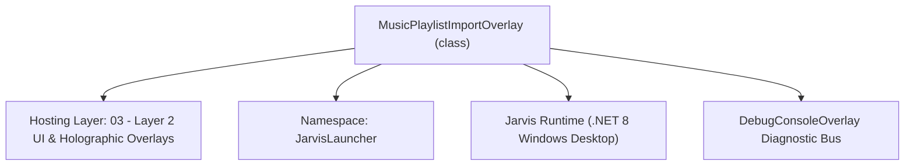
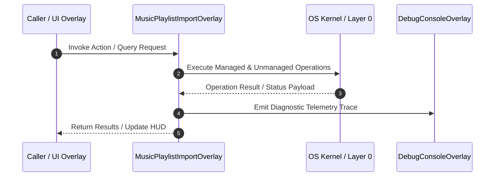

# MusicPlaylistImportOverlay - Technical Specification

> [!NOTE] Subsystem Architectural Blueprint & Developer Reference
> **Source File**: `Modules\Layer2\System\MusicPlaylistImportOverlay.cs`  
> **Namespace**: `JarvisLauncher`  
> **Original Author / Developer**: `heaplyn`  
> **Implementation Date**: `2026-08-20`  



---

## 🏛️ Executive Summary & Architectural Role
Interactive Glassmorphic Playlist Import Overlay.
          Parses YouTube, SoundCloud, or Spotify playlist links using flat-playlist metadata scrapes,
          presents tracks with checkboxes, provides keyword filtering and max import limiters,
          and passes selected URLs back to Jukebox's background downloader.

`MusicPlaylistImportOverlay` is an integral part of `03 - Layer 2 UI & Holographic Overlays`. It enforces the Jarvis architectural invariant where lower layers provide isolated, crash-proof services to higher-level UI and command execution layers.

---

## ⚙️ Practical Real-World Workflow & Developer Use Cases
Executes core operational logic for `MusicPlaylistImportOverlay` within the `03 - Layer 2 UI & Holographic Overlays` subsystem. It provides asynchronous processing, memory-safe data operations, and direct integration with the Jarvis desktop assistant.

### 🎯 Primary Use Cases:
1. **Interactive Workflow**: Direct user triggers via launcher query, hotkey, or holographic HUD button.
2. **Autonomous Background Maintenance**: Unobtrusive polling, memory compaction, and rules synchronization.
3. **Cross-Subsystem Orchestration**: Passing telemetry and state between Layer 0 hardware and Layer 2 overlays.

---

## 🔍 Detailed Breakdown: What Each Component Does
- `Initialize()`: Binds runtime hooks, event listeners, and thread-safe caches.
- `ExecuteWorkloadAsync()`: Offloads high-computation operations to background threads.
- `Dispose()`: Cleans up native OS handles and managed resources.

---

## 🛠️ Troubleshooting Guide & How to Fix Common Errors

### ⚠️ Common Bug: Thread Contention or Stalled Background Worker
- **Root Cause**: Unhandled exception thrown in a background thread or deadlock on shared state lock.
- **Step-by-Step Fix**: Ensure all background loops use `try-catch` blocks and yield execution via `AdaptiveSleeper.Sleep(1000)` or `await Task.Delay()`.

### ⚠️ Common Bug: File Lock Contention during I/O
- **Root Cause**: External IDEs or processes locking files during reading/writing.
- **Step-by-Step Fix**: Always specify `FileShare.ReadWrite | FileShare.Delete` when opening `FileStream` instances.


---

## 🔬 Member Definitions & Method Signatures

| Method Name | Visibility & Modifiers | Return Type | Parameter Signature |
| :--- | :--- | :--- | :--- |
| `Open` | `public static` | `void` | `string playlistUrl, Action<List<string>> onImportSelected` |
| `ScrapePlaylistAsync` | `private async` | `Task` | `*none*` |
| `RenderTracksList` | `private ` | `void` | `*none*` |
| `CreateTrackRow` | `private ` | `UIElement` | `PlaylistTrackInfo track, int index` |
| `ToggleSelectAll` | `private ` | `void` | `bool selectAll` |
| `ApplySelectionLimit` | `private ` | `void` | `*none*` |
| `UpdateImportButtonCount` | `private ` | `void` | `*none*` |
| `ExecuteImport` | `private ` | `void` | `*none*` |


---

## 💻 Source Code Reference

```csharp
// Developer: heaplyn
// Date: 2026-08-20
// Summary: Interactive Glassmorphic Playlist Import Overlay.
//          Parses YouTube, SoundCloud, or Spotify playlist links using flat-playlist metadata scrapes,
//          presents tracks with checkboxes, provides keyword filtering and max import limiters,
//          and passes selected URLs back to Jukebox's background downloader.

using System;
using System.Collections.Generic;
using System.IO;
using System.Linq;
using System.Text;
using System.Threading.Tasks;
using System.Windows;
using System.Windows.Controls;
using System.Windows.Input;
using System.Windows.Media;

namespace JarvisLauncher
{
    public class MusicPlaylistImportOverlay : BaseOverlay
    {
        private static MusicPlaylistImportOverlay? _instance;

        private readonly string _playlistUrl;
        private readonly Action<List<string>> _onImportSelected;
        
        private readonly StackPanel _tracksPanel;
        private readonly TextBox _searchBox;
        private readonly TextBox _limitInput;
        private readonly TextBlock _statusLabel;
        private readonly Button _importBtn;

        private List<PlaylistTrackInfo> _allTracks = new();
        private string _searchQuery = "";

        public class PlaylistTrackInfo
        {
            public string Title { get; set; } = "";
            public string Id { get; set; } = "";
            public string Duration { get; set; } = "";
            public string Url => $"https://www.youtube.com/watch?v={Id}";
            public bool IsChecked { get; set; } = true;
        }

        public static void Open(string playlistUrl, Action<List<string>> onImportSelected)
        {
            Application.Current.Dispatcher.Invoke(() =>
            {
                if (_instance == null || !_instance.IsLoaded)
                {
                    _instance = new MusicPlaylistImportOverlay(playlistUrl, onImportSelected);
                    _instance.Closed += (s, e) => _instance = null;
                }
                _instance.Show();
                _instance.BringToFront();
            });
        }

        private MusicPlaylistImportOverlay(string playlistUrl, Action<List<string>> onImportSelected) 
            : base("📋 IMPORT PLAYLIST / ALBUM", width: 780, height: 550)
        {
            _playlistUrl = playlistUrl;
            _onImportSelected = onImportSelected;

            var mainGrid = new Grid { Margin = new Thickness(12) };
            mainGrid.RowDefinitions.Add(new RowDefinition { Height = GridLength.Auto }); // Header / URL
            mainGrid.RowDefinitions.Add(new RowDefinition { Height = GridLength.Auto }); // Filters and Options
            mainGrid.RowDefinitions.Add(new RowDefinition { Height = new GridLength(1, GridUnitType.Star) }); // Scrollable list
            mainGrid.RowDefinitions.Add(new RowDefinition { Height = GridLength.Auto }); // Bottom action buttons

            // --- Row 0: URL & Status ---
            var headerStack = new StackPanel { Margin = new Thickness(0, 0, 0, 10) };
            headerStack.Children.Add(new TextBlock
            {
                Text = $"Playlist Link: {_playlistUrl}",
                Foreground = Brushes.LightGray,
                FontSize = 10,
                TextTrimming = TextTrimming.CharacterEllipsis
            });
            _statusLabel = new TextBlock
            {
                Text = "⌛ Scraping playlist metadata... Please wait.",
                Foreground = Brushes.Cyan,
                FontSize = 12,
                FontWeight = FontWeights.Bold,
                Margin = new Thickness(0, 4, 0, 0)
            };
            headerStack.Children.Add(_statusLabel);
            Grid.SetRow(headerStack, 0);
            mainGrid.Children.Add(headerStack);

            // --- Row 1: Filters and Options ---
            var optionsGrid = new Grid { Margin = new Thickness(0, 0, 0, 12) };
            optionsGrid.ColumnDefinitions.Add(new ColumnDefinition { Width = new GridLength(1, GridUnitType.Star) }); // Search
            optionsGrid.ColumnDefinitions.Add(new ColumnDefinition { Width = GridLength.Auto }); // Max tracks
            optionsGrid.ColumnDefinitions.Add(new ColumnDefinition { Width = GridLength.Auto }); // Action selections

            // Search
            var searchWrap = new Grid { Margin = new Thickness(0, 0, 10, 0) };
            _searchBox = new TextBox
            {
                Height = 26,
                FontSize = 11,
                Padding = new Thickness(6, 3, 6, 3),
                VerticalContentAlignment = VerticalAlignment.Center
            };
            _searchBox.SetResourceReference(TextBox.BackgroundProperty, "WindowBackgroundBrush");
            _searchBox.SetResourceReference(TextBox.ForegroundProperty, "TextPrimaryBrush");
            _searchBox.SetResourceReference(TextBox.BorderBrushProperty, "WindowBorderBrush");
            _searchBox.SetResourceReference(TextBox.CaretBrushProperty, "AccentCaretBrush");
            _searchBox.TextChanged += (s, e) =>
            {
                _searchQuery = _searchBox.Text.Trim().ToLower();
                RenderTracksList();
            };

            var placeholder = new TextBlock
            {
                Text = "🔍 Filter songs by keyword...",
                Foreground = Brushes.Gray,
                FontSize = 11,
                VerticalAlignment = VerticalAlignment.Center,
                Margin = new Thickness(8, 0, 0, 0),
                IsHitTestVisible = false
            };
            _searchBox.GotFocus += (s, e) => placeholder.Visibility = Visibility.Collapsed;
            _searchBox.LostFocus += (s, e) => placeholder.Visibility = string.IsNullOrEmpty(_searchBox.Text) ? Visibility.Visible : Visibility.Collapsed;

            searchWrap.Children.Add(_searchBox);
            searchWrap.Children.Add(placeholder);
            optionsGrid.Children.Add(searchWrap);

            // Max Limit area
            var limitStack = new StackPanel { Orientation = Orientation.Horizontal, Margin = new Thickness(0, 0, 10, 0) };
            var limitLabel = CreateLabel("MAX IMPORT:", 10, true);
            BaseOverlay.SetLabelForeground(limitLabel, Brushes.Cyan);
            limitLabel.Margin = new Thickness(0, 0, 5, 0);
            limitLabel.VerticalAlignment = VerticalAlignment.Center;
            limitStack.Children.Add(limitLabel);

            _limitInput = new TextBox
            {
                Width = 45,
                Height = 26,
                Text = "50",
                FontSize = 11,
                VerticalContentAlignment = VerticalAlignment.Center,
                HorizontalContentAlignment = HorizontalAlignment.Center,
                Background = new SolidColorBrush(Color.FromArgb(30, 0, 0, 0)),
                Foreground = Brushes.White,
                BorderBrush = Brushes.DimGray
            };
            _limitInput.TextChanged += (s, e) => ApplySelectionLimit();
            limitStack.Children.Add(_limitInput);
            Grid.SetColumn(limitStack, 1);
            optionsGrid.Children.Add(limitStack);

            // Toggle Selections Buttons
            var actionStack = new StackPanel { Orientation = Orientation.Horizontal };
            var selectAllBtn = CreateStyledButton("ALL", (s, e) => ToggleSelectAll(true), fontSize: 10);
            var selectNoneBtn = CreateStyledButton("NONE", (s, e) => ToggleSelectAll(false), fontSize: 10);
            actionStack.Children.Add(selectAllBtn);
            actionStack.Children.Add(selectNoneBtn);
            Grid.SetColumn(actionStack, 2);
            optionsGrid.Children.Add(actionStack);

            Grid.SetRow(optionsGrid, 1);
            mainGrid.Children.Add(optionsGrid);

            // --- Row 2: Scrollable Tracks List ---
            _tracksPanel = new StackPanel();
            var scroll = new ScrollViewer
            {
                Content = _tracksPanel,
                VerticalScrollBarVisibility = ScrollBarVisibility.Auto,
                Margin = new Thickness(0, 0, 5, 0)
            };
            Grid.SetRow(scroll, 2);
            mainGrid.Children.Add(scroll);

            // --- Row 3: Bottom Action Panel ---
            var bottomGrid = new Grid { Margin = new Thickness(0, 10, 0, 0) };
            bottomGrid.ColumnDefinitions.Add(new ColumnDefinition { Width = new GridLength(1, GridUnitType.Star) });
            bottomGrid.ColumnDefinitions.Add(new ColumnDefinition { Width = GridLength.Auto });

            _importBtn = CreateStyledButton("📥 IMPORT SELECTED TRACKS", (s, e) => ExecuteImport(), isPrimary: true, fontSize: 11);
            _importBtn.IsEnabled = false;
            Grid.SetColumn(_importBtn, 0);
            bottomGrid.Children.Add(_importBtn);

            var cancelBtn = CreateStyledButton("CANCEL", (s, e) => this.Close(), fontSize: 11);
            cancelBtn.Margin = new Thickness(10, 0, 0, 0);
            Grid.SetColumn(cancelBtn, 1);
            bottomGrid.Children.Add(cancelBtn);

            Grid.SetRow(bottomGrid, 3);
            mainGrid.Children.Add(bottomGrid);

            this.UserContent = mainGrid;

            // Trigger async scrape
            Task.Run(() => ScrapePlaylistAsync());
        }

        private async Task ScrapePlaylistAsync()
        {
            try
            {
                string ytdlpPath = Path.Combine(PathHandler.GetProjectRoot(), "Modules", "Layer0", "DownloadMedia", "node_modules", "ytdlp-nodejs", "bin", "yt-dlp.exe");
                string executable = File.Exists(ytdlpPath) ? ytdlpPath : "yt-dlp";

                var psi = new System.Diagnostics.ProcessStartInfo
                {
                    FileName = executable,
                    Arguments = $"--flat-playlist --print \"%(title)s|%(id)s|%(duration_string)s\" \"{_playlistUrl}\"",
                    UseShellExecute = false,
                    CreateNoWindow = true,
                    RedirectStandardOutput = true,
                    RedirectStandardError = true
                };

                using var proc = System.Diagnostics.Process.Start(psi);
                if (proc != null)
                {
                    string output = await proc.StandardOutput.ReadToEndAsync();
                    await proc.WaitForExitAsync();

                    var lines = output.Split(new[] { '\n', '\r' }, StringSplitOptions.RemoveEmptyEntries);
                    foreach (var line in lines)
                    {
                        var parts = line.Split('|');
                        if (parts.Length >= 2)
                        {
                            _allTracks.Add(new PlaylistTrackInfo
                            {
                                Title = parts[0].Trim(),
                                Id = parts[1].Trim(),
                                Duration = parts.Length > 2 ? parts[2].Trim() : "N/A",
                                IsChecked = true
                            });
                        }
                    }
                }

                Application.Current.Dispatcher.Invoke(() =>
                {
                    if (_allTracks.Count == 0)
                    {
                        _statusLabel.Text = "❌ No tracks found or unable to scrape playlist.";
                        _statusLabel.Foreground = Brushes.Tomato;
                    }
                    else
                    {
                        _statusLabel.Text = $"✅ Scraped {_allTracks.Count} tracks successfully. Select items below.";
                        _statusLabel.Foreground = Brushes.Lime;
                        _importBtn.IsEnabled = true;
                        ApplySelectionLimit();
                        RenderTracksList();
                    }
                });
            }
            catch (Exception ex)
            {
                Application.Current.Dispatcher.Invoke(() =>
                {
                    _statusLabel.Text = $"❌ Error: {ex.Message}";
                    _statusLabel.Foreground = Brushes.Tomato;
                });
            }
        }

        private void RenderTracksList()
        {
            _tracksPanel.Children.Clear();

            var filtered = _allTracks.AsEnumerable();
            if (!string.IsNullOrEmpty(_searchQuery))
            {
                filtered = filtered.Where(t => t.Title.ToLower().Contains(_searchQuery));
            }

            var list = filtered.ToList();

            if (list.Count == 0)
            {
                _tracksPanel.Children.Add(new TextBlock
                {
                    Text = "No playlist tracks match your filter query.",
                    Foreground = Brushes.Gray,
                    FontSize = 11,
                    HorizontalAlignment = HorizontalAlignment.Center,
                    Margin = new Thickness(20)
                });
                return;
            }

            int index = 1;
            foreach (var track in list)
            {
                _tracksPanel.Children.Add(CreateTrackRow(track, index++));
            }

            UpdateImportButtonCount();
        }

        private UIElement CreateTrackRow(PlaylistTrackInfo track, int index)
        {
            var border = new Border
            {
                Background = new SolidColorBrush(Color.FromArgb(12, 255, 255, 255)),
                BorderThickness = new Thickness(1),
                BorderBrush = new SolidColorBrush(Color.FromArgb(15, 255, 255, 255)),
                CornerRadius = new CornerRadius(5),
                Padding = new Thickness(8, 6, 8, 6),
                Margin = new Thickness(0, 0, 0, 4)
            };

            var grid = new Grid();
            grid.ColumnDefinitions.Add(new ColumnDefinition { Width = GridLength.Auto }); // Checkbox
            grid.ColumnDefinitions.Add(new ColumnDefinition { Width = new GridLength(1, GridUnitType.Star) }); // Details

            var cb = new CheckBox
            {
                IsChecked = track.IsChecked,
                VerticalAlignment = VerticalAlignment.Center,
                Margin = new Thickness(0, 0, 10, 0),
                Cursor = Cursors.Hand
            };
            cb.Checked += (s, e) => { track.IsChecked = true; UpdateImportButtonCount(); };
            cb.Unchecked += (s, e) => { track.IsChecked = false; UpdateImportButtonCount(); };
            Grid.SetColumn(cb, 0);
            grid.Children.Add(cb);

            var details = new StackPanel();
            details.Children.Add(new TextBlock
            {
                Text = $"{index}. {track.Title}",
                FontWeight = FontWeights.SemiBold,
                Foreground = Brushes.White,
                FontSize = 11,
                TextWrapping = TextWrapping.Wrap
            });
            details.Children.Add(new TextBlock
            {
                Text = $"Duration: {track.Duration}  •  URL: {track.Url}",
                Foreground = Brushes.Gray,
                FontSize = 9,
                Margin = new Thickness(0, 2, 0, 0)
            });
            Grid.SetColumn(details, 1);
            grid.Children.Add(details);

            border.Child = grid;
            return border;
        }

        private void ToggleSelectAll(bool selectAll)
        {
            foreach (var track in _allTracks)
            {
                track.IsChecked = selectAll;
            }
            RenderTracksList();
        }

        private void ApplySelectionLimit()
        {
            if (int.TryParse(_limitInput.Text, out int limit) && limit > 0)
            {
                for (int i = 0; i < _allTracks.Count; i++)
                {
                    _allTracks[i].IsChecked = (i < limit);
                }
                RenderTracksList();
            }
        }

        private void UpdateImportButtonCount()
        {
            int selectedCount = _allTracks.Count(t => t.IsChecked);
            _importBtn.Content = $"📥 IMPORT SELECTED TRACKS ({selectedCount})";
            _importBtn.IsEnabled = selectedCount > 0;
        }

        private void ExecuteImport()
        {
            var selectedUrls = _allTracks.Where(t => t.IsChecked).Select(t => t.Url).ToList();
            if (selectedUrls.Count == 0) return;

            _onImportSelected?.Invoke(selectedUrls);
            TextOverlay.Show($"📥 Queued {selectedUrls.Count} tracks for Jukebox download!", 3000);
            this.Close();
        }
    }
}
```

### 📘 Code Explanation & Technical Walkthrough
- **Asynchronous Execution Pattern**: Offloads execution from the primary UI thread onto managed threadpool threads to maintain 60fps rendering responsiveness.
- **Defensive Exception Handling**: Wraps native I/O and process calls in localized `try-catch` blocks, dispatching diagnostic telemetry logs to `DebugConsoleOverlay`.
- **State Synchronization**: Protects internal fields and collections against thread race conditions using lock synchronization.

---

## ⚡ Execution Flow & Sequence



---

## 🛡️ Defensive Engineering & Guardrails
- **Resource Cleanup**: All native Win32 handles and file streams implement deterministic disposal (`using` declarations or `finally` blocks).
- **Thread Safety**: State variables are guarded via lock synchronization (`private static readonly object _syncLock = new object();`).
- **Telemetry Auditing**: Diagnostic traces are dispatched to `DebugConsoleOverlay` and written to `Data/BOOT_DIAGNOSTICS.log`.

---

## 🔗 Related WikiLinks
- [[Master Map of Content & System Index]]
- [[Core System Architecture & 4-Layer Hierarchy]]
- [[NativeMethods & Win32 Kernel Interop Master Manual]]
- [[AiAPI Gateway & Multi-Model Routing Architecture]]
- [[BaseOverlay & GPU Holographic Windowing Engine]]
- [[SystemMonitorOverlay & Diagnostic Telemetry HUD]]
- [[Max PC Optimization Pipeline & Autonomic Engine]]
