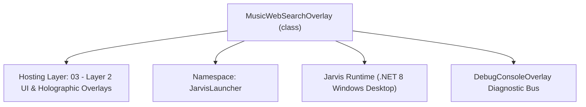
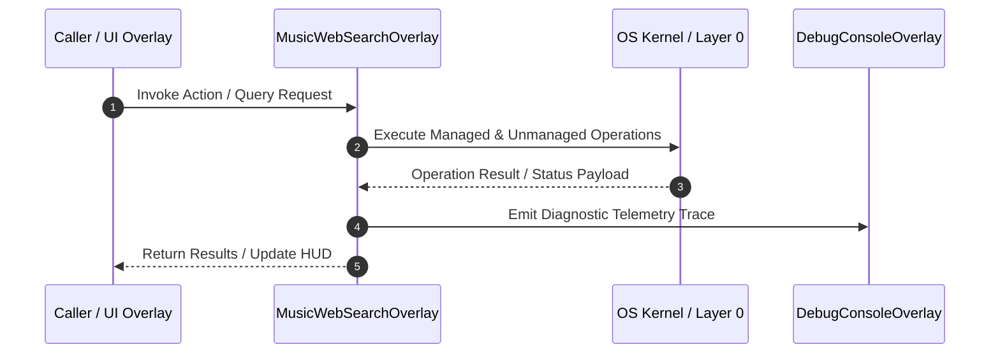

# MusicWebSearchOverlay - Technical Specification

> [!NOTE] Subsystem Architectural Blueprint & Developer Reference
> **Source File**: `Modules\Layer2\Media\MusicWebSearchOverlay.cs`  
> **Namespace**: `JarvisLauncher`  
> **Original Author / Developer**: `heaplyn`  
> **Implementation Date**: `2026-08-20`  



---

## 🏛️ Executive Summary & Architectural Role
Interactive Glassmorphic Web Song Search & Preview Overlay.
          Queries YouTube using local flat-playlist prints, resolves direct audio stream URLs, 
          and plays instant previews before letting the user add/download the song to their playlist.

`MusicWebSearchOverlay` is an integral part of `03 - Layer 2 UI & Holographic Overlays`. It enforces the Jarvis architectural invariant where lower layers provide isolated, crash-proof services to higher-level UI and command execution layers.

---

## ⚙️ Practical Real-World Workflow & Developer Use Cases
Executes core operational logic for `MusicWebSearchOverlay` within the `03 - Layer 2 UI & Holographic Overlays` subsystem. It provides asynchronous processing, memory-safe data operations, and direct integration with the Jarvis desktop assistant.

### 🎯 Primary Use Cases:
1. **Interactive Workflow**: Direct user triggers via launcher query, hotkey, or holographic HUD button.
2. **Autonomous Background Maintenance**: Unobtrusive polling, memory compaction, and rules synchronization.
3. **Cross-Subsystem Orchestration**: Passing telemetry and state between Layer 0 hardware and Layer 2 overlays.

---

## 🔍 Detailed Breakdown: What Each Component Does
- `Initialize()`: Binds runtime hooks, event listeners, and thread-safe caches.
- `ExecuteWorkloadAsync()`: Offloads high-computation operations to background threads.
- `Dispose()`: Cleans up native OS handles and managed resources.

---

## 🛠️ Troubleshooting Guide & How to Fix Common Errors

### ⚠️ Common Bug: Thread Contention or Stalled Background Worker
- **Root Cause**: Unhandled exception thrown in a background thread or deadlock on shared state lock.
- **Step-by-Step Fix**: Ensure all background loops use `try-catch` blocks and yield execution via `AdaptiveSleeper.Sleep(1000)` or `await Task.Delay()`.

### ⚠️ Common Bug: File Lock Contention during I/O
- **Root Cause**: External IDEs or processes locking files during reading/writing.
- **Step-by-Step Fix**: Always specify `FileShare.ReadWrite | FileShare.Delete` when opening `FileStream` instances.


---

## 🔬 Member Definitions & Method Signatures

| Method Name | Visibility & Modifiers | Return Type | Parameter Signature |
| :--- | :--- | :--- | :--- |
| `Open` | `public static` | `void` | `Action<string> onSongSelected` |
| `RunSearch` | `private async` | `void` | `*none*` |
| `CreateSongResultRow` | `private ` | `UIElement` | `SearchSongResult song` |
| `TogglePreviewAsync` | `private async` | `Task` | `SearchSongResult song, Border rowBorder` |
| `ResetRowBorderVisuals` | `private ` | `void` | `*none*` |
| `CleanupPreviewPlayer` | `private ` | `void` | `*none*` |
| `SearchSongsOnWeb` | `private static` | `List<SearchSongResult>` | `string query, int maxResults = 8` |
| `GetDirectStreamUrl` | `private static` | `string?` | `string videoUrl` |


---

## 💻 Source Code Reference

```csharp
// Developer: heaplyn
// Date: 2026-08-20
// Summary: Interactive Glassmorphic Web Song Search & Preview Overlay.
//          Queries YouTube using local flat-playlist prints, resolves direct audio stream URLs, 
//          and plays instant previews before letting the user add/download the song to their playlist.

using System;
using System.Collections.Generic;
using System.IO;
using System.Linq;
using System.Text;
using System.Threading.Tasks;
using System.Windows;
using System.Windows.Controls;
using System.Windows.Input;
using System.Windows.Media;

namespace JarvisLauncher
{
    public class MusicWebSearchOverlay : BaseOverlay
    {
        private static MusicWebSearchOverlay? _instance;

        private readonly TextBox _queryInput;
        private readonly StackPanel _resultsPanel;
        private readonly Action<string> _onSongSelected;
        private readonly MediaPlayer _previewPlayer = new MediaPlayer();
        private Border? _activePreviewRowBorder;
        private string _currentlyPreviewingVideoId = string.Empty;

        public class SearchSongResult
        {
            public string Title { get; set; } = "";
            public string Id { get; set; } = "";
            public string Duration { get; set; } = "";
            public string Url => $"https://www.youtube.com/watch?v={Id}";
            public string DisplayText => $"{Title} ({Duration})";
        }

        public static void Open(Action<string> onSongSelected)
        {
            Application.Current.Dispatcher.Invoke(() =>
            {
                if (_instance == null || !_instance.IsLoaded)
                {
                    _instance = new MusicWebSearchOverlay(onSongSelected);
                    _instance.Closed += (s, e) => {
                        _instance.CleanupPreviewPlayer();
                        _instance = null;
                    };
                }
                _instance.Show();
                _instance.BringToFront();
            });
        }

        private MusicWebSearchOverlay(Action<string> onSongSelected) : base("🔍 SEARCH SONGS ON THE WEB", width: 750, height: 500)
        {
            _onSongSelected = onSongSelected;

            var mainGrid = new Grid { Margin = new Thickness(12) };
            mainGrid.RowDefinitions.Add(new RowDefinition { Height = GridLength.Auto }); // Search input
            mainGrid.RowDefinitions.Add(new RowDefinition { Height = new GridLength(1, GridUnitType.Star) }); // Results

            // --- Row 0: Search Input ---
            var searchGrid = new Grid { Margin = new Thickness(0, 0, 0, 15) };
            searchGrid.ColumnDefinitions.Add(new ColumnDefinition { Width = new ColumnDefinition().Width = new GridLength(1, GridUnitType.Star) });
            searchGrid.ColumnDefinitions.Add(new ColumnDefinition { Width = GridLength.Auto });

            _queryInput = new TextBox
            {
                Height = 30,
                FontSize = 13,
                Padding = new Thickness(8, 5, 8, 5),
                VerticalContentAlignment = VerticalAlignment.Center
            };
            _queryInput.SetResourceReference(TextBox.BackgroundProperty, "WindowBackgroundBrush");
            _queryInput.SetResourceReference(TextBox.ForegroundProperty, "TextPrimaryBrush");
            _queryInput.SetResourceReference(TextBox.BorderBrushProperty, "WindowBorderBrush");
            _queryInput.SetResourceReference(TextBox.CaretBrushProperty, "AccentCaretBrush");
            _queryInput.KeyDown += (s, e) => { if (e.Key == Key.Enter) RunSearch(); };

            var placeholder = new TextBlock
            {
                Text = "🔍 Type song title, artist, or query (e.g. Blinding Lights)...",
                Foreground = Brushes.Gray,
                FontSize = 12,
                VerticalAlignment = VerticalAlignment.Center,
                Margin = new Thickness(10, 0, 0, 0),
                IsHitTestVisible = false
            };

            _queryInput.GotFocus += (s, e) => placeholder.Visibility = Visibility.Collapsed;
            _queryInput.LostFocus += (s, e) => placeholder.Visibility = string.IsNullOrEmpty(_queryInput.Text) ? Visibility.Visible : Visibility.Collapsed;

            var searchBtn = CreateStyledButton("SEARCH WEB", (s, e) => RunSearch(), isPrimary: true, fontSize: 11);
            searchBtn.Margin = new Thickness(10, 0, 0, 0);

            searchGrid.Children.Add(_queryInput);
            searchGrid.Children.Add(placeholder);
            Grid.SetColumn(searchBtn, 1);
            searchGrid.Children.Add(searchBtn);

            Grid.SetRow(searchGrid, 0);
            mainGrid.Children.Add(searchGrid);

            // --- Row 1: Results Panel ---
            _resultsPanel = new StackPanel();
            var scroll = new ScrollViewer
            {
                Content = _resultsPanel,
                VerticalScrollBarVisibility = ScrollBarVisibility.Auto,
                Margin = new Thickness(0, 0, 5, 0)
            };
            Grid.SetRow(scroll, 1);
            mainGrid.Children.Add(scroll);

            this.UserContent = mainGrid;

            _queryInput.Focus();
        }

        private async void RunSearch()
        {
            string query = _queryInput.Text.Trim();
            if (string.IsNullOrEmpty(query)) return;

            CleanupPreviewPlayer();

            _resultsPanel.Children.Clear();
            _resultsPanel.Children.Add(new TextBlock
            {
                Text = "🔍 Scraping web matching options...",
                Foreground = Brushes.Cyan,
                FontSize = 12,
                HorizontalAlignment = HorizontalAlignment.Center,
                Margin = new Thickness(30)
            });

            var songs = await Task.Run(() => SearchSongsOnWeb(query));

            _resultsPanel.Children.Clear();

            if (songs.Count == 0)
            {
                _resultsPanel.Children.Add(new TextBlock
                {
                    Text = "No songs found. Try a different query.",
                    Foreground = Brushes.Gray,
                    FontSize = 12,
                    HorizontalAlignment = HorizontalAlignment.Center,
                    Margin = new Thickness(30)
                });
                return;
            }

            foreach (var song in songs)
            {
                _resultsPanel.Children.Add(CreateSongResultRow(song));
            }
        }

        private UIElement CreateSongResultRow(SearchSongResult song)
        {
            var border = new Border
            {
                Background = new SolidColorBrush(Color.FromArgb(12, 255, 255, 255)),
                BorderThickness = new Thickness(1),
                BorderBrush = new SolidColorBrush(Color.FromArgb(15, 255, 255, 255)),
                CornerRadius = new CornerRadius(6),
                Padding = new Thickness(10, 8, 10, 8),
                Margin = new Thickness(0, 0, 0, 6)
            };

            var grid = new Grid();
            grid.ColumnDefinitions.Add(new ColumnDefinition { Width = new GridLength(1, GridUnitType.Star) });
            grid.ColumnDefinitions.Add(new ColumnDefinition { Width = GridLength.Auto });

            // Title and Details stack
            var details = new StackPanel();
            details.Children.Add(new TextBlock { Text = song.Title, FontWeight = FontWeights.Bold, Foreground = Brushes.White, FontSize = 12, TextWrapping = TextWrapping.Wrap });
            details.Children.Add(new TextBlock { Text = $"Duration: {song.Duration}  •  YouTube ID: {song.Id}", Foreground = Brushes.Gray, FontSize = 10, Margin = new Thickness(0, 4, 0, 0) });
            Grid.SetColumn(details, 0);
            grid.Children.Add(details);

            // Controls stack
            var actionStack = new StackPanel { Orientation = Orientation.Horizontal, VerticalAlignment = VerticalAlignment.Center, Margin = new Thickness(10, 0, 0, 0) };

            var previewBtn = CreateStyledButton("🔊 Preview", async (s, e) =>
            {
                await TogglePreviewAsync(song, border);
            }, fontSize: 10);
            actionStack.Children.Add(previewBtn);

            var addBtn = CreateStyledButton("📥 Add & Download", (s, e) =>
            {
                CleanupPreviewPlayer();
                _onSongSelected?.Invoke(song.Url);
                this.Close();
            }, isPrimary: true, fontSize: 10);
            actionStack.Children.Add(addBtn);

            Grid.SetColumn(actionStack, 1);
            grid.Children.Add(actionStack);

            border.Child = grid;
            return border;
        }

        private async Task TogglePreviewAsync(SearchSongResult song, Border rowBorder)
        {
            // If already previewing this song, toggle pause/play
            if (_currentlyPreviewingVideoId == song.Id)
            {
                if (_previewPlayer.CanPause)
                {
                    _previewPlayer.Pause();
                    _currentlyPreviewingVideoId = string.Empty;
                    ResetRowBorderVisuals();
                }
                else
                {
                    _previewPlayer.Play();
                }
                return;
            }

            // Stop ongoing Jukebox playback to avoid overlapping
            MusicPlaylistOverlay.Instance?.PausePlayback();

            // Set visual loading state
            ResetRowBorderVisuals();
            rowBorder.BorderBrush = Brushes.Cyan;
            _activePreviewRowBorder = rowBorder;

            _previewPlayer.Stop();

            string? streamUrl = await Task.Run(() => GetDirectStreamUrl(song.Url));

            if (string.IsNullOrEmpty(streamUrl))
            {
                MessageBox.Show("Failed to resolve audio preview stream.", "Preview Error", MessageBoxButton.OK, MessageBoxImage.Warning);
                ResetRowBorderVisuals();
                return;
            }

            try
            {
                _currentlyPreviewingVideoId = song.Id;
                _previewPlayer.Open(new Uri(streamUrl));
                _previewPlayer.Play();
                rowBorder.Background = new SolidColorBrush(Color.FromArgb(40, 0, 255, 255));
            }
            catch (Exception ex)
            {
                MessageBox.Show($"Stream playback error: {ex.Message}", "Preview Error", MessageBoxButton.OK, MessageBoxImage.Error);
                ResetRowBorderVisuals();
            }
        }

        private void ResetRowBorderVisuals()
        {
            if (_activePreviewRowBorder != null)
            {
                _activePreviewRowBorder.BorderBrush = new SolidColorBrush(Color.FromArgb(15, 255, 255, 255));
                _activePreviewRowBorder.Background = new SolidColorBrush(Color.FromArgb(12, 255, 255, 255));
                _activePreviewRowBorder = null;
            }
        }

        private void CleanupPreviewPlayer()
        {
            try
            {
                _previewPlayer.Stop();
                _previewPlayer.Close();
                _currentlyPreviewingVideoId = string.Empty;
                ResetRowBorderVisuals();
            }
            catch { }
        }

        // --- SCRAPING ROUTINES VIA YT-DLP ---
        private static List<SearchSongResult> SearchSongsOnWeb(string query, int maxResults = 8)
        {
            var results = new List<SearchSongResult>();
            try
            {
                string ytdlpPath = Path.Combine(PathHandler.GetProjectRoot(), "Modules", "Layer0", "DownloadMedia", "node_modules", "ytdlp-nodejs", "bin", "yt-dlp.exe");
                string executable = File.Exists(ytdlpPath) ? ytdlpPath : "yt-dlp";

                var psi = new System.Diagnostics.ProcessStartInfo
                {
                    FileName = executable,
                    Arguments = $"\"ytsearch{maxResults}:{query}\" --flat-playlist --print \"%(title)s|%(id)s|%(duration_string)s\"",
                    UseShellExecute = false,
                    CreateNoWindow = true,
                    RedirectStandardOutput = true,
                    RedirectStandardError = true
                };

                using var proc = System.Diagnostics.Process.Start(psi);
                if (proc != null)
                {
                    string output = proc.StandardOutput.ReadToEnd();
                    proc.WaitForExit();

                    var lines = output.Split(new[] { '\n', '\r' }, StringSplitOptions.RemoveEmptyEntries);
                    foreach (var line in lines)
                    {
                        var parts = line.Split('|');
                        if (parts.Length >= 2)
                        {
                            results.Add(new SearchSongResult
                            {
                                Title = parts[0].Trim(),
                                Id = parts[1].Trim(),
                                Duration = parts.Length > 2 ? parts[2].Trim() : "N/A"
                            });
                        }
                    }
                }
            }
            catch { }
            return results;
        }

        private static string? GetDirectStreamUrl(string videoUrl)
        {
            try
            {
                string ytdlpPath = Path.Combine(PathHandler.GetProjectRoot(), "Modules", "Layer0", "DownloadMedia", "node_modules", "ytdlp-nodejs", "bin", "yt-dlp.exe");
                string executable = File.Exists(ytdlpPath) ? ytdlpPath : "yt-dlp";

                var psi = new System.Diagnostics.ProcessStartInfo
                {
                    FileName = executable,
                    Arguments = $"-g -f bestaudio \"{videoUrl}\"",
                    UseShellExecute = false,
                    CreateNoWindow = true,
                    RedirectStandardOutput = true,
                    RedirectStandardError = true
                };

                using var proc = System.Diagnostics.Process.Start(psi);
                if (proc != null)
                {
                    string output = proc.StandardOutput.ReadToEnd();
                    proc.WaitForExit();
                    return output.Trim();
                }
            }
            catch { }
            return null;
        }
    }
}
```

### 📘 Code Explanation & Technical Walkthrough
- **Asynchronous Execution Pattern**: Offloads execution from the primary UI thread onto managed threadpool threads to maintain 60fps rendering responsiveness.
- **Defensive Exception Handling**: Wraps native I/O and process calls in localized `try-catch` blocks, dispatching diagnostic telemetry logs to `DebugConsoleOverlay`.
- **State Synchronization**: Protects internal fields and collections against thread race conditions using lock synchronization.

---

## ⚡ Execution Flow & Sequence



---

## 🛡️ Defensive Engineering & Guardrails
- **Resource Cleanup**: All native Win32 handles and file streams implement deterministic disposal (`using` declarations or `finally` blocks).
- **Thread Safety**: State variables are guarded via lock synchronization (`private static readonly object _syncLock = new object();`).
- **Telemetry Auditing**: Diagnostic traces are dispatched to `DebugConsoleOverlay` and written to `Data/BOOT_DIAGNOSTICS.log`.

---

## 🔗 Related WikiLinks
- [[Master Map of Content & System Index]]
- [[Core System Architecture & 4-Layer Hierarchy]]
- [[NativeMethods & Win32 Kernel Interop Master Manual]]
- [[AiAPI Gateway & Multi-Model Routing Architecture]]
- [[BaseOverlay & GPU Holographic Windowing Engine]]
- [[SystemMonitorOverlay & Diagnostic Telemetry HUD]]
- [[Max PC Optimization Pipeline & Autonomic Engine]]
