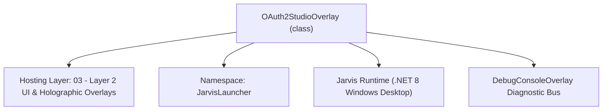
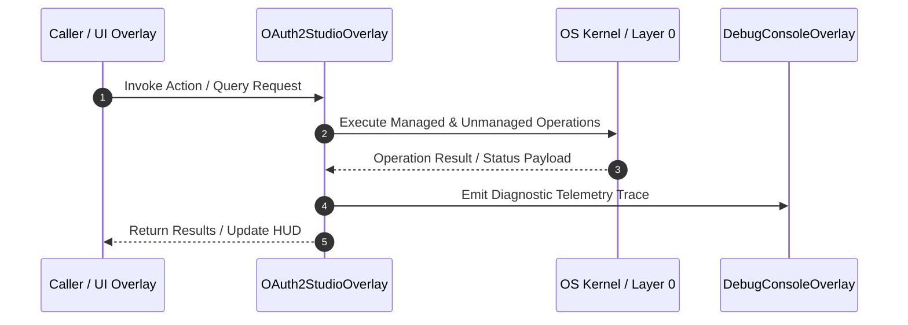

# OAuth2StudioOverlay - Technical Specification

> [!NOTE] Subsystem Architectural Blueprint & Developer Reference
> **Source File**: `Modules\Layer2\Dev\OAuth2StudioOverlay.cs`  
> **Namespace**: `JarvisLauncher`  
> **Original Author / Developer**: `heaplyn`  
> **Implementation Date**: `2026-08-13`  



---

## 🏛️ Executive Summary & Architectural Role
Interactive WPF Overlay for Google Gemini AI & GitHub OAuth2 Authentication.
 Provides 1-click browser OAuth2 authorization, live account status badges, and token management.

`OAuth2StudioOverlay` is an integral part of `03 - Layer 2 UI & Holographic Overlays`. It enforces the Jarvis architectural invariant where lower layers provide isolated, crash-proof services to higher-level UI and command execution layers.

---

## ⚙️ Practical Real-World Workflow & Developer Use Cases
Executes core operational logic for `OAuth2StudioOverlay` within the `03 - Layer 2 UI & Holographic Overlays` subsystem. It provides asynchronous processing, memory-safe data operations, and direct integration with the Jarvis desktop assistant.

### 🎯 Primary Use Cases:
1. **Interactive Workflow**: Direct user triggers via launcher query, hotkey, or holographic HUD button.
2. **Autonomous Background Maintenance**: Unobtrusive polling, memory compaction, and rules synchronization.
3. **Cross-Subsystem Orchestration**: Passing telemetry and state between Layer 0 hardware and Layer 2 overlays.

---

## 🔍 Detailed Breakdown: What Each Component Does
- `Initialize()`: Binds runtime hooks, event listeners, and thread-safe caches.
- `ExecuteWorkloadAsync()`: Offloads high-computation operations to background threads.
- `Dispose()`: Cleans up native OS handles and managed resources.

---

## 🛠️ Troubleshooting Guide & How to Fix Common Errors

### ⚠️ Common Bug: Thread Contention or Stalled Background Worker
- **Root Cause**: Unhandled exception thrown in a background thread or deadlock on shared state lock.
- **Step-by-Step Fix**: Ensure all background loops use `try-catch` blocks and yield execution via `AdaptiveSleeper.Sleep(1000)` or `await Task.Delay()`.

### ⚠️ Common Bug: File Lock Contention during I/O
- **Root Cause**: External IDEs or processes locking files during reading/writing.
- **Step-by-Step Fix**: Always specify `FileShare.ReadWrite | FileShare.Delete` when opening `FileStream` instances.


---

## 🔬 Member Definitions & Method Signatures

| Method Name | Visibility & Modifiers | Return Type | Parameter Signature |
| :--- | :--- | :--- | :--- |
| `ShowOverlay` | `public static` | `void` | `*none*` |
| `SaveCredentials` | `private ` | `void` | `*none*` |
| `RefreshStatuses` | `private ` | `void` | `*none*` |
| `CreateHeader` | `private static` | `TextBlock` | `string title` |
| `CreateLabel` | `private static` | `TextBlock` | `string text` |
| `CreateButton` | `private static` | `Button` | `string content` |


---

## 💻 Source Code Reference

```csharp
// Developer: heaplyn
// Date: 2026-08-13
// Summary: Interactive WPF Overlay for Google Gemini AI & GitHub OAuth2 Authentication.
// Provides 1-click browser OAuth2 authorization, live account status badges, and token management.

using System;
using System.Windows;
using System.Windows.Controls;
using System.Windows.Controls.Primitives;
using System.Windows.Input;
using System.Windows.Media;

namespace JarvisLauncher
{
    public class OAuth2StudioOverlay : BaseOverlay
    {
        private static OAuth2StudioOverlay? _instance;

        private TextBlock _googleStatusText = null!;
        private TextBlock _githubStatusText = null!;
        private TextBox _googleClientIdBox = null!;
        private TextBox _googleClientSecretBox = null!;
        private TextBox _githubClientIdBox = null!;
        private TextBox _githubClientSecretBox = null!;

        public static void ShowOverlay()
        {
            if (_instance == null || !_instance.IsLoaded || !_instance.IsVisible)
            {
                _instance = new OAuth2StudioOverlay();
                _instance.Show();
            }
            else
            {
                _instance.Activate();
                _instance.BringToFront();
                _instance.Focus();
            }
        }

        public OAuth2StudioOverlay() : base("🔑 OAUTH2 ACCOUNT AUTHENTICATION STUDIO", 540, 580)
        {
            this.Closed += (s, e) => { _instance = null; };

            var workArea = SystemParameters.WorkArea;
            this.Left = (workArea.Width - this.Width) / 2;
            this.Top = (workArea.Height - this.Height) / 2;

            var scroll = new ScrollViewer { VerticalScrollBarVisibility = ScrollBarVisibility.Auto };
            var root = new StackPanel { Margin = new Thickness(10) };
            scroll.Content = root;

            // ── Section 1: Google / Gemini OAuth2 ─────────────────────────────────────
            root.Children.Add(CreateHeader("🔑 Google / Gemini AI OAuth2 Account Login"));

            _googleStatusText = new TextBlock
            {
                FontSize = 12,
                FontWeight = FontWeights.Bold,
                Margin = new Thickness(0, 2, 0, 8)
            };
            root.Children.Add(_googleStatusText);

            var googleBtnGrid = new UniformGrid { Columns = 2, Margin = new Thickness(0, 0, 0, 8) };
            var btnGoogleLogin = CreateButton("🔑 Sign In with Google");
            btnGoogleLogin.FontWeight = FontWeights.Bold;
            btnGoogleLogin.Click += async (s, e) =>
            {
                btnGoogleLogin.IsEnabled = false;
                SaveCredentials();
                await OAuth2Manager.LoginGoogleOAuth2Async(status => TextOverlay.Show(status, 2500));
                RefreshStatuses();
                btnGoogleLogin.IsEnabled = true;
            };
            googleBtnGrid.Children.Add(btnGoogleLogin);

            var btnGoogleSignOut = CreateButton("🚪 Sign Out Google");
            btnGoogleSignOut.Click += (s, e) =>
            {
                OAuth2Manager.SignOutGoogle();
                RefreshStatuses();
                TextOverlay.Show("🚪 Signed out from Google Account.", 2500);
            };
            googleBtnGrid.Children.Add(btnGoogleSignOut);
            root.Children.Add(googleBtnGrid);

            root.Children.Add(CreateLabel("Custom Google OAuth2 Client ID (Optional):"));
            _googleClientIdBox = new TextBox { Text = SettingsManager.Current.GOOGLE_OAUTH_CLIENT_ID, Padding = new Thickness(4), Margin = new Thickness(0, 0, 0, 4) };
            root.Children.Add(_googleClientIdBox);

            root.Children.Add(CreateLabel("Custom Google OAuth2 Client Secret (Optional):"));
            _googleClientSecretBox = new TextBox { Text = SettingsManager.Current.GOOGLE_OAUTH_CLIENT_SECRET, Padding = new Thickness(4), Margin = new Thickness(0, 0, 0, 12) };
            root.Children.Add(_googleClientSecretBox);

            // ── Section 2: GitHub OAuth2 ──────────────────────────────────────────────
            root.Children.Add(CreateHeader("🐙 GitHub OAuth2 Account Login"));

            _githubStatusText = new TextBlock
            {
                FontSize = 12,
                FontWeight = FontWeights.Bold,
                Margin = new Thickness(0, 2, 0, 8)
            };
            root.Children.Add(_githubStatusText);

            var githubBtnGrid = new UniformGrid { Columns = 2, Margin = new Thickness(0, 0, 0, 8) };
            var btnGithubLogin = CreateButton("🐙 Sign In with GitHub");
            btnGithubLogin.FontWeight = FontWeights.Bold;
            btnGithubLogin.Click += async (s, e) =>
            {
                btnGithubLogin.IsEnabled = false;
                SaveCredentials();
                await OAuth2Manager.LoginGithubOAuth2Async(status => TextOverlay.Show(status, 2500));
                RefreshStatuses();
                btnGithubLogin.IsEnabled = true;
            };
            githubBtnGrid.Children.Add(btnGithubLogin);

            var btnGithubSignOut = CreateButton("🚪 Sign Out GitHub");
            btnGithubSignOut.Click += (s, e) =>
            {
                OAuth2Manager.SignOutGithub();
                RefreshStatuses();
                TextOverlay.Show("🚪 Signed out from GitHub Account.", 2500);
            };
            githubBtnGrid.Children.Add(btnGithubSignOut);
            root.Children.Add(githubBtnGrid);

            root.Children.Add(CreateLabel("Custom GitHub OAuth2 Client ID (Optional):"));
            _githubClientIdBox = new TextBox { Text = SettingsManager.Current.GITHUB_OAUTH_CLIENT_ID, Padding = new Thickness(4), Margin = new Thickness(0, 0, 0, 4) };
            root.Children.Add(_githubClientIdBox);

            root.Children.Add(CreateLabel("Custom GitHub OAuth2 Client Secret (Optional):"));
            _githubClientSecretBox = new TextBox { Text = SettingsManager.Current.GITHUB_OAUTH_CLIENT_SECRET, Padding = new Thickness(4), Margin = new Thickness(0, 0, 0, 12) };
            root.Children.Add(_githubClientSecretBox);

            var saveBtn = CreateButton("💾 Save OAuth2 Credentials");
            saveBtn.Height = 34;
            saveBtn.FontWeight = FontWeights.Bold;
            saveBtn.Click += (s, e) =>
            {
                SaveCredentials();
                TextOverlay.Show("✅ OAuth2 Credentials Saved!", 2500);
            };
            root.Children.Add(saveBtn);

            this.UserContent = scroll;
            RefreshStatuses();
        }

        private void SaveCredentials()
        {
            SettingsManager.Current.GOOGLE_OAUTH_CLIENT_ID = _googleClientIdBox.Text.Trim();
            SettingsManager.Current.GOOGLE_OAUTH_CLIENT_SECRET = _googleClientSecretBox.Text.Trim();
            SettingsManager.Current.GITHUB_OAUTH_CLIENT_ID = _githubClientIdBox.Text.Trim();
            SettingsManager.Current.GITHUB_OAUTH_CLIENT_SECRET = _githubClientSecretBox.Text.Trim();
            SettingsManager.Save();
        }

        private void RefreshStatuses()
        {
            string googleEmail = SettingsManager.Current.GOOGLE_OAUTH_USER_EMAIL;
            bool googleAuth = !string.IsNullOrEmpty(SettingsManager.Current.GOOGLE_OAUTH_ACCESS_TOKEN);

            _googleStatusText.Text = googleAuth
                ? $"🟢 Connected: {googleEmail}"
                : "🔴 Google OAuth2: Not Authenticated";
            _googleStatusText.Foreground = googleAuth ? Brushes.LimeGreen : Brushes.OrangeRed;

            string githubUser = SettingsManager.Current.GITHUB_OAUTH_USER_LOGIN;
            bool githubAuth = !string.IsNullOrEmpty(SettingsManager.Current.GITHUB_TOKEN);

            _githubStatusText.Text = githubAuth
                ? $"🟢 Connected: @{githubUser}"
                : "🔴 GitHub OAuth2: Not Authenticated";
            _githubStatusText.Foreground = githubAuth ? Brushes.LimeGreen : Brushes.OrangeRed;
        }

        private static TextBlock CreateHeader(string title)
        {
            var header = new TextBlock
            {
                Text = title,
                FontSize = 13,
                FontWeight = FontWeights.Bold,
                Margin = new Thickness(0, 6, 0, 4)
            };
            header.SetResourceReference(TextBlock.ForegroundProperty, "TextPrimaryBrush");
            return header;
        }

        private static TextBlock CreateLabel(string text)
        {
            var lbl = new TextBlock
            {
                Text = text,
                FontSize = 11,
                Margin = new Thickness(0, 4, 0, 2)
            };
            lbl.SetResourceReference(TextBlock.ForegroundProperty, "TextSecondaryBrush");
            return lbl;
        }

        private static Button CreateButton(string content)
        {
            var btn = new Button
            {
                Content = content,
                Margin = new Thickness(0, 2, 4, 4),
                Padding = new Thickness(8, 5, 8, 5),
                FontSize = 11,
                Cursor = Cursors.Hand
            };
            return btn;
        }
    }
}
```

### 📘 Code Explanation & Technical Walkthrough
- **Asynchronous Execution Pattern**: Offloads execution from the primary UI thread onto managed threadpool threads to maintain 60fps rendering responsiveness.
- **Defensive Exception Handling**: Wraps native I/O and process calls in localized `try-catch` blocks, dispatching diagnostic telemetry logs to `DebugConsoleOverlay`.
- **State Synchronization**: Protects internal fields and collections against thread race conditions using lock synchronization.

---

## ⚡ Execution Flow & Sequence



---

## 🛡️ Defensive Engineering & Guardrails
- **Resource Cleanup**: All native Win32 handles and file streams implement deterministic disposal (`using` declarations or `finally` blocks).
- **Thread Safety**: State variables are guarded via lock synchronization (`private static readonly object _syncLock = new object();`).
- **Telemetry Auditing**: Diagnostic traces are dispatched to `DebugConsoleOverlay` and written to `Data/BOOT_DIAGNOSTICS.log`.

---

## 🔗 Related WikiLinks
- [[Master Map of Content & System Index]]
- [[Core System Architecture & 4-Layer Hierarchy]]
- [[NativeMethods & Win32 Kernel Interop Master Manual]]
- [[AiAPI Gateway & Multi-Model Routing Architecture]]
- [[BaseOverlay & GPU Holographic Windowing Engine]]
- [[SystemMonitorOverlay & Diagnostic Telemetry HUD]]
- [[Max PC Optimization Pipeline & Autonomic Engine]]
