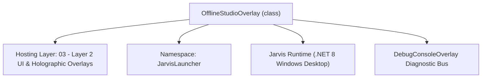
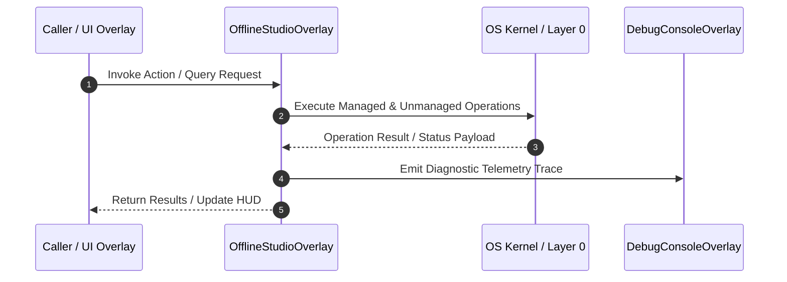

# OfflineStudioOverlay - Technical Specification

> [!NOTE] Subsystem Architectural Blueprint & Developer Reference
> **Source File**: `Modules\Layer2\System\OfflineStudioOverlay.cs`  
> **Namespace**: `JarvisLauncher`  
> **Original Author / Developer**: `heaplyn`  
> **Implementation Date**: `2026-08-17`  



---

## 🏛️ Executive Summary & Architectural Role
Offline Mode & Wi-Fi Pre-Caching Studio Overlay.
          Provides 1-click pre-caching for Vosk models, TTS, and multi-language toolchains.

`OfflineStudioOverlay` is an integral part of `03 - Layer 2 UI & Holographic Overlays`. It enforces the Jarvis architectural invariant where lower layers provide isolated, crash-proof services to higher-level UI and command execution layers.

---

## ⚙️ Practical Real-World Workflow & Developer Use Cases
Executes core operational logic for `OfflineStudioOverlay` within the `03 - Layer 2 UI & Holographic Overlays` subsystem. It provides asynchronous processing, memory-safe data operations, and direct integration with the Jarvis desktop assistant.

### 🎯 Primary Use Cases:
1. **Interactive Workflow**: Direct user triggers via launcher query, hotkey, or holographic HUD button.
2. **Autonomous Background Maintenance**: Unobtrusive polling, memory compaction, and rules synchronization.
3. **Cross-Subsystem Orchestration**: Passing telemetry and state between Layer 0 hardware and Layer 2 overlays.

---

## 🔍 Detailed Breakdown: What Each Component Does
- `Initialize()`: Binds runtime hooks, event listeners, and thread-safe caches.
- `ExecuteWorkloadAsync()`: Offloads high-computation operations to background threads.
- `Dispose()`: Cleans up native OS handles and managed resources.

---

## 🛠️ Troubleshooting Guide & How to Fix Common Errors

### ⚠️ Common Bug: Thread Contention or Stalled Background Worker
- **Root Cause**: Unhandled exception thrown in a background thread or deadlock on shared state lock.
- **Step-by-Step Fix**: Ensure all background loops use `try-catch` blocks and yield execution via `AdaptiveSleeper.Sleep(1000)` or `await Task.Delay()`.

### ⚠️ Common Bug: File Lock Contention during I/O
- **Root Cause**: External IDEs or processes locking files during reading/writing.
- **Step-by-Step Fix**: Always specify `FileShare.ReadWrite | FileShare.Delete` when opening `FileStream` instances.


---

## 🔬 Member Definitions & Method Signatures

| Method Name | Visibility & Modifiers | Return Type | Parameter Signature |
| :--- | :--- | :--- | :--- |
| `ShowOverlay` | `public static` | `void` | `*none*` |
| `CreateTab` | `private ` | `StackPanel` | `TabControl tabControl, string headerText` |
| `AddToolRow` | `private ` | `void` | `StackPanel root, string friendlyName, string packageId, string commandCheck` |
| `RefreshStatus` | `private ` | `void` | `*none*` |
| `CreateHeader` | `private static` | `TextBlock` | `string title` |
| `CreateButton` | `private static` | `Button` | `string content` |


---

## 💻 Source Code Reference

```csharp
// Developer: heaplyn
// Date: 2026-08-17
// Summary: Offline Mode & Wi-Fi Pre-Caching Studio Overlay.
//          Provides 1-click pre-caching for Vosk models, TTS, and multi-language toolchains.

using System;
using System.IO;
using System.Linq;
using System.Net.Http;
using System.Threading.Tasks;
using System.Windows;
using System.Windows.Controls;
using System.Windows.Input;
using System.Windows.Media;

namespace JarvisLauncher
{
    public class OfflineStudioOverlay : BaseOverlay
    {
        private static OfflineStudioOverlay? _instance;
        private TextBlock _connectionStatus = null!;
        private TextBlock _voskStatus = null!;
        private TextBlock _ttsStatus = null!;
        private TextBlock _progressText = null!;

        public static void ShowOverlay()
        {
            Application.Current.Dispatcher.Invoke(() => {
                if (_instance == null || !_instance.IsLoaded || !_instance.IsVisible) _instance = new OfflineStudioOverlay();
                _instance.Show(); _instance.BringToFront();
            });
        }

        public OfflineStudioOverlay()
            : base("OFFLINE MODE & PRE-CACHING STUDIO", width: 850, height: 700)
        {
            this.Closed += (s, e) => { _instance = null; };
            var workArea = SystemParameters.WorkArea;
            this.Left = (workArea.Width - this.Width) / 2;
            this.Top = (workArea.Height - this.Height) / 2;

            var tabControl = new TabControl { Margin = new Thickness(4) };
            StyleTabControl(tabControl);

            // --- Tab 1: Status & Core ---
            var corePanel = CreateTab(tabControl, "📡 Core Status");
            corePanel.Children.Add(CreateHeader("📡 System Connectivity & Cache"));

            _connectionStatus = new TextBlock { FontSize = 12, FontWeight = FontWeights.Bold, Margin = new Thickness(0, 2, 0, 4) };
            _connectionStatus.SetResourceReference(TextBlock.ForegroundProperty, "TextPrimaryBrush");
            corePanel.Children.Add(_connectionStatus);

            _voskStatus = new TextBlock { FontSize = 12, Margin = new Thickness(0, 2, 0, 4) };
            _voskStatus.SetResourceReference(TextBlock.ForegroundProperty, "TextSecondaryBrush");
            corePanel.Children.Add(_voskStatus);

            _ttsStatus = new TextBlock { FontSize = 12, Margin = new Thickness(0, 2, 0, 8) };
            _ttsStatus.SetResourceReference(TextBlock.ForegroundProperty, "TextSecondaryBrush");
            corePanel.Children.Add(_ttsStatus);

            var preCacheBtn = CreateButton("📶 Run Full Pre-Cache Sequence");
            preCacheBtn.Height = 40; preCacheBtn.FontWeight = FontWeights.Bold;
            preCacheBtn.Click += async (s, e) => {
                preCacheBtn.IsEnabled = false;
                await OfflineCacheManager.PreCacheAllForOfflineAsync(st => Application.Current.Dispatcher.Invoke(() => _progressText.Text = st));
                RefreshStatus(); preCacheBtn.IsEnabled = true;
            };
            corePanel.Children.Add(preCacheBtn);

            _progressText = new TextBlock { FontSize = 11, TextWrapping = TextWrapping.Wrap, Margin = new Thickness(0, 8, 0, 0), Opacity = 0.7 };
            _progressText.SetResourceReference(TextBlock.ForegroundProperty, "TextSecondaryBrush");
            corePanel.Children.Add(_progressText);

            // --- Tab 2: Languages & Toolchains ---
            var toolPanel = CreateTab(tabControl, "💻 Dev Toolchains");
            toolPanel.Children.Add(CreateHeader("🛠️ Compilers & Runtimes (Offline Support)"));

            AddToolRow(toolPanel, "C++ (MinGW/MSYS2)", "MSYS2.MSYS2", "g++");
            AddToolRow(toolPanel, "Assembly (NASM)", "NASM.NASM", "nasm");
            AddToolRow(toolPanel, "Python 3.x", "Python.Python.3", "python");
            AddToolRow(toolPanel, ".NET 8.0 SDK", "Microsoft.DotNet.SDK.8", "dotnet");
            AddToolRow(toolPanel, "Node.js (LTS)", "OpenJS.NodeJS", "node");
            AddToolRow(toolPanel, "Go Language", "GoLang.Go", "go");
            AddToolRow(toolPanel, "Rust (rustup)", "Rustlang.Rustup", "rustc");
            AddToolRow(toolPanel, "Java (OpenJDK 21)", "Eclipse.Temurin.21.JDK", "javac");
            AddToolRow(toolPanel, "Ollama LLM Engine", "Ollama.Ollama", "ollama");

            this.UserContent = tabControl;
            RefreshStatus();
        }

        private StackPanel CreateTab(TabControl tabControl, string headerText) {
            var tab = new TabItem { Header = headerText };
            var scroll = new ScrollViewer { VerticalScrollBarVisibility = ScrollBarVisibility.Auto };
            var panel = new StackPanel { Margin = new Thickness(12) };
            scroll.Content = panel; tab.Content = scroll; tabControl.Items.Add(tab);
            return panel;
        }

        private void AddToolRow(StackPanel root, string friendlyName, string packageId, string commandCheck) {
            var row = new Grid { Margin = new Thickness(0, 4, 0, 4) };
            row.ColumnDefinitions.Add(new ColumnDefinition { Width = new GridLength(1, GridUnitType.Star) });
            row.ColumnDefinitions.Add(new ColumnDefinition { Width = new GridLength(150) });
            row.ColumnDefinitions.Add(new ColumnDefinition { Width = new GridLength(100) });

            var nameLabel = new TextBlock { Text = friendlyName, VerticalAlignment = VerticalAlignment.Center, FontSize = 12, Foreground = Brushes.White };
            Grid.SetColumn(nameLabel, 0); row.Children.Add(nameLabel);

            var statusLabel = new TextBlock { Text = "⏳ Checking...", VerticalAlignment = VerticalAlignment.Center, FontSize = 11, FontWeight = FontWeights.Bold };
            Grid.SetColumn(statusLabel, 1); row.Children.Add(statusLabel);

            var actionBtn = new Button { Content = "Install", Height = 24, FontSize = 10, Cursor = Cursors.Hand };
            actionBtn.Click += (s, e) => OfflineCacheManager.InstallToolViaWinget(packageId, friendlyName);
            Grid.SetColumn(actionBtn, 2); row.Children.Add(actionBtn);

            root.Children.Add(row);

            Task.Run(async () => {
                bool installed = OfflineCacheManager.IsAppInstalled(commandCheck);
                Application.Current.Dispatcher.Invoke(() => {
                    statusLabel.Text = installed ? "🟢 Installed" : "🔴 Not Detected";
                    statusLabel.Foreground = installed ? Brushes.LightGreen : Brushes.Tomato;
                    if (installed) { actionBtn.IsEnabled = false; actionBtn.Content = "✅ Ready"; }
                });
            });
        }

        private void RefreshStatus() {
            bool online = OfflineCacheManager.IsInternetAvailable();
            _connectionStatus.Text = online ? "📡 Network: 🟢 Connected" : "📡 Network: 🔴 Offline Mode Active";
            bool voskReady = Directory.Exists(VoskEngine.ModelDirectory);
            _voskStatus.Text = voskReady ? "🎙️ Vosk Model: ✅ Ready Offline" : "🎙️ Vosk Model: ⚠️ Not Downloaded";
            _ttsStatus.Text = "🎵 TTS Samples: ✅ Cached";
        }

        private static TextBlock CreateHeader(string title) => new TextBlock { Text = title, FontSize = 13, FontWeight = FontWeights.Bold, Margin = new Thickness(0, 8, 0, 4), Foreground = Brushes.Cyan };
        private static Button CreateButton(string content) => new Button { Content = content, Margin = new Thickness(0, 4, 0, 4), Padding = new Thickness(10, 6, 10, 6), FontSize = 12, Cursor = Cursors.Hand };
    }
}
```

### 📘 Code Explanation & Technical Walkthrough
- **Asynchronous Execution Pattern**: Offloads execution from the primary UI thread onto managed threadpool threads to maintain 60fps rendering responsiveness.
- **Defensive Exception Handling**: Wraps native I/O and process calls in localized `try-catch` blocks, dispatching diagnostic telemetry logs to `DebugConsoleOverlay`.
- **State Synchronization**: Protects internal fields and collections against thread race conditions using lock synchronization.

---

## ⚡ Execution Flow & Sequence



---

## 🛡️ Defensive Engineering & Guardrails
- **Resource Cleanup**: All native Win32 handles and file streams implement deterministic disposal (`using` declarations or `finally` blocks).
- **Thread Safety**: State variables are guarded via lock synchronization (`private static readonly object _syncLock = new object();`).
- **Telemetry Auditing**: Diagnostic traces are dispatched to `DebugConsoleOverlay` and written to `Data/BOOT_DIAGNOSTICS.log`.

---

## 🔗 Related WikiLinks
- [[Master Map of Content & System Index]]
- [[Core System Architecture & 4-Layer Hierarchy]]
- [[NativeMethods & Win32 Kernel Interop Master Manual]]
- [[AiAPI Gateway & Multi-Model Routing Architecture]]
- [[BaseOverlay & GPU Holographic Windowing Engine]]
- [[SystemMonitorOverlay & Diagnostic Telemetry HUD]]
- [[Max PC Optimization Pipeline & Autonomic Engine]]
