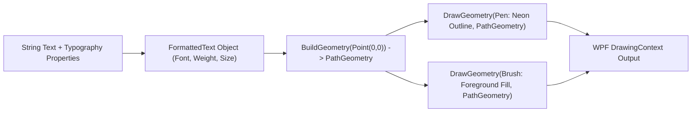

# ✍️ OutlinedText & Vector Typography Rendering Pipeline

## ✍️ High-Contrast Vector Typography Engine

Standard WPF `TextBlock` controls blur or become unreadable against high-contrast desktop wallpapers or bright game scenes. `OutlinedText` (`Modules/Layer2/Core/OutlinedText.cs`) bypasses traditional font rasterization by rendering sharp vector geometry paths directly onto the WPF `DrawingContext`.



---

## 🎨 Typography Category Matrix

```csharp
public class OutlinedText : FrameworkElement
{
    public static readonly DependencyProperty TextProperty = ...;
    public static readonly DependencyProperty CategoryProperty = ...; // Headers, Labels, Subtext, Values

    protected override void OnRender(DrawingContext dc)
    {
        var formattedText = new FormattedText(
            Text,
            CultureInfo.CurrentCulture,
            FlowDirection.LeftToRight,
            new Typeface(FontFamily, FontStyle, FontWeight, FontStretch),
            FontSize,
            Brushes.Black,
            VisualTreeHelper.GetDpi(this).PixelsPerDip);

        var geometry = formattedText.BuildGeometry(new Point(0, 0));
        
        // Draw crisp dark/neon border outline
        var pen = new Pen(StrokeBrush ?? Brushes.Black, StrokeThickness);
        dc.DrawGeometry(null, pen, geometry);

        // Draw foreground fill
        dc.DrawGeometry(Foreground ?? Brushes.White, null, geometry);
    }
}
```

### 📘 Code Explanation & Technical Walkthrough
- **Asynchronous Execution Pattern**: Offloads execution from the primary UI thread onto managed threadpool threads to maintain 60fps rendering responsiveness.
- **Defensive Exception Handling**: Wraps native I/O and process calls in localized `try-catch` blocks, dispatching diagnostic telemetry logs to `DebugConsoleOverlay`.
- **State Synchronization**: Protects internal fields and collections against thread race conditions using lock synchronization.
