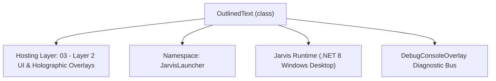
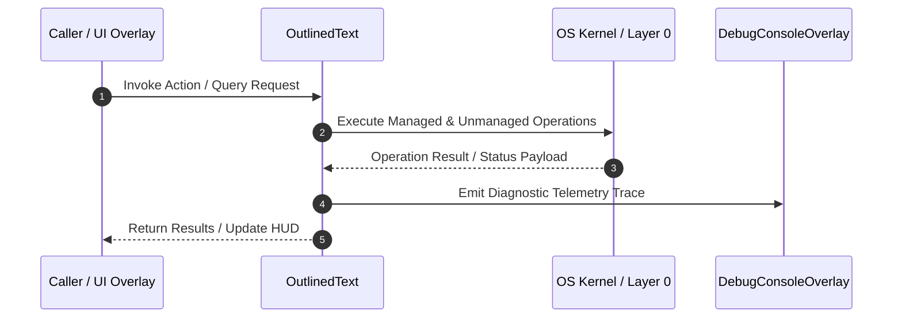

# OutlinedText - Technical Specification

> [!NOTE] Subsystem Architectural Blueprint & Developer Reference
> **Source File**: `Modules\Layer2\Core\OutlinedText.cs`  
> **Namespace**: `JarvisLauncher`  
> **Original Author / Developer**: `heaplyn`  
> **Implementation Date**: `2026-09-03`  



---

## 🏛️ Executive Summary & Architectural Role
High-performance Outlined Text control for Jarvis HUD.
          Supports N-Amount of layered strokes, Soft Gaussian Glow, Drop Shadows, Italics, Text Gradients, TextWrapping, and Wobbliness.
          Dynamic category-based profiling with graceful fallback and bulletproof null safety.

`OutlinedText` is an integral part of `03 - Layer 2 UI & Holographic Overlays`. It enforces the Jarvis architectural invariant where lower layers provide isolated, crash-proof services to higher-level UI and command execution layers.

---

## ⚙️ Practical Real-World Workflow & Developer Use Cases
Executes core operational logic for `OutlinedText` within the `03 - Layer 2 UI & Holographic Overlays` subsystem. It provides asynchronous processing, memory-safe data operations, and direct integration with the Jarvis desktop assistant.

### 🎯 Primary Use Cases:
1. **Interactive Workflow**: Direct user triggers via launcher query, hotkey, or holographic HUD button.
2. **Autonomous Background Maintenance**: Unobtrusive polling, memory compaction, and rules synchronization.
3. **Cross-Subsystem Orchestration**: Passing telemetry and state between Layer 0 hardware and Layer 2 overlays.

---

## 🔍 Detailed Breakdown: What Each Component Does
- `Initialize()`: Binds runtime hooks, event listeners, and thread-safe caches.
- `ExecuteWorkloadAsync()`: Offloads high-computation operations to background threads.
- `Dispose()`: Cleans up native OS handles and managed resources.

---

## 🛠️ Troubleshooting Guide & How to Fix Common Errors

### ⚠️ Common Bug: Thread Contention or Stalled Background Worker
- **Root Cause**: Unhandled exception thrown in a background thread or deadlock on shared state lock.
- **Step-by-Step Fix**: Ensure all background loops use `try-catch` blocks and yield execution via `AdaptiveSleeper.Sleep(1000)` or `await Task.Delay()`.

### ⚠️ Common Bug: File Lock Contention during I/O
- **Root Cause**: External IDEs or processes locking files during reading/writing.
- **Step-by-Step Fix**: Always specify `FileShare.ReadWrite | FileShare.Delete` when opening `FileStream` instances.


---

## 🔬 Member Definitions & Method Signatures

| Method Name | Visibility & Modifiers | Return Type | Parameter Signature |
| :--- | :--- | :--- | :--- |
| `EnsureWobbleTimer` | `private ` | `void` | `*none*` |
| `InvalidateAll` | `public static` | `void` | `*none*` |
| `ClearCache` | `public static` | `void` | `*none*` |
| `GetSafeFontFamily` | `private ` | `FontFamily` | `TextVisualProfile? prof` |
| `OnRender` | `protected override` | `void` | `DrawingContext dc` |
| `MeasureOverride` | `protected override` | `Size` | `Size constraint` |


---

## 💻 Source Code Reference

```csharp
// Developer: heaplyn
// Date: 2026-09-03
// Summary: High-performance Outlined Text control for Jarvis HUD.
//          Supports N-Amount of layered strokes, Soft Gaussian Glow, Drop Shadows, Italics, Text Gradients, TextWrapping, and Wobbliness.
//          Dynamic category-based profiling with graceful fallback and bulletproof null safety.

using System;
using System.Globalization;
using System.Windows;
using System.Windows.Media;
using System.Windows.Media.Effects;
using System.Windows.Controls;
using System.Collections.Generic;
using System.Linq;
using System.Windows.Threading;

namespace JarvisLauncher
{
    public class OutlinedText : Control
    {
        private static readonly List<WeakReference<OutlinedText>> _instances = new List<WeakReference<OutlinedText>>();
        private static readonly FontFamily DefaultFallbackFont = new FontFamily("Segoe UI");
        private static DispatcherTimer? _wobbleTimer;
        private static double _wobblePhase = 0;

        public static readonly DependencyProperty TextProperty = DependencyProperty.Register(
            "Text", typeof(string), typeof(OutlinedText),
            new FrameworkPropertyMetadata("", FrameworkPropertyMetadataOptions.AffectsRender | FrameworkPropertyMetadataOptions.AffectsMeasure));
        public string Text { get => (string)GetValue(TextProperty) ?? ""; set => SetValue(TextProperty, value); }

        public static readonly DependencyProperty TextAlignmentProperty = DependencyProperty.Register(
            "TextAlignment", typeof(TextAlignment), typeof(OutlinedText),
            new FrameworkPropertyMetadata(TextAlignment.Left, FrameworkPropertyMetadataOptions.AffectsRender));
        public TextAlignment TextAlignment { get => (TextAlignment)GetValue(TextAlignmentProperty); set => SetValue(TextAlignmentProperty, value); }

        public static readonly DependencyProperty TextWrappingProperty = DependencyProperty.Register(
            "TextWrapping", typeof(TextWrapping), typeof(OutlinedText),
            new FrameworkPropertyMetadata(TextWrapping.NoWrap, FrameworkPropertyMetadataOptions.AffectsRender | FrameworkPropertyMetadataOptions.AffectsMeasure));
        public TextWrapping TextWrapping { get => (TextWrapping)GetValue(TextWrappingProperty); set => SetValue(TextWrappingProperty, value); }

        public static readonly DependencyProperty CategoryProperty = DependencyProperty.Register(
            "Category", typeof(string), typeof(OutlinedText),
            new FrameworkPropertyMetadata("Labels", FrameworkPropertyMetadataOptions.AffectsRender));
        public string Category { get => (string)GetValue(CategoryProperty); set => SetValue(CategoryProperty, value); }

        public OutlinedText()
        {
            lock (_instances) _instances.Add(new WeakReference<OutlinedText>(this));
            this.Background = Brushes.Transparent;
            this.IsHitTestVisible = false;
            EnsureWobbleTimer();
        }

        private void EnsureWobbleTimer()
        {
            try
            {
                if (_wobbleTimer == null)
                {
                    _wobbleTimer = new DispatcherTimer(DispatcherPriority.Render);
                    _wobbleTimer.Interval = TimeSpan.FromMilliseconds(33);
                    _wobbleTimer.Tick += (s, e) => {
                        try
                        {
                            var set = SettingsManager.Current;
                            if (set != null && set.TEXT_WOBBLINESS > 0)
                            {
                                _wobblePhase += 0.1 * set.TEXT_WOBBLE_SPEED;
                                if (_wobblePhase > Math.PI * 2) _wobblePhase -= Math.PI * 2;
                                InvalidateAll();
                            }
                        }
                        catch { }
                    };
                    _wobbleTimer.Start();
                }
            }
            catch { }
        }

        public static void InvalidateAll()
        {
            lock (_instances)
            {
                foreach (var wr in _instances.ToList())
                {
                    if (wr.TryGetTarget(out var target))
                    {
                        try { target.InvalidateVisual(); } catch { }
                    }
                    else
                    {
                        _instances.Remove(wr);
                    }
                }
            }
        }

        public static void ClearCache()
        {
            InvalidateAll();
        }

        private FontFamily GetSafeFontFamily(TextVisualProfile? prof)
        {
            try
            {
                if (!string.IsNullOrWhiteSpace(prof?.FontFamily) && prof.FontFamily != "Segoe UI")
                    return new FontFamily(prof.FontFamily);

                if (Application.Current != null && Application.Current.Resources != null)
                {
                    if (Application.Current.Resources["ActiveFontFamily"] is FontFamily aff)
                        return aff;
                    if (Application.Current.Resources["GlobalFontFamily"] is FontFamily gff)
                        return gff;
                    if (Application.Current.Resources["BodyFontFamily"] is FontFamily bff)
                        return bff;
                }

                if (this.FontFamily != null)
                    return this.FontFamily;
            }
            catch { }

            return DefaultFallbackFont;
        }

        protected override void OnRender(DrawingContext dc)
        {
            if (string.IsNullOrEmpty(Text)) return;

            try
            {
                var set = SettingsManager.Current;
                TextVisualProfile prof = new TextVisualProfile();
                if (set?.TEXT_PROFILES != null)
                {
                    if (!string.IsNullOrEmpty(Category) && set.TEXT_PROFILES.TryGetValue(Category, out var p) && p != null)
                        prof = p;
                    else if (set.TEXT_PROFILES.TryGetValue("Labels", out var lp) && lp != null)
                        prof = lp;
                    else if (set.TEXT_PROFILES.Count > 0)
                        prof = set.TEXT_PROFILES.Values.FirstOrDefault() ?? prof;
                }

                var fontFamily = GetSafeFontFamily(prof);

                double fontSize = FontSize;
                if (double.IsNaN(fontSize) || fontSize <= 0)
                    fontSize = (set != null && set.GLOBAL_TEXT_SIZE > 0) ? set.GLOBAL_TEXT_SIZE : 13.0;

                Brush foreground = Foreground ?? Brushes.White;
                if (set != null && set.USE_TEXT_GRADIENT && !string.IsNullOrEmpty(set.TEXT_GRADIENT_START) && !string.IsNullOrEmpty(set.TEXT_GRADIENT_END))
                {
                    try
                    {
                        var c1 = (Color)ColorConverter.ConvertFromString(set.TEXT_GRADIENT_START);
                        var c2 = (Color)ColorConverter.ConvertFromString(set.TEXT_GRADIENT_END);
                        var gradBrush = new LinearGradientBrush(c1, c2, 45.0);
                        gradBrush.Freeze();
                        foreground = gradBrush;
                    }
                    catch { }
                }

                var fontStyle = (prof.IsItalic || (set != null && set.TEXT_IS_ITALIC)) ? FontStyles.Italic : FontStyles.Normal;
                var typeface = new Typeface(fontFamily, fontStyle, FontWeight, FontStretch);
                double pixelsPerDip = 1.0;
                try { pixelsPerDip = VisualTreeHelper.GetDpi(this).PixelsPerDip; } catch { }

                var ft = new FormattedText(Text, CultureInfo.CurrentCulture, this.FlowDirection, typeface, fontSize, Brushes.Black, pixelsPerDip);
                ft.TextAlignment = this.TextAlignment;

                // Resolve strokes: category profile first, fallback to global strokes
                List<TextStroke>? strokes = (prof.Strokes != null && prof.Strokes.Count > 0) ? prof.Strokes : set?.TEXT_STROKES;
                double maxStroke = (set != null && set.ENABLE_TEXT_STROKE && strokes != null && strokes.Count > 0) ? strokes.Max(s => s.Thickness) : 0;
                double shadowX = prof.ShadowOffsetX != 0 ? prof.ShadowOffsetX : (set?.TEXT_SHADOW_OFFSET_X ?? 0);
                double shadowY = prof.ShadowOffsetY != 0 ? prof.ShadowOffsetY : (set?.TEXT_SHADOW_OFFSET_Y ?? 0);
                double glowAmount = prof.GlowAmount > 0 ? prof.GlowAmount : (set?.TEXT_GLOW_AMOUNT ?? 0);

                double wobbleX = 0, wobbleY = 0;
                if (set != null && set.TEXT_WOBBLINESS > 0)
                {
                    wobbleX = Math.Sin(_wobblePhase) * set.TEXT_WOBBLINESS;
                    wobbleY = Math.Cos(_wobblePhase * 0.7) * set.TEXT_WOBBLINESS;
                }

                double originOffset = maxStroke + (glowAmount > 0 ? Math.Min(glowAmount, 15.0) : 0) + 2;
                var origin = new Point(originOffset + Math.Max(0, -shadowX) + wobbleX, originOffset + Math.Max(0, -shadowY) + wobbleY);

                if (TextWrapping == TextWrapping.Wrap && ActualWidth > originOffset * 2 + 10)
                {
                    ft.MaxTextWidth = Math.Max(10, ActualWidth - (originOffset * 2));
                }

                var geometry = ft.BuildGeometry(origin);
                if (geometry == null) return;

                // 1. HIGH-QUALITY SMOOTH GLOW (No miter spikes/triangles: uses multi-pass round radial halo)
                if (glowAmount > 0)
                {
                    try
                    {
                        string glowHex = prof.GlowAmount > 0 ? prof.GlowColor : (set?.TEXT_GLOW_COLOR ?? "#00FFFF");
                        var baseGColor = (Color)ColorConverter.ConvertFromString(string.IsNullOrEmpty(glowHex) ? "#00FFFF" : glowHex);
                        double maxRadius = Math.Min(glowAmount * 2.2, 36.0);
                        int steps = Math.Max(3, Math.Min(6, (int)(maxRadius / 4.0)));

                        for (int step = steps; step >= 1; step--)
                        {
                            double factor = (double)step / steps;
                            double penThickness = maxRadius * factor;
                            byte alpha = (byte)Math.Clamp((int)(baseGColor.A * (0.07 + 0.14 * (1.0 - factor))), 4, 110);
                            var stepColor = Color.FromArgb(alpha, baseGColor.R, baseGColor.G, baseGColor.B);
                            var glowPen = new Pen(new SolidColorBrush(stepColor), penThickness)
                            {
                                StartLineCap = PenLineCap.Round,
                                EndLineCap = PenLineCap.Round,
                                LineJoin = PenLineJoin.Round,
                                MiterLimit = 1.0
                            };
                            glowPen.Freeze();
                            dc.DrawGeometry(null, glowPen, geometry);
                        }
                    }
                    catch { }
                }

                // 2. DROP SHADOW (Soft Gaussian or Sharp offset)
                bool showShadow = (set != null && set.ENABLE_TEXT_SHADOW) && prof.EnableShadow;
                if (showShadow && (shadowX != 0 || shadowY != 0 || (set != null && set.TEXT_SHADOW_BLUR > 0)))
                {
                    try
                    {
                        string shadowHex = (!string.IsNullOrEmpty(prof.ShadowColor) && prof.ShadowOffsetX != 0) ? prof.ShadowColor : (set?.TEXT_SHADOW_COLOR ?? "#FF000000");
                        var baseSColor = (Color)ColorConverter.ConvertFromString(string.IsNullOrEmpty(shadowHex) ? "#FF000000" : shadowHex);
                        var sGeometry = ft.BuildGeometry(new Point(origin.X + shadowX, origin.Y + shadowY));

                        if (sGeometry != null)
                        {
                            if (set != null && set.TEXT_SHADOW_BLUR > 0)
                            {
                                double blurRadius = Math.Min(set.TEXT_SHADOW_BLUR, 24.0);
                                int shadowSteps = 3;
                                for (int sb = shadowSteps; sb >= 1; sb--)
                                {
                                    double sThickness = blurRadius * ((double)sb / shadowSteps);
                                    byte sAlpha = (byte)Math.Clamp((int)(baseSColor.A * 0.22 / sb), 4, 90);
                                    var sStepColor = Color.FromArgb(sAlpha, baseSColor.R, baseSColor.G, baseSColor.B);
                                    var sPen = new Pen(new SolidColorBrush(sStepColor), sThickness)
                                    {
                                        StartLineCap = PenLineCap.Round,
                                        EndLineCap = PenLineCap.Round,
                                        LineJoin = PenLineJoin.Round,
                                        MiterLimit = 1.0
                                    };
                                    sPen.Freeze();
                                    dc.DrawGeometry(null, sPen, sGeometry);
                                }
                            }
                            dc.DrawGeometry(new SolidColorBrush(baseSColor), null, sGeometry);
                        }
                    }
                    catch { }
                }

                // 3. MULTI-LAYER TEXT STROKES (Round caps & joins to prevent any clipping/glitching)
                if (set != null && set.ENABLE_TEXT_STROKE && strokes != null && strokes.Count > 0)
                {
                    PenLineJoin join = PenLineJoin.Round;
                    if (!string.IsNullOrEmpty(set.TEXT_STROKE_LINE_JOIN))
                    {
                        if (Enum.TryParse(set.TEXT_STROKE_LINE_JOIN, true, out PenLineJoin parsedJoin))
                            join = parsedJoin;
                    }

                    foreach (var stroke in strokes.OrderByDescending(s => s.Thickness))
                    {
                        try
                        {
                            var color = (Color)ColorConverter.ConvertFromString(stroke.Color);
                            var strokePen = new Pen(new SolidColorBrush(color), stroke.Thickness * 2)
                            {
                                StartLineCap = PenLineCap.Round,
                                EndLineCap = PenLineCap.Round,
                                LineJoin = join,
                                MiterLimit = 2.0 // Clamp miter limit so even Miter join never shoots wild spikes
                            };
                            strokePen.Freeze();
                            dc.DrawGeometry(null, strokePen, geometry);
                        }
                        catch { }
                    }
                }

                // 4. CHROMATIC ABERRATION (Optional Retro Effect)
                if (set != null && set.ENABLE_CHROMA_SHIFT && set.CHROMA_SHIFT_AMOUNT > 0)
                {
                    try
                    {
                        double amt = set.CHROMA_SHIFT_AMOUNT;
                        var redGeom = ft.BuildGeometry(new Point(origin.X - amt, origin.Y));
                        var blueGeom = ft.BuildGeometry(new Point(origin.X + amt, origin.Y));
                        if (redGeom != null) dc.DrawGeometry(new SolidColorBrush(Color.FromArgb(100, 255, 0, 0)), null, redGeom);
                        if (blueGeom != null) dc.DrawGeometry(new SolidColorBrush(Color.FromArgb(100, 0, 180, 255)), null, blueGeom);
                    }
                    catch { }
                }

                // 5. FOREGROUND TEXT FILL
                dc.DrawGeometry(foreground, null, geometry);
            }
            catch { }
        }

        protected override Size MeasureOverride(Size constraint)
        {
            if (string.IsNullOrEmpty(Text)) return new Size(0, 0);

            try
            {
                var set = SettingsManager.Current;
                TextVisualProfile prof = new TextVisualProfile();
                if (set?.TEXT_PROFILES != null && !string.IsNullOrEmpty(Category))
                {
                    if (set.TEXT_PROFILES.TryGetValue(Category, out var p) && p != null)
                        prof = p;
                    else if (set.TEXT_PROFILES.TryGetValue("Labels", out var lp) && lp != null)
                        prof = lp;
                }

                var fontFamily = GetSafeFontFamily(prof);

                double fontSize = FontSize;
                if (double.IsNaN(fontSize) || fontSize <= 0)
                    fontSize = (set != null && set.GLOBAL_TEXT_SIZE > 0) ? set.GLOBAL_TEXT_SIZE : 13.0;

                var fontStyle = (prof.IsItalic || (set != null && set.TEXT_IS_ITALIC)) ? FontStyles.Italic : FontStyles.Normal;
                var typeface = new Typeface(fontFamily, fontStyle, FontWeight, FontStretch);
                double pixelsPerDip = 1.0;
                try { pixelsPerDip = VisualTreeHelper.GetDpi(this).PixelsPerDip; } catch { }

                var ft = new FormattedText(Text, CultureInfo.CurrentCulture, this.FlowDirection, typeface, fontSize, Brushes.Black, pixelsPerDip);

                var strokes = (prof.Strokes != null && prof.Strokes.Count > 0) ? prof.Strokes : set?.TEXT_STROKES;
                double maxStroke = (set != null && set.ENABLE_TEXT_STROKE && strokes != null && strokes.Count > 0) ? strokes.Max(s => s.Thickness) : 0;
                double shadowX = Math.Abs(prof.ShadowOffsetX != 0 ? prof.ShadowOffsetX : (set?.TEXT_SHADOW_OFFSET_X ?? 0));
                double shadowY = Math.Abs(prof.ShadowOffsetY != 0 ? prof.ShadowOffsetY : (set?.TEXT_SHADOW_OFFSET_Y ?? 0));
                double glowAmount = prof.GlowAmount > 0 ? prof.GlowAmount : (set?.TEXT_GLOW_AMOUNT ?? 0);
                double wobble = set?.TEXT_WOBBLINESS ?? 0;

                double padX = (maxStroke * 2) + shadowX + (glowAmount * 2) + (wobble * 2) + 6;
                double padY = (maxStroke * 2) + shadowY + (glowAmount * 2) + (wobble * 2) + 6;

                if (TextWrapping == TextWrapping.Wrap && !double.IsInfinity(constraint.Width) && constraint.Width > padX + 10)
                {
                    ft.MaxTextWidth = Math.Max(10, constraint.Width - padX);
                }

                return new Size(Math.Ceiling(ft.Width + padX), Math.Ceiling(ft.Height + padY));
            }
            catch
            {
                return new Size(Math.Max(10, Text.Length * 8), 24);
            }
        }
    }
}
```

### 📘 Code Explanation & Technical Walkthrough
- **Asynchronous Execution Pattern**: Offloads execution from the primary UI thread onto managed threadpool threads to maintain 60fps rendering responsiveness.
- **Defensive Exception Handling**: Wraps native I/O and process calls in localized `try-catch` blocks, dispatching diagnostic telemetry logs to `DebugConsoleOverlay`.
- **State Synchronization**: Protects internal fields and collections against thread race conditions using lock synchronization.

---

## ⚡ Execution Flow & Sequence



---

## 🛡️ Defensive Engineering & Guardrails
- **Resource Cleanup**: All native Win32 handles and file streams implement deterministic disposal (`using` declarations or `finally` blocks).
- **Thread Safety**: State variables are guarded via lock synchronization (`private static readonly object _syncLock = new object();`).
- **Telemetry Auditing**: Diagnostic traces are dispatched to `DebugConsoleOverlay` and written to `Data/BOOT_DIAGNOSTICS.log`.

---

## 🔗 Related WikiLinks
- [[Master Map of Content & System Index]]
- [[Core System Architecture & 4-Layer Hierarchy]]
- [[NativeMethods & Win32 Kernel Interop Master Manual]]
- [[AiAPI Gateway & Multi-Model Routing Architecture]]
- [[BaseOverlay & GPU Holographic Windowing Engine]]
- [[SystemMonitorOverlay & Diagnostic Telemetry HUD]]
- [[Max PC Optimization Pipeline & Autonomic Engine]]
