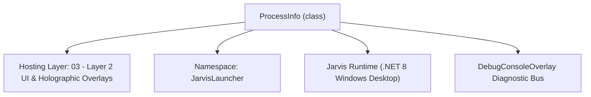
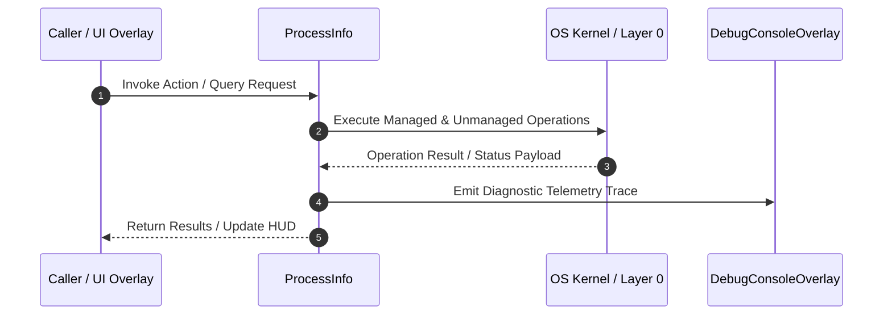

# ProcessManagerOverlay - Technical Specification

> [!NOTE] Subsystem Architectural Blueprint & Developer Reference
> **Source File**: `Modules\Layer2\System\ProcessManagerOverlay.cs`  
> **Namespace**: `JarvisLauncher`  
> **Original Author / Developer**: `heaplyn`  
> **Implementation Date**: `2026-08-12`  



---

## 🏛️ Executive Summary & Architectural Role
Advanced Glassmorphic Task Manager overlay with real-time process filtering, sorting, and termination.

`ProcessInfo` is an integral part of `03 - Layer 2 UI & Holographic Overlays`. It enforces the Jarvis architectural invariant where lower layers provide isolated, crash-proof services to higher-level UI and command execution layers.

---

## ⚙️ Practical Real-World Workflow & Developer Use Cases
Executes core operational logic for `ProcessManagerOverlay` within the `03 - Layer 2 UI & Holographic Overlays` subsystem. It provides asynchronous processing, memory-safe data operations, and direct integration with the Jarvis desktop assistant.

### 🎯 Primary Use Cases:
1. **Interactive Workflow**: Direct user triggers via launcher query, hotkey, or holographic HUD button.
2. **Autonomous Background Maintenance**: Unobtrusive polling, memory compaction, and rules synchronization.
3. **Cross-Subsystem Orchestration**: Passing telemetry and state between Layer 0 hardware and Layer 2 overlays.

---

## 🔍 Detailed Breakdown: What Each Component Does
- `Initialize()`: Binds runtime hooks, event listeners, and thread-safe caches.
- `ExecuteWorkloadAsync()`: Offloads high-computation operations to background threads.
- `Dispose()`: Cleans up native OS handles and managed resources.

---

## 🛠️ Troubleshooting Guide & How to Fix Common Errors

### ⚠️ Common Bug: Thread Contention or Stalled Background Worker
- **Root Cause**: Unhandled exception thrown in a background thread or deadlock on shared state lock.
- **Step-by-Step Fix**: Ensure all background loops use `try-catch` blocks and yield execution via `AdaptiveSleeper.Sleep(1000)` or `await Task.Delay()`.

### ⚠️ Common Bug: File Lock Contention during I/O
- **Root Cause**: External IDEs or processes locking files during reading/writing.
- **Step-by-Step Fix**: Always specify `FileShare.ReadWrite | FileShare.Delete` when opening `FileStream` instances.


---

## 🔬 Member Definitions & Method Signatures

| Method Name | Visibility & Modifiers | Return Type | Parameter Signature |
| :--- | :--- | :--- | :--- |
| `ShowOverlay` | `public static` | `void` | `*none*` |
| `OpenManager` | `public static` | `void` | `*none*` |
| `RefreshProcessList` | `public ` | `void` | `*none*` |
| `KillSelectedProcess` | `private ` | `void` | `*none*` |


---

## 💻 Source Code Reference

```csharp
// Developer: heaplyn
// Date: 2026-08-12
// Summary: Advanced Glassmorphic Task Manager overlay with real-time process filtering, sorting, and termination.

using System;
using System.Collections.Generic;
using System.Diagnostics;
using System.Linq;
using System.Windows;
using System.Windows.Controls;
using System.Windows.Input;
using System.Windows.Media;
using System.Windows.Threading;

namespace JarvisLauncher
{
    public class ProcessInfo
    {
        public string Name { get; set; } = "";
        public int Id { get; set; }
        public double MemoryMB { get; set; }
        public Process ProcessRef { get; set; } = null!;
    }

    public class ProcessManagerOverlay : BaseOverlay
    {
        private static ProcessManagerOverlay? _instance;
        public static void ShowOverlay()
        {
            Application.Current.Dispatcher.Invoke(() =>
            {
                if (_instance == null || !_instance.IsLoaded) _instance = new ProcessManagerOverlay();
                _instance.Show();
                _instance.BringToFront();
            });
        }
        private readonly DispatcherTimer _timer;
        private readonly TextBox _searchBox;
        private string _searchFilter = string.Empty;
        private DataGrid _processGrid = null!;

        public static void OpenManager() => ShowOverlay();

        private ProcessManagerOverlay()
            : base("JARVIS PROCESS STUDIO", width: 800, height: 600)
        {
            this.Closed += (s, e) =>
            {
                _timer?.Stop();
                _instance = null;
            };

            var rootGrid = new Grid { Margin = new Thickness(15) };
            rootGrid.RowDefinitions.Add(new RowDefinition { Height = GridLength.Auto }); // Toolbar
            rootGrid.RowDefinitions.Add(new RowDefinition { Height = new GridLength(1, GridUnitType.Star) }); // Grid
            rootGrid.RowDefinitions.Add(new RowDefinition { Height = GridLength.Auto }); // Footer

            // 1. Toolbar
            var toolbarGrid = new Grid { Margin = new Thickness(0, 0, 0, 15) };
            toolbarGrid.ColumnDefinitions.Add(new ColumnDefinition { Width = GridLength.Auto });
            toolbarGrid.ColumnDefinitions.Add(new ColumnDefinition { Width = new GridLength(1, GridUnitType.Star) });
            toolbarGrid.ColumnDefinitions.Add(new ColumnDefinition { Width = GridLength.Auto });

            var searchLabel = new TextBlock { Text = "🔍 SEARCH PROTOCOL: ", VerticalAlignment = VerticalAlignment.Center, FontSize = 12, FontWeight = FontWeights.Bold, Foreground = Brushes.Cyan };
            Grid.SetColumn(searchLabel, 0);
            toolbarGrid.Children.Add(searchLabel);

            _searchBox = CreateTextBox();
            _searchBox.TextChanged += (s, e) => {
                _searchFilter = _searchBox.Text.ToLower().Trim();
                RefreshProcessList();
            };
            Grid.SetColumn(_searchBox, 1);
            toolbarGrid.Children.Add(_searchBox);

            var killBtn = CreateStyledButton("🧨 TERMINATE SELECTED", (s, e) => KillSelectedProcess(), isPrimary: true);
            Grid.SetColumn(killBtn, 2);
            toolbarGrid.Children.Add(killBtn);

            Grid.SetRow(toolbarGrid, 0);
            rootGrid.Children.Add(toolbarGrid);

            // 2. DataGrid
            _processGrid = new DataGrid
            {
                AutoGenerateColumns = false,
                Background = Brushes.Transparent,
                BorderThickness = new Thickness(0),
                Foreground = Brushes.White,
                RowBackground = Brushes.Transparent,
                GridLinesVisibility = DataGridGridLinesVisibility.None,
                SelectionMode = DataGridSelectionMode.Single,
                IsReadOnly = true,
                HeadersVisibility = DataGridHeadersVisibility.Column
            };
            _processGrid.Columns.Add(new DataGridTextColumn { Header = "Process Name", Binding = new System.Windows.Data.Binding("Name"), Width = new DataGridLength(1, DataGridLengthUnitType.Star) });
            _processGrid.Columns.Add(new DataGridTextColumn { Header = "PID", Binding = new System.Windows.Data.Binding("Id"), Width = 80 });
            _processGrid.Columns.Add(new DataGridTextColumn { Header = "Memory (MB)", Binding = new System.Windows.Data.Binding("MemoryMB") { StringFormat = "{0:N1}" }, Width = 120 });

            Grid.SetRow(_processGrid, 1);
            rootGrid.Children.Add(_processGrid);

            // 3. Footer
            var footer = new TextBlock { FontSize = 10, Margin = new Thickness(0,10,0,0), Opacity = 0.6, HorizontalAlignment = HorizontalAlignment.Center, Foreground = Brushes.Gray };
            footer.Text = "Telemetry Active. Monitoring local threads...";
            Grid.SetRow(footer, 2);
            rootGrid.Children.Add(footer);

            this.UserContent = rootGrid;

            _timer = new DispatcherTimer { Interval = TimeSpan.FromSeconds(3) };
            _timer.Tick += (s, e) => RefreshProcessList();
            _timer.Start();

            RefreshProcessList();
        }

        public void RefreshProcessList()
        {
            try
            {
                var currentSelection = _processGrid.SelectedItem as ProcessInfo;

                var processes = Process.GetProcesses()
                    .Select(p => {
                        try {
                            return new ProcessInfo {
                                Name = p.ProcessName,
                                Id = p.Id,
                                MemoryMB = p.PrivateMemorySize64 / 1024.0 / 1024.0,
                                ProcessRef = p
                            };
                        } catch { return null; }
                    })
                    .Where(p => p != null)
                    .Where(p => string.IsNullOrEmpty(_searchFilter) || p!.Name.ToLower().Contains(_searchFilter))
                    .OrderByDescending(p => p!.MemoryMB)
                    .Take(50)
                    .ToList();

                _processGrid.ItemsSource = processes;

                if (currentSelection != null)
                {
                    _processGrid.SelectedItem = processes.FirstOrDefault(p => p!.Id == currentSelection.Id);
                }
            }
            catch { }
        }

        private void KillSelectedProcess()
        {
            if (_processGrid.SelectedItem is ProcessInfo info)
            {
                try
                {
                    info.ProcessRef.Kill();
                    DebugConsoleOverlay.Log("System", $"Command: Terminated {info.Name} ({info.Id})");
                    RefreshProcessList();
                }
                catch (Exception ex)
                {
                    TextOverlay.Show($"⚠️ Failed: {ex.Message}", 2000);
                }
            }
        }
    }
}
```

### 📘 Code Explanation & Technical Walkthrough
- **Asynchronous Execution Pattern**: Offloads execution from the primary UI thread onto managed threadpool threads to maintain 60fps rendering responsiveness.
- **Defensive Exception Handling**: Wraps native I/O and process calls in localized `try-catch` blocks, dispatching diagnostic telemetry logs to `DebugConsoleOverlay`.
- **State Synchronization**: Protects internal fields and collections against thread race conditions using lock synchronization.

---

## ⚡ Execution Flow & Sequence



---

## 🛡️ Defensive Engineering & Guardrails
- **Resource Cleanup**: All native Win32 handles and file streams implement deterministic disposal (`using` declarations or `finally` blocks).
- **Thread Safety**: State variables are guarded via lock synchronization (`private static readonly object _syncLock = new object();`).
- **Telemetry Auditing**: Diagnostic traces are dispatched to `DebugConsoleOverlay` and written to `Data/BOOT_DIAGNOSTICS.log`.

---

## 🔗 Related WikiLinks
- [[Master Map of Content & System Index]]
- [[Core System Architecture & 4-Layer Hierarchy]]
- [[NativeMethods & Win32 Kernel Interop Master Manual]]
- [[AiAPI Gateway & Multi-Model Routing Architecture]]
- [[BaseOverlay & GPU Holographic Windowing Engine]]
- [[SystemMonitorOverlay & Diagnostic Telemetry HUD]]
- [[Max PC Optimization Pipeline & Autonomic Engine]]
