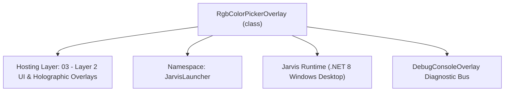
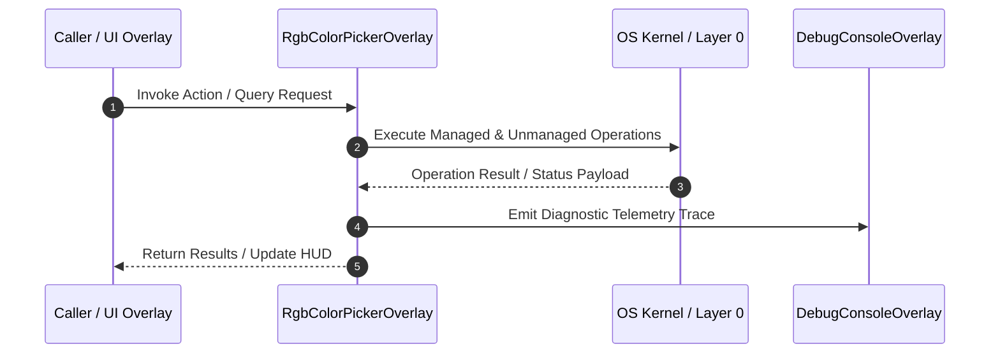

# RgbColorPickerOverlay - Technical Specification

> [!NOTE] Subsystem Architectural Blueprint & Developer Reference
> **Source File**: `Modules\Layer2\System\RgbColorPickerOverlay.cs`  
> **Namespace**: `JarvisLauncher`  
> **Original Author / Developer**: `heaplyn`  
> **Implementation Date**: `2026-08-21`  



---

## 🏛️ Executive Summary & Architectural Role
Reusable glassmorphic RGB color picker overlay.
          Shows R/G/B sliders, hex input, live preview swatch, and hue bar.
          Call RgbColorPickerOverlay.Show(initialHex, onPicked) to open.

`RgbColorPickerOverlay` is an integral part of `03 - Layer 2 UI & Holographic Overlays`. It enforces the Jarvis architectural invariant where lower layers provide isolated, crash-proof services to higher-level UI and command execution layers.

---

## ⚙️ Practical Real-World Workflow & Developer Use Cases
Executes core operational logic for `RgbColorPickerOverlay` within the `03 - Layer 2 UI & Holographic Overlays` subsystem. It provides asynchronous processing, memory-safe data operations, and direct integration with the Jarvis desktop assistant.

### 🎯 Primary Use Cases:
1. **Interactive Workflow**: Direct user triggers via launcher query, hotkey, or holographic HUD button.
2. **Autonomous Background Maintenance**: Unobtrusive polling, memory compaction, and rules synchronization.
3. **Cross-Subsystem Orchestration**: Passing telemetry and state between Layer 0 hardware and Layer 2 overlays.

---

## 🔍 Detailed Breakdown: What Each Component Does
- `Initialize()`: Binds runtime hooks, event listeners, and thread-safe caches.
- `ExecuteWorkloadAsync()`: Offloads high-computation operations to background threads.
- `Dispose()`: Cleans up native OS handles and managed resources.

---

## 🛠️ Troubleshooting Guide & How to Fix Common Errors

### ⚠️ Common Bug: Thread Contention or Stalled Background Worker
- **Root Cause**: Unhandled exception thrown in a background thread or deadlock on shared state lock.
- **Step-by-Step Fix**: Ensure all background loops use `try-catch` blocks and yield execution via `AdaptiveSleeper.Sleep(1000)` or `await Task.Delay()`.

### ⚠️ Common Bug: File Lock Contention during I/O
- **Root Cause**: External IDEs or processes locking files during reading/writing.
- **Step-by-Step Fix**: Always specify `FileShare.ReadWrite | FileShare.Delete` when opening `FileStream` instances.


---

## 🔬 Member Definitions & Method Signatures

| Method Name | Visibility & Modifiers | Return Type | Parameter Signature |
| :--- | :--- | :--- | :--- |
| `Show` | `public static` | `void` | `string initialHex, Action<string> onPicked` |
| `BuildHueBar` | `private ` | `UIElement` | `*none*` |
| `BuildPresetRow` | `private ` | `UIElement` | `*none*` |
| `MakeSwatch` | `private static` | `Border` | `string label` |
| `Slider_ValueChanged` | `private ` | `void` | `object sender, RoutedPropertyChangedEventArgs<double> e` |
| `UpdatePreviewFromSliders` | `private ` | `void` | `*none*` |
| `HexBox_TextChanged` | `private ` | `void` | `object sender, TextChangedEventArgs e` |
| `ApplyHexToSliders` | `private ` | `void` | `string hex` |
| `HueToRgb` | `private static` | `Color` | `double hue` |


---

## 💻 Source Code Reference

```csharp
// Developer: heaplyn
// Date: 2026-08-21
// Layer: 2 (UI only)
// Summary: Reusable glassmorphic RGB color picker overlay.
//          Shows R/G/B sliders, hex input, live preview swatch, and hue bar.
//          Call RgbColorPickerOverlay.Show(initialHex, onPicked) to open.

using System;
using System.Windows;
using System.Windows.Controls;
using System.Windows.Input;
using System.Windows.Media;
using System.Windows.Shapes;

namespace JarvisLauncher
{
    public class RgbColorPickerOverlay : BaseOverlay
    {
        private static RgbColorPickerOverlay? _instance;
        private Action<string>? _onPicked;

        private Slider _rSlider = null!;
        private Slider _gSlider = null!;
        private Slider _bSlider = null!;
        private Slider _aSlider = null!;
        private TextBlock _rLabel = null!;
        private TextBlock _gLabel = null!;
        private TextBlock _bLabel = null!;
        private TextBlock _aLabel = null!;
        private TextBox _hexBox = null!;
        private Border _previewSwatch = null!;
        private Border _oldSwatch = null!;
        private bool _updating = false;

        public static void Show(string initialHex, Action<string> onPicked)
        {
            Application.Current.Dispatcher.Invoke(() =>
            {
                _instance?.ForceClose();
                _instance = new RgbColorPickerOverlay(initialHex, onPicked);
                _instance.Show();
                _instance.BringToFront();
            });
        }

        private RgbColorPickerOverlay(string initialHex, Action<string> onPicked)
            : base("🎨 COLOR PICKER", 420, 460)
        {
            _onPicked = onPicked;
            _instance = this;
            this.Closed += (s, e) => _instance = null;
            this.ResizeMode = ResizeMode.NoResize;

            var root = new StackPanel { Margin = new Thickness(10, 6, 10, 6) };

            // ── Swatches row ─────────────────────────────────────────────────
            var swatchRow = new Grid { Margin = new Thickness(0, 0, 0, 14) };
            swatchRow.ColumnDefinitions.Add(new ColumnDefinition { Width = new GridLength(1, GridUnitType.Star) });
            swatchRow.ColumnDefinitions.Add(new ColumnDefinition { Width = new GridLength(8) });
            swatchRow.ColumnDefinitions.Add(new ColumnDefinition { Width = new GridLength(1, GridUnitType.Star) });

            var oldSwatchContainer     = MakeSwatch("ORIGINAL");
            var previewSwatchContainer = MakeSwatch("NEW");
            _oldSwatch     = (Border)oldSwatchContainer.Tag;
            _previewSwatch = (Border)previewSwatchContainer.Tag;

            Grid.SetColumn(oldSwatchContainer, 0);
            Grid.SetColumn(previewSwatchContainer, 2);
            swatchRow.Children.Add(oldSwatchContainer);
            swatchRow.Children.Add(previewSwatchContainer);
            root.Children.Add(swatchRow);

            // ── R / G / B / A sliders ─────────────────────────────────────────
            (_rSlider, _rLabel) = AddChannelRow(root, "R", Colors.Red);
            (_gSlider, _gLabel) = AddChannelRow(root, "G", Color.FromRgb(50, 200, 80));
            (_bSlider, _bLabel) = AddChannelRow(root, "B", Colors.DodgerBlue);
            (_aSlider, _aLabel) = AddChannelRow(root, "A", Colors.White, isAlpha: true);

            // ── Hex input ────────────────────────────────────────────────────
            var hexRow = new Grid { Margin = new Thickness(0, 10, 0, 12) };
            hexRow.ColumnDefinitions.Add(new ColumnDefinition { Width = GridLength.Auto });
            hexRow.ColumnDefinitions.Add(new ColumnDefinition { Width = new GridLength(1, GridUnitType.Star) });

            var hexLabel = new TextBlock { Text = "HEX:", FontSize = 13, FontWeight = FontWeights.SemiBold,
                VerticalAlignment = VerticalAlignment.Center, Margin = new Thickness(0, 0, 10, 0) };
            hexLabel.SetResourceReference(TextBlock.ForegroundProperty, "TextPrimaryBrush");
            Grid.SetColumn(hexLabel, 0); hexRow.Children.Add(hexLabel);

            _hexBox = new TextBox { FontSize = 13, Padding = new Thickness(8, 5, 8, 5), MaxLength = 9,
                CharacterCasing = CharacterCasing.Upper, VerticalContentAlignment = VerticalAlignment.Center };
            _hexBox.SetResourceReference(TextBox.ForegroundProperty, "TextPrimaryBrush");
            _hexBox.SetResourceReference(TextBox.BackgroundProperty, "HoverBackgroundBrush");
            _hexBox.SetResourceReference(TextBox.BorderBrushProperty, "WindowBorderBrush");
            _hexBox.TextChanged += HexBox_TextChanged;
            Grid.SetColumn(_hexBox, 1); hexRow.Children.Add(_hexBox);
            root.Children.Add(hexRow);

            // ── Hue rainbow bar ───────────────────────────────────────────────
            root.Children.Add(BuildHueBar());

            // ── Preset swatches ───────────────────────────────────────────────
            root.Children.Add(BuildPresetRow());

            // ── Buttons ───────────────────────────────────────────────────────
            var btnRow = new StackPanel { Orientation = Orientation.Horizontal,
                HorizontalAlignment = HorizontalAlignment.Right, Margin = new Thickness(0, 14, 0, 0) };

            var cancelBtn = CreateStyledButton("✕ Cancel", (s, e) => FadeOutAndHide());
            cancelBtn.Width = 85;
            var applyBtn  = CreateStyledButton("✔ Apply", (s, e) => {
                _onPicked?.Invoke(_hexBox.Text.Trim());
                FadeOutAndHide();
            }, isPrimary: true);
            applyBtn.Width = 85;
            applyBtn.Margin = new Thickness(8, 0, 0, 0);

            btnRow.Children.Add(cancelBtn);
            btnRow.Children.Add(applyBtn);
            root.Children.Add(btnRow);

            this.UserContent = root;

            // Wire slider events
            foreach (var sl in new[] { _rSlider, _gSlider, _bSlider, _aSlider })
                sl.ValueChanged += Slider_ValueChanged;

            // Load initial color
            ApplyHexToSliders(initialHex);
            _oldSwatch.Background = _previewSwatch.Background;
        }

        // ── Channel slider row ────────────────────────────────────────────────
        private (Slider slider, TextBlock label) AddChannelRow(Panel parent, string name, Color trackColor, bool isAlpha = false)
        {
            var row = new Grid { Margin = new Thickness(0, 0, 0, 8) };
            row.ColumnDefinitions.Add(new ColumnDefinition { Width = new GridLength(18) }); // letter
            row.ColumnDefinitions.Add(new ColumnDefinition { Width = new GridLength(1, GridUnitType.Star) }); // slider
            row.ColumnDefinitions.Add(new ColumnDefinition { Width = new GridLength(36) }); // value

            var letter = new TextBlock { Text = name, FontSize = 12, FontWeight = FontWeights.Bold,
                VerticalAlignment = VerticalAlignment.Center,
                Foreground = new SolidColorBrush(trackColor) };
            Grid.SetColumn(letter, 0); row.Children.Add(letter);

            var slider = new Slider { Minimum = 0, Maximum = 255, Value = isAlpha ? 255 : 128,
                SmallChange = 1, LargeChange = 10,
                VerticalAlignment = VerticalAlignment.Center };
            Grid.SetColumn(slider, 1); row.Children.Add(slider);

            var valLabel = new TextBlock { Text = "128", FontSize = 11, Width = 34,
                TextAlignment = TextAlignment.Right, VerticalAlignment = VerticalAlignment.Center };
            valLabel.SetResourceReference(TextBlock.ForegroundProperty, "TextPrimaryBrush");
            Grid.SetColumn(valLabel, 2); row.Children.Add(valLabel);

            parent.Children.Add(row);
            return (slider, valLabel);
        }

        // ── Hue rainbow quick-pick bar ────────────────────────────────────────
        private UIElement BuildHueBar()
        {
            var canvas = new Canvas { Height = 20, Margin = new Thickness(0, 6, 0, 10) };
            var rect = new Rectangle { Height = 20, RadiusX = 6, RadiusY = 6 };

            var stops = new GradientStopCollection {
                new GradientStop(Colors.Red,     0.0),
                new GradientStop(Colors.Yellow,  0.17),
                new GradientStop(Colors.Lime,    0.33),
                new GradientStop(Colors.Cyan,    0.50),
                new GradientStop(Colors.Blue,    0.67),
                new GradientStop(Colors.Magenta, 0.83),
                new GradientStop(Colors.Red,     1.0)
            };
            rect.Fill = new LinearGradientBrush(stops, new Point(0,0), new Point(1,0));
            rect.Cursor = Cursors.Cross;
            canvas.SizeChanged += (s, e) => rect.Width = canvas.ActualWidth;
            rect.MouseLeftButtonDown += (s, e) => {
                var p = e.GetPosition(rect);
                double hue = p.X / rect.ActualWidth * 360.0;
                var c = HueToRgb(hue);
                _updating = true;
                _rSlider.Value = c.R;
                _gSlider.Value = c.G;
                _bSlider.Value = c.B;
                _updating = false;
                UpdatePreviewFromSliders();
            };
            canvas.Children.Add(rect);

            var label = new TextBlock { Text = "↑ Click hue bar to set base color",
                FontSize = 10, Foreground = Brushes.Gray, Margin = new Thickness(0,0,0,0) };

            var stack = new StackPanel();
            stack.Children.Add(canvas);
            stack.Children.Add(label);
            return stack;
        }

        // ── Preset color row ──────────────────────────────────────────────────
        private UIElement BuildPresetRow()
        {
            var presets = new[] {
                "#FF0000","#FF6600","#FFD700","#00FF00","#00FFFF",
                "#007FFF","#8A2BE2","#FF007F","#FFFFFF","#808080","#000000"
            };
            var panel = new WrapPanel { Margin = new Thickness(0, 0, 0, 0) };
            foreach (var hex in presets)
            {
                var h = hex;
                var b = new Border {
                    Width = 26, Height = 26, Margin = new Thickness(2),
                    CornerRadius = new CornerRadius(4),
                    Cursor = Cursors.Hand,
                    BorderThickness = new Thickness(1),
                    BorderBrush = new SolidColorBrush(Color.FromArgb(80,255,255,255))
                };
                try { b.Background = new SolidColorBrush((Color)ColorConverter.ConvertFromString(h)); }
                catch { b.Background = Brushes.Gray; }
                b.MouseLeftButtonDown += (s, e) => ApplyHexToSliders(h);
                panel.Children.Add(b);
            }
            return panel;
        }

        // ── Swatch helper ─────────────────────────────────────────────────────
        private static Border MakeSwatch(string label)
        {
            var stack = new StackPanel { HorizontalAlignment = HorizontalAlignment.Center };
            var lbl = new TextBlock { Text = label, FontSize = 10, Foreground = Brushes.Gray,
                HorizontalAlignment = HorizontalAlignment.Center, Margin = new Thickness(0,0,0,3) };
            var rect = new Border { Height = 44, Width = 160, CornerRadius = new CornerRadius(6),
                Background = Brushes.DimGray, BorderThickness = new Thickness(1),
                BorderBrush = new SolidColorBrush(Color.FromArgb(80,255,255,255)) };
            stack.Children.Add(lbl);
            stack.Children.Add(rect);

            var outer = new Border { Child = stack };
            outer.Tag = rect;
            return outer;
        }

        // ── Event handlers ────────────────────────────────────────────────────
        private void Slider_ValueChanged(object sender, RoutedPropertyChangedEventArgs<double> e)
        {
            if (_updating) return;
            UpdatePreviewFromSliders();
        }

        private void UpdatePreviewFromSliders()
        {
            int r = (int)_rSlider.Value;
            int g = (int)_gSlider.Value;
            int b = (int)_bSlider.Value;
            int a = (int)_aSlider.Value;

            _rLabel.Text = r.ToString();
            _gLabel.Text = g.ToString();
            _bLabel.Text = b.ToString();
            _aLabel.Text = a.ToString();

            var color = Color.FromArgb((byte)a, (byte)r, (byte)g, (byte)b);
            _previewSwatch.Background = new SolidColorBrush(color);

            _updating = true;
            _hexBox.Text = a == 255
                ? $"#{r:X2}{g:X2}{b:X2}"
                : $"#{a:X2}{r:X2}{g:X2}{b:X2}";
            _updating = false;
        }

        private void HexBox_TextChanged(object sender, TextChangedEventArgs e)
        {
            if (_updating) return;
            ApplyHexToSliders(_hexBox.Text);
        }

        private void ApplyHexToSliders(string hex)
        {
            try
            {
                var color = (Color)ColorConverter.ConvertFromString(hex.Trim());
                _updating = true;
                _rSlider.Value = color.R;
                _gSlider.Value = color.G;
                _bSlider.Value = color.B;
                _aSlider.Value = color.A;
                _rLabel.Text = color.R.ToString();
                _gLabel.Text = color.G.ToString();
                _bLabel.Text = color.B.ToString();
                _aLabel.Text = color.A.ToString();
                _previewSwatch.Background = new SolidColorBrush(color);
                _hexBox.Text = color.A == 255
                    ? $"#{color.R:X2}{color.G:X2}{color.B:X2}"
                    : $"#{color.A:X2}{color.R:X2}{color.G:X2}{color.B:X2}";
                _updating = false;
            }
            catch { /* invalid hex while typing – ignore */ }
        }

        // ── Hue to RGB helper ────────────────────────────────────────────────
        private static Color HueToRgb(double hue)
        {
            double h = hue / 60.0;
            int i = (int)Math.Floor(h) % 6;
            double f = h - Math.Floor(h);
            byte p = 0, q = (byte)(255 * (1 - f)), t = (byte)(255 * f);
            return i switch {
                0 => Color.FromRgb(255, t, p),
                1 => Color.FromRgb(q, 255, p),
                2 => Color.FromRgb(p, 255, t),
                3 => Color.FromRgb(p, q, 255),
                4 => Color.FromRgb(t, p, 255),
                _ => Color.FromRgb(255, p, q)
            };
        }
    }
}
```

### 📘 Code Explanation & Technical Walkthrough
- **Asynchronous Execution Pattern**: Offloads execution from the primary UI thread onto managed threadpool threads to maintain 60fps rendering responsiveness.
- **Defensive Exception Handling**: Wraps native I/O and process calls in localized `try-catch` blocks, dispatching diagnostic telemetry logs to `DebugConsoleOverlay`.
- **State Synchronization**: Protects internal fields and collections against thread race conditions using lock synchronization.

---

## ⚡ Execution Flow & Sequence



---

## 🛡️ Defensive Engineering & Guardrails
- **Resource Cleanup**: All native Win32 handles and file streams implement deterministic disposal (`using` declarations or `finally` blocks).
- **Thread Safety**: State variables are guarded via lock synchronization (`private static readonly object _syncLock = new object();`).
- **Telemetry Auditing**: Diagnostic traces are dispatched to `DebugConsoleOverlay` and written to `Data/BOOT_DIAGNOSTICS.log`.

---

## 🔗 Related WikiLinks
- [[Master Map of Content & System Index]]
- [[Core System Architecture & 4-Layer Hierarchy]]
- [[NativeMethods & Win32 Kernel Interop Master Manual]]
- [[AiAPI Gateway & Multi-Model Routing Architecture]]
- [[BaseOverlay & GPU Holographic Windowing Engine]]
- [[SystemMonitorOverlay & Diagnostic Telemetry HUD]]
- [[Max PC Optimization Pipeline & Autonomic Engine]]
