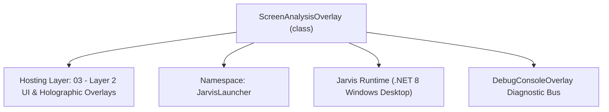
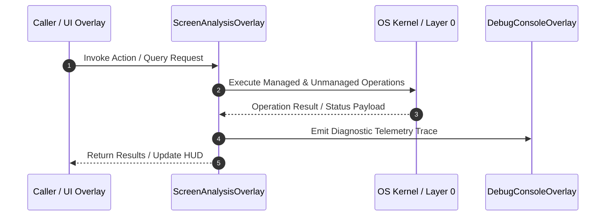

# ScreenAnalysisOverlay - Technical Specification

> [!NOTE] Subsystem Architectural Blueprint & Developer Reference
> **Source File**: `Modules\Layer2\System\ScreenAnalysisOverlay.cs`  
> **Namespace**: `JarvisLauncher`  
> **Original Author / Developer**: `copilot`  
> **Implementation Date**: `2026-08-13`  



---

## 🏛️ Executive Summary & Architectural Role
Screen analysis overlay showing open window sizes/bounds, clutter ratio, dominant color palettes, and offering wallpaper auto-theme and auto-tiling.

`ScreenAnalysisOverlay` is an integral part of `03 - Layer 2 UI & Holographic Overlays`. It enforces the Jarvis architectural invariant where lower layers provide isolated, crash-proof services to higher-level UI and command execution layers.

---

## ⚙️ Practical Real-World Workflow & Developer Use Cases
Executes core operational logic for `ScreenAnalysisOverlay` within the `03 - Layer 2 UI & Holographic Overlays` subsystem. It provides asynchronous processing, memory-safe data operations, and direct integration with the Jarvis desktop assistant.

### 🎯 Primary Use Cases:
1. **Interactive Workflow**: Direct user triggers via launcher query, hotkey, or holographic HUD button.
2. **Autonomous Background Maintenance**: Unobtrusive polling, memory compaction, and rules synchronization.
3. **Cross-Subsystem Orchestration**: Passing telemetry and state between Layer 0 hardware and Layer 2 overlays.

---

## 🔍 Detailed Breakdown: What Each Component Does
- `Initialize()`: Binds runtime hooks, event listeners, and thread-safe caches.
- `ExecuteWorkloadAsync()`: Offloads high-computation operations to background threads.
- `Dispose()`: Cleans up native OS handles and managed resources.

---

## 🛠️ Troubleshooting Guide & How to Fix Common Errors

### ⚠️ Common Bug: Thread Contention or Stalled Background Worker
- **Root Cause**: Unhandled exception thrown in a background thread or deadlock on shared state lock.
- **Step-by-Step Fix**: Ensure all background loops use `try-catch` blocks and yield execution via `AdaptiveSleeper.Sleep(1000)` or `await Task.Delay()`.

### ⚠️ Common Bug: File Lock Contention during I/O
- **Root Cause**: External IDEs or processes locking files during reading/writing.
- **Step-by-Step Fix**: Always specify `FileShare.ReadWrite | FileShare.Delete` when opening `FileStream` instances.


---

## 🔬 Member Definitions & Method Signatures

| Method Name | Visibility & Modifiers | Return Type | Parameter Signature |
| :--- | :--- | :--- | :--- |
| `Open` | `public static` | `void` | `*none*` |
| `AnalyzeScreenState` | `private ` | `void` | `*none*` |
| `SyncJarvisTheme` | `private ` | `void` | `*none*` |
| `AutoTile` | `private ` | `void` | `*none*` |
| `CreateSolidBrush` | `private ` | `Brush` | `string hex` |
| `CreateGradientBrush` | `private ` | `Brush` | `string startHex, string endHex` |
| `CreateActionButton` | `private ` | `Button` | `string text, RoutedEventHandler onClick` |


---

## 💻 Source Code Reference

```csharp
// Developer: copilot
// Date: 2026-08-13
// Summary: Screen analysis overlay showing open window sizes/bounds, clutter ratio, dominant color palettes, and offering wallpaper auto-theme and auto-tiling.

using System;
using System.Collections.Generic;
using System.Windows;
using System.Windows.Controls;
using System.Windows.Controls.Primitives;
using System.Windows.Input;
using System.Windows.Media;
using System.Windows.Shapes;

namespace JarvisLauncher
{
    public class ScreenAnalysisOverlay : BaseOverlay
    {
        private static ScreenAnalysisOverlay? _instance;

        private readonly ListBox _windowsListBox;
        private readonly TextBlock _coverageLabel;
        private readonly TextBlock _overlapLabel;
        private readonly TextBlock _feedbackLabel;

        private readonly Rectangle _dominantSwatch;
        private readonly Rectangle _accentSwatch;
        private readonly TextBlock _dominantHexLabel;
        private readonly TextBlock _accentHexLabel;

        private System.Windows.Media.Color _extractedDominant;
        private System.Windows.Media.Color _extractedAccent;

        public static void Open()
        {
            Application.Current.Dispatcher.Invoke(() =>
            {
                if (_instance == null)
                {
                    _instance = new ScreenAnalysisOverlay();
                    _instance.Closed += (s, e) => _instance = null;
                }
                _instance.Show();
            });
        }

        private ScreenAnalysisOverlay()
            : base("🖥️ JARVIS SCREEN & WORKSPACE ANALYZER", width: 580, height: 440)
        {
            var mainGrid = new Grid { Margin = new Thickness(10) };
            mainGrid.ColumnDefinitions.Add(new ColumnDefinition { Width = new GridLength(320) });
            mainGrid.ColumnDefinitions.Add(new ColumnDefinition { Width = new GridLength(1, GridUnitType.Star) });

            // ================== COLUMN 0: ACTIVE WINDOWS & LAYOUT CLUTTER ==================
            var leftPanel = new Grid();
            leftPanel.RowDefinitions.Add(new RowDefinition { Height = GridLength.Auto }); // Header / Stats
            leftPanel.RowDefinitions.Add(new RowDefinition { Height = new GridLength(1, GridUnitType.Star) }); // Windows list
            leftPanel.RowDefinitions.Add(new RowDefinition { Height = GridLength.Auto }); // Overlap info & Auto-tile button

            var winHeader = new TextBlock
            {
                Text = "ACTIVE WORKSPACE WINDOWS",
                FontSize = 11,
                FontWeight = FontWeights.Bold,
                Margin = new Thickness(0, 0, 0, 8)
            };
            winHeader.SetResourceReference(TextBlock.FontFamilyProperty, "ActiveFontFamily");
            winHeader.SetResourceReference(TextBlock.ForegroundProperty, "TextSecondaryBrush");
            leftPanel.Children.Add(winHeader);
            Grid.SetRow(winHeader, 0);

            _windowsListBox = new ListBox
            {
                Background = Brushes.Transparent,
                BorderThickness = new Thickness(0),
                SelectionMode = SelectionMode.Single,
                Margin = new Thickness(0, 0, 0, 8)
            };
            _windowsListBox.SetResourceReference(ListBox.ItemContainerStyleProperty, "ResultItemStyle");

            // Setup Data Template for list of windows
            var template = new DataTemplate();
            var factory = new FrameworkElementFactory(typeof(StackPanel));
            factory.SetValue(StackPanel.OrientationProperty, Orientation.Vertical);

            var titleBlock = new FrameworkElementFactory(typeof(TextBlock));
            titleBlock.SetBinding(TextBlock.TextProperty, new System.Windows.Data.Binding("Title"));
            titleBlock.SetResourceReference(TextBlock.ForegroundProperty, "TextPrimaryBrush");
            titleBlock.SetValue(TextBlock.FontSizeProperty, 11.0);
            titleBlock.SetValue(TextBlock.FontWeightProperty, FontWeights.SemiBold);
            titleBlock.SetValue(TextBlock.TextTrimmingProperty, TextTrimming.CharacterEllipsis);
            factory.AppendChild(titleBlock);

            var infoBlock = new FrameworkElementFactory(typeof(TextBlock));
            infoBlock.SetBinding(TextBlock.TextProperty, new System.Windows.Data.Binding("Info"));
            infoBlock.SetResourceReference(TextBlock.ForegroundProperty, "TextSecondaryBrush");
            infoBlock.SetValue(TextBlock.FontSizeProperty, 9.5);
            infoBlock.SetValue(TextBlock.MarginProperty, new Thickness(0, 1, 0, 0));
            factory.AppendChild(infoBlock);

            template.VisualTree = factory;
            _windowsListBox.ItemTemplate = template;

            leftPanel.Children.Add(_windowsListBox);
            Grid.SetRow(_windowsListBox, 1);

            // Overlap layout stats
            var statsPanel = new StackPanel { Margin = new Thickness(0, 4, 0, 4) };

            _coverageLabel = new TextBlock { FontSize = 11, Margin = new Thickness(0, 0, 0, 2) };
            _coverageLabel.SetResourceReference(TextBlock.FontFamilyProperty, "ActiveFontFamily");
            _coverageLabel.SetResourceReference(TextBlock.ForegroundProperty, "TextPrimaryBrush");
            statsPanel.Children.Add(_coverageLabel);

            _overlapLabel = new TextBlock { FontSize = 11, Margin = new Thickness(0, 0, 0, 4) };
            _overlapLabel.SetResourceReference(TextBlock.FontFamilyProperty, "ActiveFontFamily");
            _overlapLabel.SetResourceReference(TextBlock.ForegroundProperty, "TextPrimaryBrush");
            statsPanel.Children.Add(_overlapLabel);

            _feedbackLabel = new TextBlock { FontSize = 10.5, TextWrapping = TextWrapping.Wrap, Margin = new Thickness(0, 0, 0, 8), FontWeight = FontWeights.SemiBold };
            _feedbackLabel.SetResourceReference(TextBlock.FontFamilyProperty, "ActiveFontFamily");
            _feedbackLabel.SetResourceReference(TextBlock.ForegroundProperty, "TextSecondaryBrush");
            statsPanel.Children.Add(_feedbackLabel);

            var tileBtn = CreateActionButton("🧩 Auto-Tile Windows in Grid", (s, e) => AutoTile());
            statsPanel.Children.Add(tileBtn);

            leftPanel.Children.Add(statsPanel);
            Grid.SetRow(statsPanel, 2);

            leftPanel.SetValue(Grid.ColumnProperty, 0);
            mainGrid.Children.Add(leftPanel);

            // ================== COLUMN 1: PALETTE & PALETTE ADAPTOR ==================
            var rightPanel = new StackPanel { Margin = new Thickness(14, 0, 0, 0) };

            var paletteHeader = new TextBlock
            {
                Text = "SCREEN COLOR PALETTE",
                FontSize = 11,
                FontWeight = FontWeights.Bold,
                Margin = new Thickness(0, 0, 0, 12)
            };
            paletteHeader.SetResourceReference(TextBlock.FontFamilyProperty, "ActiveFontFamily");
            paletteHeader.SetResourceReference(TextBlock.ForegroundProperty, "TextSecondaryBrush");
            rightPanel.Children.Add(paletteHeader);

            // Dominant Color Swatch Box
            rightPanel.Children.Add(new TextBlock { Text = "Dominant Color (Avg Background):", FontSize = 10, Margin = new Thickness(0, 0, 0, 4) });
            var domBox = new StackPanel { Orientation = Orientation.Horizontal, Margin = new Thickness(0, 0, 0, 10) };
            _dominantSwatch = new Rectangle { Width = 32, Height = 20, RadiusX = 4, RadiusY = 4, StrokeThickness = 1, Stroke = Brushes.Gray };
            domBox.Children.Add(_dominantSwatch);
            _dominantHexLabel = new TextBlock { VerticalAlignment = VerticalAlignment.Center, Margin = new Thickness(8, 0, 0, 0), FontSize = 11 };
            _dominantHexLabel.SetResourceReference(TextBlock.ForegroundProperty, "TextPrimaryBrush");
            domBox.Children.Add(_dominantHexLabel);
            rightPanel.Children.Add(domBox);

            // Accent Color Swatch Box
            rightPanel.Children.Add(new TextBlock { Text = "Accent Theme Color (Peak Glow):", FontSize = 10, Margin = new Thickness(0, 0, 0, 4) });
            var accBox = new StackPanel { Orientation = Orientation.Horizontal, Margin = new Thickness(0, 0, 0, 18) };
            _accentSwatch = new Rectangle { Width = 32, Height = 20, RadiusX = 4, RadiusY = 4, StrokeThickness = 1, Stroke = Brushes.Gray };
            accBox.Children.Add(_accentSwatch);
            _accentHexLabel = new TextBlock { VerticalAlignment = VerticalAlignment.Center, Margin = new Thickness(8, 0, 0, 0), FontSize = 11 };
            _accentHexLabel.SetResourceReference(TextBlock.ForegroundProperty, "TextPrimaryBrush");
            accBox.Children.Add(_accentHexLabel);
            rightPanel.Children.Add(accBox);

            var syncBtn = CreateActionButton("🎨 Sync Jarvis Theme", (s, e) => SyncJarvisTheme());
            syncBtn.Margin = new Thickness(0, 0, 0, 8);
            rightPanel.Children.Add(syncBtn);

            var refreshBtn = CreateActionButton("🔄 Re-Analyze Screen", (s, e) => AnalyzeScreenState());
            rightPanel.Children.Add(refreshBtn);

            rightPanel.SetValue(Grid.ColumnProperty, 1);
            mainGrid.Children.Add(rightPanel);

            this.UserContent = mainGrid;

            // Load initial state
            AnalyzeScreenState();
        }

        private void AnalyzeScreenState()
        {
            try
            {
                // 1. Analyze Windows Layout
                var windows = ScreenAnalyzer.GetActiveWindows();
                var listItems = new List<object>();
                foreach (var w in windows)
                {
                    listItems.Add(new
                    {
                        w.Title,
                        Info = $"Process: {w.ProcessName} | Bounds: {w.Bounds.Width}x{w.Bounds.Height} at ({w.Bounds.X},{w.Bounds.Y})"
                    });
                }
                _windowsListBox.ItemsSource = listItems;

                // Calculate overlap clutter index
                double coverage, overlap;
                string feedback;
                ScreenAnalyzer.CalculateClutterIndex(windows, out coverage, out overlap, out feedback);

                _coverageLabel.Text = $"🖥️ Screen Coverage: {coverage:0.0}%";
                _overlapLabel.Text = $"🧱 Overlap Density: {overlap:0.0}%";
                _feedbackLabel.Text = feedback;

                // 2. Extract Palette
                System.Windows.Media.Color dominant, accent;
                ScreenAnalyzer.ExtractScreenPalette(out dominant, out accent);
                _extractedDominant = dominant;
                _extractedAccent = accent;

                _dominantSwatch.Fill = new SolidColorBrush(dominant);
                _accentSwatch.Fill = new SolidColorBrush(accent);

                _dominantHexLabel.Text = $"#{dominant.R:X2}{dominant.G:X2}{dominant.B:X2}";
                _accentHexLabel.Text = $"#{accent.R:X2}{accent.G:X2}{accent.B:X2}";
            }
            catch (Exception ex)
            {
                TextOverlay.Show($"⚠️ Screen Analysis failed: {ex.Message}", 3000);
            }
        }

        private void SyncJarvisTheme()
        {
            // Calculate a dark theme color scheme based on screen dominant average
            // Reduce brightness to make it a pleasant dark HUD background
            double factor = 0.12; // Dark background factor
            byte bgR = (byte)(_extractedDominant.R * factor);
            byte bgG = (byte)(_extractedDominant.G * factor);
            byte bgB = (byte)(_extractedDominant.B * factor);

            // Build Hex colors
            string bgHex = $"#F2{bgR:X2}{bgG:X2}{bgB:X2}";
            string borderHex = $"#FF{_extractedAccent.R:X2}{_extractedAccent.G:X2}{_extractedAccent.B:X2}";
            string caretHex = $"#FF{_extractedAccent.R:X2}{_extractedAccent.G:X2}{_extractedAccent.B:X2}";
            
            // Hover/Selected states derived from accent color with alphas
            string hoverHex = $"#1C{_extractedAccent.R:X2}{_extractedAccent.G:X2}{_extractedAccent.B:X2}";
            string selectedHex = $"#33{_extractedAccent.R:X2}{_extractedAccent.G:X2}{_extractedAccent.B:X2}";
            string selectedBorderHex = $"#80{_extractedAccent.R:X2}{_extractedAccent.G:X2}{_extractedAccent.B:X2}";

            // Gradients
            byte gsR = (byte)Math.Min(255, bgR + 15);
            byte gsG = (byte)Math.Min(255, bgG + 15);
            byte gsB = (byte)Math.Min(255, bgB + 15);
            string gradientStartHex = $"#F2{gsR:X2}{gsG:X2}{gsB:X2}";
            string gradientEndHex = $"#F2{Math.Max(0, bgR - 10):X2}{Math.Max(0, bgG - 10):X2}{Math.Max(0, bgB - 10):X2}";

            // Apply resources dynamically
            ThemeManager.SetBackgroundResource("WindowBackgroundBrush", bgHex, gradientStartHex, gradientEndHex);
            ThemeManager.SetColorResource("WindowBorderBrush", borderHex);
            ThemeManager.SetColorResource("AccentCaretBrush", caretHex);
            ThemeManager.SetColorResource("HoverBackgroundBrush", hoverHex);
            ThemeManager.SetColorResource("SelectedBackgroundBrush", selectedHex);
            ThemeManager.SetColorResource("SelectedBorderBrush", selectedBorderHex);
 
            // Apply default light/dark labels
            ThemeManager.SetColorResource("TextPrimaryBrush", "#FFFFFF");
            ThemeManager.SetColorResource("TextPlaceholderBrush", "#5AFFFFFF");
            ThemeManager.SetColorResource("TextSecondaryBrush", "#8CFFFFFF");

            TextOverlay.Show("🎨 Dynamic Screen Theme Applied to Jarvis HUD!", 3000);
        }

        private void AutoTile()
        {
            ScreenAnalyzer.TileActiveWindows();
            TextOverlay.Show("🧩 Auto-tiled open windows into a clean grid!", 2500);
            
            // Pause slightly and refresh analysis
            var timer = new System.Windows.Threading.DispatcherTimer { Interval = TimeSpan.FromMilliseconds(500) };
            timer.Tick += (s, e) => { timer.Stop(); AnalyzeScreenState(); };
            timer.Start();
        }

        private Brush CreateSolidBrush(string hex)
        {
            var color = (System.Windows.Media.Color)ColorConverter.ConvertFromString(hex);
            var b = new SolidColorBrush(color);
            b.Freeze();
            return b;
        }

        private Brush CreateGradientBrush(string startHex, string endHex)
        {
            var cStart = (System.Windows.Media.Color)ColorConverter.ConvertFromString(startHex);
            var cEnd = (System.Windows.Media.Color)ColorConverter.ConvertFromString(endHex);
            var b = new LinearGradientBrush(cStart, cEnd, new Point(0, 0), new Point(1, 1));
            b.Freeze();
            return b;
        }

        private Button CreateActionButton(string text, RoutedEventHandler onClick)
        {
            var btn = new Button
            {
                Content = text,
                Height = 26,
                Cursor = Cursors.Hand,
                FontSize = 10.5
            };
            btn.SetResourceReference(Button.BackgroundProperty, "HoverBackgroundBrush");
            btn.SetResourceReference(Button.ForegroundProperty, "TextPrimaryBrush");
            btn.Click += onClick;
            return btn;
        }
    }
}
```

### 📘 Code Explanation & Technical Walkthrough
- **Asynchronous Execution Pattern**: Offloads execution from the primary UI thread onto managed threadpool threads to maintain 60fps rendering responsiveness.
- **Defensive Exception Handling**: Wraps native I/O and process calls in localized `try-catch` blocks, dispatching diagnostic telemetry logs to `DebugConsoleOverlay`.
- **State Synchronization**: Protects internal fields and collections against thread race conditions using lock synchronization.

---

## ⚡ Execution Flow & Sequence



---

## 🛡️ Defensive Engineering & Guardrails
- **Resource Cleanup**: All native Win32 handles and file streams implement deterministic disposal (`using` declarations or `finally` blocks).
- **Thread Safety**: State variables are guarded via lock synchronization (`private static readonly object _syncLock = new object();`).
- **Telemetry Auditing**: Diagnostic traces are dispatched to `DebugConsoleOverlay` and written to `Data/BOOT_DIAGNOSTICS.log`.

---

## 🔗 Related WikiLinks
- [[Master Map of Content & System Index]]
- [[Core System Architecture & 4-Layer Hierarchy]]
- [[NativeMethods & Win32 Kernel Interop Master Manual]]
- [[AiAPI Gateway & Multi-Model Routing Architecture]]
- [[BaseOverlay & GPU Holographic Windowing Engine]]
- [[SystemMonitorOverlay & Diagnostic Telemetry HUD]]
- [[Max PC Optimization Pipeline & Autonomic Engine]]
