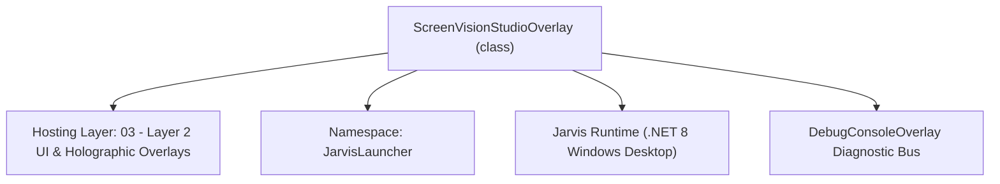
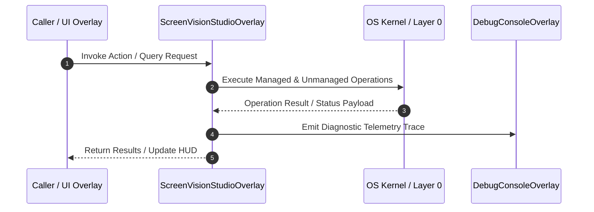

# ScreenVisionStudioOverlay - Technical Specification

> [!NOTE] Subsystem Architectural Blueprint & Developer Reference
> **Source File**: `Modules\Layer2\AI\ScreenVisionStudioOverlay.cs`  
> **Namespace**: `JarvisLauncher`  
> **Original Author / Developer**: `heaplyn`  
> **Implementation Date**: `2026-08-13`  



---

## 🏛️ Executive Summary & Architectural Role
Interactive WPF Overlay for Continuous Screen Monitoring & AI Vision Analysis.
 Provides real-time desktop preview, active window tracking, and 1-click Gemini Vision AI screen explanation.

`ScreenVisionStudioOverlay` is an integral part of `03 - Layer 2 UI & Holographic Overlays`. It enforces the Jarvis architectural invariant where lower layers provide isolated, crash-proof services to higher-level UI and command execution layers.

---

## ⚙️ Practical Real-World Workflow & Developer Use Cases
Executes core operational logic for `ScreenVisionStudioOverlay` within the `03 - Layer 2 UI & Holographic Overlays` subsystem. It provides asynchronous processing, memory-safe data operations, and direct integration with the Jarvis desktop assistant.

### 🎯 Primary Use Cases:
1. **Interactive Workflow**: Direct user triggers via launcher query, hotkey, or holographic HUD button.
2. **Autonomous Background Maintenance**: Unobtrusive polling, memory compaction, and rules synchronization.
3. **Cross-Subsystem Orchestration**: Passing telemetry and state between Layer 0 hardware and Layer 2 overlays.

---

## 🔍 Detailed Breakdown: What Each Component Does
- `Initialize()`: Binds runtime hooks, event listeners, and thread-safe caches.
- `ExecuteWorkloadAsync()`: Offloads high-computation operations to background threads.
- `Dispose()`: Cleans up native OS handles and managed resources.

---

## 🛠️ Troubleshooting Guide & How to Fix Common Errors

### ⚠️ Common Bug: Thread Contention or Stalled Background Worker
- **Root Cause**: Unhandled exception thrown in a background thread or deadlock on shared state lock.
- **Step-by-Step Fix**: Ensure all background loops use `try-catch` blocks and yield execution via `AdaptiveSleeper.Sleep(1000)` or `await Task.Delay()`.

### ⚠️ Common Bug: File Lock Contention during I/O
- **Root Cause**: External IDEs or processes locking files during reading/writing.
- **Step-by-Step Fix**: Always specify `FileShare.ReadWrite | FileShare.Delete` when opening `FileStream` instances.


---

## 🔬 Member Definitions & Method Signatures

| Method Name | Visibility & Modifiers | Return Type | Parameter Signature |
| :--- | :--- | :--- | :--- |
| `ShowOverlay` | `public static` | `void` | `*none*` |
| `RefreshScreenPreview` | `private ` | `void` | `*none*` |
| `UpdatePreviewThumbnail` | `private ` | `void` | `string imagePath` |
| `ExecuteScreenAnalysisAsync` | `private async` | `Task` | `*none*` |
| `CreateHeader` | `private static` | `TextBlock` | `string title` |
| `CreateLabel` | `private static` | `TextBlock` | `string text` |
| `CreateButton` | `private static` | `Button` | `string content` |


---

## 💻 Source Code Reference

```csharp
// Developer: heaplyn
// Date: 2026-08-13
// Summary: Interactive WPF Overlay for Continuous Screen Monitoring & AI Vision Analysis.
// Provides real-time desktop preview, active window tracking, and 1-click Gemini Vision AI screen explanation.

using System;
using System.IO;
using System.Threading.Tasks;
using System.Windows;
using System.Windows.Controls;
using System.Windows.Input;
using System.Windows.Media;
using System.Windows.Media.Imaging;

namespace JarvisLauncher
{
    public class ScreenVisionStudioOverlay : BaseOverlay
    {
        private static ScreenVisionStudioOverlay? _instance;

        private Image _previewImage = null!;
        private TextBlock _windowInfoText = null!;
        private TextBox _aiOutputBox = null!;
        private TextBox _customPromptBox = null!;
        private CheckBox _monitorToggleCheck = null!;
        private Slider _intervalSlider = null!;
        private TextBlock _intervalValText = null!;
        private Button _analyzeBtn = null!;

        public static void ShowOverlay()
        {
            if (_instance == null || !_instance.IsLoaded || !_instance.IsVisible)
            {
                _instance = new ScreenVisionStudioOverlay();
                _instance.Show();
            }
            else
            {
                _instance.Activate();
                _instance.BringToFront();
                _instance.Focus();
            }
        }

        public ScreenVisionStudioOverlay() : base("📹 AI SCREEN VISION & CONTINUOUS MONITORING STUDIO", 780, 660)
        {
            this.Closed += (s, e) => { _instance = null; };

            var workArea = SystemParameters.WorkArea;
            this.Left = (workArea.Width - this.Width) / 2;
            this.Top = (workArea.Height - this.Height) / 2;

            var mainGrid = new Grid { Margin = new Thickness(10) };
            mainGrid.RowDefinitions.Add(new RowDefinition { Height = GridLength.Auto });                     // Header
            mainGrid.RowDefinitions.Add(new RowDefinition { Height = new GridLength(1, GridUnitType.Star) }); // Content
            mainGrid.RowDefinitions.Add(new RowDefinition { Height = GridLength.Auto });                     // Action Controls

            // Header
            var headerStack = new StackPanel { Margin = new Thickness(0, 0, 0, 8) };
            headerStack.Children.Add(CreateHeader("📹 Real-Time AI Screen Vision & Continuous Background Tracking"));

            _windowInfoText = new TextBlock
            {
                Text = "Active Window: Detecting...",
                FontSize = 11,
                FontWeight = FontWeights.Bold,
                Foreground = Brushes.Cyan,
                Margin = new Thickness(0, 2, 0, 0)
            };
            headerStack.Children.Add(_windowInfoText);
            Grid.SetRow(headerStack, 0);
            mainGrid.Children.Add(headerStack);

            // Content Grid (Left: Screen Preview, Right: AI Output)
            var contentGrid = new Grid();
            contentGrid.ColumnDefinitions.Add(new ColumnDefinition { Width = new GridLength(1.1, GridUnitType.Star) });
            contentGrid.ColumnDefinitions.Add(new ColumnDefinition { Width = new GridLength(1, GridUnitType.Star) });

            // Left Panel: Screenshot Preview & Controls
            var leftStack = new StackPanel { Margin = new Thickness(0, 0, 6, 0) };
            var imgBorder = new Border
            {
                Height = 220,
                CornerRadius = new CornerRadius(8),
                BorderThickness = new Thickness(1),
                BorderBrush = Brushes.Gray,
                Margin = new Thickness(0, 0, 0, 8)
            };
            _previewImage = new Image { Stretch = Stretch.Uniform };
            imgBorder.Child = _previewImage;
            leftStack.Children.Add(imgBorder);

            _monitorToggleCheck = new CheckBox
            {
                Content = "📹 Enable Continuous Background Screen Monitoring",
                IsChecked = ScreenMonitorEngine.IsMonitoring,
                Foreground = Brushes.White,
                FontSize = 11,
                Margin = new Thickness(0, 2, 0, 6)
            };
            _monitorToggleCheck.Click += (s, e) =>
            {
                bool active = _monitorToggleCheck.IsChecked == true;
                if (active) ScreenMonitorEngine.Start((int)_intervalSlider.Value);
                else ScreenMonitorEngine.Stop();
                TextOverlay.Show(active ? "📹 Continuous Screen Monitor STARTED" : "🛑 Screen Monitor STOPPED", 2500);
            };
            leftStack.Children.Add(_monitorToggleCheck);

            leftStack.Children.Add(CreateLabel("Sampling Interval (Seconds):"));
            var sliderGrid = new Grid();
            sliderGrid.ColumnDefinitions.Add(new ColumnDefinition { Width = new GridLength(1, GridUnitType.Star) });
            sliderGrid.ColumnDefinitions.Add(new ColumnDefinition { Width = GridLength.Auto });

            _intervalSlider = new Slider
            {
                Minimum = 1,
                Maximum = 30,
                Value = ScreenMonitorEngine.IntervalSeconds,
                TickFrequency = 1,
                IsSnapToTickEnabled = true
            };
            _intervalValText = new TextBlock
            {
                Text = $"{ScreenMonitorEngine.IntervalSeconds}s",
                FontSize = 12,
                FontWeight = FontWeights.Bold,
                Foreground = Brushes.Cyan,
                Margin = new Thickness(8, 0, 0, 0)
            };
            _intervalSlider.ValueChanged += (s, e) =>
            {
                int val = (int)_intervalSlider.Value;
                ScreenMonitorEngine.IntervalSeconds = val;
                _intervalValText.Text = $"{val}s";
                if (ScreenMonitorEngine.IsMonitoring) ScreenMonitorEngine.Start(val);
            };
            Grid.SetColumn(_intervalSlider, 0);
            sliderGrid.Children.Add(_intervalSlider);
            Grid.SetColumn(_intervalValText, 1);
            sliderGrid.Children.Add(_intervalValText);
            leftStack.Children.Add(sliderGrid);

            Grid.SetColumn(leftStack, 0);
            contentGrid.Children.Add(leftStack);

            // Right Panel: AI Vision Prompt & Output
            var rightStack = new StackPanel { Margin = new Thickness(6, 0, 0, 0) };
            rightStack.Children.Add(CreateLabel("Custom AI Vision Prompt (Optional):"));

            _customPromptBox = new TextBox
            {
                Text = "Explain the code, active window, or key information visible on my screen.",
                FontSize = 11,
                Padding = new Thickness(6),
                Margin = new Thickness(0, 2, 0, 6)
            };
            rightStack.Children.Add(_customPromptBox);

            _analyzeBtn = CreateButton("🧠 Analyze Screen with Gemini Vision AI");
            _analyzeBtn.Height = 34;
            _analyzeBtn.FontWeight = FontWeights.Bold;
            _analyzeBtn.Click += async (s, e) => await ExecuteScreenAnalysisAsync();
            rightStack.Children.Add(_analyzeBtn);

            rightStack.Children.Add(CreateLabel("AI Screen Analysis Log:"));
            _aiOutputBox = new TextBox
            {
                Height = 220,
                AcceptsReturn = true,
                TextWrapping = TextWrapping.Wrap,
                FontSize = 11,
                Padding = new Thickness(8),
                VerticalScrollBarVisibility = ScrollBarVisibility.Auto,
                Text = "Click 'Analyze Screen' or enable continuous monitoring to see live AI insights."
            };
            _aiOutputBox.SetResourceReference(TextBox.BackgroundProperty, "WindowBackgroundBrush");
            _aiOutputBox.SetResourceReference(TextBox.ForegroundProperty, "TextPrimaryBrush");
            rightStack.Children.Add(_aiOutputBox);

            Grid.SetColumn(rightStack, 1);
            contentGrid.Children.Add(rightStack);

            Grid.SetRow(contentGrid, 1);
            mainGrid.Children.Add(contentGrid);

            this.UserContent = mainGrid;

            // Subscribe to live screen capture events
            ScreenMonitorEngine.OnScreenCaptured += (path, windowTitle) =>
            {
                Application.Current.Dispatcher.Invoke(() =>
                {
                    _windowInfoText.Text = $"Active Window: '{windowTitle}' ({ScreenMonitorEngine.ActiveProcessName})";
                    UpdatePreviewThumbnail(path);
                });
            };

            RefreshScreenPreview();
        }

        private void RefreshScreenPreview()
        {
            string path = ScreenMonitorEngine.CapturePrimaryScreen();
            ScreenMonitorEngine.UpdateActiveWindowInfo();
            _windowInfoText.Text = $"Active Window: '{ScreenMonitorEngine.ActiveWindowTitle}' ({ScreenMonitorEngine.ActiveProcessName})";
            UpdatePreviewThumbnail(path);
        }

        private void UpdatePreviewThumbnail(string imagePath)
        {
            if (string.IsNullOrEmpty(imagePath) || !File.Exists(imagePath)) return;
            try
            {
                var bmp = new BitmapImage();
                bmp.BeginInit();
                bmp.CacheOption = BitmapCacheOption.OnLoad;
                bmp.UriSource = new Uri(imagePath);
                bmp.EndInit();
                _previewImage.Source = bmp;
            }
            catch { }
        }

        private async Task ExecuteScreenAnalysisAsync()
        {
            _analyzeBtn.IsEnabled = false;
            _aiOutputBox.Text = "⏳ Capturing screen and querying Gemini Vision AI...";
            TextOverlay.Show("🧠 Gemini AI Analyzing Screen...", 3000);

            string result = await ScreenMonitorEngine.AnalyzeScreenWithAiAsync(_customPromptBox.Text.Trim());

            _aiOutputBox.Text = result;
            _analyzeBtn.IsEnabled = true;
            TextOverlay.Show("✅ Screen Analysis Complete!", 2500);
        }

        private static TextBlock CreateHeader(string title)
        {
            var header = new TextBlock
            {
                Text = title,
                FontSize = 13,
                FontWeight = FontWeights.Bold,
                Margin = new Thickness(0, 4, 0, 4)
            };
            header.SetResourceReference(TextBlock.ForegroundProperty, "TextPrimaryBrush");
            return header;
        }

        private static TextBlock CreateLabel(string text)
        {
            var lbl = new TextBlock
            {
                Text = text,
                FontSize = 11,
                Margin = new Thickness(0, 4, 0, 2)
            };
            lbl.SetResourceReference(TextBlock.ForegroundProperty, "TextSecondaryBrush");
            return lbl;
        }

        private static Button CreateButton(string content)
        {
            var btn = new Button
            {
                Content = content,
                Margin = new Thickness(0, 2, 0, 4),
                Padding = new Thickness(8, 5, 8, 5),
                FontSize = 11,
                Cursor = Cursors.Hand
            };
            return btn;
        }
    }
}
```

### 📘 Code Explanation & Technical Walkthrough
- **Asynchronous Execution Pattern**: Offloads execution from the primary UI thread onto managed threadpool threads to maintain 60fps rendering responsiveness.
- **Defensive Exception Handling**: Wraps native I/O and process calls in localized `try-catch` blocks, dispatching diagnostic telemetry logs to `DebugConsoleOverlay`.
- **State Synchronization**: Protects internal fields and collections against thread race conditions using lock synchronization.

---

## ⚡ Execution Flow & Sequence



---

## 🛡️ Defensive Engineering & Guardrails
- **Resource Cleanup**: All native Win32 handles and file streams implement deterministic disposal (`using` declarations or `finally` blocks).
- **Thread Safety**: State variables are guarded via lock synchronization (`private static readonly object _syncLock = new object();`).
- **Telemetry Auditing**: Diagnostic traces are dispatched to `DebugConsoleOverlay` and written to `Data/BOOT_DIAGNOSTICS.log`.

---

## 🔗 Related WikiLinks
- [[Master Map of Content & System Index]]
- [[Core System Architecture & 4-Layer Hierarchy]]
- [[NativeMethods & Win32 Kernel Interop Master Manual]]
- [[AiAPI Gateway & Multi-Model Routing Architecture]]
- [[BaseOverlay & GPU Holographic Windowing Engine]]
- [[SystemMonitorOverlay & Diagnostic Telemetry HUD]]
- [[Max PC Optimization Pipeline & Autonomic Engine]]
