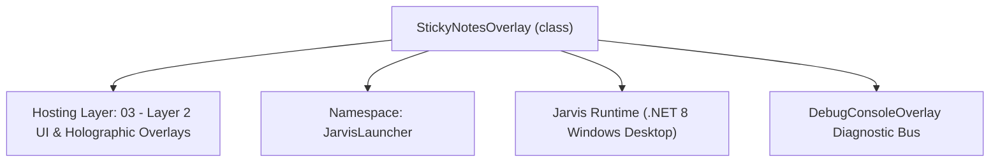
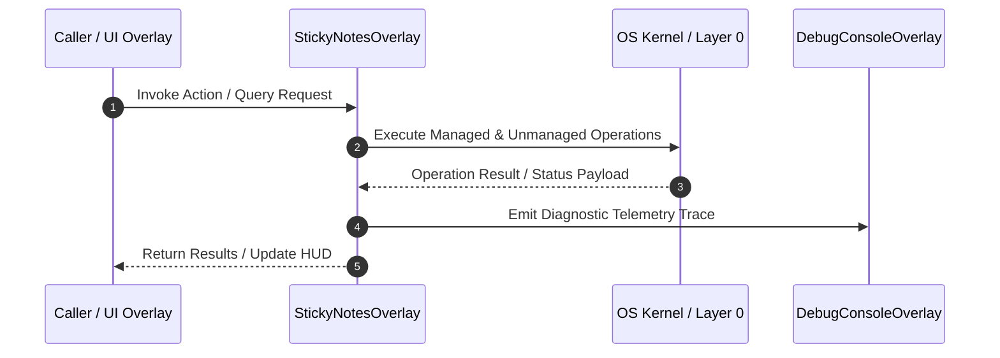

# StickyNotesOverlay - Technical Specification

> [!NOTE] Subsystem Architectural Blueprint & Developer Reference
> **Source File**: `Modules\Layer2\System\StickyNotesOverlay.cs`  
> **Namespace**: `JarvisLauncher`  
> **Original Author / Developer**: `copilot`  
> **Implementation Date**: `2026-08-13`  



---

## 🏛️ Executive Summary & Architectural Role
Interactive Multi-Note Sticky Workspace overlay with note lists, search filter, creation/deletion, and debounced disk autosave.

`StickyNotesOverlay` is an integral part of `03 - Layer 2 UI & Holographic Overlays`. It enforces the Jarvis architectural invariant where lower layers provide isolated, crash-proof services to higher-level UI and command execution layers.

---

## ⚙️ Practical Real-World Workflow & Developer Use Cases
Executes core operational logic for `StickyNotesOverlay` within the `03 - Layer 2 UI & Holographic Overlays` subsystem. It provides asynchronous processing, memory-safe data operations, and direct integration with the Jarvis desktop assistant.

### 🎯 Primary Use Cases:
1. **Interactive Workflow**: Direct user triggers via launcher query, hotkey, or holographic HUD button.
2. **Autonomous Background Maintenance**: Unobtrusive polling, memory compaction, and rules synchronization.
3. **Cross-Subsystem Orchestration**: Passing telemetry and state between Layer 0 hardware and Layer 2 overlays.

---

## 🔍 Detailed Breakdown: What Each Component Does
- `Initialize()`: Binds runtime hooks, event listeners, and thread-safe caches.
- `ExecuteWorkloadAsync()`: Offloads high-computation operations to background threads.
- `Dispose()`: Cleans up native OS handles and managed resources.

---

## 🛠️ Troubleshooting Guide & How to Fix Common Errors

### ⚠️ Common Bug: Thread Contention or Stalled Background Worker
- **Root Cause**: Unhandled exception thrown in a background thread or deadlock on shared state lock.
- **Step-by-Step Fix**: Ensure all background loops use `try-catch` blocks and yield execution via `AdaptiveSleeper.Sleep(1000)` or `await Task.Delay()`.

### ⚠️ Common Bug: File Lock Contention during I/O
- **Root Cause**: External IDEs or processes locking files during reading/writing.
- **Step-by-Step Fix**: Always specify `FileShare.ReadWrite | FileShare.Delete` when opening `FileStream` instances.


---

## 🔬 Member Definitions & Method Signatures

| Method Name | Visibility & Modifiers | Return Type | Parameter Signature |
| :--- | :--- | :--- | :--- |
| `Open` | `public static` | `void` | `*none*` |
| `Toggle` | `public static` | `void` | `*none*` |
| `GetNotesDirectory` | `private ` | `string` | `*none*` |
| `EnsureNotesDirectory` | `private ` | `void` | `*none*` |
| `RefreshNotesList` | `private ` | `void` | `*none*` |
| `FilterNotesList` | `private ` | `void` | `*none*` |
| `NotesListBox_SelectionChanged` | `private ` | `void` | `object sender, SelectionChangedEventArgs e` |
| `CreateNewNote` | `private ` | `void` | `*none*` |
| `DeleteActiveNote` | `private ` | `void` | `*none*` |
| `DebounceTimer_Tick` | `private ` | `void` | `object? sender, EventArgs e` |
| `OnClosed` | `protected override` | `void` | `EventArgs e` |
| `CreateSidebarButton` | `private ` | `Button` | `string text, RoutedEventHandler onClick` |
| `ShowOverlay` | `public static` | `void` | `*none*` |


---

## 💻 Source Code Reference

```csharp
// Developer: copilot
// Date: 2026-08-13
// Summary: Interactive Multi-Note Sticky Workspace overlay with note lists, search filter, creation/deletion, and debounced disk autosave.

using System;
using System.Collections.Generic;
using System.IO;
using System.Linq;
using System.Windows;
using System.Windows.Controls;
using System.Windows.Input;
using System.Windows.Media;
using System.Windows.Threading;
using System.Windows.Controls.Primitives;

namespace JarvisLauncher
{
    public class StickyNotesOverlay : BaseOverlay
    {
        private static StickyNotesOverlay? _instance;
        private readonly ListBox _notesListBox;
        private readonly TextBox _searchBox;
        private readonly TextBox _noteTextBox;
        private readonly DispatcherTimer _debounceTimer;

        private List<string> _allNoteFiles = new List<string>();
        private string? _activeNoteFile;
        private bool _isLoadingNote = false;

        public static void Open()
        {
            Application.Current.Dispatcher.Invoke(() =>
            {
                if (_instance == null)
                {
                    _instance = new StickyNotesOverlay();
                    _instance.Closed += (s, e) => _instance = null;
                }
                _instance.Show();
            });
        }

        public static void Toggle()
        {
            Application.Current.Dispatcher.Invoke(() =>
            {
                if (_instance == null)
                {
                    Open();
                }
                else
                {
                    _instance.FadeOutAndClose();
                    _instance = null;
                }
            });
        }

        private StickyNotesOverlay()
            : base("📌 JARVIS MULTI-NOTE WORKSPACE", width: 560, height: 420)
        {
            EnsureNotesDirectory();

            var mainGrid = new Grid { Margin = new Thickness(8) };
            mainGrid.ColumnDefinitions.Add(new ColumnDefinition { Width = new GridLength(180) });
            mainGrid.ColumnDefinitions.Add(new ColumnDefinition { Width = new GridLength(1, GridUnitType.Star) });

            // ================== COLUMN 0: SIDEBAR (NOTE LIST & ACTIONS) ==================
            var sidebar = new Grid();
            sidebar.RowDefinitions.Add(new RowDefinition { Height = GridLength.Auto }); // Search
            sidebar.RowDefinitions.Add(new RowDefinition { Height = new GridLength(1, GridUnitType.Star) }); // List
            sidebar.RowDefinitions.Add(new RowDefinition { Height = GridLength.Auto }); // Add/Delete buttons

            // Search Box
            _searchBox = new TextBox
            {
                Height = 24,
                Margin = new Thickness(0, 0, 0, 8),
                Padding = new Thickness(4, 2, 4, 2),
                FontSize = 11,
                VerticalContentAlignment = VerticalAlignment.Center
            };
            _searchBox.SetResourceReference(TextBox.BackgroundProperty, "WindowBackgroundBrush");
            _searchBox.SetResourceReference(TextBox.ForegroundProperty, "TextPrimaryBrush");
            _searchBox.SetResourceReference(TextBox.BorderBrushProperty, "WindowBorderBrush");
            _searchBox.SetResourceReference(TextBox.CaretBrushProperty, "AccentCaretBrush");
            _searchBox.TextChanged += (s, e) => FilterNotesList();
            sidebar.Children.Add(_searchBox);
            Grid.SetRow(_searchBox, 0);

            // Placeholder hint setup for search box
            string searchPlaceholder = "🔍 Search Notes...";
            _searchBox.Text = searchPlaceholder;
            _searchBox.GotFocus += (s, e) => { if (_searchBox.Text == searchPlaceholder) _searchBox.Text = ""; };
            _searchBox.LostFocus += (s, e) => { if (string.IsNullOrWhiteSpace(_searchBox.Text)) _searchBox.Text = searchPlaceholder; };

            // Notes ListBox
            _notesListBox = new ListBox
            {
                Background = Brushes.Transparent,
                BorderThickness = new Thickness(0),
                SelectionMode = SelectionMode.Single,
                Margin = new Thickness(0, 0, 0, 8)
            };
            _notesListBox.SetResourceReference(ListBox.ItemContainerStyleProperty, "ResultItemStyle");
            _notesListBox.SelectionChanged += NotesListBox_SelectionChanged;
            sidebar.Children.Add(_notesListBox);
            Grid.SetRow(_notesListBox, 1);

            // Action Buttons Panel
            var actionGrid = new UniformGrid { Columns = 2, Rows = 1 };
            
            var newBtn = CreateSidebarButton("➕ New Note", (s, e) => CreateNewNote());
            actionGrid.Children.Add(newBtn);

            var delBtn = CreateSidebarButton("🗑️ Delete", (s, e) => DeleteActiveNote());
            actionGrid.Children.Add(delBtn);

            sidebar.Children.Add(actionGrid);
            Grid.SetRow(actionGrid, 2);

            Grid.SetColumn(sidebar, 0);
            mainGrid.Children.Add(sidebar);

            // ================== COLUMN 1: NOTE EDITOR ==================
            var editorGrid = new Border
            {
                BorderThickness = new Thickness(1, 0, 0, 0),
                Padding = new Thickness(10, 0, 0, 0)
            };
            editorGrid.SetResourceReference(Border.BorderBrushProperty, "WindowBorderBrush");

            _noteTextBox = new TextBox
            {
                AcceptsReturn = true,
                TextWrapping = TextWrapping.Wrap,
                VerticalScrollBarVisibility = ScrollBarVisibility.Auto,
                Background = Brushes.Transparent,
                BorderThickness = new Thickness(0),
                FontSize = 13,
                Padding = new Thickness(4)
            };
            _noteTextBox.SetResourceReference(TextBox.FontFamilyProperty, "ActiveFontFamily");
            _noteTextBox.SetResourceReference(TextBox.ForegroundProperty, "TextPrimaryBrush");
            _noteTextBox.SetResourceReference(TextBox.CaretBrushProperty, "AccentCaretBrush");
            editorGrid.Child = _noteTextBox;

            Grid.SetColumn(editorGrid, 1);
            mainGrid.Children.Add(editorGrid);

            this.UserContent = mainGrid;

            // Debounce setup for disk writing
            _debounceTimer = new DispatcherTimer { Interval = TimeSpan.FromMilliseconds(500) };
            _debounceTimer.Tick += DebounceTimer_Tick;

            _noteTextBox.TextChanged += (s, e) =>
            {
                if (!_isLoadingNote && _activeNoteFile != null)
                {
                    _debounceTimer.Stop();
                    _debounceTimer.Start();
                }
            };

            RefreshNotesList();

            // Select first note automatically if any
            if (_notesListBox.Items.Count > 0)
            {
                _notesListBox.SelectedIndex = 0;
            }
        }

        private string GetNotesDirectory()
        {
            string baseDir = Path.Combine(AppDomain.CurrentDomain.BaseDirectory, "Data", "Notes");
            if (!Directory.Exists(baseDir))
            {
                string devPath = Path.GetFullPath(Path.Combine(AppDomain.CurrentDomain.BaseDirectory, @"..\..\..\Data\Notes"));
                if (Directory.Exists(Path.GetDirectoryName(devPath)!))
                {
                    baseDir = devPath;
                }
            }
            return baseDir;
        }

        private void EnsureNotesDirectory()
        {
            try
            {
                string dir = GetNotesDirectory();
                if (!Directory.Exists(dir)) Directory.CreateDirectory(dir);

                // Migrate old sticky note if it exists
                string oldSticky = Path.Combine(InstructionsManager.InstructionsDirectory, "sticky_notes.txt");
                string migratedPath = Path.Combine(dir, "Sticky Note.txt");
                if (File.Exists(oldSticky) && !File.Exists(migratedPath))
                {
                    File.Copy(oldSticky, migratedPath);
                    File.Delete(oldSticky);
                }

                // If folder is still empty, write a default note
                if (Directory.GetFiles(dir, "*.txt").Length == 0)
                {
                    File.WriteAllText(Path.Combine(dir, "Welcome Note.txt"), 
                        "Welcome to Jarvis Multi-Notes!\n\n" +
                        "Here you can organize all your project instructions, brainstorm lists, or personal ideas.\n" +
                        "All changes are autosaved instantly. Typing 'notes' in the command bar brings this workspace up.");
                }
            }
            catch { }
        }

        private void RefreshNotesList()
        {
            try
            {
                string dir = GetNotesDirectory();
                _allNoteFiles = Directory.GetFiles(dir, "*.txt").ToList();
            }
            catch
            {
                _allNoteFiles = new List<string>();
            }

            FilterNotesList();
        }

        private void FilterNotesList()
        {
            string filterText = _searchBox.Text.Trim();
            string placeholder = "🔍 Search Notes...";
            if (filterText == placeholder) filterText = "";

            var displayedNames = _allNoteFiles
                .Select(Path.GetFileNameWithoutExtension)
                .Where(name => string.IsNullOrEmpty(filterText) || name.IndexOf(filterText, StringComparison.OrdinalIgnoreCase) >= 0)
                .OrderBy(name => name)
                .ToList();

            string? selectedName = _activeNoteFile != null ? Path.GetFileNameWithoutExtension(_activeNoteFile) : null;

            _notesListBox.ItemsSource = displayedNames;

            // Re-select active note if it is still visible in list
            if (selectedName != null && displayedNames.Contains(selectedName))
            {
                _notesListBox.SelectedItem = selectedName;
            }
        }

        private void NotesListBox_SelectionChanged(object sender, SelectionChangedEventArgs e)
        {
            if (_notesListBox.SelectedItem is string selectedName)
            {
                // Commit any unsaved changes on old note
                if (_debounceTimer.IsEnabled)
                {
                    DebounceTimer_Tick(null, EventArgs.Empty);
                }

                string dir = GetNotesDirectory();
                string targetPath = Path.Combine(dir, $"{selectedName}.txt");
                if (File.Exists(targetPath))
                {
                    _isLoadingNote = true;
                    _activeNoteFile = targetPath;
                    try
                    {
                        _noteTextBox.Text = File.ReadAllText(targetPath);
                    }
                    catch
                    {
                        _noteTextBox.Text = string.Empty;
                    }
                    _isLoadingNote = false;
                }
            }
        }

        private void CreateNewNote()
        {
            InputPromptOverlay.Show("Enter new note title:", (title) =>
            {
                title = title.Trim();
                if (string.IsNullOrEmpty(title)) return;

                // Strip invalid filename characters
                foreach (char c in Path.GetInvalidFileNameChars())
                {
                    title = title.Replace(c, '_');
                }

                string dir = GetNotesDirectory();
                string path = Path.Combine(dir, $"{title}.txt");

                if (File.Exists(path))
                {
                    TextOverlay.Show("⚠️ Note with that name already exists!", 3000);
                    return;
                }

                try
                {
                    File.WriteAllText(path, $"# {title}\n\n");
                    RefreshNotesList();
                    _notesListBox.SelectedItem = title;
                    _noteTextBox.Focus();
                    _noteTextBox.SelectionStart = _noteTextBox.Text.Length;
                }
                catch (Exception ex)
                {
                    TextOverlay.Show($"⚠️ Failed to create note: {ex.Message}", 3000);
                }
            });
        }

        private void DeleteActiveNote()
        {
            if (_activeNoteFile == null) return;

            string noteName = Path.GetFileNameWithoutExtension(_activeNoteFile);
            var result = MessageBox.Show($"Are you sure you want to delete note '{noteName}' permanently?", 
                "Delete Note Confirm", MessageBoxButton.YesNo, MessageBoxImage.Warning);
            
            if (result == MessageBoxResult.Yes)
            {
                _debounceTimer.Stop();
                try
                {
                    if (File.Exists(_activeNoteFile)) File.Delete(_activeNoteFile);
                    _activeNoteFile = null;
                    _noteTextBox.Text = string.Empty;
                    RefreshNotesList();
                    if (_notesListBox.Items.Count > 0)
                    {
                        _notesListBox.SelectedIndex = 0;
                    }
                }
                catch (Exception ex)
                {
                    TextOverlay.Show($"⚠️ Failed to delete note: {ex.Message}", 3000);
                }
            }
        }

        private void DebounceTimer_Tick(object? sender, EventArgs e)
        {
            _debounceTimer.Stop();
            if (_activeNoteFile != null)
            {
                try
                {
                    File.WriteAllText(_activeNoteFile, _noteTextBox.Text);
                }
                catch { }
            }
        }

        protected override void OnClosed(EventArgs e)
        {
            if (_debounceTimer.IsEnabled)
            {
                DebounceTimer_Tick(null, EventArgs.Empty);
            }
            base.OnClosed(e);
        }

        private Button CreateSidebarButton(string text, RoutedEventHandler onClick)
        {
            var btn = new Button
            {
                Content = text,
                Height = 24,
                Margin = new Thickness(2, 0, 2, 0),
                Cursor = Cursors.Hand,
                FontSize = 10
            };
            btn.SetResourceReference(Button.BackgroundProperty, "HoverBackgroundBrush");
            btn.SetResourceReference(Button.ForegroundProperty, "TextPrimaryBrush");
            btn.Click += onClick;
            return btn;
        }

        public static void ShowOverlay()
        {
            if (_instance == null || !_instance.IsLoaded)
            {
                _instance = new StickyNotesOverlay();
                _instance.Show();
            }
            else
            {
                _instance.Activate();
            }
        }
    }
}
```

### 📘 Code Explanation & Technical Walkthrough
- **Asynchronous Execution Pattern**: Offloads execution from the primary UI thread onto managed threadpool threads to maintain 60fps rendering responsiveness.
- **Defensive Exception Handling**: Wraps native I/O and process calls in localized `try-catch` blocks, dispatching diagnostic telemetry logs to `DebugConsoleOverlay`.
- **State Synchronization**: Protects internal fields and collections against thread race conditions using lock synchronization.

---

## ⚡ Execution Flow & Sequence



---

## 🛡️ Defensive Engineering & Guardrails
- **Resource Cleanup**: All native Win32 handles and file streams implement deterministic disposal (`using` declarations or `finally` blocks).
- **Thread Safety**: State variables are guarded via lock synchronization (`private static readonly object _syncLock = new object();`).
- **Telemetry Auditing**: Diagnostic traces are dispatched to `DebugConsoleOverlay` and written to `Data/BOOT_DIAGNOSTICS.log`.

---

## 🔗 Related WikiLinks
- [[Master Map of Content & System Index]]
- [[Core System Architecture & 4-Layer Hierarchy]]
- [[NativeMethods & Win32 Kernel Interop Master Manual]]
- [[AiAPI Gateway & Multi-Model Routing Architecture]]
- [[BaseOverlay & GPU Holographic Windowing Engine]]
- [[SystemMonitorOverlay & Diagnostic Telemetry HUD]]
- [[Max PC Optimization Pipeline & Autonomic Engine]]
