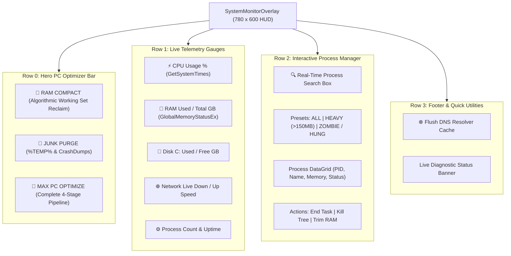

# 📊 SystemMonitorOverlay & Diagnostic Telemetry HUD

## 📊 Complete SystemMonitorOverlay Reference

`SystemMonitorOverlay` (`Modules/Layer2/System/SystemMonitorOverlay.cs`) is Jarvis's master diagnostic telemetry HUD, process manager, and 1-click autonomic PC optimizer.

---

## ⚡ Interactive Process Actions
- **Double-Click Row**: Instantly invokes `Process.Kill()` on the target process.
- **Kill Process Tree**: Recursively terminates the target process and all child sub-processes.
- **Trim RAM**: Safely calls Win32 `EmptyWorkingSet` on the selected process handle without terminating it.
