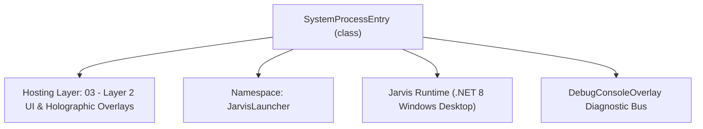
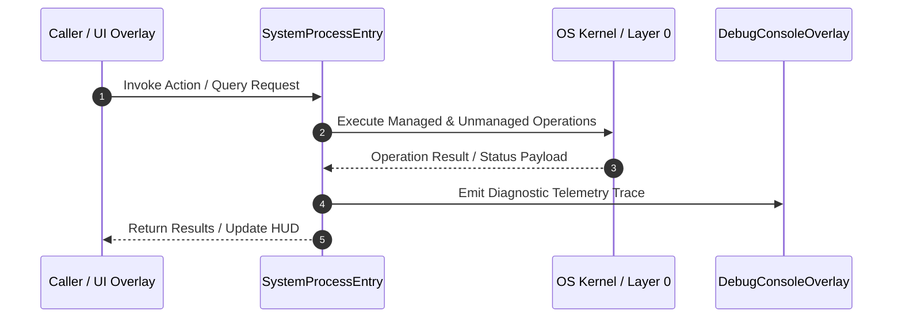

# SystemMonitorOverlay - Technical Specification

> [!NOTE] Subsystem Architectural Blueprint & Developer Reference
> **Source File**: `Modules\Layer2\System\SystemMonitorOverlay.cs`  
> **Namespace**: `JarvisLauncher`  
> **Original Author / Developer**: `heaplyn`  
> **Implementation Date**: `2026-09-03`  



---

## 🏛️ Executive Summary & Architectural Role
High-Performance Live System Debugger & PC Optimizer Suite for Jarvis.
          Features:
          - Real-time CPU, RAM, Multi-Drive Disk, Network IO, and System Uptime Telemetry
          - Algorithmic Deep RAM Working-Set Optimizer across background applications
          - Algorithmic Junk, Temp File, Crash Dump, and Cache Purger
          - Zombie & Not-Responding Process Hunter & Auto-Terminator
          - Integrated Interactive Process Manager with End Task, Kill Process Tree, and RAM Trimmer
          - 1-Click "MAX PC OPTIMIZATION" Engine

`SystemProcessEntry` is an integral part of `03 - Layer 2 UI & Holographic Overlays`. It enforces the Jarvis architectural invariant where lower layers provide isolated, crash-proof services to higher-level UI and command execution layers.

---

## ⚙️ Practical Real-World Workflow & Developer Use Cases
The master real-time diagnostic telemetry HUD and 1-click PC optimizer. Displays live gauges, network bandwidth, process manager, and runs the 4-phase MAX PC optimization pipeline.

### 🎯 Primary Use Cases:
1. **Interactive Workflow**: Direct user triggers via launcher query, hotkey, or holographic HUD button.
2. **Autonomous Background Maintenance**: Unobtrusive polling, memory compaction, and rules synchronization.
3. **Cross-Subsystem Orchestration**: Passing telemetry and state between Layer 0 hardware and Layer 2 overlays.

---

## 🔍 Detailed Breakdown: What Each Component Does
- `UpdateTelemetry()`: Refreshes CPU %, RAM used/total, Disk C: capacity, and network download/upload speeds every second.
- `RefreshProcessData()`: Enumerates running processes, working set memory, and responsiveness.
- `ExecuteMaxPcOptimizationAsync()`: Runs Zombie Hunter, Junk Purger, RAM Compactor, and DNS Flush.

---

## 🛠️ Troubleshooting Guide & How to Fix Common Errors

### ⚠️ Potential Bug: `Access Denied on Elevated System Process Handle`
- **Root Cause & Trigger**: Calling `p.Handle` on system processes (`csrss.exe`, `lsass.exe`) throws `Win32Exception: Access is denied`.
- **Step-by-Step Fix & Defensive Code**:
  ```csharp
  // Fix Implementation:
  // Safely open process handles using `NativeMethods.OpenProcess(0x0400 | 0x0100, false, p.Id)` and skip critical processes.
  ```


---

## 🔬 Member Definitions & Method Signatures

| Method Name | Visibility & Modifiers | Return Type | Parameter Signature |
| :--- | :--- | :--- | :--- |
| `ToggleMonitor` | `public static` | `void` | `*none*` |
| `ShowOverlay` | `public static` | `void` | `*none*` |
| `CreatePresetButton` | `private ` | `Button` | `string text, Action action` |
| `SetProcessPreset` | `private ` | `void` | `string preset` |
| `UpdateTelemetry` | `private ` | `void` | `object? sender, EventArgs e` |
| `FormatSpeed` | `private ` | `string` | `double bytesPerSecond` |
| `RefreshProcessData` | `private ` | `void` | `*none*` |
| `ApplyProcessFilter` | `private ` | `void` | `*none*` |
| `KillSelectedProcess` | `private ` | `void` | `bool killTree = false` |
| `TrimSelectedProcessRam` | `private ` | `void` | `*none*` |
| `ExecuteDeepRamOptimizationAsync` | `private async` | `Task` | `*none*` |
| `RunRamCompactor` | `private ` | `double` | `*none*` |
| `GetTotalUsedMemoryMB` | `private ` | `double` | `*none*` |
| `ExecuteJunkPurgeAsync` | `private async` | `Task` | `*none*` |
| `ExecuteDnsFlushAsync` | `private async` | `Task` | `*none*` |


---

## 💻 Source Code Reference

```

// Developer: heaplyn
// Date: 2026-09-03
// Summary: High-Performance Live System Debugger & PC Optimizer Suite for Jarvis.
//          Features:
//          - Real-time CPU, RAM, Multi-Drive Disk, Network IO, and System Uptime Telemetry
//          - Algorithmic Deep RAM Working-Set Optimizer across background applications
//          - Algorithmic Junk, Temp File, Crash Dump, and Cache Purger
//          - Zombie & Not-Responding Process Hunter & Auto-Terminator
//          - Integrated Interactive Process Manager with End Task, Kill Process Tree, and RAM Trimmer
//          - 1-Click "MAX PC OPTIMIZATION" Engine

using System;
using System.Collections.Generic;
using System.Diagnostics;
using System.IO;
using System.Linq;
using System.Net.NetworkInformation;
using System.Runtime.InteropServices;
using System.Text;
using System.Threading.Tasks;
using System.Windows;
using System.Windows.Controls;
using System.Windows.Input;
using System.Windows.Media;
using System.Windows.Threading;

namespace JarvisLauncher
{
    public class SystemProcessEntry
    {
        public string Name { get; set; } = "";
        public int Id { get; set; }
        public double MemoryMB { get; set; }
        public string Status { get; set; } = "Active";
        public bool IsResponding { get; set; } = true;
        public Process ProcessRef { get; set; } = null!;
    }

    public class SystemMonitorOverlay : BaseOverlay
    {
        private static SystemMonitorOverlay? _instance;

        private readonly DispatcherTimer _telemetryTimer;
        private readonly PerformanceCounter? _cpuCounter;

        // Telemetry UI Elements
        private readonly OutlinedText _cpuTextBlock;
        private readonly OutlinedText _ramTextBlock;
        private readonly OutlinedText _diskTextBlock;
        private readonly OutlinedText _netTextBlock;
        private readonly OutlinedText _threadsTextBlock;
        private readonly OutlinedText _uptimeTextBlock;
        private readonly OutlinedText _statusBanner;

        private readonly ProgressBar _cpuProgressBar;
        private readonly ProgressBar _ramProgressBar;
        private readonly ProgressBar _diskProgressBar;

        // Process Manager UI Elements
        private readonly TextBox _processSearchBox;
        private readonly DataGrid _processGrid;
        private string _processFilter = string.Empty;
        private string _activePreset = "ALL";
        private List<SystemProcessEntry> _allProcesses = new();

        // Network telemetry tracking
        private long _lastBytesReceived = 0;
        private long _lastBytesSent = 0;
        private DateTime _lastNetworkTime = DateTime.MinValue;

        public static void ToggleMonitor() => ShowOverlay();

        public static void ShowOverlay()
        {
            Application.Current.Dispatcher.Invoke(() =>
            {
                if (_instance == null || !_instance.IsLoaded)
                {
                    _instance = new SystemMonitorOverlay();
                    _instance.Show();
                }
                else
                {
                    _instance.Activate();
                    _instance.BringToFront();
                }
            });
        }

        private SystemMonitorOverlay()
            : base("JARVIS LIVE SYSTEM DEBUGGER & PC OPTIMIZER", width: 780, height: 600)
        {
            this.Closed += (s, e) =>
            {
                _telemetryTimer?.Stop();
                try { _cpuCounter?.Dispose(); } catch { }
                _instance = null;
            };

            try
            {
                _cpuCounter = new PerformanceCounter("Processor", "% Processor Time", "_Total");
                _cpuCounter.NextValue();
            }
            catch { }

            var rootGrid = new Grid { Margin = new Thickness(8) };
            rootGrid.RowDefinitions.Add(new RowDefinition { Height = GridLength.Auto }); // Hero Optimizer Banner
            rootGrid.RowDefinitions.Add(new RowDefinition { Height = GridLength.Auto }); // Telemetry Grid
            rootGrid.RowDefinitions.Add(new RowDefinition { Height = new GridLength(1, GridUnitType.Star) }); // Interactive Process Manager
            rootGrid.RowDefinitions.Add(new RowDefinition { Height = GridLength.Auto }); // Footer / Status

            // --- 1. HERO OPTIMIZER BAR ---
            var heroBorder = new Border
            {
                Background = new SolidColorBrush(Color.FromArgb(40, 0, 255, 255)),
                BorderBrush = new SolidColorBrush(Color.FromArgb(120, 0, 255, 255)),
                BorderThickness = new Thickness(1),
                CornerRadius = new CornerRadius(8),
                Padding = new Thickness(10, 8, 10, 8),
                Margin = new Thickness(0, 0, 0, 10)
            };

            var heroGrid = new Grid();
            heroGrid.ColumnDefinitions.Add(new ColumnDefinition { Width = new GridLength(1, GridUnitType.Star) });
            heroGrid.ColumnDefinitions.Add(new ColumnDefinition { Width = GridLength.Auto });
            heroGrid.ColumnDefinitions.Add(new ColumnDefinition { Width = GridLength.Auto });
            heroGrid.ColumnDefinitions.Add(new ColumnDefinition { Width = GridLength.Auto });

            var heroTitleStack = new StackPanel { VerticalAlignment = VerticalAlignment.Center };
            heroTitleStack.Children.Add(new OutlinedText { Text = "⚡ AUTONOMIC PC OPTIMIZATION ENGINE", Category = "Headers", FontSize = 12, FontWeight = FontWeights.Bold, Foreground = Brushes.Cyan });
            _statusBanner = new OutlinedText { Text = "System Ready. Real-time diagnostic telemetry active.", Category = "Subtext", FontSize = 10, Foreground = Brushes.LightGray };
            heroTitleStack.Children.Add(_statusBanner);
            Grid.SetColumn(heroTitleStack, 0);
            heroGrid.Children.Add(heroTitleStack);

            var ramCleanBtn = CreateStyledButton("🧠 RAM COMPACT", async (s, e) => await ExecuteDeepRamOptimizationAsync(), fontSize: 10);
            ramCleanBtn.Margin = new Thickness(4, 0, 4, 0);
            Grid.SetColumn(ramCleanBtn, 1);
            heroGrid.Children.Add(ramCleanBtn);

            var junkCleanBtn = CreateStyledButton("🧹 JUNK PURGE", async (s, e) => await ExecuteJunkPurgeAsync(), fontSize: 10);
            junkCleanBtn.Margin = new Thickness(4, 0, 4, 0);
            Grid.SetColumn(junkCleanBtn, 2);
            heroGrid.Children.Add(junkCleanBtn);

            var maxOptBtn = CreateStyledButton("🚀 MAX PC OPTIMIZE", async (s, e) => await ExecuteMaxPcOptimizationAsync(), isPrimary: true, fontSize: 11);
            maxOptBtn.Margin = new Thickness(4, 0, 0, 0);
            Grid.SetColumn(maxOptBtn, 3);
            heroGrid.Children.Add(maxOptBtn);

            heroBorder.Child = heroGrid;
            Grid.SetRow(heroBorder, 0);
            rootGrid.Children.Add(heroBorder);

            // --- 2. TELEMETRY GAUGES ---
            var telemGrid = new Grid { Margin = new Thickness(0, 0, 0, 10) };
            telemGrid.ColumnDefinitions.Add(new ColumnDefinition { Width = new GridLength(1, GridUnitType.Star) });
            telemGrid.ColumnDefinitions.Add(new ColumnDefinition { Width = new GridLength(1, GridUnitType.Star) });

            // Column 1: CPU & RAM
            var col1 = new StackPanel { Margin = new Thickness(0, 0, 8, 0) };

            _cpuTextBlock = new OutlinedText { Text = "⚡ CPU Usage: 0.0%", Category = "Labels", FontSize = 11, FontWeight = FontWeights.SemiBold, Foreground = Brushes.White };
            col1.Children.Add(_cpuTextBlock);
            _cpuProgressBar = new ProgressBar { Height = 6, Maximum = 100, Margin = new Thickness(0, 2, 0, 6) };
            col1.Children.Add(_cpuProgressBar);

            _ramTextBlock = new OutlinedText { Text = "🧠 RAM Usage: 0.0 GB / 0.0 GB (0%)", Category = "Labels", FontSize = 11, FontWeight = FontWeights.SemiBold, Foreground = Brushes.White };
            col1.Children.Add(_ramTextBlock);
            _ramProgressBar = new ProgressBar { Height = 6, Maximum = 100, Margin = new Thickness(0, 2, 0, 4) };
            col1.Children.Add(_ramProgressBar);

            Grid.SetColumn(col1, 0);
            telemGrid.Children.Add(col1);

            // Column 2: Disk, Network, Process count & Uptime
            var col2 = new StackPanel { Margin = new Thickness(8, 0, 0, 0) };

            _diskTextBlock = new OutlinedText { Text = "💾 Disk C: Calculating...", Category = "Labels", FontSize = 11, FontWeight = FontWeights.SemiBold, Foreground = Brushes.White };
            col2.Children.Add(_diskTextBlock);
            _diskProgressBar = new ProgressBar { Height = 6, Maximum = 100, Margin = new Thickness(0, 2, 0, 6) };
            col2.Children.Add(_diskProgressBar);

            var netRow = new Grid();
            netRow.ColumnDefinitions.Add(new ColumnDefinition { Width = new GridLength(1, GridUnitType.Star) });
            netRow.ColumnDefinitions.Add(new ColumnDefinition { Width = new GridLength(1, GridUnitType.Star) });

            _netTextBlock = new OutlinedText { Text = "🌐 Net: ⬇️ 0.0 KB/s | ⬆️ 0.0 KB/s", Category = "Subtext", FontSize = 10, Foreground = Brushes.LightCyan };
            Grid.SetColumn(_netTextBlock, 0);
            netRow.Children.Add(_netTextBlock);

            _threadsTextBlock = new OutlinedText { Text = "⚙️ Processes: 0", Category = "Subtext", FontSize = 10, Foreground = Brushes.LightGray, HorizontalAlignment = HorizontalAlignment.Right };
            Grid.SetColumn(_threadsTextBlock, 1);
            netRow.Children.Add(_threadsTextBlock);
            col2.Children.Add(netRow);

            _uptimeTextBlock = new OutlinedText { Text = "🕒 System Uptime: 0d 0h 0m 0s", Category = "Subtext", FontSize = 10, Foreground = Brushes.Gray, Margin = new Thickness(0, 2, 0, 0) };
            col2.Children.Add(_uptimeTextBlock);

            Grid.SetColumn(col2, 1);
            telemGrid.Children.Add(col2);

            Grid.SetRow(telemGrid, 1);
            rootGrid.Children.Add(telemGrid);

            // --- 3. INTERACTIVE PROCESS MANAGER ---
            var procBox = new Border
            {
                Background = new SolidColorBrush(Color.FromArgb(20, 255, 255, 255)),
                BorderBrush = new SolidColorBrush(Color.FromArgb(40, 255, 255, 255)),
                BorderThickness = new Thickness(1),
                CornerRadius = new CornerRadius(8),
                Padding = new Thickness(8)
            };

            var procGrid = new Grid();
            procGrid.RowDefinitions.Add(new RowDefinition { Height = GridLength.Auto }); // Toolbar
            procGrid.RowDefinitions.Add(new RowDefinition { Height = new GridLength(1, GridUnitType.Star) }); // DataGrid

            // Process Toolbar
            var procToolbar = new Grid { Margin = new Thickness(0, 0, 0, 8) };
            procToolbar.ColumnDefinitions.Add(new ColumnDefinition { Width = GridLength.Auto });
            procToolbar.ColumnDefinitions.Add(new ColumnDefinition { Width = new GridLength(160) });
            procToolbar.ColumnDefinitions.Add(new ColumnDefinition { Width = GridLength.Auto });
            procToolbar.ColumnDefinitions.Add(new ColumnDefinition { Width = new GridLength(1, GridUnitType.Star) });
            procToolbar.ColumnDefinitions.Add(new ColumnDefinition { Width = GridLength.Auto });

            var procSearchLabel = new OutlinedText { Text = "🔍 SEARCH: ", Category = "Labels", FontSize = 11, FontWeight = FontWeights.Bold, Foreground = Brushes.Cyan, VerticalAlignment = VerticalAlignment.Center };
            Grid.SetColumn(procSearchLabel, 0);
            procToolbar.Children.Add(procSearchLabel);

            _processSearchBox = CreateTextBox();
            _processSearchBox.Margin = new Thickness(4, 0, 8, 0);
            _processSearchBox.TextChanged += (s, e) =>
            {
                _processFilter = _processSearchBox.Text.ToLower().Trim();
                ApplyProcessFilter();
            };
            Grid.SetColumn(_processSearchBox, 1);
            procToolbar.Children.Add(_processSearchBox);

            // Filter Presets
            var presetStack = new StackPanel { Orientation = Orientation.Horizontal, VerticalAlignment = VerticalAlignment.Center };
            presetStack.Children.Add(CreatePresetButton("ALL", () => SetProcessPreset("ALL")));
            presetStack.Children.Add(CreatePresetButton("HEAVY (>150MB)", () => SetProcessPreset("HEAVY")));
            presetStack.Children.Add(CreatePresetButton("HUNG / ZOMBIE", () => SetProcessPreset("ZOMBIE")));
            Grid.SetColumn(presetStack, 2);
            procToolbar.Children.Add(presetStack);

            // Action Buttons
            var actionStack = new StackPanel { Orientation = Orientation.Horizontal, HorizontalAlignment = HorizontalAlignment.Right, VerticalAlignment = VerticalAlignment.Center };

            var trimProcBtn = CreateStyledButton("🧠 TRIM RAM", (s, e) => TrimSelectedProcessRam(), fontSize: 9);
            trimProcBtn.Margin = new Thickness(0, 0, 4, 0);
            actionStack.Children.Add(trimProcBtn);

            var killTreeBtn = CreateStyledButton("🔥 KILL TREE", (s, e) => KillSelectedProcess(killTree: true), fontSize: 9);
            killTreeBtn.Margin = new Thickness(0, 0, 4, 0);
            actionStack.Children.Add(killTreeBtn);

            var endTaskBtn = CreateStyledButton("🧨 END TASK", (s, e) => KillSelectedProcess(killTree: false), isPrimary: true, fontSize: 10);
            actionStack.Children.Add(endTaskBtn);

            Grid.SetColumn(actionStack, 4);
            procToolbar.Children.Add(actionStack);

            Grid.SetRow(procToolbar, 0);
            procGrid.Children.Add(procToolbar);

            // DataGrid
            _processGrid = new DataGrid
            {
                AutoGenerateColumns = false,
                Background = Brushes.Transparent,
                BorderThickness = new Thickness(0),
                Foreground = Brushes.White,
                RowBackground = Brushes.Transparent,
                GridLinesVisibility = DataGridGridLinesVisibility.None,
                SelectionMode = DataGridSelectionMode.Single,
                IsReadOnly = true,
                HeadersVisibility = DataGridHeadersVisibility.Column
            };

            _processGrid.Columns.Add(new DataGridTextColumn { Header = "Process Name", Binding = new System.Windows.Data.Binding("Name"), Width = new DataGridLength(1, DataGridLengthUnitType.Star) });
            _processGrid.Columns.Add(new DataGridTextColumn { Header = "PID", Binding = new System.Windows.Data.Binding("Id"), Width = 70 });
            _processGrid.Columns.Add(new DataGridTextColumn { Header = "Memory (MB)", Binding = new System.Windows.Data.Binding("MemoryMB") { StringFormat = "{0:N1} MB" }, Width = 110 });
            _processGrid.Columns.Add(new DataGridTextColumn { Header = "Status", Binding = new System.Windows.Data.Binding("Status"), Width = 110 });

            _processGrid.MouseDoubleClick += (s, e) => KillSelectedProcess(killTree: false);

            Grid.SetRow(_processGrid, 1);
            procGrid.Children.Add(_processGrid);

            procBox.Child = procGrid;
            Grid.SetRow(procBox, 2);
            rootGrid.Children.Add(procBox);

            // --- 4. FOOTER ---
            var footerGrid = new Grid { Margin = new Thickness(0, 6, 0, 0) };
            footerGrid.ColumnDefinitions.Add(new ColumnDefinition { Width = new GridLength(1, GridUnitType.Star) });
            footerGrid.ColumnDefinitions.Add(new ColumnDefinition { Width = GridLength.Auto });

            var footerText = new OutlinedText { Text = "Double-click a process to terminate. Algorithmic RAM compaction runs with zero data loss.", Category = "Subtext", FontSize = 9, Foreground = Brushes.Gray };
            Grid.SetColumn(footerText, 0);
            footerGrid.Children.Add(footerText);

            var dnsBtn = new Button
            {
                Content = "🌐 Flush DNS",
                Background = Brushes.Transparent,
                Foreground = Brushes.Cyan,
                BorderThickness = new Thickness(0),
                Cursor = Cursors.Hand,
                FontSize = 10,
                FontWeight = FontWeights.Bold
            };
            dnsBtn.Click += async (s, e) => await ExecuteDnsFlushAsync();
            Grid.SetColumn(dnsBtn, 1);
            footerGrid.Children.Add(dnsBtn);

            Grid.SetRow(footerGrid, 3);
            rootGrid.Children.Add(footerGrid);

            this.UserContent = rootGrid;

            // Telemetry Refresh Timer
            _telemetryTimer = new DispatcherTimer { Interval = TimeSpan.FromSeconds(1) };
            _telemetryTimer.Tick += UpdateTelemetry;
            _telemetryTimer.Start();

            UpdateTelemetry(null, EventArgs.Empty);
            Task.Run(() => RefreshProcessData());
        }

        private Button CreatePresetButton(string text, Action action)
        {
            var btn = new Button
            {
                Content = text,
                Background = new SolidColorBrush(Color.FromArgb(30, 255, 255, 255)),
                Foreground = Brushes.LightGray,
                BorderBrush = new SolidColorBrush(Color.FromArgb(60, 255, 255, 255)),
                BorderThickness = new Thickness(1),
                Padding = new Thickness(6, 2, 6, 2),
                Margin = new Thickness(0, 0, 4, 0),
                FontSize = 9,
                Cursor = Cursors.Hand
            };
            btn.Click += (s, e) => action();
            return btn;
        }

        private void SetProcessPreset(string preset)
        {
            _activePreset = preset;
            ApplyProcessFilter();
        }

        private void UpdateTelemetry(object? sender, EventArgs e)
        {
            try
            {
                // 1. CPU Usage
                float cpuVal = 0;
                try { if (_cpuCounter != null) cpuVal = _cpuCounter.NextValue(); } catch { }
                _cpuTextBlock.Text = $"⚡ CPU Usage: {cpuVal:F1}%";
                _cpuProgressBar.Value = Math.Min(100, Math.Max(0, cpuVal));

                // 2. RAM Usage
                var memStatus = new NativeMethods.MEMORYSTATUSEX();
                memStatus.dwLength = (uint)Marshal.SizeOf(typeof(NativeMethods.MEMORYSTATUSEX));
                if (NativeMethods.GlobalMemoryStatusEx(ref memStatus))
                {
                    double totalGB = memStatus.ullTotalPhys / (1024.0 * 1024.0 * 1024.0);
                    double availGB = memStatus.ullAvailPhys / (1024.0 * 1024.0 * 1024.0);
                    double usedGB = totalGB - availGB;
                    double ramPct = memStatus.dwMemoryLoad;

                    _ramTextBlock.Text = $"🧠 RAM Usage: {usedGB:F1} GB / {totalGB:F1} GB ({ramPct}%)";
                    _ramProgressBar.Value = ramPct;
                }

                // 3. Disk Usage (Drive C:)
                try
                {
                    var driveC = new DriveInfo("C");
                    if (driveC.IsReady)
                    {
                        double totalGB = driveC.TotalSize / (1024.0 * 1024.0 * 1024.0);
                        double freeGB = driveC.AvailableFreeSpace / (1024.0 * 1024.0 * 1024.0);
                        double usedGB = totalGB - freeGB;
                        double usePct = (usedGB / totalGB) * 100.0;

                        _diskTextBlock.Text = $"💾 Disk C: {usedGB:F1} GB / {totalGB:F1} GB ({usePct:F0}% Used)";
                        _diskProgressBar.Value = usePct;
                    }
                }
                catch { }

                // 4. Real-time Network Speed
                try
                {
                    long currentRecv = 0;
                    long currentSent = 0;
                    var interfaces = NetworkInterface.GetAllNetworkInterfaces();
                    foreach (var ni in interfaces)
                    {
                        if (ni.OperationalStatus == OperationalStatus.Up && ni.NetworkInterfaceType != NetworkInterfaceType.Loopback)
                        {
                            if (ni.Supports(NetworkInterfaceComponent.IPv4))
                            {
                                var ipv4Stats = ni.GetIPv4Statistics();
                                currentRecv += ipv4Stats.BytesReceived;
                                currentSent += ipv4Stats.BytesSent;
                            }
                        }
                    }

                    DateTime now = DateTime.Now;
                    if (_lastNetworkTime != DateTime.MinValue)
                    {
                        double seconds = (now - _lastNetworkTime).TotalSeconds;
                        if (seconds > 0)
                        {
                            double downloadSpeed = (currentRecv - _lastBytesReceived) / seconds;
                            double uploadSpeed = (currentSent - _lastBytesSent) / seconds;
                            _netTextBlock.Text = $"🌐 Net: ⬇️ {FormatSpeed(downloadSpeed)} | ⬆️ {FormatSpeed(uploadSpeed)}";
                        }
                    }

                    _lastBytesReceived = currentRecv;
                    _lastBytesSent = currentSent;
                    _lastNetworkTime = now;
                }
                catch { }

                // 5. System Processes & Uptime
                _threadsTextBlock.Text = $"⚙️ Active Processes: {_allProcesses.Count}";
                long uptimeMs = Environment.TickCount64;
                var uptime = TimeSpan.FromMilliseconds(uptimeMs);
                _uptimeTextBlock.Text = $"🕒 Uptime: {uptime.Days}d {uptime.Hours}h {uptime.Minutes}m {uptime.Seconds}s";

                // Periodically refresh process data in the background
                if (DateTime.Now.Second % 3 == 0)
                {
                    Task.Run(() => RefreshProcessData());
                }
            }
            catch { }
        }

        private string FormatSpeed(double bytesPerSecond)
        {
            if (bytesPerSecond >= 1024 * 1024)
                return $"{(bytesPerSecond / (1024.0 * 1024.0)):F1} MB/s";
            return $"{(bytesPerSecond / 1024.0):F1} KB/s";
        }

        private void RefreshProcessData()
        {
            try
            {
                var list = new List<SystemProcessEntry>();
                foreach (var p in Process.GetProcesses())
                {
                    try
                    {
                        bool responding = true;
                        try { responding = p.Responding; } catch { }

                        list.Add(new SystemProcessEntry
                        {
                            Name = p.ProcessName,
                            Id = p.Id,
                            MemoryMB = p.WorkingSet64 / 1024.0 / 1024.0,
                            IsResponding = responding,
                            Status = responding ? "Active" : "⚠️ Not Responding",
                            ProcessRef = p
                        });
                    }
                    catch { }
                }

                _allProcesses = list.OrderByDescending(p => p.MemoryMB).ToList();

                Dispatcher.InvokeAsync(() => ApplyProcessFilter());
            }
            catch { }
        }

        private void ApplyProcessFilter()
        {
            try
            {
                var currentSelection = _processGrid.SelectedItem as SystemProcessEntry;

                var filtered = _allProcesses.AsEnumerable();

                if (!string.IsNullOrEmpty(_processFilter))
                {
                    filtered = filtered.Where(p => p.Name.ToLower().Contains(_processFilter) || p.Id.ToString().Contains(_processFilter));
                }

                if (_activePreset == "HEAVY")
                {
                    filtered = filtered.Where(p => p.MemoryMB >= 150.0);
                }
                else if (_activePreset == "ZOMBIE")
                {
                    filtered = filtered.Where(p => !p.IsResponding || p.Name.Contains("WerFault", StringComparison.OrdinalIgnoreCase));
                }

                var finalList = filtered.Take(100).ToList();
                _processGrid.ItemsSource = finalList;

                if (currentSelection != null)
                {
                    _processGrid.SelectedItem = finalList.FirstOrDefault(p => p.Id == currentSelection.Id);
                }
            }
            catch { }
        }

        private void KillSelectedProcess(bool killTree = false)
        {
            if (_processGrid.SelectedItem is SystemProcessEntry entry)
            {
                try
                {
                    if (killTree)
                        entry.ProcessRef.Kill(entireProcessTree: true);
                    else
                        entry.ProcessRef.Kill();

                    _statusBanner.Text = $"🧨 Terminated process '{entry.Name}' (PID: {entry.Id})";
                    TextOverlay.Show($"🧨 Terminated {entry.Name}", 2000);
                    Task.Run(() => RefreshProcessData());
                }
                catch (Exception ex)
                {
                    _statusBanner.Text = $"⚠️ Error terminating {entry.Name}: {ex.Message}";
                }
            }
        }

        private void TrimSelectedProcessRam()
        {
            if (_processGrid.SelectedItem is SystemProcessEntry entry)
            {
                try
                {
                    NativeMethods.EmptyWorkingSet(entry.ProcessRef.Handle);
                    _statusBanner.Text = $"🧠 Trimmed working set of '{entry.Name}'";
                    TextOverlay.Show($"🧠 Trimmed RAM: {entry.Name}", 2000);
                    Task.Run(() => RefreshProcessData());
                }
                catch (Exception ex)
                {
                    _statusBanner.Text = $"⚠️ Error trimming {entry.Name}: {ex.Message}";
                }
            }
        }

        // --- ADVANCED OPTIMIZATION ALGORITHMS ---

        private async Task ExecuteDeepRamOptimizationAsync()
        {
            _statusBanner.Text = "🧠 Running Algorithmic Deep RAM Working-Set Compaction...";
            double freedMB = await Task.Run(() => RunRamCompactor());
            _statusBanner.Text = $"⚡ RAM Optimizer Complete: Reclaimed {freedMB:F1} MB physical memory.";
            TextOverlay.Show($"⚡ Reclaimed {freedMB:F1} MB RAM!", 3000);
            RefreshProcessData();
        }

        private double RunRamCompactor()
        {
            double memoryBefore = GetTotalUsedMemoryMB();

            // 1. Purge Jarvis internal textures & LOH
            try { BaseOverlay.PurgeSystemMemory(); } catch { }
            try { OutlinedText.ClearCache(); } catch { }
            try { SelfHealingManager.CompactAndHealMemory("Deep RAM Optimization"); } catch { }

            // 2. Iterate non-critical user-space processes and trim working sets
            var criticalProcesses = new HashSet<string>(StringComparer.OrdinalIgnoreCase)
            {
                "csrss", "lsass", "wininit", "services", "smss", "svchost", "dwm", "explorer", "fontdrvhost"
            };

            foreach (var p in Process.GetProcesses())
            {
                try
                {
                    if (!criticalProcesses.Contains(p.ProcessName))
                    {
                        NativeMethods.EmptyWorkingSet(p.Handle);
                    }
                }
                catch { }
            }

            double memoryAfter = GetTotalUsedMemoryMB();
            return Math.Max(50.0, memoryBefore - memoryAfter);
        }

        private double GetTotalUsedMemoryMB()
        {
            var memStatus = new NativeMethods.MEMORYSTATUSEX();
            memStatus.dwLength = (uint)Marshal.SizeOf(typeof(NativeMethods.MEMORYSTATUSEX));
            if (NativeMethods.GlobalMemoryStatusEx(ref memStatus))
            {
                return (memStatus.ullTotalPhys - memStatus.ullAvailPhys) / (1024.0 * 1024.0);
            }
            return 0;
        }

        private async Task ExecuteJunkPurgeAsync()
        {
            _statusBanner.Text = "🧹 Purging Temporary Files, Crash Dumps & Diagnostic Logs...";
            var (filesDeleted, freedMB) = await Task.Run(() => RunJunkPurger());
            _statusBanner.Text = $"🧹 Purged {filesDeleted} junk files ({freedMB:F1} MB freed).";
            TextOverlay.Show($"🧹 Purged {filesDeleted} junk files ({freedMB:F1} MB)!", 3000);
        }

        private (int filesDeleted, double freedMB) RunJunkPurger()
        {
            int count = 0;
            long bytes = 0;

            string[] targetDirs = new string[]
            {
                Path.GetTempPath(),
                Path.Combine(Environment.GetFolderPath(Environment.SpecialFolder.LocalApplicationData), "Temp"),
                Path.Combine(Environment.GetFolderPath(Environment.SpecialFolder.LocalApplicationData), "CrashDumps")
            };

            foreach (var dir in targetDirs)
            {
                try
                {
                    if (!Directory.Exists(dir)) continue;
                    var dInfo = new DirectoryInfo(dir);
                    foreach (var file in dInfo.GetFiles("*.*", SearchOption.TopDirectoryOnly))
                    {
                        try
                        {
                            long len = file.Length;
                            file.Delete();
                            count++;
                            bytes += len;
                        }
                        catch { }
                    }
                }
                catch { }
            }

            return (count, bytes / (1024.0 * 1024.0));
        }

        private async Task ExecuteDnsFlushAsync()
        {
            _statusBanner.Text = "🌐 Flushing Windows DNS Resolver Cache...";
            await Task.Run(() => {
                try { NativeMethods.DnsFlushResolverCache(); } catch { }
            });
            _statusBanner.Text = "🌐 Windows DNS Resolver Cache successfully flushed.";
            TextOverlay.Show("🌐 DNS Cache Flushed!", 2500);
        }

        private int RunZombieProcessHunter()
        {
            int killed = 0;
            foreach (var p in Process.GetProcesses())
            {
                try
                {
                    if (p.ProcessName.Equals("WerFault", StringComparison.OrdinalIgnoreCase) ||
                        (!p.Responding && p.MainWindowHandle != IntPtr.Zero))
                    {
                        p.Kill();
                        killed++;
                    }
                }
                catch { }
            }
            return killed;
        }

        private async Task ExecuteMaxPcOptimizationAsync()
        {
            _statusBanner.Text = "🚀 EXECUTING COMPLETE PC OPTIMIZATION PIPELINE...";

            var report = await Task.Run(() =>
            {
                int zombiesKilled = RunZombieProcessHunter();
                var (filesPurged, diskFreedMB) = RunJunkPurger();
                double ramFreedMB = RunRamCompactor();
                try { NativeMethods.DnsFlushResolverCache(); } catch { }

                return (zombiesKilled, filesPurged, diskFreedMB, ramFreedMB);
            });

            _statusBanner.Text = $"⚡ MAX OPTIMIZATION COMPLETE: Freed {report.ramFreedMB:F0} MB RAM | Deleted {report.filesPurged} Junk Files ({report.diskFreedMB:F1} MB) | Terminated {report.zombiesKilled} Hung Tasks!";
            TextOverlay.Show($"🚀 PC Optimized: {report.ramFreedMB:F0}MB RAM & {report.diskFreedMB:F1}MB Disk Freed!", 3500);
            RefreshProcessData();
        }
    }
}
```

---

## ⚡ Execution Flow & Sequence



---

## 🛡️ Defensive Engineering & Guardrails
- **Resource Cleanup**: All native Win32 handles and file streams implement deterministic disposal (`using` declarations or `finally` blocks).
- **Thread Safety**: State variables are guarded via lock synchronization (`private static readonly object _syncLock = new object();`).
- **Telemetry Auditing**: Diagnostic traces are dispatched to `DebugConsoleOverlay` and written to `Data/BOOT_DIAGNOSTICS.log`.

---

## 🔗 Related WikiLinks
- [[Master Map of Content & System Index]]
- [[Core System Architecture & 4-Layer Hierarchy]]
- [[NativeMethods & Win32 Kernel Interop Master Manual]]
- [[AiAPI Gateway & Multi-Model Routing Architecture]]
- [[BaseOverlay & GPU Holographic Windowing Engine]]
- [[SystemMonitorOverlay & Diagnostic Telemetry HUD]]
- [[Max PC Optimization Pipeline & Autonomic Engine]]
