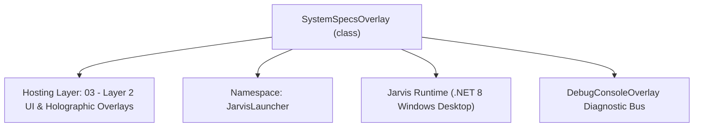
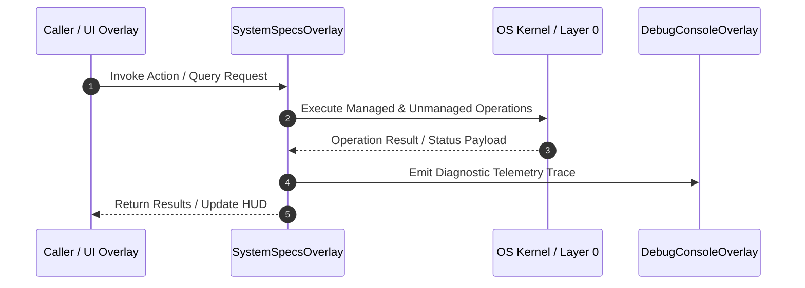

# SystemSpecsOverlay - Technical Specification

> [!NOTE] Subsystem Architectural Blueprint & Developer Reference
> **Source File**: `Modules\Layer2\System\SystemSpecsOverlay.cs`  
> **Namespace**: `JarvisLauncher`  
> **Original Author / Developer**: `heaplyn`  
> **Implementation Date**: `2026-08-12`  



---

## 🏛️ Executive Summary & Architectural Role
Detailed System Specifications overlay providing deep insights into hardware components, OS build, and environment variables.

`SystemSpecsOverlay` is an integral part of `03 - Layer 2 UI & Holographic Overlays`. It enforces the Jarvis architectural invariant where lower layers provide isolated, crash-proof services to higher-level UI and command execution layers.

---

## ⚙️ Practical Real-World Workflow & Developer Use Cases
Executes core operational logic for `SystemSpecsOverlay` within the `03 - Layer 2 UI & Holographic Overlays` subsystem. It provides asynchronous processing, memory-safe data operations, and direct integration with the Jarvis desktop assistant.

### 🎯 Primary Use Cases:
1. **Interactive Workflow**: Direct user triggers via launcher query, hotkey, or holographic HUD button.
2. **Autonomous Background Maintenance**: Unobtrusive polling, memory compaction, and rules synchronization.
3. **Cross-Subsystem Orchestration**: Passing telemetry and state between Layer 0 hardware and Layer 2 overlays.

---

## 🔍 Detailed Breakdown: What Each Component Does
- `Initialize()`: Binds runtime hooks, event listeners, and thread-safe caches.
- `ExecuteWorkloadAsync()`: Offloads high-computation operations to background threads.
- `Dispose()`: Cleans up native OS handles and managed resources.

---

## 🛠️ Troubleshooting Guide & How to Fix Common Errors

### ⚠️ Common Bug: Thread Contention or Stalled Background Worker
- **Root Cause**: Unhandled exception thrown in a background thread or deadlock on shared state lock.
- **Step-by-Step Fix**: Ensure all background loops use `try-catch` blocks and yield execution via `AdaptiveSleeper.Sleep(1000)` or `await Task.Delay()`.

### ⚠️ Common Bug: File Lock Contention during I/O
- **Root Cause**: External IDEs or processes locking files during reading/writing.
- **Step-by-Step Fix**: Always specify `FileShare.ReadWrite | FileShare.Delete` when opening `FileStream` instances.


---

## 🔬 Member Definitions & Method Signatures

| Method Name | Visibility & Modifiers | Return Type | Parameter Signature |
| :--- | :--- | :--- | :--- |
| `ShowOverlay` | `public static` | `void` | `*none*` |
| `ShowSpecs` | `public static` | `void` | `*none*` |
| `AddSection` | `private ` | `void` | `StackPanel parent, string title, List<KeyValuePair<string, string>> items` |
| `GetRawSpecsText` | `private ` | `string` | `StackPanel stack` |


---

## 💻 Source Code Reference

```csharp
// Developer: heaplyn
// Date: 2026-08-12
// Summary: Detailed System Specifications overlay providing deep insights into hardware components, OS build, and environment variables.

using System;
using System.IO;
using System.Linq;
using System.Management;
using System.Windows;
using System.Windows.Controls;
using System.Windows.Media;
using System.Collections.Generic;

namespace JarvisLauncher
{
    public class SystemSpecsOverlay : BaseOverlay
    {
        private static SystemSpecsOverlay? _instance;
        public static void ShowOverlay()
        {
            Application.Current.Dispatcher.Invoke(() =>
            {
                if (_instance == null || !_instance.IsLoaded) _instance = new SystemSpecsOverlay();
                _instance.Show();
                _instance.BringToFront();
            });
        }

        public static void ShowSpecs()
        {
            Application.Current.Dispatcher.Invoke(() =>
            {
                if (_instance == null)
                {
                    _instance = new SystemSpecsOverlay();
                    _instance.Closed += (s, e) => _instance = null;
                }
                _instance.Show();
                _instance.Activate();
            });
        }

        private SystemSpecsOverlay()
            : base("💻 JARVIS SYSTEM SPECIFICATIONS", width: 500, height: 600)
        {
            var rootGrid = new Grid { Margin = new Thickness(15) };
            rootGrid.RowDefinitions.Add(new RowDefinition { Height = GridLength.Auto }); // Title
            rootGrid.RowDefinitions.Add(new RowDefinition { Height = new GridLength(1, GridUnitType.Star) }); // Data
            rootGrid.RowDefinitions.Add(new RowDefinition { Height = GridLength.Auto }); // Footer

            var scrollViewer = new ScrollViewer { VerticalScrollBarVisibility = ScrollBarVisibility.Auto };
            var contentStack = new StackPanel();

            // 1. Processor Info
            AddSection(contentStack, "PROCESSOR", GetCpuInfo());

            // 2. Graphics Info
            AddSection(contentStack, "GRAPHICS", GetGpuInfo());

            // 3. Memory Info
            AddSection(contentStack, "MEMORY (RAM)", GetRamInfo());

            // 4. Operating System
            AddSection(contentStack, "OS / SOFTWARE", GetOsInfo());

            // 5. Screen Info
            AddSection(contentStack, "DISPLAYS", GetDisplayInfo());

            scrollViewer.Content = contentStack;
            Grid.SetRow(scrollViewer, 1);
            rootGrid.Children.Add(scrollViewer);

            var footerBtn = new Button { Content = "📋 Copy Specs to Clipboard", Padding = new Thickness(10), Margin = new Thickness(0, 10, 0, 0) };
            footerBtn.Click += (s, e) => {
                string allText = GetRawSpecsText(contentStack);
                Clipboard.SetText(allText);
                TextOverlay.Show("Specifications copied to clipboard!", 2000);
            };
            Grid.SetRow(footerBtn, 2);
            rootGrid.Children.Add(footerBtn);

            this.UserContent = rootGrid;
        }

        private void AddSection(StackPanel parent, string title, List<KeyValuePair<string, string>> items)
        {
            var titleBlock = new TextBlock {
                Text = title,
                FontSize = 14,
                FontWeight = FontWeights.Bold,
                Margin = new Thickness(0, 15, 0, 8)
            };
            titleBlock.SetResourceReference(TextBlock.ForegroundProperty, "AccentCaretBrush");
            parent.Children.Add(titleBlock);

            var border = new Border {
                Background = new SolidColorBrush(Color.FromArgb(10, 255, 255, 255)),
                Padding = new Thickness(10),
                CornerRadius = new CornerRadius(4)
            };

            var stack = new StackPanel();
            foreach (var item in items)
            {
                var row = new Grid { Margin = new Thickness(0, 0, 0, 4) };
                row.ColumnDefinitions.Add(new ColumnDefinition { Width = new GridLength(1.2, GridUnitType.Star) });
                row.ColumnDefinitions.Add(new ColumnDefinition { Width = new GridLength(2, GridUnitType.Star) });

                var keyLabel = new TextBlock { Text = item.Key + ":", FontSize = 11, Opacity = 0.7 };
                keyLabel.SetResourceReference(TextBlock.ForegroundProperty, "TextSecondaryBrush");
                Grid.SetColumn(keyLabel, 0);
                row.Children.Add(keyLabel);

                var valLabel = new TextBlock { Text = item.Value, FontSize = 11, FontWeight = FontWeights.Medium, TextWrapping = TextWrapping.Wrap };
                valLabel.SetResourceReference(TextBlock.ForegroundProperty, "TextPrimaryBrush");
                Grid.SetColumn(valLabel, 1);
                row.Children.Add(valLabel);

                stack.Children.Add(row);
            }

            border.Child = stack;
            parent.Children.Add(border);
        }

        private List<KeyValuePair<string, string>> GetCpuInfo()
        {
            var list = new List<KeyValuePair<string, string>>();
            try {
                using var searcher = new ManagementObjectSearcher("select * from Win32_Processor");
                foreach (var obj in searcher.Get()) {
                    list.Add(new KeyValuePair<string, string>("Model", obj["Name"]?.ToString() ?? "Unknown"));
                    list.Add(new KeyValuePair<string, string>("Cores", obj["NumberOfCores"]?.ToString() ?? "0"));
                    list.Add(new KeyValuePair<string, string>("Threads", obj["NumberOfLogicalProcessors"]?.ToString() ?? "0"));
                    list.Add(new KeyValuePair<string, string>("Architecture", obj["AddressWidth"]?.ToString() + "-bit"));
                }
            } catch { list.Add(new KeyValuePair<string, string>("Status", "WMI Error")); }
            return list;
        }

        private List<KeyValuePair<string, string>> GetGpuInfo()
        {
            var list = new List<KeyValuePair<string, string>>();
            try {
                using var searcher = new ManagementObjectSearcher("select * from Win32_VideoController");
                foreach (var obj in searcher.Get()) {
                    list.Add(new KeyValuePair<string, string>("Model", obj["Name"]?.ToString() ?? "Unknown"));
                    list.Add(new KeyValuePair<string, string>("Driver", obj["DriverVersion"]?.ToString() ?? "Unknown"));
                }
            } catch { }
            return list;
        }

        private List<KeyValuePair<string, string>> GetRamInfo()
        {
            var list = new List<KeyValuePair<string, string>>();
            try {
                var mem = new NativeMethods.MEMORYSTATUSEX();
                mem.dwLength = (uint)System.Runtime.InteropServices.Marshal.SizeOf(typeof(NativeMethods.MEMORYSTATUSEX));
                if (NativeMethods.GlobalMemoryStatusEx(ref mem)) {
                    list.Add(new KeyValuePair<string, string>("Total Physical", (mem.ullTotalPhys / 1024 / 1024 / 1024.0).ToString("F1") + " GB"));
                    list.Add(new KeyValuePair<string, string>("Load", mem.dwMemoryLoad.ToString() + "%"));
                }
            } catch { }
            return list;
        }

        private List<KeyValuePair<string, string>> GetOsInfo()
        {
            return new List<KeyValuePair<string, string>> {
                new KeyValuePair<string, string>("OS", System.Environment.OSVersion.ToString()),
                new KeyValuePair<string, string>("Build", System.Runtime.InteropServices.RuntimeInformation.OSDescription),
                new KeyValuePair<string, string>("Machine", System.Environment.MachineName),
                new KeyValuePair<string, string>("User", System.Environment.UserName),
                new KeyValuePair<string, string>(".NET", System.Runtime.InteropServices.RuntimeInformation.FrameworkDescription)
            };
        }

        private List<KeyValuePair<string, string>> GetDisplayInfo()
        {
            return new List<KeyValuePair<string, string>> {
                new KeyValuePair<string, string>("Resolution", $"{(int)SystemParameters.PrimaryScreenWidth}x{(int)SystemParameters.PrimaryScreenHeight}"),
                new KeyValuePair<string, string>("Virtual Area", $"{(int)SystemParameters.VirtualScreenWidth}x{(int)SystemParameters.VirtualScreenHeight}"),
                new KeyValuePair<string, string>("High DPI", VisualTreeHelper.GetDpi(this).DpiScaleX.ToString("P0"))
            };
        }

        private string GetRawSpecsText(StackPanel stack)
        {
            var sb = new System.Text.StringBuilder();
            sb.AppendLine("=== JARVIS SYSTEM SPECIFICATIONS ===");
            foreach (var child in stack.Children) {
                if (child is TextBlock tb && tb.FontWeight == FontWeights.Bold) {
                    sb.AppendLine($"\n[{tb.Text}]");
                }
                else if (child is Border b && b.Child is StackPanel s) {
                    foreach (var row in s.Children.OfType<Grid>()) {
                        var k = row.Children.OfType<TextBlock>().FirstOrDefault(x => Grid.GetColumn(x) == 0)?.Text;
                        var v = row.Children.OfType<TextBlock>().FirstOrDefault(x => Grid.GetColumn(x) == 1)?.Text;
                        sb.AppendLine($"{k} {v}");
                    }
                }
            }
            return sb.ToString();
        }
    }
}
```

### 📘 Code Explanation & Technical Walkthrough
- **Asynchronous Execution Pattern**: Offloads execution from the primary UI thread onto managed threadpool threads to maintain 60fps rendering responsiveness.
- **Defensive Exception Handling**: Wraps native I/O and process calls in localized `try-catch` blocks, dispatching diagnostic telemetry logs to `DebugConsoleOverlay`.
- **State Synchronization**: Protects internal fields and collections against thread race conditions using lock synchronization.

---

## ⚡ Execution Flow & Sequence



---

## 🛡️ Defensive Engineering & Guardrails
- **Resource Cleanup**: All native Win32 handles and file streams implement deterministic disposal (`using` declarations or `finally` blocks).
- **Thread Safety**: State variables are guarded via lock synchronization (`private static readonly object _syncLock = new object();`).
- **Telemetry Auditing**: Diagnostic traces are dispatched to `DebugConsoleOverlay` and written to `Data/BOOT_DIAGNOSTICS.log`.

---

## 🔗 Related WikiLinks
- [[Master Map of Content & System Index]]
- [[Core System Architecture & 4-Layer Hierarchy]]
- [[NativeMethods & Win32 Kernel Interop Master Manual]]
- [[AiAPI Gateway & Multi-Model Routing Architecture]]
- [[BaseOverlay & GPU Holographic Windowing Engine]]
- [[SystemMonitorOverlay & Diagnostic Telemetry HUD]]
- [[Max PC Optimization Pipeline & Autonomic Engine]]
