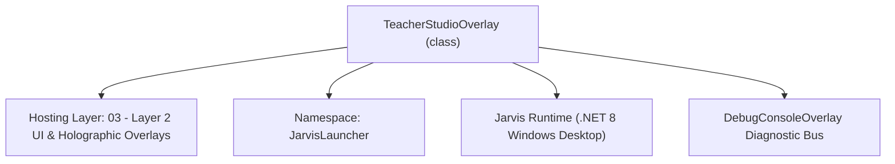
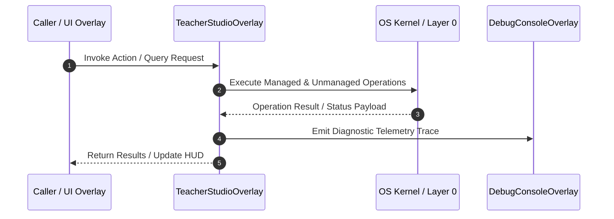

# TeacherStudioOverlay - Technical Specification

> [!NOTE] Subsystem Architectural Blueprint & Developer Reference
> **Source File**: `Modules\Layer2\AI\TeacherStudioOverlay.cs`  
> **Namespace**: `JarvisLauncher`  
> **Original Author / Developer**: `heaplyn`  
> **Implementation Date**: `2026-08-15`  



---

## 🏛️ Executive Summary & Architectural Role
Teacher Studio — the GUI for the goal-aware Live Coding Tutor.
          The user types what they're working on / want to learn; JARVIS generates its OWN tailored
          triggers (on-screen conditions to watch for), the user can tweak them, then Save & Activate.
          The Live Coding Tutor then biases its screen-watching toward that goal.

`TeacherStudioOverlay` is an integral part of `03 - Layer 2 UI & Holographic Overlays`. It enforces the Jarvis architectural invariant where lower layers provide isolated, crash-proof services to higher-level UI and command execution layers.

---

## ⚙️ Practical Real-World Workflow & Developer Use Cases
Executes core operational logic for `TeacherStudioOverlay` within the `03 - Layer 2 UI & Holographic Overlays` subsystem. It provides asynchronous processing, memory-safe data operations, and direct integration with the Jarvis desktop assistant.

### 🎯 Primary Use Cases:
1. **Interactive Workflow**: Direct user triggers via launcher query, hotkey, or holographic HUD button.
2. **Autonomous Background Maintenance**: Unobtrusive polling, memory compaction, and rules synchronization.
3. **Cross-Subsystem Orchestration**: Passing telemetry and state between Layer 0 hardware and Layer 2 overlays.

---

## 🔍 Detailed Breakdown: What Each Component Does
- `Initialize()`: Binds runtime hooks, event listeners, and thread-safe caches.
- `ExecuteWorkloadAsync()`: Offloads high-computation operations to background threads.
- `Dispose()`: Cleans up native OS handles and managed resources.

---

## 🛠️ Troubleshooting Guide & How to Fix Common Errors

### ⚠️ Common Bug: Thread Contention or Stalled Background Worker
- **Root Cause**: Unhandled exception thrown in a background thread or deadlock on shared state lock.
- **Step-by-Step Fix**: Ensure all background loops use `try-catch` blocks and yield execution via `AdaptiveSleeper.Sleep(1000)` or `await Task.Delay()`.

### ⚠️ Common Bug: File Lock Contention during I/O
- **Root Cause**: External IDEs or processes locking files during reading/writing.
- **Step-by-Step Fix**: Always specify `FileShare.ReadWrite | FileShare.Delete` when opening `FileStream` instances.


---

## 🔬 Member Definitions & Method Signatures

| Method Name | Visibility & Modifiers | Return Type | Parameter Signature |
| :--- | :--- | :--- | :--- |
| `ShowOverlay` | `public static` | `void` | `*none*` |
| `GenerateAsync` | `private async` | `Task` | `*none*` |
| `SaveAndActivate` | `private ` | `void` | `*none*` |
| `Deactivate` | `private ` | `void` | `*none*` |
| `TestNowAsync` | `private async` | `Task` | `*none*` |
| `SetStatus` | `private ` | `void` | `string text, Brush color` |


---

## 💻 Source Code Reference

```csharp
// Developer: heaplyn
// Summary: Teacher Studio — the GUI for the goal-aware Live Coding Tutor.
//          The user types what they're working on / want to learn; JARVIS generates its OWN tailored
//          triggers (on-screen conditions to watch for), the user can tweak them, then Save & Activate.
//          The Live Coding Tutor then biases its screen-watching toward that goal.

using System;
using System.Windows;
using System.Windows.Controls;
using System.Windows.Media;
using System.Threading.Tasks;

namespace JarvisLauncher
{
    public class TeacherStudioOverlay : BaseOverlay
    {
        private static TeacherStudioOverlay? _instance;

        public static void ShowOverlay()
        {
            Application.Current.Dispatcher.Invoke(() =>
            {
                if (_instance == null || !_instance.IsLoaded)
                {
                    _instance = new TeacherStudioOverlay();
                    _instance.Closed += (s, e) => _instance = null;
                }
                _instance.Show();
                _instance.BringToFront();
                _instance.Focus();
            });
        }

        private readonly CheckBox _teacherModeCheck;
        private readonly TextBox _goalBox;
        private readonly TextBox _planBox;
        private readonly TextBlock _statusText;
        private readonly Button _generateBtn;
        private readonly Button _saveBtn;
        private readonly Button _deactivateBtn;
        private readonly Button _testBtn;

        private TeacherStudioOverlay() : base("🎓 JARVIS TEACHER STUDIO", width: 640, height: 660)
        {
            var grid = new Grid { Margin = new Thickness(14) };
            grid.RowDefinitions.Add(new RowDefinition { Height = GridLength.Auto }); // intro
            grid.RowDefinitions.Add(new RowDefinition { Height = GridLength.Auto }); // teacher toggle
            grid.RowDefinitions.Add(new RowDefinition { Height = GridLength.Auto }); // goal label
            grid.RowDefinitions.Add(new RowDefinition { Height = new GridLength(1.1, GridUnitType.Star) }); // goal box
            grid.RowDefinitions.Add(new RowDefinition { Height = GridLength.Auto }); // buttons
            grid.RowDefinitions.Add(new RowDefinition { Height = GridLength.Auto }); // plan label
            grid.RowDefinitions.Add(new RowDefinition { Height = new GridLength(2, GridUnitType.Star) }); // plan box
            grid.RowDefinitions.Add(new RowDefinition { Height = GridLength.Auto }); // status

            var intro = CreateLabel(
                "Describe what you're working on or want to learn. JARVIS will generate its own triggers — the " +
                "on-screen situations it should watch for — then coach you live (speaks tips + pops the chat).", 11, false);
            intro.TextWrapping = TextWrapping.Wrap;
            intro.Margin = new Thickness(0, 0, 0, 10);
            Grid.SetRow(intro, 0);
            grid.Children.Add(intro);

            _teacherModeCheck = new CheckBox
            {
                Content = "Teacher Mode enabled (required for live tutoring)",
                IsChecked = SettingsManager.Current.IS_TEACHER_MODE_ENABLED,
                Foreground = Brushes.White,
                Margin = new Thickness(0, 0, 0, 12),
                FontSize = 12
            };
            _teacherModeCheck.Checked += (s, e) => { SettingsManager.Current.IS_TEACHER_MODE_ENABLED = true; SettingsManager.Save(); LiveCodingTutorEngine.Start(); };
            _teacherModeCheck.Unchecked += (s, e) => { SettingsManager.Current.IS_TEACHER_MODE_ENABLED = false; SettingsManager.Save(); };
            Grid.SetRow(_teacherModeCheck, 1);
            grid.Children.Add(_teacherModeCheck);

            var goalLabel = CreateLabel("🎯 YOUR GOAL / TASK:", 11, true);
            BaseOverlay.SetLabelForeground(goalLabel, Brushes.Cyan);
            Grid.SetRow(goalLabel, 2);
            grid.Children.Add(goalLabel);

            _goalBox = CreateTextBox();
            _goalBox.AcceptsReturn = true;
            _goalBox.TextWrapping = TextWrapping.Wrap;
            _goalBox.VerticalScrollBarVisibility = ScrollBarVisibility.Auto;
            _goalBox.VerticalContentAlignment = VerticalAlignment.Top;
            _goalBox.Text = TeacherGoalContext.Goal;
            if (string.IsNullOrWhiteSpace(_goalBox.Text))
                _goalBox.Text = "e.g. I'm building a FastAPI REST service and I'm new to async — help me avoid blocking calls and bad error handling.";
            Grid.SetRow(_goalBox, 3);
            grid.Children.Add(_goalBox);

            var btnRow = new StackPanel { Orientation = Orientation.Horizontal, Margin = new Thickness(0, 10, 0, 10) };
            _generateBtn = CreateStyledButton("🧠 GENERATE TRIGGERS", (s, e) => _ = GenerateAsync(), isPrimary: true, fontSize: 11);
            _generateBtn.Margin = new Thickness(0, 0, 8, 0);
            _saveBtn = CreateStyledButton("💾 SAVE & ACTIVATE", (s, e) => SaveAndActivate(), isPrimary: true, fontSize: 11);
            _saveBtn.Margin = new Thickness(0, 0, 8, 0);
            _deactivateBtn = CreateStyledButton("⏸ DEACTIVATE", (s, e) => Deactivate(), isPrimary: false, fontSize: 11);
            _deactivateBtn.Margin = new Thickness(0, 0, 8, 0);
            _testBtn = CreateStyledButton("👁 TEST NOW", (s, e) => _ = TestNowAsync(), isPrimary: false, fontSize: 11);
            btnRow.Children.Add(_generateBtn);
            btnRow.Children.Add(_saveBtn);
            btnRow.Children.Add(_deactivateBtn);
            btnRow.Children.Add(_testBtn);
            Grid.SetRow(btnRow, 4);
            grid.Children.Add(btnRow);

            var planLabel = CreateLabel("🤖 JARVIS-GENERATED WATCH PLAN (editable):", 11, true);
            BaseOverlay.SetLabelForeground(planLabel, Brushes.Cyan);
            Grid.SetRow(planLabel, 5);
            grid.Children.Add(planLabel);

            _planBox = CreateTextBox();
            _planBox.AcceptsReturn = true;
            _planBox.TextWrapping = TextWrapping.Wrap;
            _planBox.VerticalScrollBarVisibility = ScrollBarVisibility.Auto;
            _planBox.VerticalContentAlignment = VerticalAlignment.Top;
            _planBox.FontFamily = new FontFamily("Consolas");
            _planBox.FontSize = 11.5;
            _planBox.Text = TeacherGoalContext.Active ? TeacherGoalContext.BuildEditablePlan()
                : "// Click 'GENERATE TRIGGERS' to have JARVIS build a watch plan for your goal.";
            Grid.SetRow(_planBox, 6);
            grid.Children.Add(_planBox);

            _statusText = new TextBlock
            {
                Text = TeacherGoalContext.Active ? "● Active — tutoring is biased toward your saved goal." : "○ Inactive — general coding help only.",
                Foreground = TeacherGoalContext.Active ? Brushes.LightGreen : Brushes.Gray,
                Margin = new Thickness(0, 10, 0, 0),
                FontSize = 11
            };
            Grid.SetRow(_statusText, 7);
            grid.Children.Add(_statusText);

            this.UserContent = grid;
        }

        private async Task GenerateAsync()
        {
            string goal = _goalBox.Text.Trim();
            if (string.IsNullOrWhiteSpace(goal) || goal.StartsWith("e.g."))
            {
                MessageBox.Show("Describe what you're working on first.", "No Goal", MessageBoxButton.OK, MessageBoxImage.Information);
                return;
            }

            _generateBtn.IsEnabled = false;
            SetStatus("🧠 Generating tailored triggers from your goal...", Brushes.Khaki);
            _planBox.Text = "🤖 Thinking about what to watch for...";

            try
            {
                var (focus, triggers, tone, raw) = await TeacherGoalContext.GenerateFromGoalAsync(goal);
                string plan = string.IsNullOrWhiteSpace(triggers)
                    ? raw   // fall back to raw text if parsing failed
                    : TeacherGoalContext.BuildEditablePlan(focus, triggers, tone);
                Application.Current.Dispatcher.Invoke(() =>
                {
                    _planBox.Text = plan;
                    SetStatus("✓ Triggers generated. Review/edit them, then Save & Activate.", Brushes.LightGreen);
                });
            }
            catch (Exception ex)
            {
                Application.Current.Dispatcher.Invoke(() =>
                {
                    _planBox.Text = $"// Generation failed: {ex.Message}";
                    SetStatus("✗ Generation failed.", Brushes.OrangeRed);
                });
            }
            finally
            {
                Application.Current.Dispatcher.Invoke(() => _generateBtn.IsEnabled = true);
            }
        }

        private void SaveAndActivate()
        {
            string goal = _goalBox.Text.Trim();
            if (string.IsNullOrWhiteSpace(goal) || goal.StartsWith("e.g."))
            {
                MessageBox.Show("Describe what you're working on first.", "No Goal", MessageBoxButton.OK, MessageBoxImage.Information);
                return;
            }

            TeacherGoalContext.SaveFromRaw(goal, _planBox.Text, active: true);

            // Ensure teacher mode is on and the engine is running.
            if (!SettingsManager.Current.IS_TEACHER_MODE_ENABLED)
            {
                SettingsManager.Current.IS_TEACHER_MODE_ENABLED = true;
                SettingsManager.Save();
                _teacherModeCheck.IsChecked = true;
            }
            LiveCodingTutorEngine.Start();

            SetStatus("● Active — JARVIS is now tutoring toward your goal.", Brushes.LightGreen);
            TextOverlay.Show("🎓 Teacher goal activated", 2500);
        }

        private void Deactivate()
        {
            TeacherGoalContext.SetActive(false);
            SetStatus("○ Inactive — general coding help only.", Brushes.Gray);
            TextOverlay.Show("🎓 Teacher goal deactivated", 2000);
        }

        private async Task TestNowAsync()
        {
            if (!SettingsManager.Current.IS_TEACHER_MODE_ENABLED)
            {
                MessageBox.Show("Enable Teacher Mode first.", "Teacher Mode Off", MessageBoxButton.OK, MessageBoxImage.Information);
                return;
            }
            _testBtn.IsEnabled = false;
            SetStatus("👁 Scanning your screen once now...", Brushes.Khaki);
            try
            {
                await LiveCodingTutorEngine.ForceScanAsync();
                SetStatus("✓ Test scan complete (a tip appears in the chat only if something was worth flagging).", Brushes.LightGreen);
            }
            catch (Exception ex)
            {
                SetStatus($"✗ Test failed: {ex.Message}", Brushes.OrangeRed);
            }
            finally
            {
                _testBtn.IsEnabled = true;
            }
        }

        private void SetStatus(string text, Brush color)
        {
            _statusText.Text = text;
            _statusText.Foreground = color;
        }
    }
}
```

### 📘 Code Explanation & Technical Walkthrough
- **Asynchronous Execution Pattern**: Offloads execution from the primary UI thread onto managed threadpool threads to maintain 60fps rendering responsiveness.
- **Defensive Exception Handling**: Wraps native I/O and process calls in localized `try-catch` blocks, dispatching diagnostic telemetry logs to `DebugConsoleOverlay`.
- **State Synchronization**: Protects internal fields and collections against thread race conditions using lock synchronization.

---

## ⚡ Execution Flow & Sequence



---

## 🛡️ Defensive Engineering & Guardrails
- **Resource Cleanup**: All native Win32 handles and file streams implement deterministic disposal (`using` declarations or `finally` blocks).
- **Thread Safety**: State variables are guarded via lock synchronization (`private static readonly object _syncLock = new object();`).
- **Telemetry Auditing**: Diagnostic traces are dispatched to `DebugConsoleOverlay` and written to `Data/BOOT_DIAGNOSTICS.log`.

---

## 🔗 Related WikiLinks
- [[Master Map of Content & System Index]]
- [[Core System Architecture & 4-Layer Hierarchy]]
- [[NativeMethods & Win32 Kernel Interop Master Manual]]
- [[AiAPI Gateway & Multi-Model Routing Architecture]]
- [[BaseOverlay & GPU Holographic Windowing Engine]]
- [[SystemMonitorOverlay & Diagnostic Telemetry HUD]]
- [[Max PC Optimization Pipeline & Autonomic Engine]]
