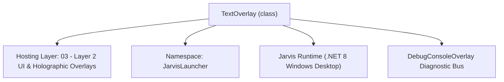
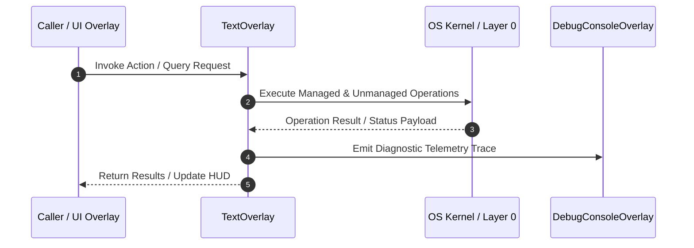

# TextOverlay - Technical Specification

> [!NOTE] Subsystem Architectural Blueprint & Developer Reference
> **Source File**: `Modules\Layer2\System\TextOverlay.cs`  
> **Namespace**: `JarvisLauncher`  
> **Original Author / Developer**: `heaplyn`  
> **Implementation Date**: `2026-08-09`  



---

## 🏛️ Executive Summary & Architectural Role
Draggable text notification overlay inheriting BaseOverlay that auto-closes after a set duration.

`TextOverlay` is an integral part of `03 - Layer 2 UI & Holographic Overlays`. It enforces the Jarvis architectural invariant where lower layers provide isolated, crash-proof services to higher-level UI and command execution layers.

---

## ⚙️ Practical Real-World Workflow & Developer Use Cases
Executes core operational logic for `TextOverlay` within the `03 - Layer 2 UI & Holographic Overlays` subsystem. It provides asynchronous processing, memory-safe data operations, and direct integration with the Jarvis desktop assistant.

### 🎯 Primary Use Cases:
1. **Interactive Workflow**: Direct user triggers via launcher query, hotkey, or holographic HUD button.
2. **Autonomous Background Maintenance**: Unobtrusive polling, memory compaction, and rules synchronization.
3. **Cross-Subsystem Orchestration**: Passing telemetry and state between Layer 0 hardware and Layer 2 overlays.

---

## 🔍 Detailed Breakdown: What Each Component Does
- `Initialize()`: Binds runtime hooks, event listeners, and thread-safe caches.
- `ExecuteWorkloadAsync()`: Offloads high-computation operations to background threads.
- `Dispose()`: Cleans up native OS handles and managed resources.

---

## 🛠️ Troubleshooting Guide & How to Fix Common Errors

### ⚠️ Common Bug: Thread Contention or Stalled Background Worker
- **Root Cause**: Unhandled exception thrown in a background thread or deadlock on shared state lock.
- **Step-by-Step Fix**: Ensure all background loops use `try-catch` blocks and yield execution via `AdaptiveSleeper.Sleep(1000)` or `await Task.Delay()`.

### ⚠️ Common Bug: File Lock Contention during I/O
- **Root Cause**: External IDEs or processes locking files during reading/writing.
- **Step-by-Step Fix**: Always specify `FileShare.ReadWrite | FileShare.Delete` when opening `FileStream` instances.


---

## 🔬 Member Definitions & Method Signatures

| Method Name | Visibility & Modifiers | Return Type | Parameter Signature |
| :--- | :--- | :--- | :--- |
| `Show` | `public static` | `void` | `
            string Text,
            int DurationMs = 1500,
            double Width = 350,
            double Height = 120,
            double FontSize = 20,
            string BackgroundColor = "#F2140D24",
            string TextColor = "#FFFFFF",
            string BorderColor = "#808050E6"` |


---

## 💻 Source Code Reference

```csharp
// Developer: heaplyn
// Date: 2026-08-09
// Summary: Draggable text notification overlay inheriting BaseOverlay that auto-closes after a set duration.

using System;
using System.Windows;
using System.Windows.Controls;
using System.Windows.Media;
using System.Windows.Threading;

namespace JarvisLauncher
{
    public class TextOverlay : BaseOverlay
    {
        private static TextOverlay? LastOverlay;
        private static string LastText = string.Empty;

        public static void Show(
            string Text,
            int DurationMs = 1500,
            double Width = 350,
            double Height = 120,
            double FontSize = 20,
            string BackgroundColor = "#F2140D24",
            string TextColor = "#FFFFFF",
            string BorderColor = "#808050E6")
        {
            if (string.IsNullOrEmpty(Text)) return;

            // Execute on UI Dispatcher Thread
            Application.Current.Dispatcher.Invoke(() =>
            {
                // Simple Debounce: Don't show the exact same message if one is already visible
                if (LastOverlay != null && LastOverlay.IsVisible && LastText == Text)
                {
                    return;
                }

                // Close previous toast to prevent stacking if it's the same type of notification
                if (LastOverlay != null && LastOverlay.IsVisible)
                {
                    LastOverlay.FadeOutAndClose();
                }

                var Overlay = new TextOverlay(Text, Width, Height, FontSize, BackgroundColor, TextColor, BorderColor);
                LastOverlay = Overlay;
                LastText = Text;
                Overlay.Show();

                if (DurationMs > 0)
                {
                    var Timer = new DispatcherTimer { Interval = TimeSpan.FromMilliseconds(DurationMs) };
                    Timer.Tick += (S, E) =>
                    {
                        Timer.Stop();
                        if (LastOverlay == Overlay) LastOverlay = null;
                        Overlay.FadeOutAndClose();
                    };
                    Timer.Start();
                }
            });
        }

        private TextOverlay(
            string Text,
            double Width,
            double Height,
            double FontSize,
            string BgColor,
            string TxtColor,
            string BdrColor)
            : base("NOTIFICATION", Width, Height, BgColor, TxtColor, BdrColor)
        {
            var BrushConverter = new BrushConverter();
            var TxtBrush = (Brush)(BrushConverter.ConvertFromString(TxtColor) ?? Brushes.White);

            var TextBlock = new TextBlock
            {
                Text = Text,
                Foreground = TxtBrush,
                FontSize = FontSize,
                FontFamily = new FontFamily("Segoe UI Semibold, Arial"),
                HorizontalAlignment = HorizontalAlignment.Center,
                VerticalAlignment = VerticalAlignment.Center,
                TextWrapping = TextWrapping.Wrap,
                TextAlignment = TextAlignment.Center
            };

            this.UserContent = TextBlock;
        }
    }
}
```

### 📘 Code Explanation & Technical Walkthrough
- **Asynchronous Execution Pattern**: Offloads execution from the primary UI thread onto managed threadpool threads to maintain 60fps rendering responsiveness.
- **Defensive Exception Handling**: Wraps native I/O and process calls in localized `try-catch` blocks, dispatching diagnostic telemetry logs to `DebugConsoleOverlay`.
- **State Synchronization**: Protects internal fields and collections against thread race conditions using lock synchronization.

---

## ⚡ Execution Flow & Sequence



---

## 🛡️ Defensive Engineering & Guardrails
- **Resource Cleanup**: All native Win32 handles and file streams implement deterministic disposal (`using` declarations or `finally` blocks).
- **Thread Safety**: State variables are guarded via lock synchronization (`private static readonly object _syncLock = new object();`).
- **Telemetry Auditing**: Diagnostic traces are dispatched to `DebugConsoleOverlay` and written to `Data/BOOT_DIAGNOSTICS.log`.

---

## 🔗 Related WikiLinks
- [[Master Map of Content & System Index]]
- [[Core System Architecture & 4-Layer Hierarchy]]
- [[NativeMethods & Win32 Kernel Interop Master Manual]]
- [[AiAPI Gateway & Multi-Model Routing Architecture]]
- [[BaseOverlay & GPU Holographic Windowing Engine]]
- [[SystemMonitorOverlay & Diagnostic Telemetry HUD]]
- [[Max PC Optimization Pipeline & Autonomic Engine]]
